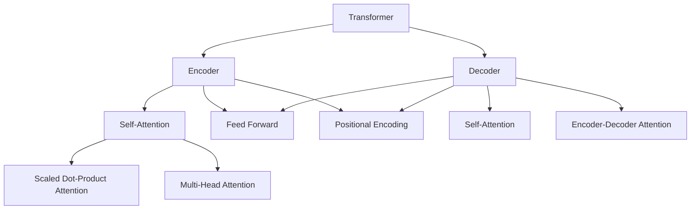

# Transformer 原理与代码实例讲解

## 1. 背景介绍

### 1.1 问题的由来

在自然语言处理和机器学习领域,序列数据(如文本、语音、基因序列等)是一种常见的数据形式。传统的序列模型如隐马尔可夫模型(HMM)和递归神经网络(RNN)在处理这些数据时存在一些局限性。例如,RNN在处理长序列时容易遇到梯度消失或梯度爆炸问题,导致模型难以捕捉长距离依赖关系。

为了解决这些问题,Transformer模型应运而生。Transformer是一种全新的基于注意力机制(Attention Mechanism)的序列到序列(Seq2Seq)模型,它不依赖于循环和卷积,而是通过自注意力(Self-Attention)机制直接对输入序列中的任意两个位置建立联系,从而更好地捕捉长距离依赖关系。

### 1.2 研究现状

Transformer模型最初由Google Brain团队在2017年提出,用于机器翻译任务,取得了令人瞩目的成绩。自此,Transformer及其变体在自然语言处理、计算机视觉、语音识别等领域得到了广泛应用和研究。

目前,Transformer已成为序列建模的主流模型之一,被广泛应用于机器翻译、文本生成、语音识别、图像分类等任务。许多知名的预训练语言模型,如BERT、GPT、XLNet等,都是基于Transformer或其变体构建的。

### 1.3 研究意义

深入理解Transformer的原理和实现对于从事自然语言处理、机器学习等相关领域的研究人员和工程师来说至关重要。Transformer模型的创新性在于引入了自注意力机制,这种全新的建模方式打破了传统序列模型的局限,为序列数据的处理开辟了新的思路。

通过学习Transformer,我们可以掌握自注意力机制的工作原理,了解多头注意力和位置编码等关键技术,并学习如何利用Transformer进行序列建模和下游任务。此外,研究Transformer的变体和改进版本,有助于我们深入理解注意力机制的本质,并为设计新的注意力模型提供启发。

### 1.4 本文结构

本文将全面介绍Transformer模型的原理、实现和应用。我们将从模型的背景和发展历程入手,深入探讨自注意力机制、多头注意力、位置编码等核心概念,并详细阐释Transformer的编码器(Encoder)和解码器(Decoder)结构。

接下来,我们将推导Transformer中使用的数学模型和公式,并通过案例分析加深理解。然后,我们将提供Transformer的代码实现示例,并对关键代码进行解读和分析。

最后,我们将介绍Transformer在实际应用中的场景,如机器翻译、文本生成等,并探讨Transformer的未来发展趋势和面临的挑战。

## 2. 核心概念与联系

Transformer模型的核心概念包括:

1. **Encoder(编码器)**: 将输入序列(如源语言句子)映射为高维向量表示。
2. **Decoder(解码器)**: 接收Encoder的输出,生成目标序列(如目标语言句子)。
3. **Self-Attention(自注意力)**: 计算输入序列中每个位置与其他位置的关联程度,捕捉序列内部的依赖关系。
4. **Multi-Head Attention(多头注意力)**: 将注意力机制分成多个"头"(head),每个头对输入序列进行不同的注意力计算,最后将结果合并。
5. **Scaled Dot-Product Attention(缩放点积注意力)**: 一种高效的注意力计算方式,通过点积运算计算注意力分数。
6. **Positional Encoding(位置编码)**: 因为Transformer没有递归和卷积结构,无法直接获取序列的位置信息,因此需要将位置信息编码到输入中。
7. **Feed Forward(前馈网络)**: 对每个位置的向量进行独立的全连接变换,为Encoder和Decoder提供位置wise的非线性映射。

这些核心概念相互关联,共同构建了Transformer的整体架构。Encoder和Decoder分别由多个Self-Attention和Feed Forward子层组成,Self-Attention负责捕捉输入序列的内部依赖关系,而Decoder还需要通过Encoder-Decoder Attention关注Encoder的输出。位置编码为序列提供位置信息,而多头注意力和缩放点积注意力则是注意力机制的具体实现方式。

## 3. 核心算法原理 & 具体操作步骤

### 3.1 算法原理概述

Transformer的核心算法原理是基于**自注意力(Self-Attention)机制**。与RNN和CNN不同,Transformer完全放弃了循环和卷积结构,而是通过自注意力机制直接对输入序列中的任意两个位置建立联系,捕捉长距离依赖关系。

自注意力机制的基本思想是:对于输入序列中的每个位置,计算它与其他位置的关联程度(注意力分数),然后根据这些分数对所有位置的向量进行加权求和,得到该位置的注意力向量表示。

具体来说,自注意力机制包括以下几个关键步骤:

1. **线性投影**: 将输入序列的每个向量分别投影到查询(Query)、键(Key)和值(Value)空间,得到 $Q$、$K$、$V$ 矩阵。
2. **注意力计算**: 计算查询 $Q$ 与所有键 $K$ 的注意力分数,通常使用缩放点积注意力(Scaled Dot-Product Attention)进行计算。
3. **注意力加权**: 根据注意力分数对值 $V$ 进行加权求和,得到注意力向量表示。
4. **多头注意力**: 将注意力机制分成多个"头"(head),每个头对输入序列进行不同的注意力计算,最后将结果合并。

通过自注意力机制,Transformer能够直接建立输入序列内部的长距离依赖关系,从而更好地捕捉序列的语义和上下文信息。

### 3.2 算法步骤详解

现在,我们将详细解释Transformer自注意力机制的具体算法步骤。

#### 3.2.1 线性投影

首先,我们将输入序列 $X = (x_1, x_2, \dots, x_n)$ 分别投影到查询(Query)、键(Key)和值(Value)空间,得到 $Q$、$K$、$V$ 矩阵:

$$Q = XW^Q$$
$$K = XW^K$$
$$V = XW^V$$

其中, $W^Q$、$W^K$、$W^V$ 分别是可学习的权重矩阵。

#### 3.2.2 缩放点积注意力

接下来,我们计算查询 $Q$ 与所有键 $K$ 的注意力分数矩阵 $A$:

$$A = \text{softmax}(\frac{QK^T}{\sqrt{d_k}})$$

其中, $d_k$ 是键向量的维度,用于缩放点积结果,防止过大的值导致softmax函数饱和。

注意力分数矩阵 $A$ 的每个元素 $a_{ij}$ 表示查询向量 $q_i$ 与键向量 $k_j$ 的关联程度。

#### 3.2.3 注意力加权

然后,我们根据注意力分数矩阵 $A$ 对值矩阵 $V$ 进行加权求和,得到注意力向量表示 $Z$:

$$Z = AV$$

其中, $Z$ 的每个向量 $z_i$ 是输入序列第 $i$ 个位置的注意力向量表示,它是所有位置的值向量 $v_j$ 根据注意力分数 $a_{ij}$ 加权求和得到的。

#### 3.2.4 多头注意力

为了捕捉不同的子空间关系,Transformer引入了多头注意力(Multi-Head Attention)机制。具体来说,我们将查询、键、值矩阵分别投影到 $h$ 个子空间,对每个子空间分别计算注意力,最后将结果拼接:

$$\text{MultiHead}(Q, K, V) = \text{Concat}(head_1, \dots, head_h)W^O$$
$$\text{where } head_i = \text{Attention}(QW_i^Q, KW_i^K, VW_i^V)$$

其中, $W_i^Q$、$W_i^K$、$W_i^V$ 和 $W^O$ 都是可学习的投影矩阵。通过多头注意力,Transformer能够同时关注不同的子空间关系,提高了模型的表达能力。

### 3.3 算法优缺点

**优点**:

1. **并行计算**: 与RNN不同,Transformer不依赖序列的顺序,可以高效地并行计算,加快训练和推理速度。
2. **长距离依赖**: 自注意力机制能够直接捕捉输入序列中任意两个位置之间的依赖关系,有效解决了RNN的长距离依赖问题。
3. **灵活性**: Transformer的Encoder-Decoder结构可以应用于多种序列到序列的任务,如机器翻译、文本生成等。

**缺点**:

1. **计算复杂度**: 自注意力机制需要计算输入序列中所有位置对的注意力分数,计算复杂度为 $O(n^2)$,对长序列来说计算代价较高。
2. **位置信息**: Transformer本身无法直接获取序列的位置信息,需要通过位置编码的方式将位置信息编码到输入中。
3. **序列长度限制**:由于计算复杂度的原因,Transformer通常只能处理长度有限的序列,对于极长序列可能会受到限制。

### 3.4 算法应用领域

Transformer及其变体已被广泛应用于自然语言处理、计算机视觉、语音识别等领域,包括但不限于:

- **机器翻译**: Transformer最初就是为机器翻译任务设计的,在多种语言对的翻译任务上表现优异。
- **文本生成**: Transformer可用于文本摘要、对话系统、创作型写作等任务。
- **语言模型**: 基于Transformer的预训练语言模型(如BERT、GPT)在下游任务中表现出色。
- **计算机视觉**: 视觉Transformer(ViT)在图像分类、目标检测等视觉任务中取得了不错的成绩。
- **语音识别**: Transformer也被应用于语音识别领域,用于建模语音序列。
- **推荐系统**: Transformer可用于序列化推荐,捕捉用户行为序列的依赖关系。

总的来说,Transformer凭借其强大的序列建模能力,在许多需要处理序列数据的领域都有广泛的应用前景。

## 4. 数学模型和公式 & 详细讲解 & 举例说明

在上一节中,我们介绍了Transformer自注意力机制的核心算法原理和步骤。现在,我们将详细推导Transformer中使用的数学模型和公式,并通过案例分析加深理解。

### 4.1 数学模型构建

#### 4.1.1 注意力计算

在Transformer中,注意力计算的核心是缩放点积注意力(Scaled Dot-Product Attention)。给定查询 $Q$、键 $K$ 和值 $V$,注意力计算过程如下:

1. 计算查询 $Q$ 与所有键 $K$ 的点积:

$$QK^T = \begin{bmatrix}
q_1 \cdot k_1 & q_1 \cdot k_2 & \cdots & q_1 \cdot k_n \\
q_2 \cdot k_1 & q_2 \cdot k_2 & \cdots & q_2 \cdot k_n \\
\vdots & \vdots & \ddots & \vdots \\
q_m \cdot k_1 & q_m \cdot k_2 & \cdots & q_m \cdot k_n
\end{bmatrix}$$

其中, $q_i$ 和 $k_j$ 分别是查询向量和键向量。

2. 对点积结果进行缩放:

$$\text{Scaled}(QK^T) = \frac{QK^T}{\sqrt{d_k}}$$

其中, $d_k$ 是键向量的维