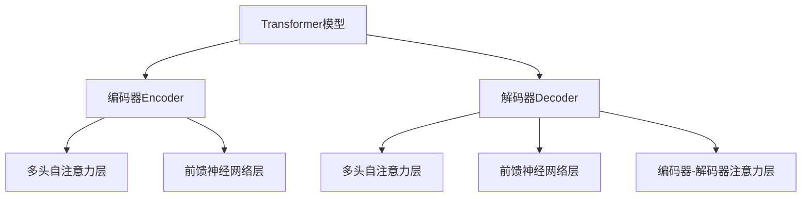

# Transformer 模型 原理与代码实例讲解

## 1. 背景介绍

### 1.1 问题的由来

在自然语言处理(NLP)和序列数据建模领域,长期以来,循环神经网络(RNN)一直是主导模型。RNN擅长捕捉序列数据中的长期依赖关系,但也存在一些固有缺陷,如梯度消失/爆炸问题、无法并行计算等。为了解决这些问题,Transformer模型应运而生。

### 1.2 研究现状

2017年,Transformer模型在谷歌大脑的论文"Attention Is All You Need"中首次被提出,并在机器翻译任务上取得了优异的成绩。自此,Transformer模型在NLP领域掀起了一股热潮,广泛应用于文本生成、语音识别、图像描述等多个任务中。

### 1.3 研究意义

Transformer模型完全基于注意力机制,摒弃了RNN的递归结构,能够高效并行计算,缓解了长期依赖问题。此外,Transformer模型的可解释性更强,注意力分数可视化有助于理解模型内部工作机制。因此,深入研究Transformer模型的原理和应用具有重要意义。

### 1.4 本文结构

本文将全面介绍Transformer模型的核心概念、原理和实现细节。首先阐述模型的基本架构和注意力机制;其次深入探讨编码器-解码器结构、位置编码和多头注意力等关键组件;再次通过数学推导和案例分析详细解释模型内部运作;最后提供代码实例,并讨论实际应用场景、发展趋势和挑战。

## 2. 核心概念与联系

Transformer模型的核心思想是利用自注意力(Self-Attention)机制来捕捉输入序列中任意两个位置之间的依赖关系,从而建模序列数据。与RNN不同,Transformer不再依赖序列顺序或递归计算,而是通过注意力机制直接关注序列中的每个位置,从而实现高效的并行计算。

Transformer模型主要由编码器(Encoder)和解码器(Decoder)两个子模块组成。编码器负责处理输入序列,生成对应的序列表示;解码器则基于编码器的输出,生成目标序列。两个子模块的内部结构高度相似,都由多个相同的层组成,每层包含多头自注意力(Multi-Head Self-Attention)和前馈神经网络(Feed-Forward Neural Network)两个子层。

上图展示了Transformer模型的基本架构。编码器和解码器都由多个相同的层组成,每层包含多头自注意力、前馈神经网络等关键组件。解码器还引入了编码器-解码器注意力机制,以捕捉输入和输出序列之间的依赖关系。

## 3. 核心算法原理 & 具体操作步骤

### 3.1 算法原理概述

Transformer模型的核心算法原理是**自注意力(Self-Attention)机制**。传统的注意力机制需要依赖额外的记忆或上下文向量来计算注意力分数,而自注意力则是通过查询(Query)、键(Key)和值(Value)之间的相似性来计算注意力分数,完全基于输入序列本身。

自注意力机制的计算过程如下:

1. 将输入序列 $X$ 线性映射到查询 $Q$、键 $K$ 和值 $V$ 矩阵。
2. 计算查询 $Q$ 和所有键 $K$ 的点积,得到未缩放的注意力分数矩阵。
3. 对注意力分数矩阵进行缩放,得到缩放的注意力分数矩阵。
4. 对缩放的注意力分数矩阵执行 Softmax 操作,得到注意力权重矩阵。
5. 将注意力权重矩阵与值矩阵 $V$ 相乘,得到注意力输出矩阵。

数学表达式如下:

$$\begin{aligned}
Q &= XW^Q\\
K &= XW^K\\
V &= XW^V\\
\text{Attention}(Q, K, V) &= \text{softmax}\left(\frac{QK^T}{\sqrt{d_k}}\right)V
\end{aligned}$$

其中 $W^Q$、$W^K$ 和 $W^V$ 分别是查询、键和值的线性映射矩阵,而 $d_k$ 是缩放因子,用于防止点积的值过大导致梯度饱和。

### 3.2 算法步骤详解

1. **线性映射**

   首先,我们将输入序列 $X$ 通过三个不同的线性映射矩阵 $W^Q$、$W^K$ 和 $W^V$ 分别映射到查询 $Q$、键 $K$ 和值 $V$ 空间:

   $$Q = XW^Q, \quad K = XW^K, \quad V = XW^V$$

   其中,查询 $Q$ 用于计算注意力分数,键 $K$ 也用于计算注意力分数,而值 $V$ 则是我们最终希望获得的注意力加权和。

2. **计算注意力分数**

   接下来,我们计算查询 $Q$ 与所有键 $K$ 的点积,得到未缩放的注意力分数矩阵:

   $$\text{AttentionScores} = QK^T$$

   注意,这里的点积是按行向量与列向量相乘,因此结果是一个矩阵。

3. **缩放注意力分数**

   为了防止点积的值过大导致梯度饱和,我们需要对注意力分数进行缩放:

   $$\text{ScaledAttentionScores} = \frac{\text{AttentionScores}}{\sqrt{d_k}}$$

   其中 $d_k$ 是键向量的维度,用作缩放因子。

4. **计算注意力权重**

   对缩放后的注意力分数矩阵执行 Softmax 操作,得到注意力权重矩阵:

   $$\text{AttentionWeights} = \text{softmax}(\text{ScaledAttentionScores})$$

   Softmax 函数可以将注意力分数转换为概率分布,使得每一行的所有元素之和为 1。

5. **计算注意力输出**

   最后,我们将注意力权重矩阵与值矩阵 $V$ 相乘,得到注意力输出矩阵:

   $$\text{AttentionOutput} = \text{AttentionWeights} \cdot V$$

   注意力输出矩阵就是自注意力机制的最终输出,它捕捉了输入序列中任意两个位置之间的依赖关系。

### 3.3 算法优缺点

**优点**:

1. **并行计算能力强**:与RNN不同,Transformer模型不需要递归计算,可以高效并行。
2. **长期依赖建模能力强**:自注意力机制能够直接捕捉任意距离的依赖关系,有效解决了长期依赖问题。
3. **可解释性好**:注意力分数可视化,有助于理解模型内部工作机制。

**缺点**:

1. **计算复杂度高**:自注意力需要计算所有位置对之间的注意力分数,计算量随序列长度的平方增长。
2. **位置编码必要性**:Transformer模型本身无法捕捉序列的绝对位置信息,需要引入位置编码。
3. **序列长度限制**:由于计算复杂度的限制,Transformer模型通常只能处理长度有限的序列。

### 3.4 算法应用领域

Transformer模型最初被提出用于机器翻译任务,但由于其出色的表现,后来被广泛应用于自然语言处理的各个领域,包括但不限于:

- **文本生成**:新闻摘要、对话系统、文本续写等。
- **文本分类**:情感分析、垃圾邮件检测、主题分类等。
- **机器翻译**:神经机器翻译系统。
- **语音识别**:自动语音转文本。
- **图像描述**:根据图像生成对应的文本描述。

除了NLP领域,Transformer模型也被成功应用于计算机视觉、推荐系统等其他领域。

## 4. 数学模型和公式 & 详细讲解 & 举例说明

### 4.1 数学模型构建

Transformer模型的数学模型主要由三个部分组成:

1. **位置编码(Positional Encoding)**
2. **多头自注意力(Multi-Head Self-Attention)**
3. **前馈神经网络(Feed-Forward Neural Network)**

我们将依次介绍这三个部分的数学模型。

**位置编码**

由于Transformer模型完全基于注意力机制,无法像RNN那样自然地捕捉序列的位置信息。因此,我们需要为每个位置添加一个位置编码,将位置信息注入到模型中。

位置编码的数学表达式为:

$$\begin{aligned}
\text{PE}_{(pos, 2i)} &= \sin\left(\frac{pos}{10000^{\frac{2i}{d_\text{model}}}}\right)\\
\text{PE}_{(pos, 2i+1)} &= \cos\left(\frac{pos}{10000^{\frac{2i}{d_\text{model}}}}\right)
\end{aligned}$$

其中 $pos$ 表示位置索引, $i$ 表示维度索引, $d_\text{model}$ 是模型的embedding维度。

通过不同的正弦和余弦函数值来编码不同的位置,从而将位置信息注入到embedding中。

**多头自注意力**

多头自注意力是Transformer模型的核心组件,它将自注意力机制扩展到多个"头"(head),每个头都学习不同的注意力模式。

多头自注意力的数学表达式为:

$$\begin{aligned}
\text{MultiHead}(Q, K, V) &= \text{Concat}(\text{head}_1, \ldots, \text{head}_h)W^O\\
\text{where } \text{head}_i &= \text{Attention}(QW_i^Q, KW_i^K, VW_i^V)
\end{aligned}$$

其中 $W_i^Q$、$W_i^K$ 和 $W_i^V$ 分别是第 $i$ 个头的查询、键和值的线性映射矩阵,而 $W^O$ 是最终的线性映射矩阵。

通过多个并行的自注意力头,模型可以从不同的表示子空间中捕捉不同的依赖关系,提高了模型的表达能力。

**前馈神经网络**

前馈神经网络是Transformer模型中的另一个重要组件,它对每个位置的表示进行独立的非线性映射,增强了模型的表达能力。

前馈神经网络的数学表达式为:

$$\text{FFN}(x) = \max(0, xW_1 + b_1)W_2 + b_2$$

其中 $W_1$、$b_1$、$W_2$ 和 $b_2$ 是可学习的参数,而 $\max(0, \cdot)$ 是ReLU激活函数。

前馈神经网络将每个位置的表示映射到一个更高维的空间,然后再映射回原始空间,增加了模型的非线性能力。

### 4.2 公式推导过程

在这一部分,我们将详细推导自注意力机制的数学公式,以加深对其原理的理解。

首先,我们定义查询 $Q$、键 $K$ 和值 $V$ 矩阵:

$$Q = XW^Q, \quad K = XW^K, \quad V = XW^V$$

其中 $X$ 是输入序列,而 $W^Q$、$W^K$ 和 $W^V$ 分别是查询、键和值的线性映射矩阵。

接下来,我们计算查询 $Q$ 与所有键 $K$ 的点积,得到未缩放的注意力分数矩阵:

$$\text{AttentionScores} = QK^T$$

为了防止点积的值过大导致梯度饱和,我们需要对注意力分数进行缩放:

$$\text{ScaledAttentionScores} = \frac{\text{AttentionScores}}{\sqrt{d_k}}$$

其中 $d_k$ 是键向量的维度,用作缩放因子。

然后,我们对缩放后的注意力分数矩阵执行 Softmax 操作,得到注意力权重矩阵:

$$\text{AttentionWeights} = \text{softmax}(\