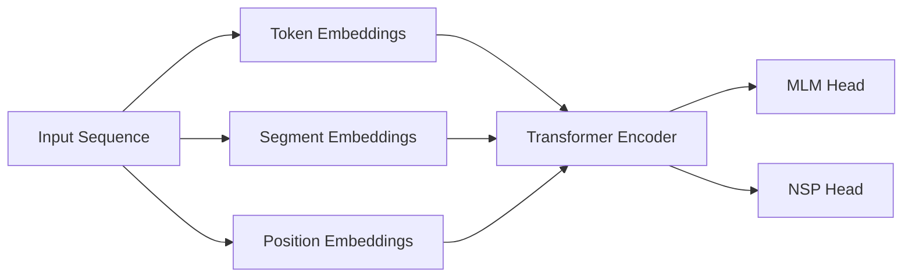

# Transformer大模型实战 BERT 模型预训练

## 1. 背景介绍
### 1.1 问题的由来
近年来,随着深度学习技术的快速发展,自然语言处理(NLP)领域取得了长足的进步。从早期的词袋模型、N-gram语言模型,到word2vec、GloVe等静态词向量,再到LSTM、GRU等循环神经网络,NLP技术不断突破。然而,这些模型都存在一定的局限性,难以很好地捕捉语言中的长距离依赖关系和语义信息。

2017年,Google提出了Transformer模型[1],开创了NLP领域的新纪元。Transformer采用了自注意力机制和残差连接,能够并行化计算,大大提高了模型训练效率。此后,各种基于Transformer的预训练语言模型如雨后春笋般涌现,如BERT[2]、GPT[3]、XLNet[4]等,在多个NLP任务上取得了state-of-the-art的表现。

### 1.2 研究现状
在众多Transformer预训练模型中,BERT(Bidirectional Encoder Representations from Transformers)无疑是最具代表性和影响力的一个。BERT通过引入Masked Language Model和Next Sentence Prediction两个预训练任务,在大规模无监督语料上进行预训练,可以学习到强大的通用语言表示。在下游任务微调时,只需在BERT的输出上添加一个简单的全连接层,即可在多个NLP任务上取得优异的结果。

目前,BERT及其变体已经被广泛应用于智能问答、情感分析、命名实体识别、文本分类等诸多NLP任务中,并取得了显著的效果提升。同时,BERT的思想也被拓展到了计算机视觉、语音识别等其他领域。可以说,BERT引领了AI技术发展的新浪潮。

### 1.3 研究意义
尽管BERT在学术界和工业界得到了广泛关注和应用,但对于很多研究者和从业者来说,如何从零开始训练一个BERT模型仍然是一个具有挑战性的课题。搭建训练环境、准备海量语料、调试模型参数,都需要较高的专业技能和计算资源。

本文旨在提供一个BERT预训练的全流程指南,从理论到实践,深入浅出地讲解BERT的原理和实现。通过本文,读者可以全面掌握BERT预训练的核心技术,并动手训练属于自己的BERT模型。这对于理解Transformer类预训练模型的工作机制,以及将其应用到实际任务中,都具有重要的参考价值。

### 1.4 本文结构
本文后续章节安排如下:
第2部分介绍BERT涉及的核心概念,如Transformer、自注意力、位置编码等,并阐述它们之间的联系;
第3部分详细讲解BERT的预训练算法原理和具体实现步骤;
第4部分从数学角度对BERT的模型结构和目标函数进行推导,并给出一个简单的例子加以说明;
第5部分提供了一个基于TensorFlow的BERT预训练代码实现,并对关键代码进行注释讲解;
第6部分展望了BERT在垂直领域的应用前景;
第7部分推荐了一些BERT相关的学习资源和开发工具;
第8部分对全文进行总结,并对BERT的未来发展趋势和面临的挑战进行了展望。

## 2. 核心概念与联系

在讲解BERT之前,我们先来了解一下其背后的一些核心概念。

- Transformer:这是一种基于自注意力机制的序列建模框架,摒弃了传统的RNN/CNN等结构,通过Self-Attention学习序列内部的依赖关系,并行计算效率高。BERT就是基于Transformer Encoder实现的。

- 自注意力(Self-Attention):一种通过计算序列内部任意两个位置之间的关联度来更新序列表示的机制。直观地说,它让序列中的每个位置都能"看到"其他所有位置的信息。自注意力是Transformer的核心组件。

- 位置编码(Positional Encoding):由于Transformer不包含任何循环和卷积,为了引入序列的位置信息,需要给输入序列添加位置编码。BERT采用的是固定的正弦曲线函数作为位置编码。

- Masked Language Model(MLM):BERT的两大预训练任务之一。通过随机Mask掉一些Token,让模型根据上下文预测这些Token,从而学习语言的统计规律和语义信息。

- Next Sentence Prediction(NSP):BERT的另一个预训练任务。通过预测两个句子是否前后相邻,让模型学习句子级别的连贯性和一致性。

下图展示了BERT的整体架构和各部分的关系:

可以看到,BERT首先将输入序列转换为三种Embedding的和,然后通过多层Transformer Encoder进行特征提取,最后接MLM和NSP两个任务头进行预训练。

## 3. 核心算法原理 & 具体操作步骤

### 3.1 算法原理概述
BERT的预训练本质上是一个自监督学习过程,通过构造自己的监督信号,在大规模无标注语料上学习通用语言表示。具体来说,BERT使用了以下两个预训练任务:

(1)MLM(Masked Language Model):随机Mask掉输入序列的一些Token,让模型根据上下文预测这些Token。这个任务可以帮助BERT学习词语的语义信息和上下文联系。

(2)NSP(Next Sentence Prediction):给定两个句子,让模型判断它们是否是上下句关系。这个任务可以帮助BERT学习句子级别的连贯性和一致性。

通过联合优化这两个任务,BERT可以学习到强大的语言表示,捕捉词法、语法、语义等多个层面的特征。在下游任务Fine-tuning时,只需在BERT输出的基础上添加一个简单的全连接层即可。

### 3.2 算法步骤详解
下面我们具体来看BERT的预训练流程:

**Step1:语料准备**
首先需要准备大规模的无标注语料,如Wikipedia、BooksCorpus等。然后对语料进行预处理,如分词、转小写、去除太长/太短的句子等。

**Step2:构造训练样本**
对于MLM任务,需要随机选择15%的Token进行Mask。其中80%替换为[MASK]符号,10%替换为随机词,10%保持不变。
对于NSP任务,需要从语料中随机采样句子对。其中50%为真实的上下句,50%为随机组合的非上下句。

**Step3:生成输入序列**
将训练样本转换为BERT的输入格式,即[CLS] Sentence A [SEP] Sentence B [SEP]的形式。其中[CLS]代表分类符号,[SEP]代表分隔符号。然后将词转换为词嵌入向量,并加上位置编码和段嵌入。

**Step4:模型训练**
初始化BERT模型参数,将输入序列传入BERT的Transformer Encoder中,计算MLM和NSP的损失函数,然后通过反向传播和优化器更新模型参数。重复该过程,直到模型收敛或达到预设的训练轮数。

**Step5:模型存储**
将训练好的BERT模型参数保存到磁盘,供下游任务Fine-tuning使用。一般会存储多个Checkpoint,如最后一轮、评估最好的一轮等。

### 3.3 算法优缺点
BERT相比之前的预训练模型主要有以下优点:
- 采用双向Transformer,可以融合左右上下文信息,获得更好的语言表示。
- 引入MLM和NSP两个预训练任务,可以同时学习词级和句子级别的语言特征。  
- 在大规模语料上训练,可以学习到丰富的世界知识和常识。
- 模型结构简单,下游任务只需添加一个全连接层即可,非常容易使用。

当然,BERT也存在一些不足:
- 模型参数量巨大,训练和推理成本高,需要大量计算资源。  
- 对于一些长文本任务,如机器翻译、文本摘要等,BERT不能很好地建模长距离依赖。
- 模型解释性差,是一个黑盒子,难以解释其内部工作机制。
- 仍然是基于词粒度的,忽略了词内部的字、词缀等形态信息。

### 3.4 算法应用领域
得益于其强大的语言理解能力,BERT已经被广泛应用于NLP的各个任务,如:

- 文本分类:如情感分析、新闻分类、意图识别等
- 序列标注:如命名实体识别、词性标注、语义角色标注等  
- 句子关系判断:如自然语言推理、语义相似度计算等
- 问答:基于知识库、阅读理解的问答等
- 信息抽取:关系抽取、事件抽取、观点抽取等

此外,BERT在搜索、推荐、广告、风控等工业界场景也有大量应用。

## 4. 数学模型和公式 & 详细讲解 & 举例说明

### 4.1 数学模型构建
BERT的数学模型可以用如下公式表示:

$$\begin{aligned}
\mathbf{H}_0 &= \mathbf{E}_w + \mathbf{E}_p + \mathbf{E}_s \\
\mathbf{H}_l &= \text{Transformer}(\mathbf{H}_{l-1}), l=1\ldots L \\
p(\text{masked}|\text{unmasked}) &= \text{softmax}(\mathbf{W}_m\mathbf{h}_i + \mathbf{b}_m)\\
p(\text{IsNext}) &= \text{sigmoid}(\mathbf{W}_n\mathbf{h}_{\text{[CLS]}} + \mathbf{b}_n)
\end{aligned}$$

其中,$\mathbf{E}_w$是词嵌入矩阵,$\mathbf{E}_p$是位置编码矩阵,$\mathbf{E}_s$是段嵌入矩阵。$\mathbf{H}_0$是输入序列的初始表示,通过三种Embedding相加得到。

$\mathbf{H}_l$是第$l$层Transformer的输出,通过对$\mathbf{H}_{l-1}$进行自注意力和前馈网络计算得到。$L$是Transformer的层数。

$p(\text{masked}|\text{unmasked})$是MLM任务的输出概率,通过在$\mathbf{h}_i$(第$i$个Token的最后一层隐状态)上添加一个全连接层+softmax得到。

$p(\text{IsNext})$是NSP任务的输出概率,通过在$\mathbf{h}_{\text{[CLS]}}$(第一个[CLS]符号的最后一层隐状态)上添加一个全连接层+sigmoid得到。

### 4.2 公式推导过程
下面我们详细推导一下BERT的目标函数。

对于MLM任务,我们希望最大化被Mask掉词的条件概率,即:

$$\mathcal{L}_{\text{MLM}} = -\sum_{i\in \mathcal{M}}\log p(w_i|\mathbf{h}_i) = -\sum_{i\in \mathcal{M}}\log \frac{\exp(\mathbf{e}_{w_i}^T \mathbf{h}_i)}{\sum_{w'\in \mathcal{V}} \exp(\mathbf{e}_{w'}^T \mathbf{h}_i)}$$

其中,$\mathcal{M}$是被Mask掉词的位置集合,$\mathcal{V}$是词表,$\mathbf{e}_w$是词$w$的嵌入向量。

对于NSP任务,我们希望最大化二分类的对数似然,即:

$$\mathcal{L}_{\text{NSP}} = -\log p(\text{IsNext}|\mathbf{h}_{\text{[CLS]}}) - \log(1-p(\text{NotNext}|\mathbf{h}_{\text{[CLS]}}))$$

最终,BERT的目标函数是MLM和NSP两个任务的加权和:

$$\mathcal{L} = \mathcal{L}_{\text{MLM}} + \lambda \mathcal{L}_{\text{NSP}}$$

其中,$\lambda$是NSP任务的权重系数,一般取0.5。

### 4.3 案例分析与讲解
下面我们用一个简单的例子来说明BERT的训练过程。

假设我们有以下两个句子:
- Sentence A:The man went to [MASK] store with [MASK] dog.