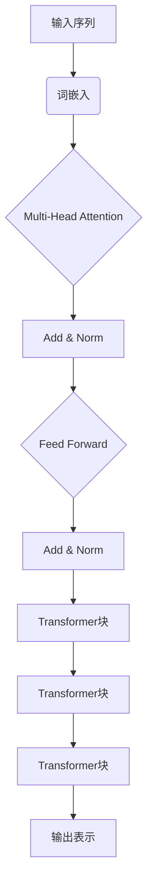

# Transformer大模型实战 BERT 的配置

## 1. 背景介绍

### 1.1 问题的由来

在自然语言处理(NLP)领域,transformer模型凭借其出色的性能和并行计算能力,已成为处理序列数据的主导架构。作为transformer模型的一个重要延伸,BERT(Bidirectional Encoder Representations from Transformers)模型在各种NLP任务中表现出色,成为了当前最先进的语言模型之一。

然而,训练和部署BERT模型并非一蹴而就。由于模型的巨大规模和复杂性,对硬件资源的需求极为苛刻,给实际应用带来了诸多挑战。因此,如何高效配置和优化BERT模型,以在资源受限的环境中发挥其最大潜力,成为一个亟待解决的问题。

### 1.2 研究现状

目前,已有多项研究致力于优化BERT模型的配置和部署。一些常见的优化策略包括:

- 模型压缩: 通过知识蒸馏、模型剪枝等技术压缩模型大小,降低计算和存储开销。
- 并行计算: 利用多GPU训练、模型并行等方式加速训练过程。
- 量化: 将模型参数从32位浮点数压缩到更小的数据类型,减少内存占用。
- 模型裁剪: 根据任务需求,裁剪掉BERT中不必要的部分,如注意力头等。

尽管取得了一定进展,但这些优化方法往往需要权衡精度和效率,且配置过程复杂,对开发者的经验要求较高。

### 1.3 研究意义

高效配置BERT模型对于实现其在资源受限场景下的广泛应用至关重要。本文将系统介绍BERT模型的配置方法,涵盖模型优化、硬件加速、部署策略等多个方面,旨在为开发者提供一个完整的指南,帮助他们充分发挥BERT的潜能。

### 1.4 本文结构  

本文首先介绍BERT模型的核心概念和工作原理,然后详细阐述模型配置的关键环节,包括硬件加速、模型压缩、并行计算等策略。接下来,我们将通过实例项目,展示如何将这些策略付诸实践。最后,文章将总结BERT模型在实际应用中的挑战和未来发展趋势。

## 2. 核心概念与联系

BERT是一种基于Transformer的双向编码器表示,它的核心思想是通过预训练的方式学习上下文表示,为下游NLP任务提供通用的语义表示。

BERT模型由编码器(Encoder)组成,包含多层Transformer块。每个Transformer块由多头自注意力(Multi-Head Attention)和前馈神经网络(Feed-Forward Neural Network)组成。

1. 输入序列首先通过词嵌入层获得初始表示。
2. 嵌入表示输入到多头自注意力子层,捕获序列中词与词之间的依赖关系。
3. 自注意力输出通过归一化层,再输入前馈子层进行非线性变换。
4. 前馈输出再次归一化,构成一个Transformer块的输出。
5. 输出传递到下一个Transformer块,重复上述过程。
6. 最终输出是编码器对输入序列的上下文表示。

通过预训练,BERT可以在大规模无标注语料上学习通用的语义表示,再通过微调(fine-tuning)将这些表示应用到特定的NLP任务中,显著提高了模型的性能。

## 3. 核心算法原理 & 具体操作步骤  

### 3.1 算法原理概述

BERT的核心算法包括两个预训练任务:

1. **掩蔽语言模型(Masked Language Model, MLM)**: 随机将输入序列中的一些词替换为特殊的[MASK]标记,然后让模型预测这些被掩蔽词的原始词汇。这有助于BERT捕获双向上下文信息。

2. **下一句预测(Next Sentence Prediction, NSP)**: 判断两个句子是否为连续的句子对。这个任务旨在加强BERT对上下文关系的建模能力。

在预训练阶段,BERT在大规模语料上并行执行MLM和NSP任务,通过最小化这两个任务的损失函数,学习上下文表示。

在微调阶段,BERT的输出表示被馈送到特定任务的输出层(如分类器或序列生成器),并根据任务目标进行端到端的模型微调。

### 3.2 算法步骤详解

1. **输入处理**:
   - 将输入序列拼接为单个字符串,在开头添加特殊标记[CLS],在句子之间添加[SEP]。
   - 对输入序列执行词条化、词嵌入和位置编码。
   - 随机选择15%的词进行掩蔽,被掩蔽词用[MASK]标记替换。

2. **MLM预训练**:
   - 将掩蔽后的输入序列馈送到BERT编码器。
   - 在编码器的最后一层,收集被掩蔽位置的输出向量。
   - 使用这些向量作为特征,通过分类器预测被掩蔽词的原始词汇。
   - 计算预测值与真实值之间的交叉熵损失,作为MLM损失函数。

3. **NSP预训练**:
   - 在输入序列中,50%的概率选择两个连续的句子作为正例,否则随机选择两个不相关的句子作为负例。
   - 将输入序列馈送到BERT编码器。
   - 从编码器的第一个标记[CLS]处获取输出向量。
   - 使用这个向量作为特征,通过二元分类器预测输入是否为句子对。  
   - 计算预测值与真实值之间的交叉熵损失,作为NSP损失函数。

4. **联合训练**:
   - 将MLM损失和NSP损失相加,得到总的损失函数。
   - 使用梯度下降算法对BERT模型的所有参数进行联合训练,最小化总损失。

5. **微调**:
   - 将预训练好的BERT模型作为初始化权重。
   - 在特定NLP任务的训练数据上,对BERT模型的输出层进行微调。
   - 使用任务相关的损失函数(如分类损失或序列生成损失)进行微调。

### 3.3 算法优缺点

**优点**:

- 通过预训练学习到通用的语义表示,可以显著提高下游任务的性能。
- 双向编码器架构允许BERT捕获更丰富的上下文信息。
- 预训练任务设计合理,有助于捕获词语、句子和句子关系等多层次语义信息。
- 基于Transformer的架构,可以充分利用硬件加速(如GPU/TPU)进行高效的并行计算。

**缺点**:

- 预训练过程计算开销巨大,需要大量算力和训练时间。
- 模型规模庞大,对内存和存储资源要求高。
- 推理速度较慢,不适合对延迟要求苛刻的场景。
- 缺乏对长距离依赖的建模能力。

### 3.4 算法应用领域

BERT及其变体模型已被广泛应用于各种自然语言处理任务,包括但不限于:

- **文本分类**: 新闻分类、情感分析、垃圾邮件检测等。
- **序列标注**: 命名实体识别、关系抽取、词性标注等。
- **问答系统**: 阅读理解、开放域问答等。
- **文本生成**: 文本摘要、机器翻译、对话系统等。
- **语言理解**: 语义相似度计算、句子蕴含识别等。

此外,BERT模型也被用于计算机视觉、语音识别、多模态等其他领域,展现出跨领域的泛化能力。

## 4. 数学模型和公式 & 详细讲解 & 举例说明

### 4.1 数学模型构建

BERT模型的核心是基于Transformer的编码器架构,其中多头自注意力机制是关键组成部分。我们首先介绍自注意力的数学模型。

给定一个长度为$n$的输入序列$\boldsymbol{X} = (x_1, x_2, \dots, x_n)$,其中$x_i \in \mathbb{R}^{d_\text{model}}$是词嵌入向量。自注意力的计算过程如下:

$$\begin{aligned}
\boldsymbol{Q} &= \boldsymbol{X} \boldsymbol{W}^Q \\
\boldsymbol{K} &= \boldsymbol{X} \boldsymbol{W}^K \\
\boldsymbol{V} &= \boldsymbol{X} \boldsymbol{W}^V
\end{aligned}$$

其中$\boldsymbol{W}^Q, \boldsymbol{W}^K, \boldsymbol{W}^V \in \mathbb{R}^{d_\text{model} \times d_k}$是可学习的权重矩阵,将输入映射到查询(Query)、键(Key)和值(Value)空间。

接下来,通过计算查询与所有键的点积,获得注意力分数:

$$\text{Attention}(\boldsymbol{Q}, \boldsymbol{K}, \boldsymbol{V}) = \text{softmax}\left(\frac{\boldsymbol{Q}\boldsymbol{K}^\top}{\sqrt{d_k}}\right)\boldsymbol{V}$$

其中$\sqrt{d_k}$是一个缩放因子,用于防止点积值过大导致softmax函数梯度较小。

多头注意力机制是通过将注意力计算过程独立运行$h$次,然后将结果拼接而成:

$$\begin{aligned}
\text{MultiHead}(\boldsymbol{Q}, \boldsymbol{K}, \boldsymbol{V}) &= \text{Concat}(\text{head}_1, \dots, \text{head}_h)\boldsymbol{W}^O\\
\text{where}\  \text{head}_i &= \text{Attention}(\boldsymbol{Q}\boldsymbol{W}_i^Q, \boldsymbol{K}\boldsymbol{W}_i^K, \boldsymbol{V}\boldsymbol{W}_i^V)
\end{aligned}$$

其中$\boldsymbol{W}_i^Q, \boldsymbol{W}_i^K, \boldsymbol{W}_i^V, \boldsymbol{W}^O$是可学习的线性投影参数。

最后,将多头注意力的输出与输入相加,并通过层归一化和前馈神经网络进行进一步处理,构成一个Transformer编码器块。

### 4.2 公式推导过程

我们以MLM预训练任务为例,推导BERT模型的损失函数。

假设输入序列长度为$n$,其中有$m$个位置被掩蔽,记为掩蔽位置集合$\mathcal{M} = \{i_1, i_2, \dots, i_m\}$。令$\boldsymbol{Y} = (y_1, y_2, \dots, y_m)$表示这些位置的原始词汇,其中$y_j \in \mathcal{V}$,且$\mathcal{V}$是词汇表。

将掩蔽后的输入序列$\boldsymbol{X}$馈送到BERT编码器,得到最终的输出表示$\boldsymbol{H} = (\boldsymbol{h}_1, \boldsymbol{h}_2, \dots, \boldsymbol{h}_n)$,其中$\boldsymbol{h}_i \in \mathbb{R}^{d_\text{model}}$。

对于每个被掩蔽的位置$i_j$,我们使用对应的输出向量$\boldsymbol{h}_{i_j}$作为特征,通过一个分类器预测原始词汇:

$$\hat{y}_{i_j} = \text{softmax}(\boldsymbol{h}_{i_j}\boldsymbol{W}^T + \boldsymbol{b})$$

其中$\boldsymbol{W} \in \mathbb{R}^{d_\text{model} \times |\mathcal{V}|}$和$\boldsymbol{b} \in \mathbb{R}^{|\mathcal{V}|}$是可学习的分类器参数。

MLM的损失函数定义为所有被掩蔽位置的交叉熵损失之和:

$$\mathcal{L}_\text{MLM} = -\sum_{j=1}^m \log P(y_{