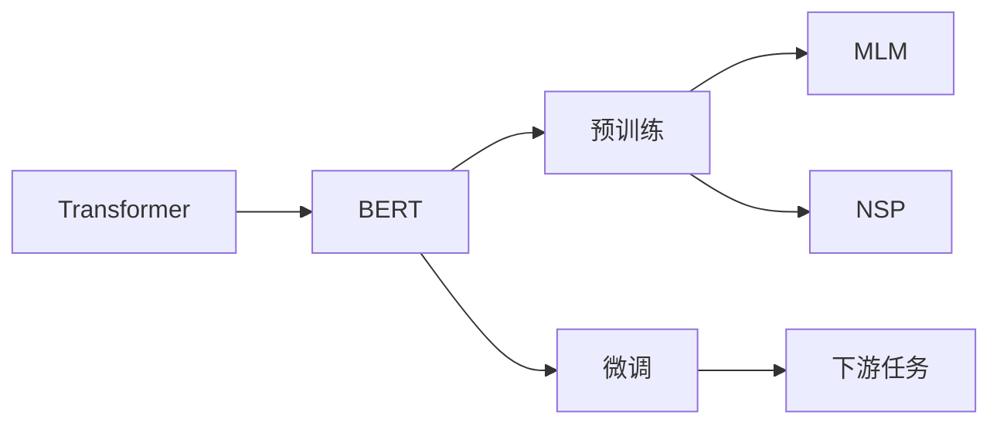

# Transformer大模型实战 汉语的BERT模型

## 1. 背景介绍

### 1.1 问题的由来
近年来，随着深度学习技术的飞速发展，自然语言处理(NLP)领域取得了巨大的突破。尤其是Transformer模型的出现，更是将NLP推向了一个新的高度。BERT(Bidirectional Encoder Representations from Transformers)作为Transformer家族的代表模型之一，以其强大的语义理解和特征抽取能力，在多项NLP任务上取得了state-of-the-art的表现。

然而，原版BERT模型是基于英文语料训练的，对于中文等语种的适配性还有待提高。为了更好地应用于中文NLP场景，研究人员提出了多种面向中文的BERT变体模型，如Chinese-BERT、RoBERTa-wwm-ext等。这些模型在中文数据集上进行了预训练，极大地提升了下游中文NLP任务的效果。

### 1.2 研究现状
目前，基于中文BERT的研究已经涵盖了NLP的多个领域，如情感分析、命名实体识别、文本分类、阅读理解、机器翻译等。一些代表性的工作包括：

- 哈工大讯飞联合实验室发布的RoBERTa-wwm-ext，在多个中文NLP任务上取得了最好的效果[1]。
- 清华大学团队提出的ERNIE(Enhanced Representation through Knowledge Integration)，通过融入知识图谱等外部知识，进一步增强了模型的语义理解能力[2]。
- 复旦大学研究者开发的BERT-wwm，使用Whole Word Masking策略，在多个中文数据集上超越了BERT和ERNIE[3]。

这些研究工作极大地推动了中文NLP技术的发展，为实际应用奠定了基础。

### 1.3 研究意义
开展面向中文的BERT研究，对于提升中文NLP系统的性能具有重要意义：

1. 充分利用海量中文语料，构建更加强大的中文语言模型，为下游任务提供高质量的语义表示。
2. 针对汉语的语言特点，如字词混合、语义曲折等，设计更加贴合中文的预训练目标和策略。  
3. 促进中文NLP技术在智能客服、舆情监测、知识图谱等领域的落地应用，提升中文信息处理的智能化水平。
4. 为其他低资源语言的研究提供借鉴，推动多语言NLP模型的发展。

### 1.4 本文结构
本文将重点介绍汉语BERT模型的原理和实践。内容安排如下：

第2部分介绍BERT的核心概念和Transformer结构原理。  
第3部分详细阐述BERT的预训练和微调算法。  
第4部分给出BERT的数学建模过程和关键公式推导。  
第5部分展示基于中文BERT的代码实践。  
第6部分讨论BERT在中文NLP任务中的应用场景。  
第7部分推荐BERT相关的学习资源和开发工具。  
第8部分总结全文，并对未来研究方向进行展望。

## 2. 核心概念与联系

BERT的核心是基于Transformer的双向语言模型。它的特点包括：

1. 双向编码：不同于传统的单向语言模型，BERT采用掩码语言模型(Masked Language Model, MLM)和下一句预测(Next Sentence Prediction, NSP)两个预训练任务，实现了对上下文信息的双向建模。

2. 深层的多头注意力：BERT使用Transformer的编码器结构，通过多层的Self-Attention和前馈网络，建模词与词之间的依赖关系，捕捉长距离语义信息。

3. 预训练+微调范式：BERT采用两阶段学习，首先在大规模无监督语料上进行预训练，学习通用的语言表示；然后针对具体任务进行微调，快速适应下游应用。

4. WordPiece分词：BERT使用WordPiece进行分词，能够有效处理未登录词，提高语义建模的健壮性。

5. 位置编码：为了引入词序信息，BERT在Embedding中加入可学习的位置编码向量。

BERT与Transformer的关系如下图所示：

可以看出，BERT是基于Transformer结构，通过预训练和微调两个阶段，实现了强大的语言理解能力，可以灵活应用于各种NLP任务。

## 3. 核心算法原理 & 具体操作步骤

### 3.1 算法原理概述
BERT的训练分为两个阶段：预训练和微调。

预训练阶段的目标是学习语言的通用表示。具体来说，使用MLM和NSP两个任务：

- MLM：随机掩盖一定比例的词，让模型根据上下文预测被掩盖的词。这样可以学到词与词之间的关联。 
- NSP：给定两个句子，让模型判断它们在原文中是否相邻。这有助于学习句间关系。

微调阶段是在具体任务的标注数据上进行监督学习，让BERT的参数适应下游任务。主要思路是在BERT顶层添加任务特定的输出层，端到端地进行训练。

### 3.2 算法步骤详解

1. 预训练
   - 语料准备：收集大规模无监督的文本数据，进行清洗和预处理。
   - 分词：使用WordPiece算法对语料进行分词，得到词表和词id序列。
   - 构造训练样本：
     - 对于MLM，以一定概率(如15%)随机掩盖词，并让模型预测被掩盖的词。
     - 对于NSP，从语料中采样句子对，并标记它们是否相邻。
   - 模型训练：
     - 将样本输入BERT，经过Embedding、Self-Attention、前馈网络等层，得到每个词的contextualized表示。
     - 根据MLM和NSP任务对输出层进行预测，并计算损失函数。
     - 使用Adam优化器更新模型参数，直到收敛。

2. 微调
   - 任务数据准备：对下游任务的标注数据进行预处理，转换为BERT的输入格式。
   - 模型构建：在预训练好的BERT上添加任务特定的输出层，如分类层、序列标注层等。
   - 训练：
     - 将任务数据输入微调后的BERT，计算任务损失函数。
     - 使用Adam优化器更新整个模型的参数，直到收敛。
   - 推理：对测试集进行预测，评估模型在下游任务上的性能。

### 3.3 算法优缺点

优点：
- 通过预训练学习通用语言知识，再通过微调快速适应任务，提高了模型的泛化能力和数据效率。
- 双向建模和深层Self-Attention能够捕捉长距离依赖，增强语义理解。
- WordPiece分词和Mask机制提高了模型的鲁棒性。

缺点：
- 模型参数量大，训练和推理成本高。
- 对于一些细粒度的NLP任务，如情感分析的aspect级别分类，BERT的效果提升有限。
- 模型是基于全词掩码的Transformer，对于词法分析等任务不够理想。

### 3.4 算法应用领域
BERT已经在多个NLP任务上取得了突破性进展，主要应用包括：

- 文本分类：如情感分析、新闻分类、意图识别等。
- 序列标注：如命名实体识别、词性标注、语义角色标注等。  
- 句子关系判断：如自然语言推理、语义相似度计算等。
- 阅读理解：如问答系统、文章标题生成等。
- 机器翻译：将BERT用于编码源语言和目标语言，提高翻译质量。

总的来说，BERT为NLP下游任务提供了强大的语义表示，极大地提升了模型性能。同时，BERT的思想也为其他领域的预训练模型提供了范式，如用于图像的ViT、用于语音的wav2vec等。

## 4. 数学模型和公式 & 详细讲解 & 举例说明

### 4.1 数学模型构建
BERT的核心是Transformer的编码器结构，主要由Embedding、Self-Attention、前馈网络等组件构成。

1. Embedding层
设输入序列为 $\mathbf{x} = \{x_1, \dots, x_n\}$，其中 $x_i$ 为第 $i$ 个词的id。Embedding层将离散的词id映射为连续向量表示：

$$
\mathbf{e}_i = \mathbf{E}x_i + \mathbf{p}_i + \mathbf{s}_i
$$

其中，$\mathbf{E} \in \mathbb{R}^{d_e \times |V|}$ 为词嵌入矩阵，$d_e$ 为嵌入维度，$|V|$ 为词表大小。$\mathbf{p}_i \in \mathbb{R}^{d_e}$ 为位置编码向量，引入词序信息。$\mathbf{s}_i \in \mathbb{R}^{d_e}$ 为段落编码向量，用于区分句子对。

2. Self-Attention层
Self-Attention用于捕捉词与词之间的依赖关系。设第 $l$ 层的隐状态为 $\mathbf{h}^l = \{\mathbf{h}_1^l, \dots, \mathbf{h}_n^l\}$，每个词的表示为 $\mathbf{h}_i^l \in \mathbb{R}^{d_h}$，$d_h$ 为隐藏层维度。

首先，通过线性变换得到查询矩阵 $\mathbf{Q}$、键矩阵 $\mathbf{K}$ 和值矩阵 $\mathbf{V}$：

$$
\mathbf{Q} = \mathbf{h}^l\mathbf{W}^Q, \quad 
\mathbf{K} = \mathbf{h}^l\mathbf{W}^K, \quad
\mathbf{V} = \mathbf{h}^l\mathbf{W}^V
$$

其中，$\mathbf{W}^Q, \mathbf{W}^K, \mathbf{W}^V \in \mathbb{R}^{d_h \times d_k}$ 为可学习的权重矩阵，$d_k$ 为注意力头的维度。

然后，计算注意力分数和注意力输出：

$$
\mathbf{A} = \text{softmax}(\frac{\mathbf{Q}\mathbf{K}^T}{\sqrt{d_k}}), \quad
\mathbf{Z} = \mathbf{A}\mathbf{V}
$$

其中，$\mathbf{A} \in \mathbb{R}^{n \times n}$ 为注意力矩阵，表示每个词对其他词的注意力分布。$\mathbf{Z} \in \mathbb{R}^{n \times d_k}$ 为注意力输出，聚合了每个词的上下文信息。

BERT使用多头注意力，即并行计算多个注意力头，再将它们拼接起来：

$$
\text{MultiHead}(\mathbf{h}^l) = \text{Concat}(\mathbf{Z}_1, \dots, \mathbf{Z}_H)\mathbf{W}^O
$$

其中，$H$ 为注意力头数，$\mathbf{W}^O \in \mathbb{R}^{Hd_k \times d_h}$ 为输出层权重矩阵。

3. 前馈网络层
前馈网络用于增加模型的非线性表达能力。它由两个全连接层和一个非线性激活函数组成：

$$
\text{FFN}(\mathbf{z}) = \text{ReLU}(\mathbf{z}\mathbf{W}_1 + \mathbf{b}_1)\mathbf{W}_2 + \mathbf{b}_2
$$

其中，$\mathbf{W}_1 \in \mathbb{R}^{d_h \times d_{ff}}, \mathbf{W}_2 \in \mathbb{R}^{d_{ff} \times d_h}$ 为权重矩阵，$\mathbf{b}_1 \in \mathbb{R}^{d_{ff}}, \mathbf{b}_2 \in \mathbb{R}^{d_h}$ 为偏置项，$d_{ff}$ 为前馈层维度。

4. 残差连接和层归一化
为了促进梯度传播和加速收敛，BERT在Self-Attention和前馈网络之后加入残差连接和层归一化：

$$
\mathbf{h}^{l+1} = \text{LayerNorm}(\mathbf{