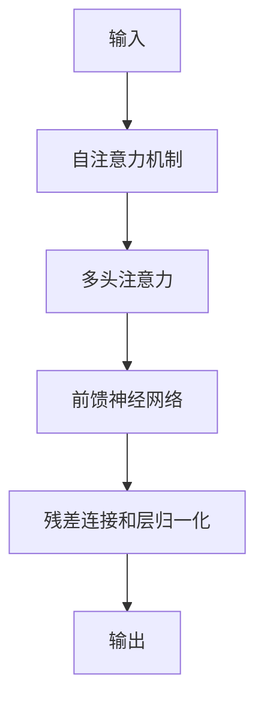

# Transformer大模型实战 解码器总览

## 1. 背景介绍
### 1.1 问题的由来
近年来，随着深度学习的快速发展，自然语言处理领域取得了突破性的进展。Transformer模型作为一种革命性的神经网络架构，在机器翻译、文本摘要、问答系统等任务中表现出色。然而，对于许多开发者和研究者来说，如何实现一个高效、可扩展的Transformer解码器仍然是一个具有挑战性的问题。

### 1.2 研究现状
目前，业界已经提出了多种Transformer解码器的实现方案，如Beam Search、Greedy Search等。这些方法在一定程度上解决了解码器的效率问题，但在生成长文本时仍然存在一些局限性。此外，现有的解码器实现大多基于特定的深度学习框架，可移植性和可扩展性有待提高。

### 1.3 研究意义
深入研究Transformer解码器的实现原理和优化技术，对于推动自然语言处理的发展具有重要意义。一方面，高效的解码器可以加速模型的推理过程，提升应用的响应速度；另一方面，通用的解码器实现可以方便地集成到不同的任务和框架中，促进技术的普及和应用。

### 1.4 本文结构
本文将从以下几个方面对Transformer解码器进行深入探讨：首先，介绍Transformer解码器的核心概念和原理；其次，详细阐述解码器的算法步骤和数学模型；再次，通过代码实例和详细解释，演示如何实现一个高效的解码器；最后，总结Transformer解码器的发展趋势和面临的挑战。

## 2. 核心概念与联系
Transformer解码器的核心概念包括：
- 自注意力机制（Self-Attention）：通过计算序列内部的注意力权重，捕捉词与词之间的依赖关系。
- 多头注意力（Multi-Head Attention）：将自注意力扩展为多个并行的注意力头，增强模型的表达能力。
- 前馈神经网络（Feed-Forward Network）：对注意力的输出进行非线性变换，提取高级特征。
- 残差连接（Residual Connection）和层归一化（Layer Normalization）：稳定网络训练，加速收敛速度。

这些概念之间紧密相连，共同构建了Transformer解码器的架构。下图展示了它们在解码器中的位置和作用：



## 3. 核心算法原理 & 具体操作步骤
### 3.1 算法原理概述
Transformer解码器的核心算法是基于自注意力机制和前馈神经网络的迭代计算过程。在每个时间步，解码器根据当前的输入和之前的隐藏状态，计算出下一个时间步的输出。这个过程可以分为以下几个步骤：

1. 计算自注意力权重
2. 进行多头注意力计算
3. 通过前馈神经网络提取特征
4. 残差连接和层归一化
5. 生成下一个时间步的输出

### 3.2 算法步骤详解
1. 计算自注意力权重
   - 将当前时间步的输入向量和之前的隐藏状态拼接成一个矩阵 $X$
   - 计算查询矩阵 $Q=XW^Q$，键矩阵 $K=XW^K$，值矩阵 $V=XW^V$
   - 计算自注意力权重 $A=softmax(\frac{QK^T}{\sqrt{d_k}})$

2. 进行多头注意力计算
   - 将 $Q$，$K$，$V$ 分别划分为 $h$ 个子矩阵 $Q_i$，$K_i$，$V_i$
   - 对每个头并行计算注意力 $head_i=Attention(Q_i,K_i,V_i)$
   - 将所有头的结果拼接起来 $MultiHead(Q,K,V)=Concat(head_1,...,head_h)W^O$

3. 通过前馈神经网络提取特征
   - 对多头注意力的输出进行非线性变换 $FFN(x)=max(0,xW_1+b_1)W_2+b_2$

4. 残差连接和层归一化
   - 将前馈网络的输出与输入进行残差连接 $x=LayerNorm(x+FFN(x))$

5. 生成下一个时间步的输出
   - 将归一化后的结果作为下一个时间步的输入，重复步骤1-4
   - 在最后一个时间步，通过Softmax层生成最终的输出概率分布

### 3.3 算法优缺点
优点：
- 自注意力机制可以有效捕捉长距离依赖关系
- 多头注意力增强了模型的表达能力
- 残差连接和层归一化稳定了网络训练

缺点：
- 计算复杂度较高，对硬件要求较高
- 解码器的生成过程是串行的，难以并行化
- 生成长文本时，容易出现重复、矛盾等问题

### 3.4 算法应用领域
Transformer解码器广泛应用于以下领域：
- 机器翻译：将源语言文本翻译成目标语言文本
- 文本摘要：自动生成文章的摘要或标题
- 对话系统：根据上下文生成恰当的回复
- 图像描述：根据图像内容生成自然语言描述

## 4. 数学模型和公式 & 详细讲解 & 举例说明
### 4.1 数学模型构建
Transformer解码器可以用以下数学模型来描述：

给定输入序列 $X=(x_1,x_2,...,x_n)$，解码器的目标是生成输出序列 $Y=(y_1,y_2,...,y_m)$。在每个时间步 $t$，解码器根据当前的输入 $y_t$ 和之前的隐藏状态 $h_{<t}$ 计算下一个时间步的输出 $y_{t+1}$。

$$
\begin{aligned}
h_t &= Decoder(y_t, h_{<t}) \\
y_{t+1} &= Softmax(h_tW^{vocab})
\end{aligned}
$$

其中，$Decoder$ 表示解码器的计算过程，$W^{vocab}$ 是输出词汇表的权重矩阵。

### 4.2 公式推导过程
解码器的计算过程可以进一步展开为：

1. 自注意力权重计算
$$
\begin{aligned}
Q &= XW^Q \\
K &= XW^K \\
V &= XW^V \\
A &= softmax(\frac{QK^T}{\sqrt{d_k}})
\end{aligned}
$$

2. 多头注意力计算
$$
\begin{aligned}
head_i &= Attention(Q_i,K_i,V_i) \\
MultiHead(Q,K,V) &= Concat(head_1,...,head_h)W^O
\end{aligned}
$$

3. 前馈神经网络
$$
FFN(x) = max(0,xW_1+b_1)W_2+b_2
$$

4. 残差连接和层归一化
$$
x = LayerNorm(x+FFN(x))
$$

通过以上步骤的迭代计算，解码器可以生成完整的输出序列。

### 4.3 案例分析与讲解
以机器翻译任务为例，假设我们要将英文句子 "I love natural language processing" 翻译成中文。

输入序列 $X$ 为：
```
['<start>', 'I', 'love', 'natural', 'language', 'processing', '<end>']
```

解码器逐步生成输出序列 $Y$：
```
y_1 = '<start>'
y_2 = '我'
y_3 = '喜欢'
y_4 = '自然语言'
y_5 = '处理'
y_6 = '<end>'
```

在每个时间步，解码器根据当前的输入和之前的隐藏状态，计算自注意力权重、多头注意力、前馈网络，并通过残差连接和层归一化得到下一个时间步的隐藏状态。最终，解码器输出的中文翻译结果为："我喜欢自然语言处理"。

### 4.4 常见问题解答
Q: Transformer解码器的时间复杂度是多少？
A: 解码器的时间复杂度为 $O(n^2d)$，其中 $n$ 是序列长度，$d$ 是模型维度。这主要是由于自注意力机制需要计算 $n×n$ 的注意力矩阵。

Q: 解码器中的残差连接有什么作用？
A: 残差连接可以帮助梯度直接传递到前面的层，缓解梯度消失问题。同时，它也使得网络可以学习恒等映射，加速收敛速度。

Q: 如何处理解码器生成重复、矛盾的问题？
A: 可以采用以下策略：1)使用覆盖度机制，惩罚重复生成的词；2)引入多样性损失，鼓励生成多样化的文本；3)在解码时使用束搜索，选择最优的候选结果。

## 5. 项目实践：代码实例和详细解释说明
### 5.1 开发环境搭建
本项目基于PyTorch深度学习框架，需要安装以下依赖：
- Python 3.6+
- PyTorch 1.8+
- NumPy
- NLTK

可以使用pip命令进行安装：
```bash
pip install torch numpy nltk
```

### 5.2 源代码详细实现
下面是Transformer解码器的PyTorch实现代码：

```python
import torch
import torch.nn as nn

class Decoder(nn.Module):
    def __init__(self, vocab_size, embed_dim, num_heads, hidden_dim, num_layers, dropout=0.1):
        super().__init__()
        self.embedding = nn.Embedding(vocab_size, embed_dim)
        self.layers = nn.ModuleList([DecoderLayer(embed_dim, num_heads, hidden_dim, dropout) for _ in range(num_layers)])
        self.fc = nn.Linear(embed_dim, vocab_size)
    
    def forward(self, x, encoder_output, mask=None):
        x = self.embedding(x)
        for layer in self.layers:
            x = layer(x, encoder_output, mask)
        x = self.fc(x)
        return x

class DecoderLayer(nn.Module):
    def __init__(self, embed_dim, num_heads, hidden_dim, dropout=0.1):
        super().__init__()
        self.self_attn = MultiHeadAttention(embed_dim, num_heads)
        self.cross_attn = MultiHeadAttention(embed_dim, num_heads)
        self.ffn = nn.Sequential(
            nn.Linear(embed_dim, hidden_dim),
            nn.ReLU(),
            nn.Linear(hidden_dim, embed_dim)
        )
        self.norm1 = nn.LayerNorm(embed_dim)
        self.norm2 = nn.LayerNorm(embed_dim)
        self.norm3 = nn.LayerNorm(embed_dim)
        self.dropout = nn.Dropout(dropout)
    
    def forward(self, x, encoder_output, mask=None):
        # Self-attention
        residual = x
        x = self.self_attn(x, x, x, mask)
        x = self.norm1(residual + self.dropout(x))
        
        # Cross-attention
        residual = x
        x = self.cross_attn(x, encoder_output, encoder_output)
        x = self.norm2(residual + self.dropout(x))
        
        # Feed-forward network
        residual = x
        x = self.ffn(x)
        x = self.norm3(residual + self.dropout(x))
        
        return x

class MultiHeadAttention(nn.Module):
    def __init__(self, embed_dim, num_heads):
        super().__init__()
        self.embed_dim = embed_dim
        self.num_heads = num_heads
        self.head_dim = embed_dim // num_heads
        
        self.q_proj = nn.Linear(embed_dim, embed_dim)
        self.k_proj = nn.Linear(embed_dim, embed_dim)
        self.v_proj = nn.Linear(embed_dim, embed_dim)
        self.out_proj = nn.Linear(embed_dim, embed_dim)
    
    def forward(self, q, k, v, mask=None):
        batch_size = q.size(0)
        
        # Project and reshape queries, keys and values
        q = self.q_proj(q).view(batch_size, -1, self.num_heads, self.head_dim).transpose(1, 2)
        k = self.k_proj(k).view(batch_size, -1, self.num_heads, self.head_dim).transpose(1, 2)
        v = self.v_proj(v).view(batch_size, -1, self.num_heads, self.head_dim).transpose(1, 2)
        
        # Compute attention scores and apply mask
        attn_scores = torch.matmul(q, k.transpose