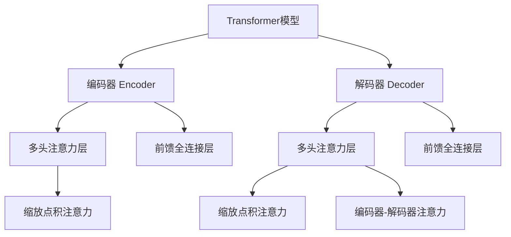

# Transformer大模型实战 训练学生BERT模型（TinyBERT 模型）

## 1. 背景介绍

### 1.1 问题的由来

随着自然语言处理(NLP)技术的不断发展,transformer模型因其强大的表现力和并行计算能力,成为了NLP领域的主流模型架构。然而,大规模的transformer模型通常包含数十亿甚至数百亿参数,导致了计算资源和存储开销的急剧增加,限制了其在资源受限环境(如移动端、嵌入式设备等)中的应用。为了解决这一问题,业界提出了知识蒸馏(Knowledge Distillation)的方法,即利用大模型(Teacher Model)的知识来指导训练小模型(Student Model),使小模型在保持较高精度的同时大幅减小模型大小和计算开销。

### 1.2 研究现状

目前,基于transformer的BERT模型是NLP领域最成功的预训练语言模型之一,被广泛应用于各种下游任务。然而,BERT-Base模型就包含约1.1亿个参数,BERT-Large更是高达3.4亿个参数,这使得它们在资源受限环境下的应用受到了严重限制。为了解决这一问题,研究人员提出了多种BERT模型压缩和知识蒸馏方法,例如TinyBERT、DistillBERT、MobileBERT等,旨在获得精度和效率的平衡。

### 1.3 研究意义

本文将重点介绍TinyBERT模型的训练过程,它是一种基于知识蒸馏的BERT模型压缩方法。TinyBERT模型不仅能够大幅减小模型大小,而且在下游任务上表现出与BERT-Base相当的性能。通过掌握TinyBERT模型的训练方法,读者将能够更好地理解和应用transformer知识蒸馏技术,为在资源受限环境中部署大型NLP模型提供有力支持。

### 1.4 本文结构  

本文首先介绍transformer模型和BERT的核心概念,然后详细阐述TinyBERT模型的训练算法原理、数学模型及公式推导。接下来,我们将通过代码实例展示TinyBERT模型的具体训练过程,并分析运行结果。最后,本文将探讨TinyBERT模型在实际应用中的场景,并对未来的发展趋势和挑战进行展望。

## 2. 核心概念与联系

为了更好地理解TinyBERT模型的训练过程,我们首先需要了解transformer模型和BERT模型的核心概念。

### 2.1 Transformer模型

Transformer是一种全新的基于自注意力(Self-Attention)机制的序列到序列(Seq2Seq)模型,它完全摒弃了传统的循环神经网络(RNN)和卷积神经网络(CNN)结构,使用了全新的注意力机制来捕捉输入序列中任意两个位置之间的长程依赖关系。Transformer模型主要由编码器(Encoder)和解码器(Decoder)两部分组成,两者都是由多个相同的层组成的堆栈结构。

其中,编码器用于编码输入序列,解码器则根据编码器的输出生成目标序列。每个编码器/解码器层都包含一个多头注意力(Multi-Head Attention)子层和一个前馈全连接(Feed-Forward)子层。多头注意力机制能够同时关注输入序列中的不同位置,捕捉长程依赖关系;前馈全连接层则对每个位置的表示进行非线性变换,增强模型的表现能力。

### 2.2 BERT模型

BERT(Bidirectional Encoder Representations from Transformers)是一种基于Transformer的双向编码器模型,它通过预训练的方式学习通用的语言表示,然后将这些表示迁移到下游的NLP任务中,取得了卓越的效果。BERT模型主要由以下几个核心部分组成:

1. **词嵌入(Token Embeddings)**: 将输入文本中的每个词映射为一个连续的向量表示。
2. **位置嵌入(Position Embeddings)**: 因为Transformer没有递归或卷积结构,所以需要位置嵌入来编码序列中每个位置的信息。
3. **段嵌入(Segment Embeddings)**: 用于区分输入序列中不同的句子或段落。
4. **多层Transformer编码器**: 对输入序列进行编码,捕捉长程依赖关系。
5. **预训练任务**: BERT采用了两个无监督预训练任务,即"掩码语言模型"(Masked Language Model)和"下一句预测"(Next Sentence Prediction)。

通过在大规模语料库上进行预训练,BERT能够学习到通用的语义和语法知识,并将这些知识迁移到下游的NLP任务中,显著提高了模型的性能。

### 2.3 TinyBERT与知识蒸馏

尽管BERT模型取得了卓越的效果,但它包含大量的参数,导致了计算和存储开销的增加。为了解决这一问题,研究人员提出了TinyBERT模型,它是一种基于知识蒸馏的BERT模型压缩方法。

知识蒸馏(Knowledge Distillation)是一种模型压缩技术,它的核心思想是利用一个大型的"教师模型"(Teacher Model)来指导一个小型的"学生模型"(Student Model)的训练,使学生模型能够学习到教师模型的知识,从而在保持较高精度的同时大幅减小模型大小和计算开销。

在TinyBERT中,BERT-Base或BERT-Large模型就扮演了教师模型的角色,而TinyBERT则是学生模型。通过特殊设计的知识蒸馏目标函数,TinyBERT能够有效地从教师模型那里学习到丰富的语言知识,最终获得与BERT-Base相当的性能表现,但模型大小只有BERT-Base的7.5%左右。

## 3. 核心算法原理 & 具体操作步骤

### 3.1 算法原理概述

TinyBERT模型的训练过程可以分为两个阶段:预训练(Pre-training)和微调(Fine-tuning)。

在预训练阶段,TinyBERT模型通过知识蒸馏的方式从BERT教师模型那里学习通用的语言表示。具体来说,教师模型和学生模型分别对同一输入序列进行前向计算,得到对应的logits输出。然后,TinyBERT的训练目标是最小化学生模型的logits输出与教师模型的logits输出之间的损失函数。通过这种方式,TinyBERT能够学习到教师模型丰富的语言知识,同时大幅减小了模型大小。

在微调阶段,我们将预训练好的TinyBERT模型迁移到下游的NLP任务中,并在任务数据上进行进一步的微调训练,使模型能够更好地适应特定的任务。

### 3.2 算法步骤详解

1. **准备数据**

   我们需要准备两种类型的数据:
   - 用于预训练的通用语料库数据,例如Wikipedia、书籍等。
   - 用于微调的下游任务数据,例如文本分类、序列标注等任务的标注数据。

2. **加载教师模型和学生模型**

   加载预训练好的BERT教师模型(如BERT-Base或BERT-Large)和初始化的TinyBERT学生模型。

3. **预训练阶段**

   - 对同一输入序列,分别通过教师模型和学生模型进行前向计算,得到对应的logits输出。
   - 计算教师模型logits和学生模型logits之间的损失函数,例如使用均方误差(Mean Squared Error, MSE)或者KL散度(Kullback-Leibler Divergence)。
   - 对学生模型的参数进行反向传播和优化,使其logits输出逐渐逼近教师模型的logits输出。
   - 重复上述过程,直到模型收敛或达到预设的训练轮数。

4. **微调阶段**

   - 将预训练好的TinyBERT模型加载到下游NLP任务中。
   - 根据任务的目标函数(如交叉熵损失函数),对TinyBERT模型进行进一步的微调训练。
   - 在验证集上评估模型的性能,并根据需要调整超参数或训练策略。
   - 重复上述过程,直到模型在验证集上达到最佳性能。

5. **模型评估和部署**

   - 在测试集上评估最终模型的性能。
   - 将训练好的TinyBERT模型部署到实际的应用环境中。

### 3.3 算法优缺点

**优点**:

- 大幅减小模型大小,降低计算和存储开销,有利于在资源受限环境中部署。
- 能够有效地从教师模型那里学习到丰富的语言知识,保持较高的精度表现。
- 预训练和微调的分步训练策略,使得模型能够更好地适应不同的下游任务。

**缺点**:

- 需要预先训练好的大型教师模型,增加了额外的计算开销。
- 知识蒸馏过程可能会导致一些信息损失,影响模型的最终性能。
- 对于一些特殊的下游任务,可能需要进一步调整模型结构和训练策略。

### 3.4 算法应用领域

TinyBERT模型的训练算法可以广泛应用于以下领域:

- 移动端和嵌入式设备的自然语言处理应用,例如智能助手、语音识别等。
- 云端服务器的大规模自然语言处理任务,例如机器翻译、文本生成等。
- 其他资源受限环境下的自然语言处理应用,例如物联网设备、边缘计算等。

## 4. 数学模型和公式 & 详细讲解 & 举例说明

### 4.1 数学模型构建

在TinyBERT模型的预训练阶段,我们需要构建一个合适的损失函数,使学生模型的logits输出逐渐逼近教师模型的logits输出。常见的损失函数包括均方误差(MSE)和KL散度(KL Divergence)。

1. **均方误差(MSE)**

均方误差是衡量两个向量之间差异的常用方法,定义如下:

$$\mathrm{MSE}(y, \hat{y}) = \frac{1}{n} \sum_{i=1}^{n} (y_i - \hat{y_i})^2$$

其中,$y$是教师模型的logits输出,$\hat{y}$是学生模型的logits输出,$n$是logits向量的维度。

在TinyBERT的训练中,我们需要最小化教师模型logits和学生模型logits之间的均方误差:

$$\mathcal{L}_\mathrm{MSE} = \mathrm{MSE}(y, \hat{y})$$

2. **KL散度(KL Divergence)**

KL散度是衡量两个概率分布之间差异的常用方法,定义如下:

$$\mathrm{KL}(P \| Q) = \sum_{i} P(i) \log \frac{P(i)}{Q(i)}$$

其中,$P$和$Q$分别表示两个概率分布。

在TinyBERT的训练中,我们可以将教师模型的logits输出$y$通过Softmax函数转换为概率分布$P$,将学生模型的logits输出$\hat{y}$转换为概率分布$Q$,然后最小化两者之间的KL散度:

$$\mathcal{L}_\mathrm{KL} = \mathrm{KL}(P \| Q) = \mathrm{KL}(\mathrm{Softmax}(y) \| \mathrm{Softmax}(\hat{y}))$$

### 4.2 公式推导过程

我们以KL散度损失函数为例,推导TinyBERT预训练的目标函数。

首先,根据KL散度的定义,我们有:

$$\begin{aligned}
\mathcal{L}_\mathrm{KL} &= \mathrm{KL}(\mathrm{Softmax}(y) \| \mathrm{Softmax}(\hat{y})) \\
&= \sum_i \mathrm{Softmax}(y)_i \log \frac{\mathrm{Softmax}(y)_i}{\mathrm