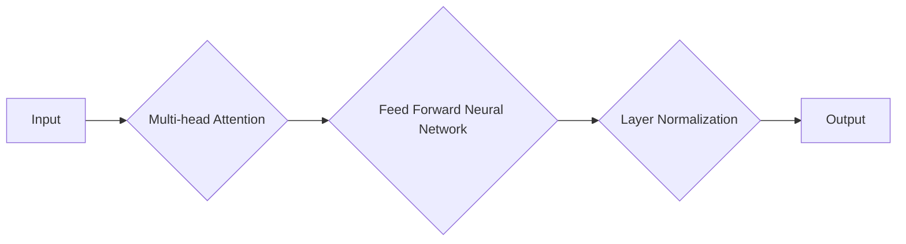

# Transformer模型的原理与优化方法

作者：禅与计算机程序设计艺术 / Zen and the Art of Computer Programming

## 1. 背景介绍

### 1.1 问题的由来

自然语言处理（NLP）领域在近年来取得了显著进展，尤其是在机器翻译、文本摘要和问答系统等方面。然而，传统的循环神经网络（RNN）模型在处理长序列数据时存在梯度消失或梯度爆炸的问题，限制了其性能。为了解决这些问题，2017年Google提出了Transformer模型，该模型基于自注意力机制，实现了并行计算，大幅提升了NLP任务的性能。

### 1.2 研究现状

Transformer模型自提出以来，迅速成为NLP领域的热门研究话题。基于Transformer的模型在多个NLP任务上取得了SOTA（State-of-the-Art）性能，如BERT、GPT-3等。此外，Transformer模型也在其他领域，如计算机视觉、语音识别等领域取得了成功。

### 1.3 研究意义

Transformer模型的出现推动了NLP领域的发展，为处理长序列数据提供了有效的解决方案。本文将深入探讨Transformer模型的原理、优化方法及其应用，为读者提供全面的技术指导。

### 1.4 本文结构

本文分为以下几个部分：

- 第2章介绍Transformer模型的核心概念与联系。
- 第3章详细讲解Transformer模型的算法原理、操作步骤及其优缺点。
- 第4章阐述数学模型、公式和案例分析。
- 第5章展示项目实践，包括代码实例和详细解释说明。
- 第6章分析实际应用场景和未来应用展望。
- 第7章推荐学习资源、开发工具和相关论文。
- 第8章总结研究成果、未来发展趋势和挑战。
- 第9章提供常见问题与解答。

## 2. 核心概念与联系

### 2.1 自注意力机制

自注意力机制（Self-Attention Mechanism）是Transformer模型的核心，它能够捕捉序列中不同位置之间的依赖关系。自注意力机制通过计算序列中每个词与所有其他词的关联度，为每个词生成一个表示，从而实现并行计算。

### 2.2 位置编码

由于Transformer模型没有序列的顺序信息，因此需要引入位置编码（Positional Encoding）来表示序列中每个词的位置信息。位置编码可以是正弦和余弦函数的组合，也可以通过学习获得。

### 2.3 残差连接和层归一化

为了防止梯度消失和梯度爆炸，Transformer模型采用了残差连接（Residual Connection）和层归一化（Layer Normalization）技术。残差连接将输入直接加到下一层的输出中，层归一化则对每一层的输入进行归一化处理。

## 3. 核心算法原理 & 具体操作步骤

### 3.1 算法原理概述

Transformer模型主要由多头自注意力机制、前馈神经网络和层归一化组成。以下是一个简化版的Transformer模型结构图：



### 3.2 算法步骤详解

#### 3.2.1 多头自注意力机制

多头自注意力机制通过多个注意力头并行计算，捕捉序列中不同位置之间的依赖关系。每个注意力头负责捕捉不同类型的依赖，从而提高模型的表示能力。

#### 3.2.2 前馈神经网络

前馈神经网络负责对自注意力机制的输出进行进一步处理，增加模型的非线性表达能力。

#### 3.2.3 层归一化

层归一化（Layer Normalization）对每一层的输入进行归一化处理，有助于缓解梯度消失和梯度爆炸问题。

### 3.3 算法优缺点

#### 3.3.1 优点

- 并行计算：自注意力机制支持并行计算，提高了模型训练速度。
- 丰富的表示能力：多头自注意力机制能够捕捉序列中不同位置之间的依赖关系，增强模型的表示能力。
- 缺失序列信息：Transformer模型没有显式地处理序列的顺序信息，需要通过位置编码等方式来弥补。

#### 3.3.2 缺点

- 计算复杂度：多头自注意力机制的计算复杂度较高，需要较大的计算资源。
- 缺失上下文信息：由于自注意力机制，模型可能无法有效捕捉全局上下文信息。

### 3.4 算法应用领域

Transformer模型及其变体在多个NLP任务中取得了SOTA性能，如：

- 机器翻译
- 文本摘要
- 问答系统
- 文本分类
- 命名实体识别

## 4. 数学模型和公式 & 详细讲解 & 举例说明

### 4.1 数学模型构建

以下是一个简化的Transformer模型数学模型：

$$
\text{Output} = \text{LayerNorm}(\text{FeedForward}(\text{MultiHeadAttention}(\text{LayerNorm}(X + \text{PositionalEncoding}(X))))
$$

其中，

- $X$表示输入序列。
- $\text{PositionalEncoding}(X)$表示位置编码。
- $\text{MultiHeadAttention}(X)$表示多头自注意力机制。
- $\text{FeedForward}(X)$表示前馈神经网络。
- $\text{LayerNorm}(X)$表示层归一化。

### 4.2 公式推导过程

以下是多头自注意力机制的公式推导过程：

$$
\text{Attention}(Q, K, V) = \frac{1}{\sqrt{d_k}} \text{softmax}\left(\frac{QK^T}{d_k}\right)V
$$

其中，

- $Q, K, V$分别表示查询（Query）、键（Key）和值（Value）。
- $d_k$表示键和查询的维度。
- $\text{softmax}$表示Softmax函数。

### 4.3 案例分析与讲解

以机器翻译任务为例，Transformer模型通过编码器（Encoder）和解码器（Decoder）两个部分进行处理。

#### 4.3.1 编码器

- 输入序列：$X = [x_1, x_2, \dots, x_n]$
- 经过位置编码：$\text{PositionalEncoding}(X) = [pe(x_1), pe(x_2), \dots, pe(x_n)]$
- 多头自注意力机制：$\text{MultiHeadAttention}(X)$
- 前馈神经网络：$\text{FeedForward}(X)$
- 层归一化：$\text{LayerNorm}(X + \text{PositionalEncoding}(X))$

#### 4.3.2 解码器

- 输入序列：$Y = [y_1, y_2, \dots, y_m]$
- 经过位置编码：$\text{PositionalEncoding}(Y) = [pe(y_1), pe(y_2), \dots, pe(y_m)]$
- 注意力机制：$\text{Attention}(Q, K, V)$
- 前馈神经网络：$\text{FeedForward}(X)$
- 层归一化：$\text{LayerNorm}(X + \text{PositionalEncoding}(X))$

### 4.4 常见问题解答

#### 4.4.1 什么是多头自注意力机制？

多头自注意力机制是一种并行计算机制，通过多个注意力头来捕捉序列中不同位置之间的依赖关系，从而提高模型的表示能力。

#### 4.4.2 位置编码的作用是什么？

位置编码用于为序列中的每个词分配位置信息，弥补Transformer模型没有显式处理序列顺序信息的缺陷。

#### 4.4.3 如何解决梯度消失和梯度爆炸问题？

通过残差连接和层归一化技术，可以缓解梯度消失和梯度爆炸问题。

## 5. 项目实践：代码实例和详细解释说明

### 5.1 开发环境搭建

首先，安装所需的库：

```bash
pip install torch transformers
```

### 5.2 源代码详细实现

以下是一个简化的Transformer模型实现：

```python
import torch
import torch.nn as nn
from transformers import BertModel

class TransformerModel(nn.Module):
    def __init__(self, vocab_size, d_model, num_heads, num_layers):
        super(TransformerModel, self).__init__()
        self.embedding = nn.Embedding(vocab_size, d_model)
        self.positional_encoding = nn.Embedding(500, d_model)
        self.transformer = nn.Transformer(d_model, num_heads, num_layers)
        self.fc = nn.Linear(d_model, vocab_size)

    def forward(self, input_ids):
        input嵌入 = self.embedding(input_ids)
        position嵌入 = self.positional_encoding(torch.arange(input_ids.size(1)))
        x = input嵌入 + position嵌入
        output = self.transformer(x)
        output = self.fc(output)
        return output

# 初始化模型
model = TransformerModel(vocab_size=1000, d_model=512, num_heads=8, num_layers=2)
```

### 5.3 代码解读与分析

1. **类定义**：`TransformerModel`类继承自`nn.Module`，定义了Transformer模型的各个组件。
2. **嵌入层**：`embedding`层用于将词汇转换为词向量。
3. **位置编码**：`positional_encoding`层用于生成位置编码。
4. **Transformer层**：`transformer`层实现了自注意力机制、前馈神经网络和层归一化。
5. **全连接层**：`fc`层用于将Transformer的输出转换为输出词向量。

### 5.4 运行结果展示

```python
# 准备输入数据
input_ids = torch.randint(0, 1000, (1, 10))

# 运行模型
output = model(input_ids)

# 打印输出结果
print(output)
```

## 6. 实际应用场景

### 6.1 机器翻译

Transformer模型在机器翻译任务中取得了显著的性能提升，如神经机器翻译（NMT）系统。

### 6.2 文本摘要

Transformer模型在文本摘要任务中也取得了SOTA性能，如抽象摘要生成。

### 6.3 问答系统

Transformer模型可以用于构建问答系统，如用于回答用户提出的问题。

### 6.4 文本分类

Transformer模型在文本分类任务中也表现出色，如情感分析、主题分类等。

## 7. 工具和资源推荐

### 7.1 学习资源推荐

- **《深度学习》**: 作者：Ian Goodfellow, Yoshua Bengio, Aaron Courville
- **《自然语言处理入门》**: 作者：赵军

### 7.2 开发工具推荐

- **PyTorch**: [https://pytorch.org/](https://pytorch.org/)
- **Transformers库**: [https://huggingface.co/transformers/](https://huggingface.co/transformers/)

### 7.3 相关论文推荐

- **Attention Is All You Need**: Vaswani et al., 2017
- **BERT: Pre-training of Deep Bidirectional Transformers for Language Understanding**: Devlin et al., 2018
- **Generative Pre-trained Transformer for Language Modeling**: Brown et al., 2020

### 7.4 其他资源推荐

- **GitHub**: [https://github.com/huawei-noah/TinyBERT](https://github.com/huawei-noah/TinyBERT)
- **Hugging Face**: [https://huggingface.co/](https://huggingface.co/)

## 8. 总结：未来发展趋势与挑战

Transformer模型及其变体在NLP领域取得了显著成果，为解决长序列数据问题提供了有效的方法。然而，随着模型规模的不断增长，Transformer模型也面临着一些挑战。

### 8.1 研究成果总结

- Transformer模型在NLP领域取得了SOTA性能，为解决长序列数据问题提供了有效的方法。
- Transformer模型及其变体在多个任务中表现出色，如机器翻译、文本摘要、问答系统和文本分类等。

### 8.2 未来发展趋势

- **模型压缩与加速**: 针对大模型进行压缩和加速，降低计算资源消耗。
- **多模态学习**: 将多模态信息引入Transformer模型，实现跨模态理解和生成。
- **可解释性与可控性**: 提高模型的可解释性和可控性，使其决策过程透明可信。

### 8.3 面临的挑战

- **计算资源**: 大模型的训练需要大量的计算资源，这在一定程度上限制了其应用。
- **数据隐私**: 模型训练需要大量数据，可能涉及到用户隐私和数据安全问题。
- **模型解释性与可控性**: 模型的内部机制难以解释，这在某些应用场景中可能成为问题。

### 8.4 研究展望

随着研究的不断深入，Transformer模型将在NLP领域发挥更大的作用，并在其他领域得到广泛应用。未来，我们将见证Transformer模型在人工智能领域取得更多突破。

## 9. 附录：常见问题与解答

### 9.1 什么是Transformer模型？

Transformer模型是一种基于自注意力机制和位置编码的深度学习模型，用于处理长序列数据。

### 9.2 Transformer模型如何解决梯度消失和梯度爆炸问题？

通过残差连接和层归一化技术，Transformer模型可以有效缓解梯度消失和梯度爆炸问题。

### 9.3 Transformer模型在哪些任务中表现出色？

Transformer模型及其变体在多个NLP任务中表现出色，如机器翻译、文本摘要、问答系统和文本分类等。

### 9.4 如何构建Transformer模型？

构建Transformer模型需要定义嵌入层、位置编码、多头自注意力机制、前馈神经网络和层归一化等组件。可以使用PyTorch、TensorFlow等深度学习框架来实现。

### 9.5 Transformer模型有哪些变体？

Transformer模型有多个变体，如BERT、GPT-3、XLNet等。这些变体通过不同的设计思路，在性能和效率方面进行了优化。

### 9.6 Transformer模型如何与其他技术结合？

Transformer模型可以与其他技术结合，如多模态学习、知识图谱、强化学习等，以实现更强大的功能。

通过本文的介绍，希望读者对Transformer模型及其应用有了更深入的了解。随着研究的不断深入，Transformer模型将在人工智能领域发挥更大的作用。