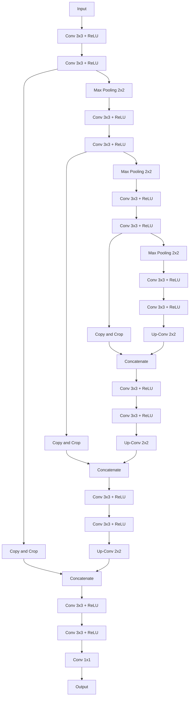

# UNet原理与代码实例讲解

## 1. 背景介绍

### 1.1 问题的由来
近年来,随着深度学习技术的迅猛发展,计算机视觉领域取得了巨大的进步。图像分割作为计算机视觉的一个重要分支,在医学影像分析、自动驾驶、遥感图像分析等诸多领域有着广泛的应用前景。然而,传统的图像分割算法往往需要大量的人工标注数据,且分割精度和效率难以满足实际应用的需求。因此,如何设计高效、精确的图像分割算法成为了亟需解决的问题。

### 1.2 研究现状
2015年,Ronneberger等人在论文《U-Net: Convolutional Networks for Biomedical Image Segmentation》中提出了一种用于医学图像分割的端到端网络结构U-Net,该网络能够在小样本数据集上实现精确的像素级分割。此后,U-Net在医学影像分析领域得到了广泛的应用和改进,并逐渐扩展到了其他领域。目前,U-Net已经成为图像分割任务的标准baseline之一。

### 1.3 研究意义
U-Net网络结构简单、分割效果出色,能够很好地平衡分割精度和计算效率。深入理解U-Net的原理,并掌握其代码实现,对于从事图像分割相关研究和应用的人员具有重要意义。通过学习U-Net,可以快速上手图像分割任务,为后续的算法改进和创新打下坚实的基础。

### 1.4 本文结构
本文将从以下几个方面对U-Net进行详细讲解:
- 第2部分介绍U-Net的核心概念与联系
- 第3部分讲解U-Net的核心算法原理和具体操作步骤
- 第4部分介绍U-Net涉及的数学模型和公式,并给出详细的推导过程和案例分析
- 第5部分给出U-Net的代码实例,并对关键代码进行解释说明
- 第6部分讨论U-Net在实际场景中的应用,并展望其未来的发展方向
- 第7部分推荐U-Net相关的学习资源、开发工具和文献资料
- 第8部分对全文进行总结,讨论U-Net未来的发展趋势和面临的挑战
- 第9部分列举U-Net的常见问题,并给出解答

## 2. 核心概念与联系

U-Net是一种基于全卷积网络(FCN)的encoder-decoder结构。其核心思想是先通过encoder对输入图像进行下采样,提取高级语义特征;然后再通过decoder对特征图进行上采样,恢复到原始图像的分辨率,从而实现端到端的像素级分割。U-Net的网络结构如下图所示:

U-Net的关键特点包括:

1. 对称的U型结构,由收缩路径(encoder)和扩张路径(decoder)组成。

2. 在收缩路径中,通过卷积和下采样操作提取图像的高级语义特征。

3. 在扩张路径中,通过反卷积(转置卷积)和上采样操作恢复特征图的空间分辨率。

4. 在扩张路径的每一层,与收缩路径对应层的特征图进行拼接,实现特征的重用。

5. 最后通过1x1卷积将特征图映射到所需的类别数,得到最终的分割结果。

U-Net巧妙地结合了FCN和encoder-decoder结构的优点,通过跨层连接实现了特征的复用,有效地提高了分割精度。同时,对称的网络设计使得U-Net能够在小样本数据集上进行端到端的训练,非常适合医学图像分割等应用场景。

## 3. 核心算法原理 & 具体操作步骤

### 3.1 算法原理概述
U-Net的核心是由卷积、下采样、上采样等操作构建的对称网络结构。在收缩路径中,通过卷积提取特征,并通过下采样操作减小特征图的空间尺寸,增大感受野;在扩张路径中,通过上采样操作恢复特征图的空间分辨率,并与收缩路径对应层的特征图进行拼接,实现特征的重用和细节信息的恢复。

### 3.2 算法步骤详解
U-Net的具体算法步骤如下:

1. 输入图像经过两次3x3卷积,每次卷积后接ReLU激活函数。特征图的通道数翻倍。

2. 对特征图进行2x2最大池化,空间尺寸减半。重复步骤1,直到达到最底层。

3. 在最底层再进行两次3x3卷积,每次卷积后接ReLU激活函数。

4. 对特征图进行2x2上采样(反卷积),空间尺寸增大一倍。将上采样的结果与收缩路径对应层的特征图在通道维度上拼接。

5. 对拼接后的特征图进行两次3x3卷积,每次卷积后接ReLU激活函数。特征图的通道数减半。

6. 重复步骤4和步骤5,直到恢复到原始图像的空间尺寸。

7. 在最后一层使用1x1卷积将特征图映射到所需的类别数,得到像素级的分割结果。

### 3.3 算法优缺点
U-Net的主要优点包括:

1. 端到端的全卷积结构,可以接受任意大小的输入图像,输出与输入尺寸相同的分割结果。

2. 通过跨层连接实现特征复用,有效地结合了高层语义信息和底层细节信息,提高了分割精度。

3. 对称的网络设计,编码器和解码器参数共享,减少了模型的参数量。

4. 在小样本数据集上表现出色,非常适合医学图像分割等应用场景。

U-Net的主要缺点包括:  

1. 对于超大尺寸的图像,U-Net可能会占用较大的显存,影响训练和推理效率。

2. U-Net对图像的尺度变化和旋转等变换的鲁棒性有待提高。

3. U-Net的感受野相对有限,对于需要全局信息的分割任务可能会有所局限。

### 3.4 算法应用领域
U-Net最初是为医学图像分割而设计的,在这一领域取得了广泛的成功。此外,U-Net还被应用于以下领域:

1. 卫星遥感图像分割,如道路提取、土地利用分类等。

2. 工业视觉检测,如瑕疵检测、零件分割等。

3. 自动驾驶中的场景理解,如车道线分割、障碍物检测等。

4. 生物医学图像分析,如细胞分割、器官分割等。  

5. 其他通用的图像分割任务。

## 4. 数学模型和公式 & 详细讲解 & 举例说明

### 4.1 数学模型构建
U-Net可以看作由编码器 $f_{enc}$ 和解码器 $f_{dec}$ 组成的映射函数:

$$f_{unet}(x) = f_{dec}(f_{enc}(x))$$

其中,$x$表示输入图像,$f_{unet}(x)$表示输出的分割结果。

编码器 $f_{enc}$ 由卷积和下采样操作组成,将输入图像映射到高级语义特征:

$$f_{enc}(x) = d_n(\cdots d_2(d_1(x))\cdots)$$

其中,$d_i$表示第$i$层的卷积和下采样操作。

解码器 $f_{dec}$ 由上采样和卷积操作组成,将高级语义特征恢复到原始分辨率:

$$f_{dec}(y) = u_1(\cdots u_{n-1}(u_n(y))\cdots)$$

其中,$y$表示编码器的输出特征,$u_i$表示第$i$层的上采样和卷积操作。

在每一个解码器层,上采样的结果与编码器对应层的特征图拼接:

$$z_i = \text{concat}(u_i(z_{i+1}), d_{n-i}(x))$$

其中,$z_i$表示第$i$层解码器的输入特征图。

### 4.2 公式推导过程
对于编码器的第$i$层,卷积和下采样操作可以表示为:

$$d_i(x) = \text{maxpool}(\text{ReLU}(\text{conv}(x)))$$

其中,$\text{conv}$表示3x3卷积,$\text{ReLU}$表示ReLU激活函数,$\text{maxpool}$表示2x2最大池化。

对于解码器的第$i$层,上采样和卷积操作可以表示为:

$$u_i(y) = \text{conv}(\text{ReLU}(\text{upconv}(y)))$$

其中,$\text{upconv}$表示2x2上采样(反卷积)。

在最后一层,使用1x1卷积将特征图映射到所需的类别数:

$$f_{unet}(x) = \text{conv1x1}(z_1)$$

其中,$\text{conv1x1}$表示1x1卷积。

### 4.3 案例分析与讲解
以一个简单的二分类医学图像分割任务为例,输入是512x512的CT图像,目标是分割出肿瘤区域。

首先,输入图像经过两次3x3卷积,特征图的通道数从1增加到64。然后经过2x2最大池化,空间尺寸减半,变为256x256。

重复卷积和下采样的过程,直到特征图的尺寸为64x64,通道数为512。这构成了U-Net的编码器部分。

在解码器部分,先对64x64的特征图进行2x2上采样,空间尺寸变为128x128。然后与编码器中128x128大小的特征图在通道维度上拼接,得到一个128x128x1024的特征图。

对拼接后的特征图进行两次3x3卷积,通道数从1024减半到512。然后再进行2x2上采样,将特征图的尺寸恢复到256x256。

重复上采样和拼接的过程,直到恢复到原始的512x512分辨率。最后使用1x1卷积将特征图映射到2个通道,表示每个像素属于肿瘤和非肿瘤的概率。

通过阈值化或取argmax,即可得到每个像素的分割标签,完成肿瘤区域的分割。

### 4.4 常见问题解答
1. U-Net可以处理任意大小的输入图像吗?
   答:理论上可以,但是由于显存限制,实际使用时需要根据硬件条件选择合适的输入尺寸。对于超大图像,可以采用滑动窗口或图像分块的方式进行处理。

2. U-Net可以用于多分类任务吗?
   答:可以,只需要将最后一层的输出通道数设置为类别数即可。例如,对于10类分割任务,最后一层的输出通道数为10。

3. U-Net对数据增强有什么要求?
   答:U-Net对数据增强的鲁棒性较好,常见的数据增强方法如翻转、旋转、缩放、添加噪声等都可以使用。但是需要注意,数据增强