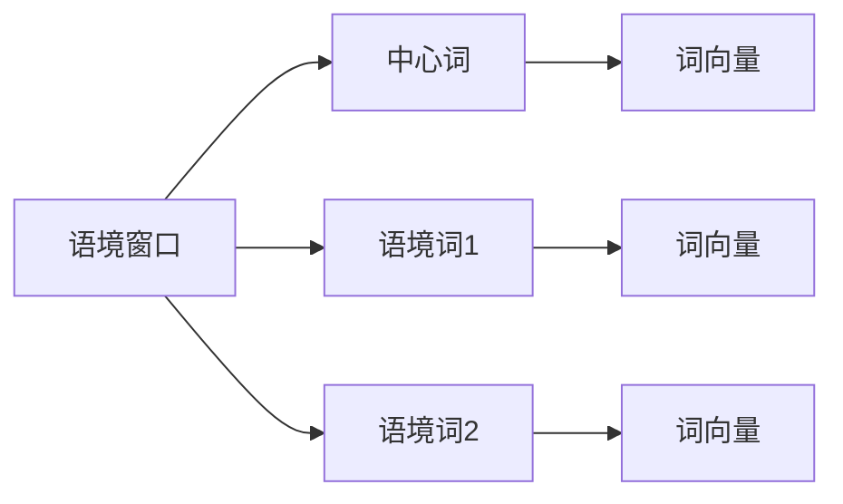

# Word2Vec原理与代码实例讲解

## 1. 背景介绍
### 1.1 问题的由来
在自然语言处理领域,如何有效地表示词语一直是一个核心问题。传统的词表示方法如one-hot encoding虽然简单直观,但是无法刻画词语之间的语义关系,且容易产生维度灾难。为了解决这些问题,Tomas Mikolov等人在2013年提出了Word2Vec模型,通过词语所处的上下文来学习词语的分布式表示,取得了良好的效果。

### 1.2 研究现状 
Word2Vec模型自提出以来受到了广泛关注,成为了词嵌入领域的代表性工作之一。目前基于Word2Vec的思想衍生出了很多优秀的词嵌入模型,如GloVe、FastText等。同时Word2Vec在命名实体识别、情感分析、机器翻译等NLP任务中得到了大量应用。

### 1.3 研究意义
Word2Vec不仅是一种高效的词嵌入方法,更重要的是其蕴含的分布式表示思想对后来的表示学习研究产生了深远影响。深入理解Word2Vec的原理,对于我们掌握词嵌入乃至表示学习的本质具有重要意义。同时,Word2Vec模型结构简单、训练高效,非常适合作为词嵌入研究的入门学习材料。

### 1.4 本文结构
本文将全面介绍Word2Vec的原理与实现。第2节介绍Word2Vec中的核心概念。第3节详细讲解Word2Vec的两种训练架构:CBOW和Skip-Gram。第4节给出Word2Vec的数学建模与公式推导。第5节通过代码实例演示Word2Vec的具体实现。第6节讨论Word2Vec的应用场景。第7节推荐一些学习Word2Vec的资源。第8节对全文进行总结并展望未来。

## 2. 核心概念与联系
Word2Vec的核心思想是通过词语的上下文来表示该词语。具体来说有以下几个重要概念:

- 词向量(Word Vector):用一个实值向量表示一个词。向量的每个元素可以看作该词在某个隐含主题上的权重。
- 语境窗口(Context Window):一个词前后若干个词构成了该词的上下文,称为语境窗口。
- 语境词(Context Word):语境窗口中除了当前词以外的其他词都是当前词的语境词。
- 中心词(Center Word):当前要表示的词叫做中心词。

这些概念的关系可以用下图表示:

Word2Vec通过构建中心词和语境词的映射关系,来学习每个词语所对应的词向量。学习到的词向量天然地刻画了词语之间的语义相似性。

## 3. 核心算法原理 & 具体操作步骤
### 3.1 算法原理概述
Word2Vec有两种经典的训练架构:CBOW(Continuous Bag-of-Words)和Skip-Gram。它们的核心思想是:一个词的语义由其上下文决定,词语和其上下文之间存在某种映射关系。两种架构的区别在于映射的方向:
- CBOW:利用某个词的语境词来预测该词本身。
- Skip-Gram:利用某个词来预测其语境词。

### 3.2 算法步骤详解
以下以CBOW为例详细说明训练步骤:

1. 对语料库进行预处理,获得词语序列。如"I love natural language processing"处理为["I","love","natural","language","processing"]

2. 构造训练样本。以某个词为中心词,将其前后一定距离内的词作为其语境词,形成一个样本。如以"natural"为中心词,语境窗口大小为2,则可得到一个样本:([I,love,language,processing], natural)

3. 将词语映射为one-hot向量。如"natural"映射为一个V维one-hot向量,其中V为词表大小,该向量除了"natural"对应维度为1,其余都为0。

4. 搭建网络结构。输入层为所有语境词的one-hot向量之和,输出层为中心词的one-hot向量。隐藏层将one-hot向量映射为低维稠密词向量。

5. 随机初始化输入层到隐藏层的权重矩阵W和隐藏层到输出层的权重矩阵W'。

6. 前向传播。将输入层的one-hot向量与W相乘得到隐藏层词向量,再与W'相乘并softmax得到输出层概率分布。

7. 计算输出层与真实中心词的交叉熵损失。

8. 通过梯度下降法更新W和W'以最小化损失函数。重复第6~8步直到收敛。

9. 训练完成后,W的每一行就是对应词语的词向量。

Skip-Gram的训练步骤与CBOW类似,区别在于Skip-Gram以一个中心词作为输入,所有语境词作为输出。

### 3.3 算法优缺点
Word2Vec的优点主要有:
- 原理简单,训练高效。CBOW和Skip-Gram结构简单,训练速度快。
- 词向量质量高。相比传统的词表示方法,Word2Vec学到的词向量更能反映词语的语义关系。
- 适用范围广。Word2Vec可以应用于各种文本数据,对语料库的要求不高。

Word2Vec的缺点包括:
- 需要大规模语料训练。只有在大规模语料上训练,才能学到高质量的词向量。
- 不能很好地处理未登录词。对于训练语料中没有出现过的新词,Word2Vec无法给出其词向量。
- 词向量是静态的。Word2Vec学习到的是词语的静态嵌入表示,无法很好地处理一词多义的问题。

### 3.4 算法应用领域
Word2Vec在NLP领域有广泛应用,如:
- 文本分类。将文本中的词语用词向量表示,作为分类器的输入特征。
- 命名实体识别。将词向量作为命名实体识别模型的输入,可以提升识别效果。  
- 情感分析。用词向量刻画词语蕴含的情感倾向,用于情感极性分类等任务。
- 机器翻译。将源语言和目标语言的词语映射到同一个词向量空间,用于计算翻译的相似度。
- 文本生成。将词向量作为文本生成模型的输入,以增强生成文本的连贯性和多样性。

除了NLP,Word2Vec还被应用到社交网络分析、推荐系统等领域。

## 4. 数学模型和公式 & 详细讲解 & 举例说明
### 4.1 数学模型构建
设词表大小为$V$,词向量维度为$N$,语境窗口大小为$C$。定义如下符号:
- $v_i$:第$i$个词的one-hot向量,维度为$V$。
- $\mathbf{v}_i$:第$i$个词的词向量,维度为$N$。
- $\mathbf{W} \in \mathbb{R}^{V \times N}$:输入层到隐藏层的权重矩阵。
- $\mathbf{W'} \in \mathbb{R}^{N \times V}$:隐藏层到输出层的权重矩阵。

对于一个训练样本$(w_{i-C},...,w_{i-1},w_{i+1},...,w_{i+C},w_i)$,其中$w_i$为中心词,$w_{i-C},...,w_{i-1},w_{i+1},...,w_{i+C}$为语境词,CBOW的数学模型为:

$$
\begin{aligned}
\mathbf{x} &= \mathbf{v}_{i-C} + ... + \mathbf{v}_{i-1} + \mathbf{v}_{i+1} + ... + \mathbf{v}_{i+C}\\
\mathbf{h} &= \mathbf{W}^\top \mathbf{x}\\  
\mathbf{u} &= \mathbf{W'} \mathbf{h}\\
\hat{\mathbf{y}} &= \text{softmax}(\mathbf{u})
\end{aligned}
$$

其中$\mathbf{x} \in \mathbb{R}^{V}$为输入层,$\mathbf{h} \in \mathbb{R}^{N}$为隐藏层,$\mathbf{u} \in \mathbb{R}^{V}$为输出层,$\hat{\mathbf{y}} \in \mathbb{R}^{V}$为softmax归一化后的输出概率分布。

Skip-Gram的数学模型为:

$$
\begin{aligned}
\mathbf{x} &= \mathbf{v}_i \\
\mathbf{h} &= \mathbf{W}^\top \mathbf{x}\\
\mathbf{u}_j &= \mathbf{W'}_j \mathbf{h}, \quad j=1,...,2C\\
\hat{\mathbf{y}}_j &= \text{softmax}(\mathbf{u}_j), \quad j=1,...,2C
\end{aligned}
$$

其中$\mathbf{W'}_j$为$\mathbf{W'}$的第$j$列。Skip-Gram以中心词$w_i$作为输入,预测所有语境词$w_{i-C},...,w_{i-1},w_{i+1},...,w_{i+C}$。

### 4.2 公式推导过程
以CBOW为例推导损失函数和梯度更新公式。设第$i$个样本的one-hot标签向量为$\mathbf{y}_i$,网络的输出概率分布为$\hat{\mathbf{y}}_i$,则交叉熵损失函数为:

$$
\begin{aligned}
\mathcal{L} &= -\sum_{i=1}^T \mathbf{y}_i^\top \log \hat{\mathbf{y}}_i \\
&= -\sum_{i=1}^T \sum_{j=1}^V y_{ij} \log \hat{y}_{ij} \\
&= -\sum_{i=1}^T \log \hat{y}_{i,w_i}
\end{aligned}
$$

其中$T$为样本数,$w_i$为第$i$个样本的中心词。利用链式法则求损失函数对$\mathbf{W}$的梯度:

$$
\begin{aligned}
\frac{\partial \mathcal{L}}{\partial \mathbf{W}} &= \sum_{i=1}^T \frac{\partial \mathcal{L}_i}{\partial \mathbf{W}} \\
&= \sum_{i=1}^T \frac{\partial \mathcal{L}_i}{\partial \hat{\mathbf{y}}_i} \frac{\partial \hat{\mathbf{y}}_i}{\partial \mathbf{u}_i} \frac{\partial \mathbf{u}_i}{\partial \mathbf{W}}\\
&= \sum_{i=1}^T (\hat{\mathbf{y}}_i - \mathbf{y}_i) \mathbf{h}_i^\top 
\end{aligned}
$$

同理可得$\mathbf{W'}$的梯度为:

$$
\frac{\partial \mathcal{L}}{\partial \mathbf{W'}} = \sum_{i=1}^T \mathbf{h}_i (\hat{\mathbf{y}}_i - \mathbf{y}_i)^\top
$$

最后用梯度下降法更新参数:

$$
\begin{aligned}
\mathbf{W} &:= \mathbf{W} - \eta \frac{\partial \mathcal{L}}{\partial \mathbf{W}} \\
\mathbf{W'} &:= \mathbf{W'} - \eta \frac{\partial \mathcal{L}}{\partial \mathbf{W'}}
\end{aligned}
$$

其中$\eta$为学习率。Skip-Gram的推导过程与之类似。

### 4.3 案例分析与讲解
下面以一个简单的例子直观地说明CBOW的训练过程。设有6个词{I,love,natural,language,processing,!}构成的语料,词表大小$V=6$,词向量维度$N=4$,语境窗口大小$C=2$。

假设某个训练样本为(I,love,language,processing,natural),其中"natural"为中心词。首先将输入词映射为one-hot向量:

$$
\mathbf{v}_I = [1,0,0,0,0,0]^\top \\
\mathbf{v}_{love} = [0,1,0,0,0,0]^\top \\
\mathbf{v}_{language} = [0,0,0,1,0,0]^\top \\
\mathbf{v}_{processing} = [0,0,0,0,1,0]^\top
$$

然后将输入向量求和得到$\mathbf{x}$,与权重矩阵$\mathbf{W}$相乘得到隐藏层$\mathbf{h}$:

$$
\mathbf{x} = [1,1,