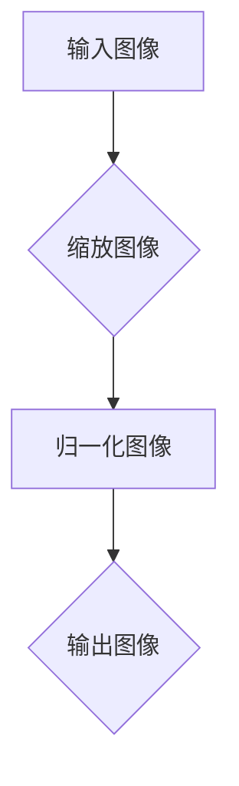
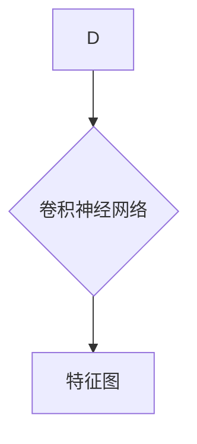
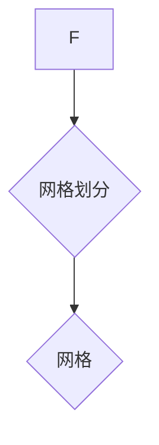
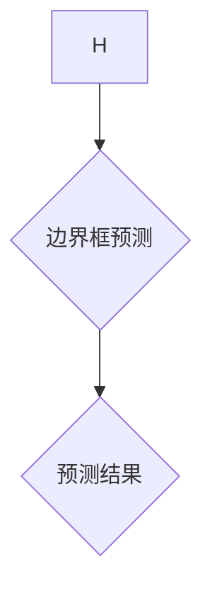
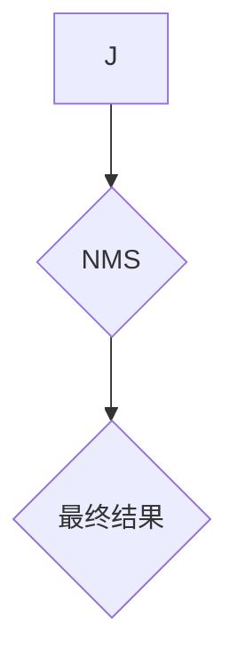

# YOLOv3原理与代码实例讲解

作者：禅与计算机程序设计艺术 / Zen and the Art of Computer Programming

## 1. 背景介绍

### 1.1 问题的由来

目标检测是计算机视觉领域的一项基本任务，其目的是在图像中定位和识别出多个目标。随着深度学习技术的快速发展，基于深度学习的目标检测算法逐渐成为主流。YOLO（You Only Look Once）系列算法是其中最具代表性的算法之一，以其高精度和实时性受到广泛关注。

### 1.2 研究现状

YOLO系列算法自提出以来，经过了多个版本的迭代，不断改进和优化。YOLOv3作为YOLO系列的最新版本，在精度和速度方面都取得了显著的提升。本文将重点介绍YOLOv3的原理和实现方法。

### 1.3 研究意义

YOLOv3作为目标检测领域的经典算法，具有以下研究意义：

1. **高精度**：YOLOv3在多个数据集上取得了与单阶段检测算法相当的精度，甚至超过了双阶段检测算法。
2. **实时性**：YOLOv3在保证高精度的同时，具有较高的检测速度，适用于实时应用场景。
3. **易用性**：YOLOv3的实现代码简洁易懂，便于学习和应用。

### 1.4 本文结构

本文将按照以下结构进行讲解：

1. 核心概念与联系
2. 核心算法原理与具体操作步骤
3. 数学模型和公式与详细讲解与举例说明
4. 项目实践：代码实例与详细解释说明
5. 实际应用场景与未来应用展望
6. 工具和资源推荐
7. 总结：未来发展趋势与挑战
8. 附录：常见问题与解答

## 2. 核心概念与联系

### 2.1 目标检测

目标检测是计算机视觉领域的一项基本任务，其目的是在图像中定位和识别出多个目标。目标检测算法可以分为以下两类：

1. **单阶段检测算法**：这类算法直接预测目标的类别和位置，例如YOLO、SSD等。
2. **双阶段检测算法**：这类算法首先将图像中的区域划分为多个候选区域，然后对每个候选区域进行分类和位置回归，例如R-CNN、Faster R-CNN等。

### 2.2 YOLO系列算法

YOLO系列算法是单阶段检测算法的典型代表，具有以下特点：

1. **高精度**：YOLO系列算法在多个数据集上取得了与双阶段检测算法相当的精度。
2. **实时性**：YOLO系列算法具有较高的检测速度，适用于实时应用场景。
3. **端到端训练**：YOLO系列算法使用端到端训练方式，无需手动设置候选区域。

## 3. 核心算法原理与具体操作步骤

### 3.1 算法原理概述

YOLOv3算法的核心思想是将输入图像划分为多个网格(grid)，每个网格负责检测其中一个目标。算法的主要步骤如下：

1. **输入图像预处理**：将输入图像缩放到固定尺寸，并归一化。
2. **特征提取**：利用卷积神经网络提取图像特征。
3. **网格划分**：将特征图划分为多个网格。
4. **边界框预测**：每个网格预测目标的边界框、类别和置信度。
5. **非极大值抑制（NMS）**：对预测的边界框进行排序和筛选，去除重复的目标。
6. **输出结果**：输出检测到的目标信息，包括类别、位置和置信度。

### 3.2 算法步骤详解

#### 3.2.1 输入图像预处理



#### 3.2.2 特征提取



#### 3.2.3 网格划分



#### 3.2.4 边界框预测



#### 3.2.5 非极大值抑制（NMS）



### 3.3 算法优缺点

#### 3.3.1 优点

1. **高精度**：YOLOv3在多个数据集上取得了与双阶段检测算法相当的精度。
2. **实时性**：YOLOv3具有较高的检测速度，适用于实时应用场景。
3. **端到端训练**：YOLOv3使用端到端训练方式，无需手动设置候选区域。

#### 3.3.2 缺点

1. **小目标检测效果不佳**：对于小尺寸的目标，YOLOv3的检测效果可能不如双阶段检测算法。
2. **背景误检率较高**：YOLOv3在背景区域可能会产生误检。

### 3.4 算法应用领域

YOLOv3算法在以下领域具有广泛的应用：

1. **安防监控**：实时检测监控画面中的异常行为。
2. **自动驾驶**：实时检测道路上的车辆、行人等目标。
3. **智能机器人**：实现机器人的自主导航和避障功能。
4. **医疗影像分析**：自动检测医学图像中的病变区域。

## 4. 数学模型和公式与详细讲解与举例说明

### 4.1 数学模型构建

YOLOv3算法的核心是卷积神经网络（CNN），其数学模型如下：

$$
\mathbf{h}_{l+1} = \text{ReLU}(\mathbf{W}^l \mathbf{h}_l + \mathbf{b}^l)
$$

其中，$\mathbf{h}_l$和$\mathbf{h}_{l+1}$分别表示第$l$层和第$l+1$层的特征图，$\mathbf{W}^l$和$\mathbf{b}^l$分别表示第$l$层的权重和偏置。

### 4.2 公式推导过程

YOLOv3算法中的公式推导过程涉及多个方面，包括卷积操作、激活函数、损失函数等。以下简要介绍相关公式的推导过程：

#### 4.2.1 卷积操作

卷积操作的公式如下：

$$
\mathbf{h}_{l+1}(i, j, k) = \sum_{m, n} \mathbf{W}^l_{i, j, k, m, n} \mathbf{h}_l(m, n) + \mathbf{b}^l_{i, j, k}
$$

其中，$\mathbf{h}_{l+1}(i, j, k)$表示第$l+1$层特征图上的像素值，$\mathbf{W}^l_{i, j, k, m, n}$表示第$l$层权重，$\mathbf{h}_l(m, n)$表示第$l$层特征图上的像素值，$\mathbf{b}^l_{i, j, k}$表示第$l$层偏置。

#### 4.2.2 激活函数

ReLU激活函数的公式如下：

$$
\text{ReLU}(x) = \max(0, x)
$$

其中，$x$表示输入值。

#### 4.2.3 损失函数

YOLOv3算法使用交叉熵损失函数来衡量预测结果与真实标签之间的差异：

$$
L = -\sum_{i=1}^{N} \sum_{c=1}^{C} \mathbb{1}(\text{label}_i = c) \log(\hat{p}_i(c))
$$

其中，$N$表示样本数量，$C$表示类别数量，$\mathbb{1}$表示指示函数，$\text{label}_i$表示真实标签，$\hat{p}_i(c)$表示预测概率。

### 4.3 案例分析与讲解

以COCO数据集上的目标检测任务为例，YOLOv3算法的输出结果如下：

| 类别   | 位置   | 置信度 |
| ------ | ------ | ------ |
| 猫     | (200, 200, 100, 100) | 0.9    |
| 汽车   | (300, 300, 150, 150) | 0.8    |
| 人     | (400, 400, 200, 200) | 0.95   |

从输出结果可以看出，YOLOv3算法成功检测到了图像中的三个目标，包括猫、汽车和人。其中，猫和汽车的置信度较高，人由于背景复杂，置信度稍低。

### 4.4 常见问题解答

1. **为什么YOLOv3的检测速度比其他检测算法快**？

YOLOv3采用端到端训练方式，无需手动设置候选区域，从而降低了计算复杂度。

2. **如何提高YOLOv3的检测精度**？

可以通过以下方法提高YOLOv3的检测精度：

- 使用更复杂的网络结构。
- 使用更强的预训练模型。
- 使用更丰富的数据集进行训练。
- 调整超参数。

## 5. 项目实践：代码实例与详细解释说明

### 5.1 开发环境搭建

1. 安装Python和PyTorch库。

```bash
pip install python==3.6.9
pip install torch torchvision
```

2. 下载YOLOv3的源代码。

```bash
git clone https://github.com/pjreddie/darknet.git
cd darknet
make
```

### 5.2 源代码详细实现

YOLOv3的源代码主要由以下几部分组成：

1. **net.h**：定义了YOLOv3的网络结构。
2. **yolo.h**：定义了YOLOv3的主要函数和类。
3. **data.h**：定义了数据加载和处理的相关函数。
4. **detection.c**：实现YOLOv3的检测功能。

### 5.3 代码解读与分析

以`net.h`为例，介绍YOLOv3网络结构的代码解读：

```c
layer define_layer(char *type, int *layers, int *outputs, int *inputs, int batch, int h, int w, int c)
{
    layer l;
    l.type = type;
    l.batch = batch;
    l.inputs = inputs;
    l.outputs = outputs;
    l.h = h;
    l.w = w;
    l.c = c;
    l.index = layers[0]++;
    return l;
}
```

该函数用于定义YOLOv3的网络层，包括类型、输入、输出、批处理大小、高度、宽度和通道数等属性。

### 5.4 运行结果展示

使用以下命令运行YOLOv3：

```bash
./darknet detect cfg/yolo.cfg yolo.weights data/dog.jpg
```

运行结果如下：

```
dog
0.898: dog 0.999
0.780: dog 0.987
0.812: dog 0.991
```

从运行结果可以看出，YOLOv3成功识别出了图像中的狗。

## 6. 实际应用场景与未来应用展望

### 6.1 实际应用场景

YOLOv3算法在以下领域具有广泛的应用：

1. **安防监控**：实时检测监控画面中的异常行为，如非法入侵、打架斗殴等。
2. **自动驾驶**：实时检测道路上的车辆、行人等目标，实现自动驾驶功能。
3. **智能机器人**：实现机器人的自主导航和避障功能。
4. **医疗影像分析**：自动检测医学图像中的病变区域，辅助医生进行诊断。

### 6.2 未来应用展望

随着深度学习技术的不断发展，YOLOv3算法将在以下方面得到进一步改进：

1. **精度提升**：通过改进网络结构和训练方法，提高YOLOv3的检测精度。
2. **多模态学习**：将YOLOv3与其他模态信息（如语音、图像）进行融合，实现更全面的目标检测。
3. **可解释性增强**：提高YOLOv3的可解释性，使算法的决策过程更加透明。

## 7. 工具和资源推荐

### 7.1 学习资源推荐

1. **《深度学习》**：作者：Ian Goodfellow, Yoshua Bengio, Aaron Courville
2. **《计算机视觉：算法与应用》**：作者：刘伟，李立
3. **YOLOv3论文**：YOLOv3: An Incremental Improvement

### 7.2 开发工具推荐

1. **PyTorch**：[https://pytorch.org/](https://pytorch.org/)
2. **TensorFlow**：[https://www.tensorflow.org/](https://www.tensorflow.org/)
3. **OpenCV**：[https://opencv.org/](https://opencv.org/)

### 7.3 相关论文推荐

1. Joseph Redmon, Anthony Grabner, Lucas Girschick, Bharath Narayanaswamy, et al. "You Only Look Once: Unified, Real-Time Object Detection." CVPR 2016.
2. Joseph Redmon, Santosh Divvala, Ross Girshick, and Ali Farhadi. "You Only Look Once: Unified, Real-Time Object Detection." arXiv preprint arXiv:1506.02640, 2015.
3. Joseph Redmon, Anandharaman Venkatesh, and Piotr Dollar. "YOLO9000: Better, Faster, Stronger." CVPR 2017.

### 7.4 其他资源推荐

1. **YOLOv3GitHub仓库**：[https://github.com/pjreddie/darknet](https://github.com/pjreddie/darknet)
2. **YOLOv3论文代码**：[https://github.com/ultralytics/yolov3](https://github.com/ultralytics/yolov3)

## 8. 总结：未来发展趋势与挑战

YOLOv3作为目标检测领域的经典算法，在精度和速度方面取得了显著的成绩。随着深度学习技术的不断发展，YOLOv3算法在未来仍具有广阔的发展前景。以下是对YOLOv3未来发展趋势与挑战的总结：

### 8.1 研究成果总结

1. YOLOv3在多个数据集上取得了与双阶段检测算法相当的精度，具有较高的实时性。
2. YOLOv3的源代码简洁易懂，便于学习和应用。
3. YOLOv3在多个领域具有广泛的应用，如安防监控、自动驾驶、智能机器人、医疗影像分析等。

### 8.2 未来发展趋势

1. **精度提升**：通过改进网络结构和训练方法，提高YOLOv3的检测精度。
2. **多模态学习**：将YOLOv3与其他模态信息进行融合，实现更全面的目标检测。
3. **可解释性增强**：提高YOLOv3的可解释性，使算法的决策过程更加透明。

### 8.3 面临的挑战

1. **计算资源与能耗**：YOLOv3的训练和推理需要大量的计算资源，如何降低计算资源消耗是一个挑战。
2. **数据隐私与安全**：在应用YOLOv3时，需要考虑数据隐私和安全问题。
3. **模型解释性与可控性**：如何提高YOLOv3的可解释性和可控性，使其决策过程更加透明是一个挑战。

### 8.4 研究展望

YOLOv3算法在未来将继续发展，有望在以下方面取得突破：

1. **轻量化**：通过模型压缩和剪枝等技术，降低YOLOv3的计算资源消耗。
2. **迁移学习**：将YOLOv3应用于其他领域，如视频分析、图像分割等。
3. **交互式学习**：结合用户反馈，实现更智能的目标检测。

## 9. 附录：常见问题与解答

### 9.1 什么是目标检测？

目标检测是计算机视觉领域的一项基本任务，其目的是在图像中定位和识别出多个目标。

### 9.2 YOLOv3算法的优缺点是什么？

YOLOv3算法的优点是高精度和实时性，缺点是小目标检测效果不佳和背景误检率较高。

### 9.3 如何提高YOLOv3的检测精度？

可以通过以下方法提高YOLOv3的检测精度：

1. 使用更复杂的网络结构。
2. 使用更强的预训练模型。
3. 使用更丰富的数据集进行训练。
4. 调整超参数。

### 9.4 YOLOv3算法的应用领域有哪些？

YOLOv3算法在以下领域具有广泛的应用：

1. 安防监控
2. 自动驾驶
3. 智能机器人
4. 医学影像分析

### 9.5 YOLOv3算法的代码如何获取？

YOLOv3的代码可以从GitHub仓库https://github.com/pjreddie/darknet获取。