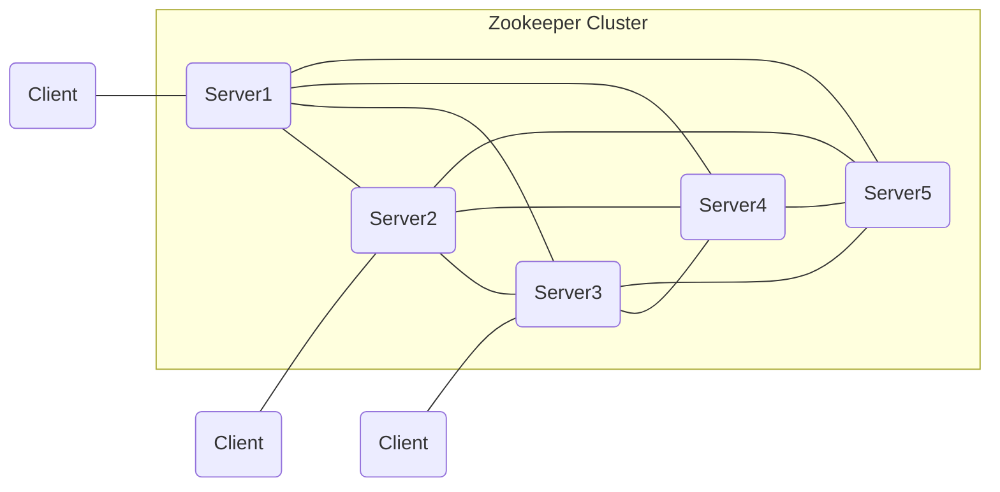
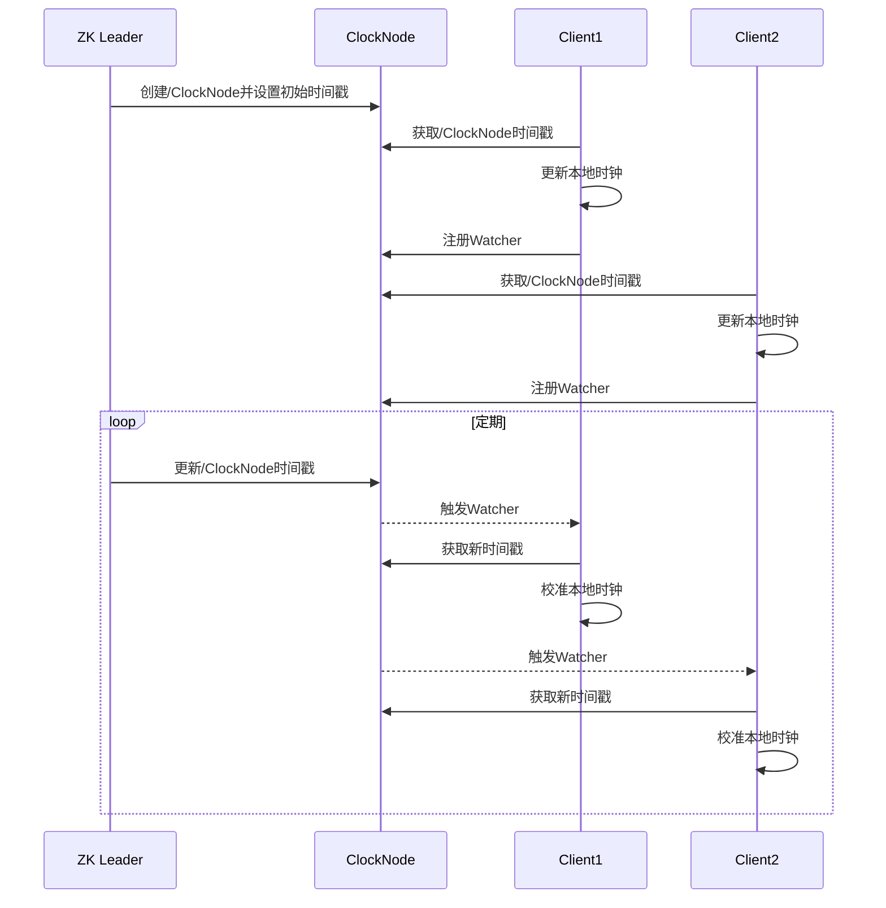

# Zookeeper与分布式计时器的实现与应用

关键词：Zookeeper、分布式计时器、分布式系统、分布式协调、分布式锁、分布式队列

## 1. 背景介绍
### 1.1  问题的由来
在现代分布式系统中,时间同步和任务调度是一个非常重要且具有挑战性的问题。不同节点之间的时钟漂移、网络延迟等因素都会导致分布式环境下的时间不一致,进而影响系统的正确性和可靠性。因此,如何实现一个高效可靠的分布式计时器,成为了分布式系统领域的一个研究热点。
### 1.2  研究现状
目前业界已经提出了多种分布式计时器的实现方案,例如基于NTP的时间同步方案、Lamport逻辑时钟算法、向量时钟算法等。但这些方案要么精度不够高,要么算法复杂度高,在实际应用中存在诸多局限性。近年来,随着Zookeeper等优秀的分布式协调框架的出现,为分布式计时器的实现提供了新的思路。
### 1.3  研究意义 
深入研究Zookeeper在分布式计时器领域的应用,对于提升分布式系统的可靠性、可用性和性能都具有重要意义。一方面,实现高精度、强一致性的分布式计时器可以为其他分布式组件如分布式锁、分布式队列等提供基础支撑；另一方面,研究Zookeeper的内部原理和最佳实践,可以加深我们对分布式协调的理解,促进分布式技术的发展。
### 1.4  本文结构
本文将重点介绍如何基于Zookeeper实现一个高效可靠的分布式计时器,并探讨其在实际场景中的应用。内容安排如下:第2节介绍Zookeeper的核心概念；第3节详细阐述分布式计时器的算法原理和实现步骤；第4节给出数学模型和关键公式的推导与证明；第5节通过代码实例和注释深入讲解计时器的编程实现；第6节总结分布式计时器的典型应用场景；第7节推荐相关学习资源和开发工具；第8节对全文进行总结,并展望分布式计时器技术的未来发展方向。

## 2. 核心概念与联系
Zookeeper是一个开源的分布式协调服务框架,它基于ZAB(Zookeeper Atomic Broadcast)协议,提供了高性能、高可用的分布式一致性服务。Zookeeper的核心是一个类似于文件系统的树形结构,称为Znode。Znode可以用来存储少量数据,也可以用来实现分布式锁、Leader选举等协调功能。

在Zookeeper中,每个Znode都可以设置一个Watcher监视器,当Znode发生变化(如数据更新、子节点创建删除)时,Watcher会收到异步通知,从而实现分布式环境下不同进程之间的事件通知和同步。

下图展示了Zookeeper的整体架构,由若干个Server组成Zookeeper集群,通过ZAB协议实现分布式一致性。每个Server都维护一份内存数据视图,并且通过持久化存储保证数据的安全性。客户端通过Client API与Server进行交互。



利用Zookeeper的Znode和Watcher机制,可以巧妙地实现分布式计时器。计时器的核心思想是:在Zookeeper上创建一个专门的Znode作为时钟节点,所有分布式进程监听该节点的变化,当时钟节点发生改变时,进程就可以进行时间同步。同时,由Zookeeper的Leader节点负责定期修改时钟Znode,向整个集群分发最新时间。

## 3. 核心算法原理 & 具体操作步骤
### 3.1  算法原理概述
分布式计时器的核心是利用Zookeeper的Znode作为时钟,通过Watcher机制实现不同进程间的时钟同步。具体来说,需要在Zookeeper中创建一个持久节点/ClockNode作为时钟基准,并在其上设置当前的时间戳。分布式进程启动后,在本地缓存/ClockNode的时间戳,同时在/ClockNode上注册一个Watcher。

Zookeeper集群的Leader节点负责定期(如每秒)更新/ClockNode的时间戳。当/ClockNode发生变化时,所有注册的Watcher都会收到通知,分布式进程从而可以及时同步自己的本地时钟。
### 3.2  算法步骤详解
1. 在Zookeeper中创建持久节点/ClockNode,并写入当前时间戳
2. 分布式进程启动,连接Zookeeper,并获取/ClockNode的时间戳,更新本地时钟
3. 分布式进程在/ClockNode上注册Watcher监听器
4. Zookeeper Leader定期向/ClockNode写入更新的时间戳
5. /ClockNode发生变化,分布式进程收到Watcher通知
6. 分布式进程重新获取/ClockNode的最新时间戳,校准本地时钟
7. 进程可调用getTimestamp()获取当前同步时间戳,调用getElapsedTime()获取逝去的毫秒数

下图展示了分布式计时器的工作流程:


### 3.3  算法优缺点
优点:
- 利用Zookeeper保证了分布式环境下时钟的强一致性
- Watcher机制实现了时钟变更的实时通知
- 实现简单,容易理解和使用

缺点:  
- 受限于Zookeeper的性能和可扩展性
- 若Leader节点故障,可能导致时钟更新延迟
- 不适合对时间精度要求极高的场景

### 3.4  算法应用领域
分布式计时器在许多分布式系统中都有着广泛应用,如:
- 分布式任务调度:统一调度离散的定时任务
- 全局事件序列:为分布式事件生成全局唯一的时间戳
- 日志追踪:跟踪分布式系统调用链的耗时
- 缓存失效:时间驱动的缓存自动失效
  
## 4. 数学模型和公式 & 详细讲解 & 举例说明
### 4.1  数学模型构建
我们定义如下符号:
- $T_0$:初始时间戳
- $T_i$:第i次更新后的时间戳
- $ΔT$:Zookeeper Leader的更新周期
- $δ_i$:第i个进程的时钟偏移量
- $t_i$:第i个进程的本地时钟

假设分布式系统中有n个进程,则任一时刻,系统的全局时钟$T$为:

$$
T(t) = T_0 + \lfloor \frac{t}{ΔT} \rfloor ⋅ ΔT
$$

其中$\lfloor x \rfloor$表示对x向下取整。

对于第i个进程,其本地时钟$t_i$与全局时钟$T$的偏差为:

$$
δ_i(t) = t_i(t) - T(t)
$$

### 4.2  公式推导过程
由于Zookeeper的一致性保证,任一时刻,所有进程看到的/ClockNode时间戳是一致的。因此,当/ClockNode发生更新后,第i个进程在收到Watcher通知时,总能获得当前的准确时间戳$T_i$。

进程根据$T_i$校准自己的本地时钟,令其回归全局时钟:

$$
t_i(t^+) = T_i = T_0 + \lfloor \frac{t}{ΔT} \rfloor ⋅ ΔT
$$

其中$t^+$表示Watcher触发后的第一个时刻。

由此可见,在每个$ΔT$周期内,各进程的时钟偏差是逐步累积的,但在/ClockNode更新后又会回归一致。$δ_i$的最大值取决于$ΔT$以及Watcher通知的网络延迟。
### 4.3  案例分析与讲解
举一个具体的例子,假设$T_0=1000,ΔT=200$,分布式系统中有A、B、C三个进程,它们的本地时钟起始值都是1000。

在$t=0$时,Leader向/ClockNode写入了$T_0=1000$,三个进程的本地时钟与全局时钟一致,即:
$t_A(0)=t_B(0)=t_C(0)=T(0)=1000$

随着时间流逝,各进程时钟开始偏离,在$t=100$时,它们的值分别为:
$t_A(100)=1106,t_B(100)=1095,t_C(100)=1088$

而$T(100)=1000$,三个进程的时钟偏差分别为:
$δ_A(100)=106,δ_B(100)=95,δ_C(100)=88$

当$t=200$时,Leader再次更新/ClockNode,写入$T_1=1200$。假设三个进程分别在$t=210,215,205$时收到Watcher通知,它们查询/ClockNode,获得$T_1=1200$,并据此校准本地时钟:

$t_A(210^+)=t_B(215^+)=t_C(205^+)=T(200)=1200$

至此,三个进程的时钟偏差再次回归到0,完成了一次同步周期。

### 4.4  常见问题解答
Q:分布式计时器的同步精度能达到多高?
A:同步精度主要取决于两个因素:Zookeeper Leader的更新周期$ΔT$以及Watcher通知延迟。$ΔT$越短,同步频率越高,理论精度越高。而Watcher通知延迟受限于网络状况,一般在毫秒级别。综合来看,利用Zookeeper实现的分布式计时器,在绝大多数场景下可以达到秒级精度。

Q:如果某个进程长时间未收到/ClockNode更新通知怎么办?
A:可以为Watcher设置一个超时时间,如果在超时时间内未收到/ClockNode更新,则主动去Zookeeper上获取最新时间戳。另外,还可以在本地维护一个逻辑时钟,记录自上次同步以来的本地流逝时间,这样即使与Zookeeper失去连接,也能获得一个大致准确的时间估计值。

## 5. 项目实践：代码实例和详细解释说明
下面我们给出基于Zookeeper实现分布式计时器的核心代码,并进行详细注释和说明。本例使用Java语言和Curator客户端。
### 5.1  开发环境搭建
- JDK 1.8+
- Zookeeper 3.4+
- Curator 4.0+
- Maven项目管理

在pom.xml中添加所需依赖:
```xml
<dependencies>
    <dependency>
        <groupId>org.apache.curator</groupId>
        <artifactId>curator-framework</artifactId>
        <version>4.2.0</version>
    </dependency>
    <dependency>
        <groupId>org.apache.curator</groupId>
        <artifactId>curator-recipes</artifactId>
        <version>4.2.0</version>
    </dependency>
</dependencies>
```
### 5.2  源代码详细实现
DistributedTimer.java
```java
public class DistributedTimer implements Closeable {

    private