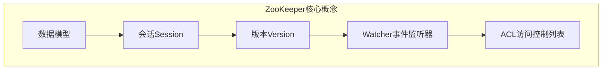

# Zookeeper的集群管理与扩展

## 1. 背景介绍

### 1.1 问题的由来

在分布式系统中，协调和管理大量的节点是一项艰巨的挑战。随着业务规模的不断扩大,单个节点已经无法满足日益增长的需求,因此需要构建一个高可用、高扩展性的分布式集群系统。然而,在集群环境下,节点之间的状态同步、数据一致性、故障转移等问题都需要被妥善地解决。这就催生了一种称为分布式协调服务(Distributed Coordination Service)的解决方案,用于管理分布式环境中的元数据和配置信息。Apache ZooKeeper 就是这样一个广为人知的分布式协调服务。

### 1.2 研究现状

ZooKeeper 最初由雅虎研究院开发,后来捐献给 Apache 软件基金会,成为了 Apache 顶级项目。它被广泛应用于 Hadoop、HBase、Kafka 等分布式系统中,用于维护配置信息、命名服务、分布式锁和组管理等。ZooKeeper 采用了高性能的原子广播协议,能够有效地解决分布式数据一致性问题。它提供了一个多层次的命名空间,类似于标准的文件系统,方便用户对节点进行组织和管理。

### 1.3 研究意义

作为分布式系统的"守护神",ZooKeeper 的可靠性和高可用性对整个系统的稳定运行至关重要。因此,如何有效地管理和扩展 ZooKeeper 集群就显得尤为重要。本文将深入探讨 ZooKeeper 集群的管理和扩展技术,包括集群搭建、节点角色、数据复制、故障转移、在线扩容等关键技术,为读者提供一个全面的指南。

### 1.4 本文结构

本文共分为九个部分:

1. 背景介绍
2. ZooKeeper 核心概念与联系
3. ZooKeeper 核心算法原理与具体操作步骤
4. ZooKeeper 数学模型和公式详细讲解与举例说明
5. ZooKeeper 项目实践:代码实例和详细解释说明
6. ZooKeeper 实际应用场景
7. ZooKeeper 工具和资源推荐
8. 总结:ZooKeeper 未来发展趋势与挑战
9. 附录:ZooKeeper 常见问题与解答

## 2. 核心概念与联系

在深入探讨 ZooKeeper 集群管理与扩展之前,我们需要先了解一些核心概念。

### 2.1 数据模型

ZooKeeper 采用了一种类似于标准文件系统的多层次命名空间,被称为数据模型(Data Model)。它是一个由斜杠(`/`)分隔的路径字符串,每个节点上都可以存储数据和子节点。这种层次化的命名方式便于用户对节点进行组织和管理。

例如,在 `/app1/server`路径下,可以存储该应用的服务器列表,而在`/app2/logs`下则可以存储日志文件等配置信息。

### 2.2 会话(Session)

客户端需要先与 ZooKeeper 服务端建立一个会话(Session),才能进行后续的操作。会话的建立过程包括:

1. 客户端向服务端发送会话建立请求
2. 服务端为客户端分配一个会话 ID
3. 客户端定期向服务端发送心跳包,维持会话有效

如果服务端在会话超时时间内没有收到客户端的心跳包,就会认为该会话已经失效,从而关闭会话并通知相关的监听器。

### 2.3 版本(Version)

ZooKeeper 为每个 znode 维护了一个版本号(Version),包括数据版本(dataVersion)和子节点版本(cversion)。一旦有数据或子节点发生变化,相应的版本号就会递增。这种版本控制机制可以有效地检测并解决数据冲突问题。

### 2.4 Watcher(事件监听器)

Watcher 是 ZooKeeper 中一个很重要的概念,它是一个回调函数,用于监听特定 znode 发生的事件。一旦被监听的 znode 发生变化,ZooKeeper 就会触发相应的 Watcher 事件,并将事件通知给设置了该 Watcher 的客户端进程。

Watcher 机制可以让分布式系统中的进程相互感知彼此的状态变更,从而实现集群管理、配置更新、负载均衡、命名服务、分布式锁等高级功能。

### 2.5 ACL(访问控制列表)

ZooKeeper 引入了权限控制机制,通过 ACL(Access Control List)来对指定 znode 的操作设置不同的权限。例如,我们可以设置某个 znode 只允许读操作,或者只允许指定的 IP 地址范围访问。这样可以很好地保护 ZooKeeper 中的关键数据,防止被非法访问或修改。

### 2.6 Mermaid 流程图

下面的 Mermaid 流程图展示了 ZooKeeper 的核心概念及其之间的关系:

上图清晰地展示了 ZooKeeper 核心概念之间的联系:

- 数据模型定义了 ZooKeeper 的命名空间结构
- 会话是客户端与服务端交互的基础
- 版本控制机制用于检测数据冲突
- Watcher 用于监听数据变更事件
- ACL 提供了访问控制能力,保证数据安全

这些核心概念相互关联、相互作用,共同构建了 ZooKeeper 作为分布式协调服务的坚实基础。

## 3. 核心算法原理 & 具体操作步骤

### 3.1 算法原理概述

ZooKeeper 采用了 Zab(ZooKeeper Atomic Broadcast) 原子广播协议作为其核心算法。Zab 协议基于 Paxos 算法,用于解决分布式系统中的数据一致性问题。它能够保证在集群环境下,所有的写操作都按顺序被广播到集群中的其他服务器,从而实现数据的最终一致性。

Zab 协议的核心思想是选举一个全局唯一的领导者(Leader),由领导者负责将事务请求广播给所有的 Follower 节点。只有当超过半数的 Follower 节点确认接收到该事务请求后,Leader 才会提交该事务。这种方式保证了在任何时刻,集群中至多只有一个服务器能够处理写操作请求。

### 3.2 算法步骤详解

Zab 协议主要包括以下几个步骤:

#### 1) 领导者选举(Leader Election)

在集群初始化或者领导者节点出现故障时,就需要进行新一轮的领导者选举。选举过程采用了一种基于 TCP 连接的简单协议,由 64 位的服务器 ID 决定谁将成为新的领导者。具体步骤如下:

1. 每个服务器都会向其他服务器发送自己的 ID
2. 收到其他服务器 ID 时,将与自身 ID 进行对比,并保留最大的那个 ID
3. 如果接收到的最大 ID 比自身 ID 大,则投票给该最大 ID 所对应的服务器
4. 获得超过半数服务器投票的服务器,将成为新的领导者

#### 2) 原子广播(Atomic Broadcast)

一旦领导者被选举出来,它就开始为客户端的写操作请求分配全局唯一的递增事务ID,并按顺序将事务请求广播给集群中的其他 Follower 节点。

1. Leader 为每个事务请求分配一个唯一的递增事务 ID
2. Leader 将事务请求广播给所有 Follower
3. Follower 接收到事务请求后,会在本地日志中持久化该事务
4. Follower 完成事务持久化后,会向 Leader 发送 ACK 确认消息
5. 当 Leader 收到超过半数 Follower 的 ACK 后,就会将事务请求应用到内存数据库中
6. Leader 将事务提交的结果返回给客户端

#### 3) 崩溃恢复(Crash Recovery)

如果 Leader 发生崩溃,集群中的其他服务器就会再次进行领导者选举。新选举出来的 Leader 需要确定之前的 Leader 到底完成了哪些事务,以及哪些事务尚未完成。

1. 新 Leader 会从所有 Follower 那里获取其已经持久化的最后一个事务的 ID
2. 取出大多数 Follower 已经持久化的最大事务 ID,将该事务 ID 之前的所有事务都标记为committed
3. 丢弃该事务 ID 之后的所有事务
4. 将已提交的事务继续应用到内存数据库中
5. 处理新的客户端事务请求

这种崩溃恢复机制保证了在任何时候,集群中至多只有一个服务器会处理写操作请求。

### 3.3 算法优缺点

#### 优点:

1. **数据强一致性**: Zab 协议能够保证在任何时刻,集群中至多只有一个服务器处理写操作,从而保证了数据的强一致性。
2. **高可用性**: 由于采用了主从模式,当主节点出现故障时,其他从节点可以快速选举出新的主节点,从而实现高可用性。
3. **顺序一致性**: 所有的事务请求都是按顺序被广播和应用的,这保证了事务的顺序一致性。

#### 缺点:

1. **吞吐量有限**: 由于所有的写操作都需要在主节点上进行序列化处理,因此 ZooKeeper 的写吞吐量是有限的。
2. **延迟较高**: 每个写操作都需要等待超过半数的 Follower 节点确认后才能完成,因此写操作的延迟会比较高。
3. **单点故障**: 虽然 ZooKeeper 采用了主从架构,但如果整个集群都发生故障,那么仍然无法对外提供服务。

### 3.4 算法应用领域

Zab 协议赋予了 ZooKeeper 强大的一致性保证能力,使其可以广泛应用于以下领域:

- **配置管理**: 将应用程序的配置信息存储在 ZooKeeper 中,便于集中式管理和更新。
- **命名服务**: 利用 ZooKeeper 的命名空间,可以构建分布式命名服务。
- **分布式锁**: 基于 ZooKeeper 的临时有序节点,可以实现分布式锁。
- **集群管理**: 通过监听节点的变化事件,可以实现集群成员的自动加入和退出。
- **队列管理**: 利用 ZooKeeper 的有序节点,可以构建分布式队列。
- **分布式通知/协调**: 进程可以通过监听 ZooKeeper 中的节点来感知其他进程的状态变更。

总的来说,Zab 协议使 ZooKeeper 成为了分布式系统中可靠的"守护神",为分布式应用提供了一致性、可靠性和实时性的保证。

## 4. 数学模型和公式 & 详细讲解 & 举例说明

### 4.1 数学模型构建

为了更好地理解 ZooKeeper 的一致性模型,我们可以借助一些数学概念和符号来对其进行形式化建模。

首先,我们定义一个集群由 $N$ 个服务器节点组成,其中包括一个主节点(Leader)和 $N-1$ 个从节点(Follower)。我们用 $S = \{s_1, s_2, ..., s_N\}$ 来表示集群中所有的服务器节点。

客户端发出的每个写操作请求都会被主节点分配一个全局唯一的递增事务ID,我们用 $t_i$ 来表示第 $i$ 个事务。每个事务 $t_i$ 都会被广播到所有的从节点上执行,我们用 $e_i^j$ 来表示事务 $t_i$ 在服务器 $s_j$ 上的执行结果。

我们定义一个函数 $f: S \times T \rightarrow E$,其中 $T = \{t_1, t_2, ..., t_n\}$ 表示所有的事务集合,而 $E = \{e_1^1, e_1^2, ..., e_n^N\}$