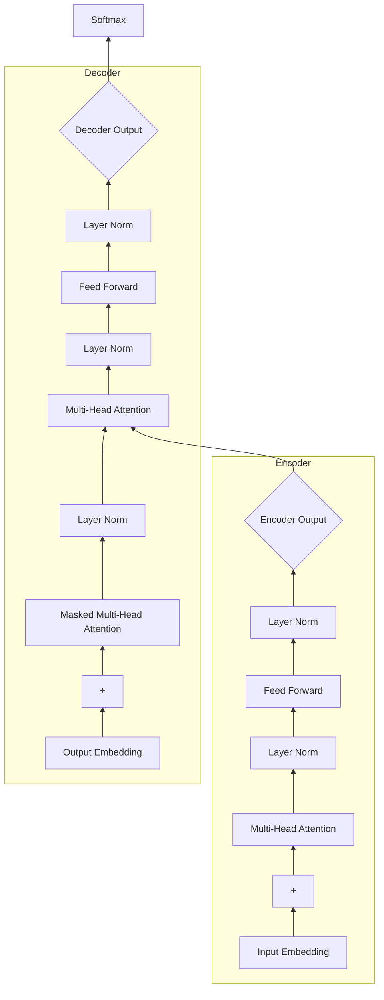

# transformer架构(Transformer Architecture)原理与代码实战案例讲解

关键词：transformer, self-attention, 注意力机制, 编码器, 解码器, 位置编码, 残差连接, 层标准化, 前馈神经网络, 机器翻译

## 1. 背景介绍
### 1.1  问题的由来
自然语言处理(NLP)是人工智能领域的一个重要分支,其目标是让计算机能够理解、生成和处理人类语言。传统的NLP模型如RNN和LSTM虽然在许多任务上取得了不错的效果,但它们本质上是一种序列模型,难以并行计算,训练速度慢,且难以捕捉长距离的依赖关系。为了解决这些问题,Google于2017年提出了Transformer模型[1],该模型完全基于注意力机制(Attention Mechanism),抛弃了传统的RNN和CNN等结构,大幅提高了并行计算能力和长距离特征捕捉能力,在机器翻译任务上取得了state-of-the-art的效果。

### 1.2  研究现状
Transformer提出后,迅速成为了NLP领域的研究热点。各种基于Transformer的预训练语言模型如BERT[2]、GPT[3]、XLNet[4]等相继问世,在多个NLP任务上刷新了最好成绩。Transformer结构也被引入到计算机视觉、语音识别、图网络等其他领域,展现出了广泛的适用性。目前学术界和工业界都在积极探索Transformer的改进和应用。

### 1.3  研究意义
Transformer作为一种颠覆性的模型结构,其研究意义主要体现在以下几点:

1. 技术创新:Transformer开创性地提出了完全基于注意力机制的序列建模范式,是深度学习技术的一大突破。
2. 效果显著:在机器翻译、阅读理解、文本分类等多个任务上,Transformer模型的效果超越了此前最好的模型。  
3. 应用广泛:Transformer为NLP乃至其他领域的研究和应用开辟了新的道路,有望成为通用的基础模型结构。
4. 启发后续:Transformer催生了大量后续研究工作,极大地推动了人工智能技术的发展。

### 1.4  本文结构 
本文将全面介绍Transformer的原理和代码实现。第2节介绍Transformer的核心概念。第3节详细讲解其核心算法原理和步骤。第4节给出数学模型和公式推导。第5节提供基于PyTorch的代码实战。第6节分析其实际应用场景。第7节推荐相关工具和资源。第8节总结全文并展望未来。第9节列出常见问题解答。

## 2. 核心概念与联系
Transformer的核心概念包括:

1. 注意力机制(Attention Mechanism):通过注意力分数动态地聚焦到输入序列的不同部分,从而捕捉输入之间的依赖关系。
2. 自注意力(Self-Attention):序列自身的不同位置之间通过注意力机制计算依赖,捕捉序列内部的长距离依赖。
3. 编码器(Encoder):由若干个相同的层堆叠而成,每一层包含一个多头自注意力子层和一个前馈神经网络子层,用于将输入序列映射为隐藏状态表示。
4. 解码器(Decoder):结构与编码器类似,但每一层除了两个子层外,还在两个子层之间插入一个多头注意力子层,用于聚合编码器的输出。解码器根据已生成的输出序列和编码器的隐藏状态表示,逐个生成目标序列。
5. 多头注意力(Multi-Head Attention):将输入进行多次线性变换,然后分别输入到若干个注意力"头",再将各个头的输出拼接,经过另一个线性变换得到最终的多头注意力输出。
6. 位置编码(Positional Encoding):由于Transformer不包含RNN等顺序操作,需要通过位置编码将位置信息引入到输入表示中。
7. 残差连接(Residual Connection):将某一层的输入与其输出相加,保证梯度可以直接回传,缓解梯度消失问题。
8. 层标准化(Layer Normalization):在每一个子层之后对神经元的激活值进行归一化,有助于加速训练并提高模型泛化能力。

下图展示了Transformer模型的整体架构,阐明了各个组件之间的联系:

## 3. 核心算法原理 & 具体操作步骤
### 3.1 算法原理概述
Transformer的核心是注意力机制,通过注意力分数为不同输入分配不同的权重,动态地聚焦到输入序列的不同部分。具体来说,Transformer中的注意力函数接受三个输入:Query矩阵 $Q$, Key矩阵 $K$ 和 Value矩阵 $V$。注意力分数 $\alpha$ 通过 $Q$ 和 $K$ 的相似度计算得到:

$$
\alpha = \text{softmax}(\frac{QK^T}{\sqrt{d_k}})
$$

其中 $d_k$ 为 $K$ 的维度。然后用 $\alpha$ 对 $V$ 进行加权求和,得到注意力输出:

$$
\text{Attention}(Q,K,V) = \alpha V
$$

多头注意力则是将 $Q$,$K$,$V$ 通过线性变换投影到 $h$ 个不同的子空间,然后并行计算 $h$ 个注意力函数,最后将结果拼接起来再经过一个线性变换:

$$
\text{MultiHead}(Q,K,V) = \text{Concat}(\text{head}_1,...,\text{head}_h)W^O \\
\text{head}_i = \text{Attention}(QW_i^Q, KW_i^K, VW_i^V)
$$

其中 $W_i^Q \in \mathbb{R}^{d_{\text{model}} \times d_k}$,$W_i^K \in \mathbb{R}^{d_{\text{model}} \times d_k}$,$W_i^V \in \mathbb{R}^{d_{\text{model}} \times d_v}$,$W^O \in \mathbb{R}^{hd_v \times d_{\text{model}}}$ 为可学习的参数矩阵。

### 3.2 算法步骤详解
下面详细描述Transformer的编码器和解码器的计算步骤。

编码器的计算步骤如下:
1. 将输入序列 $\mathbf{x} = (x_1,...,x_n)$ 通过Embedding层和位置编码相加,得到输入嵌入式表示 $\mathbf{e} = (e_1,...,e_n)$。
2. 初始化 $Q=K=V=\mathbf{e}$,输入多头自注意力层,得到新的隐藏状态表示 $\mathbf{z} = (z_1,...,z_n)$。
3. 进行残差连接和层标准化: $\mathbf{z}^\prime = \text{LayerNorm}(\mathbf{z} + \mathbf{e})$。
4. 将 $\mathbf{z}^\prime$ 输入前馈神经网络,再次进行残差连接和层标准化,得到最终的编码器输出 $\mathbf{h} = (h_1,...,h_n)$。
5. 重复步骤2-4若干次(即堆叠若干个编码器层),每一层的输入为前一层的输出。

解码器的计算步骤如下:
1. 将输出序列 $\mathbf{y} = (y_1,...,y_{i-1})$ 通过Embedding层和位置编码相加,得到输出嵌入式表示 $\mathbf{g} = (g_1,...,g_{i-1})$。
2. 初始化 $Q=K=V=\mathbf{g}$,输入多头自注意力层,得到隐藏状态表示 $\mathbf{s} = (s_1,...,s_{i-1})$。注意这里的自注意力层使用序列mask,每个位置只能attend to其左侧的位置。
3. 进行残差连接和层标准化: $\mathbf{s}^\prime = \text{LayerNorm}(\mathbf{s} + \mathbf{g})$。
4. 将 $\mathbf{s}^\prime$ 作为Query,编码器输出 $\mathbf{h}$ 作为Key和Value,输入第二个多头注意力层,得到 $\mathbf{c} = (c_1,...,c_{i-1})$。
5. 进行残差连接和层标准化: $\mathbf{c}^\prime = \text{LayerNorm}(\mathbf{c} + \mathbf{s}^\prime)$。
6. 将 $\mathbf{c}^\prime$ 输入前馈神经网络,再次进行残差连接和层标准化,得到最终的解码器输出 $\mathbf{o} = (o_1,...,o_{i-1})$。
7. 重复步骤2-6若干次(即堆叠若干个解码器层),每一层的输入为前一层的输出。
8. 将 $\mathbf{o}$ 输入线性层和softmax层,得到下一个token $y_i$ 的概率分布。

### 3.3 算法优缺点
Transformer相比传统的RNN/CNN模型,主要有以下优点:
1. 并行计算能力强,训练速度快。
2. 通过自注意力机制,可以捕捉任意距离的依赖关系。
3. 模型结构简单,易于实现和修改。
4. 扩展性好,可以通过增加层数和注意力头数来提升模型容量。

但Transformer也存在一些局限:
1. 计算复杂度随着序列长度平方级增长,难以处理很长的序列。
2. 位置编码是固定的,缺乏灵活性。
3. 缺乏先验知识,需要大量数据进行训练。
4. 解释性不强,内部工作机制仍不够清晰。

### 3.4 算法应用领域
得益于其强大的特征提取和建模能力,Transformer已经在多个领域得到广泛应用,包括但不限于:
1. 机器翻译:如Google的Neural Machine Translation系统。
2. 对话系统:如微软的XiaoIce。
3. 文本摘要:如Salesforce的抽取式摘要模型。
4. 语义匹配:如谷歌的BERT在GLUE基准测试中的表现。
5. 语音识别:如Transformer-Transducer模型。
6. 图像字幕:如谷歌的Image Transformer。
7. 视频分析:如Transformer在行为识别任务上的应用。
8. 图表示学习:如Graph Transformer网络。

随着研究的不断深入,Transformer有望在更多领域发挥重要作用。

## 4. 数学模型和公式 & 详细讲解 & 举例说明
### 4.1 数学模型构建
Transformer的数学模型可以用下面的公式来概括。

输入序列 $\mathbf{x} = (x_1,...,x_n)$ 经过Embedding和位置编码后得到 $\mathbf{e} = (e_1,...,e_n)$:

$$
e_i = E(x_i) + PE(i)
$$

其中 $E \in \mathbb{R}^{d_{\text{vocab}} \times d_{\text{model}}}$ 为Embedding矩阵,$PE \in \mathbb{R}^{n \times d_{\text{model}}}$ 为位置编码矩阵。位置编码通过三角函数实现:

$$
PE(i,2j) = \sin(i/10000^{2j/d_{\text{model}}}) \\
PE(i,2j+1) = \cos(i/10000^{2j/d_{\text{model}}})
$$

其中 $i$ 为位置索引,$j$ 为维度索引。

编码器的第 $l$ 层输出为 $\mathbf{h}^l = (h_1^l,...,h_n^l)$,初始状态 $\mathbf{h}^0 = \mathbf{e}$,每一层的计算过程为:

$$
\mathb