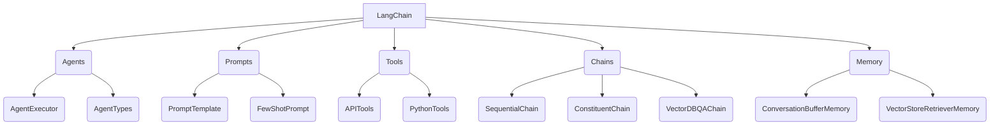
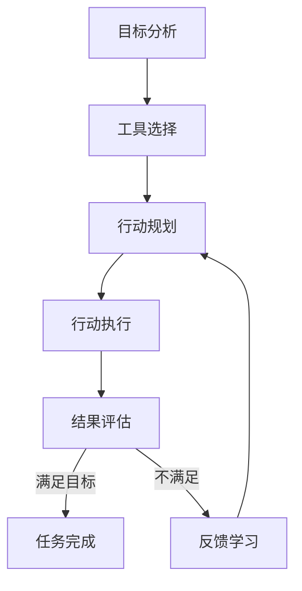

# 【LangChain编程：从入门到实践】RunnablePassthrough

## 1. 背景介绍

### 1.1 问题的由来

在当今的数字时代，人工智能(AI)和自然语言处理(NLP)技术已经渗透到了各个领域,成为推动科技创新的核心驱动力。随着数据量的激增和计算能力的飞速发展,AI系统需要高效地处理海量数据,并从中提取有价值的信息。然而,传统的数据处理方式往往存在效率低下、可扩展性差等问题,难以满足现代AI系统的需求。

在这种背景下,LangChain应运而生。作为一个强大的AI开发框架,LangChain旨在简化AI应用程序的构建过程,提供一种统一的方式来组合不同的AI模型、数据源和工具。通过LangChain,开发人员可以轻松地集成各种语言模型、知识库和API,构建出高效、可扩展的AI应用程序。

### 1.2 研究现状

LangChain是一个相对较新的开源项目,但已经在AI社区中引起了广泛关注。越来越多的开发人员和研究人员开始探索LangChain的潜力,并将其应用于各种领域,如自然语言处理、知识管理、智能助手等。

目前,LangChain提供了丰富的模块和工具,支持多种语言模型(如GPT-3、BERT等)、数据源(如文件、Web页面、API等)和工具(如Python库、外部API等)。此外,LangChain还提供了一系列预构建的代理(Agents),可以帮助开发人员快速构建智能系统。

然而,尽管LangChain提供了强大的功能,但对于初学者来说,掌握LangChain并将其应用于实际项目仍然是一个挑战。缺乏全面的教程和最佳实践指南,使得许多开发人员难以充分利用LangChain的潜力。

### 1.3 研究意义

本文旨在为读者提供一个全面的LangChain入门指南,涵盖从基础概念到实践应用的各个方面。通过深入探讨LangChain的核心原理、算法和架构,读者将能够掌握LangChain的工作机制,并了解如何将其应用于实际项目中。

此外,本文还将介绍LangChain的实际应用场景,包括自然语言处理、知识管理、智能助手等领域。通过实际案例分析和代码示例,读者将能够更好地理解LangChain的实践应用,并获得宝贵的经验和见解。

最后,本文将探讨LangChain的未来发展趋势和面临的挑战,为读者提供一个前瞻性的视角,帮助他们做好充分准备,以便在未来的AI革命中占据先机。

### 1.4 本文结构

本文将按照以下结构进行阐述:

1. 背景介绍
2. 核心概念与联系
3. 核心算法原理与具体操作步骤
4. 数学模型和公式详细讲解与举例说明
5. 项目实践:代码实例和详细解释说明
6. 实际应用场景
7. 工具和资源推荐
8. 总结:未来发展趋势与挑战
9. 附录:常见问题与解答

## 2. 核心概念与联系

在深入探讨LangChain的核心算法和原理之前,我们需要先了解一些基本概念和它们之间的联系。这些概念构成了LangChain的基础,对于理解后续内容至关重要。

### 2.1 Agents

Agents是LangChain中的一个核心概念,代表了一种智能代理,能够根据给定的目标和工具自主地规划和执行行动。Agents由两个主要组件组成:AgentExecutor和AgentType。

- **AgentExecutor**:负责执行代理的行为,包括分析目标、选择工具、执行行动等。
- **AgentType**:定义了代理的行为策略,例如如何分析目标、如何选择工具等。

### 2.2 Prompts

Prompts是与语言模型进行交互的关键。LangChain提供了多种Prompt类型,用于构建高质量的提示,从而获得更好的模型输出。

- **PromptTemplate**:用于定义提示的模板,可以包含占位符,方便动态插入数据。
- **FewShotPrompt**:基于少量示例数据构建提示,有助于模型更好地理解任务。

### 2.3 Tools

Tools代表了LangChain可以与之交互的各种工具和资源,包括API、Python库等。通过将这些工具集成到LangChain中,开发人员可以轻松地将它们应用于AI应用程序。

- **APITools**:封装了各种API,如OpenAI、Wolfram Alpha等。
- **PythonTools**:封装了各种Python库,如Pandas、NumPy等。

### 2.4 Chains

Chains是LangChain中的另一个核心概念,代表了一系列连续的操作步骤。通过将多个链条组合在一起,开发人员可以构建复杂的AI应用程序。

- **SequentialChain**:按顺序执行一系列操作步骤。
- **ConstituentChain**:根据条件动态选择执行哪些操作步骤。
- **VectorDBQAChain**:专门用于基于向量数据库进行问答。

### 2.5 Memory

Memory是LangChain中用于存储和检索信息的组件。通过Memory,代理可以记住过去的交互和决策,从而做出更加准确和一致的行为。

- **ConversationBufferMemory**:存储代理与用户之间的对话历史。
- **VectorStoreRetrieverMemory**:基于向量相似性从知识库中检索相关信息。

这些核心概念相互关联,共同构成了LangChain的基础架构。理解它们及其联系,对于掌握LangChain的使用至关重要。

## 3. 核心算法原理与具体操作步骤

### 3.1 算法原理概述

LangChain的核心算法原理是基于一种称为"构成性AI"(Constitutive AI)的范式。构成性AI旨在通过组合各种AI模型、工具和数据源,构建出复杂的智能系统。

在LangChain中,这一原理体现在以下几个方面:

1. **模块化设计**:LangChain将不同的功能模块化,如Agents、Tools、Chains等,每个模块负责特定的任务。这种模块化设计提高了代码的可重用性和可维护性。

2. **灵活组合**:开发人员可以根据需求,灵活地组合不同的模块,构建出满足特定需求的AI应用程序。例如,可以将不同的语言模型、知识库和API集成到同一个应用程序中。

3. **自主决策**:LangChain中的Agents能够根据给定的目标和可用的工具,自主地规划和执行行动。这种自主决策能力使得LangChain能够处理复杂的任务,而无需过多的人工干预。

4. **迭代优化**:LangChain支持基于反馈和历史数据进行迭代优化。通过记录代理的行为和决策,LangChain可以不断优化其策略,提高系统的性能和准确性。

总的来说,LangChain的核心算法原理是将AI模型、工具和数据源进行灵活组合,并赋予智能代理自主决策的能力,从而构建出高效、可扩展的AI应用程序。

### 3.2 算法步骤详解

LangChain的核心算法可以概括为以下几个主要步骤:

1. **目标分析**:首先,代理需要分析给定的目标,理解任务的要求和约束条件。这一步骤通常涉及自然语言处理和语义理解技术。

2. **工具选择**:根据目标和可用的工具,代理需要选择最合适的工具集合,以完成任务。这一步骤需要考虑工具的功能、成本和限制。

3. **行动规划**:代理需要规划一系列行动步骤,以有效地利用选择的工具完成任务。这一步骤涉及到任务分解、优先级排序和决策过程。

4. **行动执行**:代理执行规划好的行动步骤,与选择的工具进行交互,获取所需的数据和结果。

5. **结果评估**:代理评估执行行动后的结果,判断是否满足目标要求。如果不满足,则需要重新规划或调整策略。

6. **反馈学习**:代理根据执行过程中的反馈和历史数据,不断优化自身的策略和决策模型,以提高未来任务的执行效率和准确性。

这些步骤通常是循环执行的,直到完成最终目标。在整个过程中,LangChain利用了各种AI技术,如自然语言处理、知识表示、规划算法、强化学习等,以实现智能化的任务执行。

### 3.3 算法优缺点

LangChain的核心算法具有以下优点:

1. **模块化和可扩展性**:由于采用了模块化设计,LangChain具有很强的可扩展性。开发人员可以根据需求,轻松地集成新的模型、工具和数据源。

2. **自主决策能力**:LangChain中的代理具有自主决策能力,能够根据目标和可用资源自动规划和执行行动,减轻了开发人员的工作负担。

3. **灵活性和通用性**:LangChain可以应用于各种领域和任务,如自然语言处理、知识管理、智能助手等,具有很强的灵活性和通用性。

4. **迭代优化**:LangChain支持基于反馈和历史数据进行迭代优化,可以不断提高系统的性能和准确性。

然而,LangChain的算法也存在一些缺点和挑战:

1. **复杂性**:由于涉及多个模块和组件,LangChain的整体架构较为复杂,对开发人员的要求较高。

2. **可解释性**:由于采用了自主决策机制,LangChain的决策过程可能缺乏透明度和可解释性,这可能会影响用户对系统的信任度。

3. **数据质量依赖**:LangChain的性能在很大程度上依赖于输入数据的质量和可用工具的能力,如果数据或工具存在缺陷,可能会导致系统性能下降。

4. **成本和资源消耗**:集成多个AI模型和工具可能会导致较高的计算资源消耗和成本支出。

5. **安全和隐私问题**:由于涉及多个外部数据源和API,LangChain可能面临一定的安全和隐私风险,需要采取适当的措施进行保护。

### 3.4 算法应用领域

由于其灵活性和通用性,LangChain的核心算法可以应用于多个领域,包括但不限于:

1. **自然语言处理(NLP)**:LangChain可以用于构建各种NLP应用程序,如问答系统、文本摘要、情感分析等。

2. **知识管理**:LangChain能够集成多种知识库和信息源,用于构建智能知识管理系统。

3. **智能助手**:利用LangChain,可以开发出具有自主决策能力的智能助手,为用户提供个性化的服务和支持。

4. **任务自动化**:LangChain可以用于自动化各种复杂的任务,如数据处理、文档生成、业务流程等。

5. **科研和教育**:LangChain为科研人员和教育工作者提供了一个强大的工具,可用于构建智能教学系统、科研辅助工具等。

6. **企业应用**:在企业环境中,LangChain可以应用