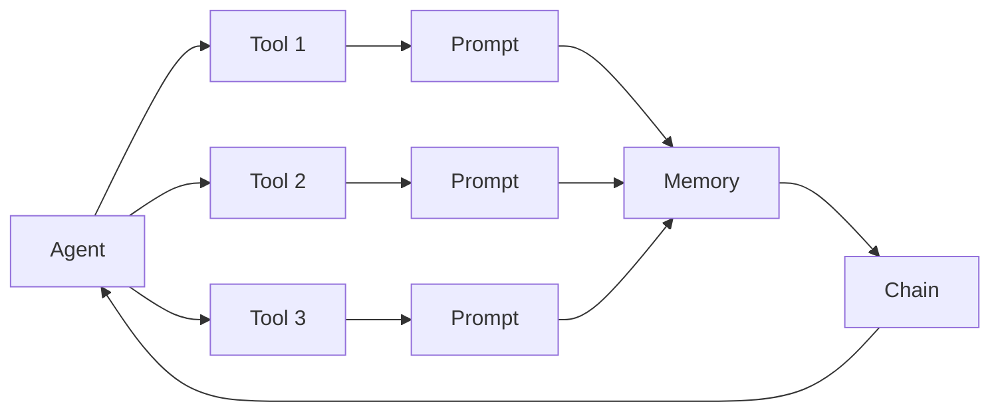
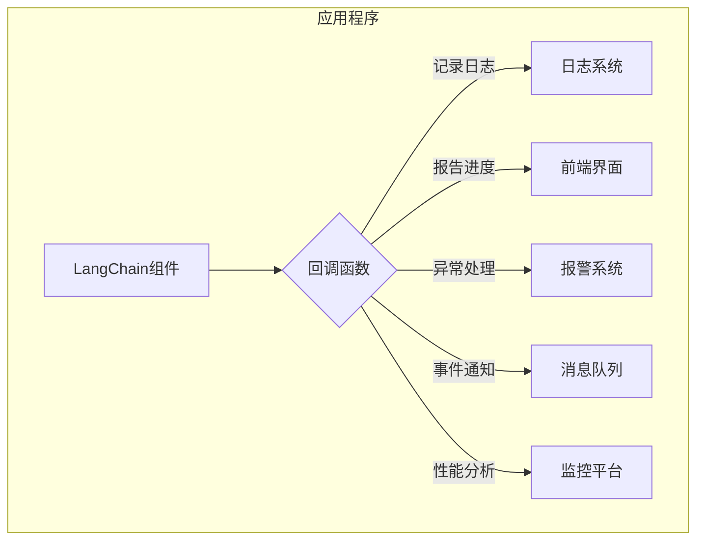

# 【LangChain编程：从入门到实践】使用回调的两种方式

## 1. 背景介绍
### 1.1  问题的由来
随着人工智能技术的飞速发展，自然语言处理(NLP)领域也取得了长足的进步。在NLP的诸多应用中，对话式AI助手因其能够与人进行自然流畅的交互而备受关注。而要实现一个功能强大、体验出色的对话式AI助手，除了需要先进的语言模型外，还需要灵活高效的编程框架来支撑。

### 1.2  研究现状
目前，已经有多个开源的对话式AI编程框架涌现出来，如 Rasa、DeepPavlov、ParlAI等。这些框架在一定程度上降低了构建对话式AI系统的门槛。然而，它们往往需要较多的定制开发和配置工作，学习曲线较为陡峭。

最近，一个名为 LangChain 的开源项目引起了广泛关注。LangChain 是一个用于开发由语言模型驱动的应用程序的框架。它提供了一套标准化的接口和可复用的组件，大大简化了对话式AI应用的开发流程。

### 1.3  研究意义
LangChain 强大而灵活的编程模型有望成为对话式AI开发领域的新范式。深入研究 LangChain 的内部机制和最佳实践，对于推动对话式AI技术的发展具有重要意义。本文将聚焦于 LangChain 中的一个关键特性——回调(Callbacks)，探讨其工作原理和使用方法，帮助读者更好地掌握 LangChain 编程技巧，提升开发效率。

### 1.4  本文结构
本文将从以下几个方面展开论述：

- 首先，我们将介绍 LangChain 的核心概念和整体架构，帮助读者建立宏观认知。 
- 然后，重点解析 LangChain 中的回调机制，说明其在异步编程、日志记录、事件处理等场景下的应用价值。
- 接下来，我们将通过实例代码，演示在 LangChain 中使用回调的两种主要方式——函数装饰器和显式回调。
- 最后，总结 LangChain 回调的优势和局限性，展望其未来的发展方向，并提供一些学习资源，帮助读者进一步深入探索。

## 2. 核心概念与联系

在深入介绍回调之前，我们有必要先了解一下 LangChain 的几个核心概念：

- `Agent`：代理，负责接收用户输入，调用一系列工具来生成回复。可以将其视为对话式AI助手的大脑。
- `Tool`：工具，执行特定功能的组件，如搜索引擎、计算器、数据库查询等。Agent 通过调用工具来完成任务。  
- `Prompt`：提示，引导语言模型生成特定文本的模板。可以包含Instructions、Examples等内容。
- `Memory`：记忆，存储对话历史，提供上下文信息。常见的如 Buffer Memory、Conversation Summary Memory等。
- `Chain`：链，由一系列组件顺序连接而成，用于处理复杂的多步骤任务。

下面这张示意图直观地展现了 LangChain 的核心组件及其交互关系：



可以看出，Agent 通过组合不同的 Tool、Prompt、Memory 等组件，构建出功能完备的对话式AI系统。而 Chain 则将这些组件连接起来，形成一个闭环。

理解了这些核心概念后，我们就可以进一步探讨 LangChain 中的回调机制了。

## 3. 核心算法原理 & 具体操作步骤
### 3.1  算法原理概述
LangChain 中的回调本质上是一种事件驱动编程模式。通过在关键节点注册回调函数，我们可以在不修改原有代码的情况下，增强 LangChain 组件的功能。

回调函数一般具有如下签名：

```python
def callback(result, **kwargs):
    # 处理结果，执行额外的操作
    ...
```

其中，`result` 表示 LangChain 组件的执行结果，`**kwargs` 则包含了一些元信息，如执行时间、错误信息等。

在 LangChain 中，几乎所有的组件都支持回调，包括 Agent、Chain、Tool 等。通过为这些组件注册回调函数，我们可以实现诸如日志记录、性能分析、错误处理等功能，而无需侵入原有的业务逻辑。

### 3.2  算法步骤详解
使用回调的一般步骤如下：

1. 定义回调函数，确定要处理的事件类型（如执行前、执行后、执行错误等）。
2. 将回调函数注册到 LangChain 组件上。可以通过装饰器或显式传参的方式进行注册。
3. 运行 LangChain 应用，触发回调函数。
4. 在回调函数中访问执行结果，执行额外的操作，如记录日志、发送通知等。

下面是一个简单的示例，演示了如何为一个 Chain 注册执行后回调：

```python
from langchain.chains import LLMChain
from langchain.callbacks import StdOutCallbackHandler

def post_run_callback(result, **kwargs):
    print(f"Chain 执行完毕，结果是：{result}")

chain = LLMChain(...)
chain.add_callback(StdOutCallbackHandler(post_run=post_run_callback))

# 运行 Chain，触发回调
result = chain.run("请用Python写一个冒泡排序")
```

在这个例子中，我们定义了一个 `post_run_callback` 函数，用于在 Chain 执行完毕后打印执行结果。然后，通过 `add_callback` 方法，将其注册到了 Chain 上。这样，每次 Chain 执行完毕，都会自动调用该回调函数。

### 3.3  算法优缺点
使用回调的优点在于：

- 解耦合：回调函数独立于主逻辑，易于维护和扩展。
- 灵活性：可以在不修改原有代码的情况下，动态增加新的功能。
- 可复用：相同的回调函数可以注册到多个组件上，提高了代码的复用性。

但回调也有一些缺点：

- 破坏线性流程：大量使用回调可能会使代码难以阅读和调试。
- 参数传递：回调函数的参数依赖于被监听的事件，容易出现参数不匹配的问题。
- 异常处理：回调函数中发生的异常需要特殊处理，否则可能会导致主逻辑中断。

因此，在使用回调时，我们需要权衡其利弊，避免过度使用，同时要注意编写可读性强、健壮性高的回调函数。

### 3.4  算法应用领域
回调在 LangChain 编程中有广泛的应用，主要体现在以下几个方面：

- 日志记录：通过注册执行前、执行后回调，可以方便地记录组件的运行情况，如执行时间、输入输出等，便于后续的分析和优化。
- 进度跟踪：对于长时间运行的任务，可以通过回调实时报告进度，提升用户体验。
- 异常处理：捕获回调函数中的异常，可以防止主逻辑意外中断，提高系统的健壮性。
- 事件通知：回调函数可以与外部系统交互，实现消息通知、Webhook等功能。
- 性能分析：通过在关键节点设置回调，可以收集性能数据，识别系统瓶颈。

下面这张图展示了回调在 LangChain 应用中的典型用法：



## 4. 数学模型和公式 & 详细讲解 & 举例说明
### 4.1  数学模型构建
LangChain 作为一个编程框架，其核心并不依赖于特定的数学模型。但在 LangChain 所连接的语言模型中，却广泛应用了各种数学模型和算法，如 Transformer、Attention、Beam Search 等。

以 Transformer 为例，它是一种基于自注意力机制的神经网络模型，广泛应用于自然语言处理领域。Transformer 的核心思想是通过 Attention 机制，让模型能够自动学习输入序列中的重要信息，从而生成高质量的输出。

### 4.2  公式推导过程
Transformer 中的 Attention 机制可以用下面的公式来表示：

$$
Attention(Q,K,V) = softmax(\frac{QK^T}{\sqrt{d_k}})V
$$

其中，$Q$、$K$、$V$ 分别表示 Query、Key、Value 矩阵，$d_k$ 是 Key 向量的维度。这个公式的含义是：

1. 将 Query 矩阵和 Key 矩阵做点积，得到一个 Attention 分数矩阵。
2. 将 Attention 分数矩阵除以 $\sqrt{d_k}$，起到归一化的作用，避免分数过大。
3. 对归一化后的分数矩阵应用 Softmax 函数，得到 Attention 权重矩阵。
4. 将 Attention 权重矩阵与 Value 矩阵相乘，得到最终的 Attention 结果。

通过这种方式，Transformer 可以自动学习输入序列中的重要信息，生成高质量的输出。

### 4.3  案例分析与讲解
下面我们用一个简单的例子来说明 Attention 机制的作用。假设我们有一个英文句子："The quick brown fox jumps over the lazy dog"，现在要将其翻译成中文。

首先，我们将句子编码成一个矩阵 $X$：

$$
X = \begin{bmatrix}
x_1 & x_2 & \cdots & x_n
\end{bmatrix}
$$

其中，$x_i$ 表示第 $i$ 个单词的词向量。

然后，我们通过 Attention 机制，计算每个单词的重要性权重：

$$
\alpha = Attention(Q,K,V)
$$

其中，$Q$、$K$、$V$ 都是从 $X$ 计算得到的。

最后，我们根据 Attention 权重 $\alpha$，对词向量进行加权求和，得到句子的表示向量 $v$：

$$
v = \sum_{i=1}^n \alpha_i x_i
$$

这个表示向量 $v$ 就编码了整个句子的语义信息，可以用于后续的翻译任务。

通过这个例子，我们可以看出，Attention 机制可以帮助模型自动学习输入中的重要信息，从而生成更准确、更通顺的翻译结果。

### 4.4  常见问题解答
1. **Q**: Transformer 中的 Query、Key、Value 矩阵是如何计算得到的？

   **A**: 一般来说，Query、Key、Value 矩阵是通过将输入矩阵 $X$ 与三个可学习的权重矩阵 $W_Q$、$W_K$、$W_V$ 相乘得到的：

   $Q = XW_Q$
   
   $K = XW_K$
   
   $V = XW_V$

   这三个权重矩阵在模型训练过程中会自动学习得到。

2. **Q**: Transformer 中的多头注意力(Multi-head Attention)是什么？
   
   **A**: 多头注意力是 Transformer 的一个重要特性，它将单个 Attention 扩展为多个并行的 Attention，每个 Attention 关注输入的不同部分。这样可以让模型从不同的角度去理解输入，提取更丰富的特征。多头注意力的计算公式为：
   
   $$
   MultiHead(Q,K,V) = Concat(head_1, \dots, head_h)W^O
   $$
   
   其中，$head_i = Attention(QW_i^Q, KW_i^K, VW_i^V)$，$W^O$ 是一个可学习的权