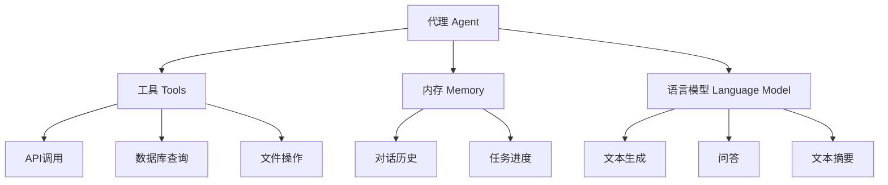

# 【LangChain编程：从入门到实践】发展计划

## 1. 背景介绍

### 1.1 问题的由来

在当今快速发展的人工智能时代，构建智能应用程序已经成为一个备受关注的热门话题。然而,开发人工智能系统通常需要处理大量复杂的数据,并将多个模型和工具集成到一个统一的框架中。这种复杂性给开发人员带来了巨大的挑战,导致开发周期延长、成本增加,并且难以维护和扩展。

### 1.2 研究现状

为了解决这些挑战,近年来出现了一种新的编程范式:LangChain。LangChain是一个用于构建应用程序的框架,它将语言模型(如GPT-3)与其他工具和数据源相结合。LangChain的目标是简化人工智能应用程序的开发过程,提高开发效率,并促进人工智能技术的广泛应用。

### 1.3 研究意义

LangChain的出现为开发人员提供了一种全新的编程方式,使他们能够更轻松地构建智能应用程序。通过将语言模型与其他工具和数据源相结合,LangChain可以帮助开发人员快速构建各种智能应用程序,如聊天机器人、问答系统、自动化工作流等。此外,LangChain还提供了一种模块化的方法来组织和管理应用程序的各个组件,从而提高了代码的可维护性和可扩展性。

### 1.4 本文结构

本文将深入探讨LangChain编程,从入门到实践。我们将首先介绍LangChain的核心概念和原理,然后详细讲解其核心算法和数学模型。接下来,我们将通过实际项目实践,展示如何使用LangChain构建智能应用程序。最后,我们将探讨LangChain的实际应用场景、相关工具和资源,并对其未来发展趋势和挑战进行展望。

## 2. 核心概念与联系

LangChain是一个用于构建应用程序的框架,它将语言模型与其他工具和数据源相结合。它的核心概念包括:

1. **代理(Agent)**: 代理是LangChain中的核心组件,它负责协调和管理应用程序的各个部分。代理可以执行各种任务,如查询知识库、调用外部API、执行计算等。

2. **工具(Tool)**: 工具是LangChain中的另一个重要组件,它代表了可以被代理调用的各种功能。工具可以是各种形式,如API调用、数据库查询、文件操作等。

3. **内存(Memory)**: 内存是LangChain中用于存储和管理应用程序状态的组件。它允许代理跟踪对话历史、任务进度等信息,从而提高应用程序的上下文理解能力。

4. **语言模型(Language Model)**: 语言模型是LangChain中用于自然语言处理的组件。它可以执行各种任务,如文本生成、问答、文本摘要等。LangChain支持多种语言模型,如GPT-3、BERT等。

这些核心概念相互关联,共同构建了LangChain的整体框架。代理充当了协调者的角色,它利用工具执行各种任务,并利用内存来维护应用程序的状态。语言模型则为整个系统提供了自然语言处理的能力。

## 3. 核心算法原理 & 具体操作步骤

### 3.1 算法原理概述

LangChain的核心算法是一种基于代理的决策过程,它允许代理根据当前的任务和上下文,选择最合适的工具来执行任务。这个过程可以概括为以下几个步骤:

1. **任务分解**: 将复杂的任务分解为一系列更小的子任务。
2. **工具选择**: 根据当前的子任务,选择最合适的工具来执行该子任务。
3. **工具执行**: 执行选定的工具,获取结果。
4. **结果评估**: 评估工具执行的结果,判断是否满足当前子任务的要求。
5. **状态更新**: 更新内存中的状态,包括对话历史、任务进度等。
6. **循环迭代**: 如果当前任务尚未完成,则返回步骤1,继续执行下一个子任务。

这个过程可以通过递归的方式实现,即每个子任务都可以进一步分解为更小的子任务,直到最终达到可以直接执行的工具级别。

### 3.2 算法步骤详解

1. **任务分解**

任务分解是LangChain算法的第一步,它将原始任务分解为一系列更小的子任务。这个过程可以利用语言模型的自然语言理解能力,将原始任务表述为一系列更具体的子任务。

例如,对于一个"预订旅行"的任务,可以分解为以下子任务:

- 选择目的地
- 查找机票和酒店
- 比较价格和评分
- 进行预订

2. **工具选择**

在完成任务分解后,LangChain算法需要为每个子任务选择合适的工具。这个过程可以利用语言模型的自然语言理解能力,将子任务与可用工具进行匹配。

例如,对于"查找机票和酒店"的子任务,可以选择以下工具:

- 航空公司网站API
- 在线旅游预订网站API
- 旅游评论网站API

3. **工具执行**

选择合适的工具后,LangChain算法将执行该工具,并获取执行结果。这个过程可能需要与外部API或数据源进行交互,也可能只是简单的数据处理操作。

4. **结果评估**

在获取工具执行结果后,LangChain算法需要评估该结果是否满足当前子任务的要求。这个过程可以利用语言模型的自然语言理解能力,将结果与子任务进行比对。

如果结果满足要求,则可以继续执行下一个子任务;否则,可能需要重新选择工具或调整执行参数。

5. **状态更新**

无论工具执行是否成功,LangChain算法都需要更新内存中的状态,以便后续的子任务能够利用这些信息。状态信息可能包括对话历史、任务进度、中间结果等。

6. **循环迭代**

如果当前任务尚未完成,LangChain算法将返回步骤1,继续执行下一个子任务。这个过程将一直持续,直到所有子任务都被成功执行,原始任务完成。

### 3.3 算法优缺点

LangChain算法的优点包括:

- **模块化**: 通过将任务分解为多个子任务,并为每个子任务选择合适的工具,LangChain算法实现了高度模块化。这使得系统更易于维护和扩展。
- **灵活性**: LangChain算法可以与各种语言模型、工具和数据源集成,提供了极大的灵活性。
- **上下文理解**: 通过利用内存组件,LangChain算法能够跟踪对话历史和任务进度,提高了对上下文的理解能力。

LangChain算法的缺点包括:

- **复杂性**: 算法涉及多个组件和步骤,可能会增加系统的复杂性。
- **性能瓶颈**: 在处理大量任务或子任务时,算法可能会面临性能瓶颈。
- **依赖质量**: 算法的效果在很大程度上依赖于语言模型、工具和数据源的质量。

### 3.4 算法应用领域

LangChain算法可以应用于各种领域,包括但不限于:

- **自动化工作流**: 通过将复杂任务分解为多个子任务,并利用不同的工具执行这些子任务,LangChain算法可以用于自动化各种工作流程。
- **问答系统**: 利用语言模型的自然语言理解能力,LangChain算法可以构建智能问答系统,为用户提供准确的答复。
- **聊天机器人**: 通过与语言模型的集成,LangChain算法可以用于构建具有上下文理解能力的聊天机器人。
- **任务规划和决策支持**: LangChain算法可以用于规划和优化复杂任务,为决策者提供支持。

## 4. 数学模型和公式 & 详细讲解 & 举例说明

### 4.1 数学模型构建

在LangChain中,我们可以利用数学模型来量化和优化代理的决策过程。一种常见的方法是使用马尔可夫决策过程(Markov Decision Process, MDP)模型。

MDP模型由以下几个要素构成:

- **状态集合 (S)**: 代表系统可能处于的所有状态。在LangChain中,状态可以包括对话历史、任务进度等信息。
- **动作集合 (A)**: 代表代理可以执行的所有动作。在LangChain中,动作可以是选择工具、执行工具等。
- **转移概率 (P)**: 定义了在执行某个动作后,系统从一个状态转移到另一个状态的概率。
- **奖励函数 (R)**: 定义了在执行某个动作并转移到新状态时,代理获得的奖励或惩罚。

我们可以使用以下公式来表示MDP模型:

$$
MDP = (S, A, P, R)
$$

其中:

- $S$ 表示状态集合
- $A$ 表示动作集合
- $P(s' | s, a)$ 表示在状态 $s$ 执行动作 $a$ 后,转移到状态 $s'$ 的概率
- $R(s, a, s')$ 表示在状态 $s$ 执行动作 $a$ 并转移到状态 $s'$ 时获得的奖励

目标是找到一个策略 $\pi$,使得在执行该策略时,代理能够获得最大的累积奖励。

### 4.2 公式推导过程

为了找到最优策略,我们可以使用动态规划或强化学习等方法。这里我们以动态规划为例,介绍公式推导过程。

我们定义值函数 $V(s)$ 表示在状态 $s$ 下,执行最优策略时可获得的最大累积奖励。根据贝尔曼方程,我们可以推导出以下公式:

$$
V(s) = \max_{a \in A} \left[ R(s, a) + \gamma \sum_{s' \in S} P(s' | s, a) V(s') \right]
$$

其中:

- $\gamma$ 是折现因子,用于平衡当前奖励和未来奖励的权重
- $R(s, a)$ 是在状态 $s$ 执行动作 $a$ 时获得的即时奖励
- $\sum_{s' \in S} P(s' | s, a) V(s')$ 是未来状态的期望值函数,表示执行动作 $a$ 后可能转移到的所有状态的值函数的加权和

通过迭代计算值函数,我们可以找到最优策略 $\pi^*(s)$,它为每个状态 $s$ 选择一个最优动作:

$$
\pi^*(s) = \arg\max_{a \in A} \left[ R(s, a) + \gamma \sum_{s' \in S} P(s' | s, a) V(s') \right]
$$

### 4.3 案例分析与讲解

为了更好地理解数学模型和公式,我们来分析一个简单的案例。

假设我们有一个任务是预订旅行,包括选择目的地、查找机票和酒店、比较价格和评分、进行预订等子任务。我们可以将这个任务建模为一个MDP:

- **状态集合 (S)**: 包括任务的当前进度、已获取的信息等。例如,状态可以表示为 `(已选目的地, 已查找机票和酒店, 已比较价格和评分, 已预订)`。
- **动作集合 (A)**: 包括选择目的地、查找机票和酒店、比较价格和评分、进行预订等动作。
- **转移概率 (P)**: 定义了在执行某个动作后,任务进度转移到新状态的概率。例如,在状态 `(False, False, False, False)` 执行