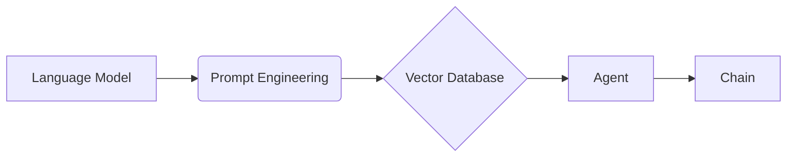

# 【LangChain编程：从入门到实践】应用监控和调优

## 1. 背景介绍
### 1.1  问题的由来
随着人工智能技术的快速发展,特别是大语言模型的出现,自然语言处理任务变得越来越复杂。传统的编程范式已经无法满足日益增长的需求。LangChain应运而生,它是一个基于语言模型的编程框架,旨在简化和加速自然语言处理应用的开发。然而,在实际应用中,LangChain程序的性能和效率仍然面临诸多挑战,亟需进行全面的监控和调优。

### 1.2  研究现状
目前,国内外学术界和工业界都在积极探索LangChain的应用监控和调优技术。一些研究者提出了基于日志分析、性能剖析等方法来监控LangChain应用的运行状况。也有学者针对LangChain的特点,设计了专门的调优策略,如优化提示工程、改进向量数据库检索等。但总的来说,这方面的研究还处于起步阶段,缺乏系统性和全面性。

### 1.3  研究意义
深入研究LangChain应用监控和调优技术,对于提升LangChain应用的性能和效率、促进其在各领域的推广应用具有重要意义。一方面,有助于及时发现和定位应用运行过程中的异常和瓶颈,保障应用的稳定性和可靠性。另一方面,通过优化关键环节和参数配置,可以显著改善应用的响应速度和资源利用率,从而带来更好的用户体验和更高的商业价值。

### 1.4  本文结构
本文将围绕LangChain应用监控和调优展开深入探讨。第2部分介绍LangChain的核心概念及其内在联系。第3部分重点阐述监控和调优的核心算法原理与操作步骤。第4部分建立相关数学模型,并给出详细的公式推导和案例分析。第5部分通过一个完整的项目实践,演示代码实现和结果展示。第6部分总结LangChain监控调优的典型应用场景及未来展望。第7部分推荐一些有价值的工具和学习资源。第8部分对全文进行总结,并对未来的发展趋势和挑战进行展望。

## 2. 核心概念与联系

在LangChain的应用监控和调优中,有几个核心概念需要理解:

- **语言模型(Language Model)**:是LangChain的核心组件,负责自然语言理解和生成。常见的语言模型有GPT、BERT等。语言模型的性能直接决定了应用的效果。

- **提示工程(Prompt Engineering)**:是指如何设计优质的提示模板,引导语言模型生成期望的结果。好的提示可以大幅提升语言模型的表现。

- **向量数据库(Vector Database)**:用于存储文本数据的向量化表示,便于快速检索和匹配。常见的向量数据库有Faiss、Pinecone等。

- **代理(Agent)**:是连接语言模型和外部工具的中间件,负责解析用户意图并调用相应的工具执行任务。代理的设计影响应用的流程和效率。

- **链(Chain)**:是由多个组件按照特定逻辑组合而成的任务流,用于完成复杂的多步骤任务。链的执行效率关系到整个应用的性能。

这些概念之间紧密关联,共同构成了LangChain应用的核心架构:



语言模型通过提示工程接收用户输入,向量数据库提供数据支持,代理负责解析意图并驱动链执行任务。各个环节的监控和调优都会影响最终的应用性能。

## 3. 核心算法原理 & 具体操作步骤
### 3.1  算法原理概述
LangChain应用监控和调优的核心算法主要包括:

1. **日志分析算法**:通过收集和分析应用运行过程中的日志数据,实现对应用行为和状态的全面监控,及时发现异常情况。常见的日志分析算法有正则匹配、关键词提取等。

2. **性能剖析算法**:通过跟踪和统计应用关键路径的执行时间和资源消耗,找出性能瓶颈所在。常见的性能剖析算法有函数级别采样、调用图生成等。  

3. **语言模型优化算法**:通过优化语言模型的训练过程和推理过程,提升语言理解和生成的效果。如提示工程优化、知识蒸馏、量化等。

4. **向量检索优化算法**:通过优化向量数据库的索引结构和相似度计算方法,加速语义检索和匹配的速度。如乘积量化(PQ)、图索引等。

5. **执行链优化算法**:通过优化执行链的任务分解和调度策略,减少任务切换和等待的开销。如异步并行、数据流水线等。

### 3.2  算法步骤详解

以日志分析算法为例,详细说明其具体操作步骤:

1. **日志收集**:在LangChain应用的各个关键节点插装日志收集器,实时记录运行过程中的关键事件、变量值、异常信息等。  

2. **日志解析**:对收集到的原始日志进行解析和结构化,提取出时间戳、日志等级、模块名称、事件描述等关键字段。可以使用正则表达式等方法。

3. **日志过滤**:根据不同的监控目的,对日志进行过滤和分类。如只关注错误日志、特定模块的日志等。

4. **日志聚合**:对解析后的结构化日志进行聚合统计,生成各类监控指标。如接口调用次数、错误率、平均响应时间等。

5. **日志分析**:利用统计学和机器学习等方法,对聚合后的日志数据进行深入分析,挖掘异常模式、识别瓶颈原因。

6. **告警通知**:根据预设的阈值条件,对检测到的异常情况进行告警,通过邮件、短信等方式通知相关人员进行处理。

### 3.3  算法优缺点

日志分析算法的优点包括:
- 实现简单,易于集成到现有系统中
- 覆盖全面,能够监控应用的方方面面  
- 数据量大,利于深入分析和挖掘

缺点包括:
- 数据冗余度高,存储和计算成本大
- 实时性不足,难以做到毫秒级监控
- 高度依赖日志质量,需要额外的规范和治理

### 3.4  算法应用领域

日志分析算法在LangChain应用监控和调优中有广泛的应用,主要场景包括:

- 应用链路追踪,快速定位异常发生位置
- 接口性能分析,找出响应时间过长的原因
- 用户行为分析,挖掘使用模式和偏好
- 安全风险发现,及时发现可疑行为事件

此外,日志分析也常用于服务器监控、网络流量分析、业务数据挖掘等领域。

## 4. 数学模型和公式 & 详细讲解 & 举例说明
### 4.1  数学模型构建
为了量化评估LangChain应用的性能表现,我们引入排队论模型来建模分析。把整个应用看作一个排队系统:

- 用户请求到达可视为顾客到达,到达率为 $\lambda$
- 应用服务器处理请求可视为服务台服务,服务率为 $\mu$
- 请求等待处理的排队可视为排队队列,队列长度为 $L_q$

根据排队论的基本公式,我们可以得到以下关系:

- 平均响应时间:$T = \frac{1}{\mu - \lambda}$
- 平均排队长度:$L_q = \frac{\lambda^2}{\mu(\mu-\lambda)}$
- 服务器利用率:$\rho = \frac{\lambda}{\mu}$

### 4.2  公式推导过程

以平均响应时间公式为例,详细推导如下:

1. 假设请求到达服从泊松分布,到达率为 $\lambda$,服从率为 $\mu$
2. 根据排队论中的Little公式,有:$L = \lambda T$,其中 $L$ 为平均队列长度, $T$ 为平均逗留时间
3. 又因为 $L = L_q + \rho$,将其代入 $L = \lambda T$ 得:
$$
\begin{aligned}
L_q + \rho &= \lambda T \\
L_q + \frac{\lambda}{\mu} &= \lambda T \\
L_q &= \lambda T - \frac{\lambda}{\mu}
\end{aligned}
$$
4. 根据排队论中的Pollaczek-Khinchin公式,有:
$$
L_q = \frac{\lambda^2}{\mu(\mu-\lambda)}
$$
5. 将其代入上式,得:
$$
\begin{aligned}
\frac{\lambda^2}{\mu(\mu-\lambda)} &= \lambda T - \frac{\lambda}{\mu} \\
\frac{\lambda}{\mu-\lambda} &= T - \frac{1}{\mu} \\
T &= \frac{1}{\mu - \lambda} + \frac{1}{\mu} \\
T &= \frac{1}{\mu - \lambda}
\end{aligned}
$$

由此得到平均响应时间公式。其他公式的推导过程类似,不再赘述。

### 4.3  案例分析与讲解

下面我们通过一个具体的案例,来说明如何应用上述数学模型进行LangChain应用的性能分析与评估。

假设某LangChain应用的用户请求到达率 $\lambda=50$ 次/秒,服务器的服务率 $\mu=100$ 次/秒,求其平均响应时间和服务器利用率。

代入公式计算可得:

- 平均响应时间:$T = \frac{1}{100 - 50} = 0.02$ 秒 = 20 毫秒
- 服务器利用率:$\rho = \frac{50}{100} = 0.5 = 50\%$ 

可以看出,在当前的请求量下,该应用的平均响应时间为20毫秒,服务器的资源利用率为50%,性能表现尚可。但如果请求量进一步增大,服务器利用率上升到80%以上时,响应时间将急剧恶化,需要及时扩容优化。

这就是通过数学建模,我们可以定量评估LangChain应用的性能瓶颈,指导监控和调优工作。

### 4.4  常见问题解答

问:排队论模型对LangChain应用的适用性如何?

答:排队论模型对于描述和分析请求-响应式的应用系统非常适用,而大部分LangChain应用恰好符合这一特点。但排队论模型也有其局限性,如它假设请求到达和服务时间服从特定的概率分布,这在实际系统中并不总是成立。因此在应用排队论模型时,需要根据实际情况进行适当的简化和修正。

问:除了排队论,还有哪些数学工具可以用于LangChain应用的建模分析?

答:除了排队论,常用的数学工具还有:
- 马尔可夫链:可以用于建模状态转移过程,如会话流程等
- 时间序列分析:可以用于建模和预测请求量、响应时间等指标随时间的变化趋势
- 图论:可以用于建模和分析应用的拓扑结构和依赖关系
- 优化理论:可以用于建模资源分配、任务调度等优化问题

总的来说,数学建模是LangChain应用监控和调优不可或缺的利器,它可以帮助我们定量认识系统行为,揭示性能瓶颈,指导优化方向。同时也要注意理论模型与实际系统的差异,灵活运用,避免脱离实际。

## 5. 项目实践：代码实例和详细解释说明
### 5.1  开发环境搭建
首先,我们需要搭建一个LangChain应用的开发环境。以Python为例,主要步骤如下:

1. 安装Python 3.7+版本
2. 安装LangChain包:
```
pip install langchain
```
3. 安装相关依赖,如OpenAI、Faiss等:
```
pip install openai faiss-cpu
```
4. 准备OpenAI的API Key,存入环境变量:
```
export OPENAI_API_KEY=your_api_