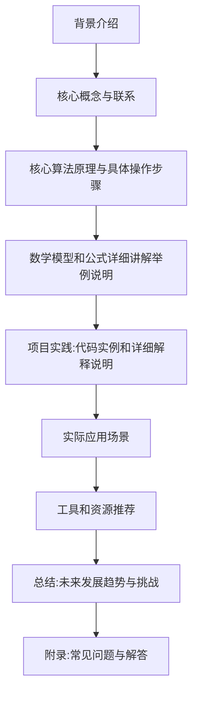

# 【LangChain编程：从入门到实践】教程用例

## 1. 背景介绍

### 1.1 问题的由来

在当今数据时代,我们面临着海量的非结构化数据,如文本、图像、视频等。如何高效地处理和利用这些数据,成为了一个巨大的挑战。传统的软件开发方式往往需要大量的人工编码,不仅效率低下,而且难以适应不断变化的需求。因此,我们迫切需要一种新的编程范式,能够更加智能、灵活地处理各种形式的数据。

### 1.2 研究现状

近年来,人工智能技术的飞速发展,特别是自然语言处理(NLP)和机器学习(ML)等领域的突破,为解决上述问题提供了新的思路。基于这些技术,出现了一种新的编程范式——LangChain编程。LangChain是一个Python库,旨在构建应用程序,将语言模型(LLM)与其他工具和数据源相结合,实现智能化的数据处理和任务自动化。

### 1.3 研究意义

LangChain编程具有以下重要意义:

1. **提高开发效率**:通过利用LLM的自然语言理解和生成能力,开发人员可以更加高效地完成各种任务,如数据处理、文本生成、问答系统等。

2. **降低开发门槛**:LangChain提供了简单易用的API,开发人员无需深入了解底层机器学习模型的细节,即可快速构建智能应用程序。

3. **增强系统灵活性**:LangChain支持将多种工具和数据源无缝集成,使系统能够灵活适应不同的需求和场景。

4. **促进人工智能民主化**:LangChain降低了人工智能技术的应用门槛,使更多的开发者和企业能够受益于人工智能带来的创新。

### 1.4 本文结构

本文将全面介绍LangChain编程的核心概念、算法原理、数学模型、项目实践、应用场景、工具资源等内容,旨在为读者提供一个全面而深入的LangChain编程学习指南。文章结构如下:

## 2. 核心概念与联系

LangChain编程涉及多个核心概念,它们相互关联,构成了一个完整的框架。下面我们将逐一介绍这些概念及其联系。

### 2.1 语言模型(Language Model, LLM)

语言模型是LangChain编程的核心,它是一种基于深度学习的自然语言处理模型,能够理解和生成人类语言。常见的语言模型包括GPT-3、BERT、XLNet等。LangChain支持集成多种语言模型,开发者可以根据需求选择合适的模型。

### 2.2 代理(Agent)

代理是LangChain中的一个重要概念,它充当了人与语言模型之间的中介。代理接收用户的自然语言指令,将其转换为语言模型可以理解的形式,然后将语言模型的输出转换为可执行的操作。代理还可以根据需要调用其他工具和数据源,实现更加复杂的任务。

### 2.3 工具(Tool)

工具是LangChain中的一个抽象概念,它可以代表任何可执行的函数或API。工具可以是搜索引擎、数据库、文件系统等,也可以是自定义的函数。代理可以根据需要调用不同的工具,完成特定的任务。

### 2.4 内存(Memory)

内存是LangChain中用于存储上下文信息的组件。在执行复杂任务时,代理可能需要记住之前的状态和结果,以便进行下一步操作。内存可以是简单的字符串缓存,也可以是更加复杂的向量数据库。

### 2.5 链(Chain)

链是LangChain中用于组合多个组件的概念。例如,我们可以将语言模型、代理、工具和内存组合成一个链,实现特定的功能。链提供了一种模块化和可组合的方式,使得开发者可以更加灵活地构建应用程序。

这些核心概念相互关联,共同构成了LangChain编程的基础框架。下面我们将详细介绍其中的核心算法原理和数学模型。

## 3. 核心算法原理与具体操作步骤

### 3.1 算法原理概述

LangChain编程的核心算法是基于一种称为"构成性搜索"(Constitutive Search)的范式。构成性搜索是一种新的人工智能范式,它将语言模型与其他工具和数据源结合起来,实现智能化的任务执行。

构成性搜索的基本思想是:语言模型作为一个"思考引擎",根据输入的任务描述,生成一系列操作步骤。这些操作步骤可能涉及调用其他工具(如搜索引擎、数据库等)或执行特定的函数。执行结果会反馈给语言模型,语言模型根据这些结果继续生成新的操作步骤,直到完成整个任务。

这种算法范式具有以下优点:

1. **灵活性**:可以根据需求无缝集成各种工具和数据源,实现复杂的任务自动化。
2. **可解释性**:生成的操作步骤是可解释的,开发者可以理解系统的决策过程。
3. **可扩展性**:可以通过添加新的工具和数据源,不断扩展系统的功能。
4. **高效性**:利用语言模型的能力,可以更加高效地完成任务,减少人工编码的工作量。

下面我们将详细介绍构成性搜索算法的具体操作步骤。

### 3.2 算法步骤详解

构成性搜索算法的主要步骤如下:

1. **任务描述**:用户使用自然语言描述需要执行的任务。

2. **任务理解**:语言模型对任务描述进行理解,生成一个初始的操作步骤序列。

3. **操作执行**:代理按照语言模型生成的操作步骤序列,调用相应的工具或函数执行操作。

4. **结果反馈**:操作执行的结果会反馈给语言模型。

5. **迭代优化**:语言模型根据反馈的结果,调整或生成新的操作步骤序列,直到完成整个任务。

6. **输出结果**:最终的任务执行结果会以自然语言的形式输出给用户。

在整个过程中,语言模型扮演了一个关键的角色,它不仅理解任务描述,还根据中间结果生成新的操作步骤,指导整个任务的执行。代理则负责调用相应的工具和函数,执行具体的操作。

下面我们用一个简单的示例来说明算法的执行过程。

**示例:查找某个城市的天气信息**

1. 用户输入:"请查找北京今天的天气情况"。

2. 语言模型理解任务描述,生成初始操作步骤序列:"1) 调用天气API 2) 输入城市名'北京' 3) 获取今天的天气数据 4) 输出天气信息"。

3. 代理按照操作步骤,调用天气API,输入"北京",获取今天的天气数据。

4. 天气数据反馈给语言模型。

5. 语言模型生成最终输出:"北京今天的天气是晴朗,最高温度25摄氏度,最低温度15摄氏度。"

6. 输出结果给用户。

通过这个示例,我们可以看到构成性搜索算法如何将语言模型与其他工具(如天气API)结合,完成特定的任务。算法的核心在于语言模型生成的操作步骤序列,它指导了整个任务的执行过程。

### 3.3 算法优缺点

构成性搜索算法具有以下优点:

1. **灵活性强**:可以无缝集成各种工具和数据源,应对复杂的任务场景。
2. **可解释性好**:生成的操作步骤序列是可解释的,有利于理解系统的决策过程。
3. **可扩展性高**:可以通过添加新的工具和数据源,不断扩展系统的功能。
4. **高效性**:利用语言模型的能力,可以减少人工编码的工作量,提高开发效率。

但同时,该算法也存在一些缺点和挑战:

1. **依赖语言模型质量**:算法的性能在很大程度上依赖于语言模型的质量,如果语言模型存在偏差或错误,会影响整个系统的表现。
2. **操作步骤生成质量**:语言模型生成的操作步骤序列可能存在错误或不完整的情况,需要进一步优化和改进。
3. **上下文理解能力**:算法需要更好地理解任务的上下文和背景知识,以生成更加准确的操作步骤。
4. **鲁棒性**:算法需要具有更强的鲁棒性,能够处理异常情况和意外输入。

总的来说,构成性搜索算法为智能任务自动化提供了一种新的思路,但仍需要在多个方面进行改进和优化,以提高其性能和可靠性。

### 3.4 算法应用领域

构成性搜索算法可以应用于多个领域,包括但不限于:

1. **自动化任务执行**:可以用于自动化各种任务,如数据处理、文本生成、问答系统等。
2. **智能助手**:可以构建智能助手系统,帮助用户完成各种任务,如信息查询、日程安排等。
3. **决策支持系统**:可以用于构建决策支持系统,为决策者提供建议和分析结果。
4. **教育领域**:可以用于构建智能教学系统,根据学生的需求提供个性化的学习资源和指导。
5. **科研领域**:可以用于辅助科研工作,如文献检索、数据分析、实验设计等。

总的来说,构成性搜索算法为人工智能系统的开发提供了一种新的范式,具有广阔的应用前景。随着算法的不断改进和优化,它在更多领域将发挥重要作用。

## 4. 数学模型和公式详细讲解举例说明

### 4.1 数学模型构建

构成性搜索算法的核心是语言模型生成操作步骤序列的过程。为了更好地理解和优化这一过程,我们需要构建相应的数学模型。

假设我们有一个任务描述 $x$,目标是生成一个操作步骤序列 $y = (y_1, y_2, \dots, y_n)$,其中每个 $y_i$ 表示一个操作步骤。我们可以将这个过程建模为一个条件概率模型:

$$P(y|x) = \prod_{i=1}^{n} P(y_i|y_{<i}, x)$$

其中 $y_{<i}$ 表示操作步骤序列中位于 $y_i$ 之前的所有步骤。该模型的目标是最大化给定任务描述 $x$ 时,生成操作步骤序列 $y$ 的条件概率。

在实践中,我们通常使用基于transformer的语言模型(如GPT-3)来估计上述条件概率。语言模型会根据输入的任务描述 $x$ 和已生成的操作步骤 $y_{<i}$,预测下一个操作步骤 $y_i$ 的概率分布。然后,我们可以从该概率分布中采样或选择概率最大的操作步骤作为输出。

为了提高模型的性能,我们可以在训练语言模型时,使用包含任务描述和对应操作步骤序列的数据集进行监督学习。通过最大化训练数据的条件概率,语言模型可以学习到生成正确操作步骤序列的能力。

### 4.2 公式推导过程

下面我们将推导构成性搜索算法中使用的数学模型公式。

首先,我们定义一个概率模型,用于估计给定任务描述 $x$ 时,生成操作步