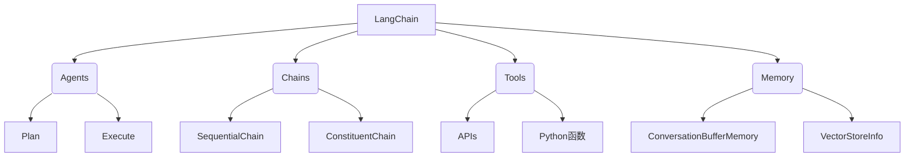

# 【LangChain编程：从入门到实践】方案说明

## 1. 背景介绍

### 1.1 问题的由来

在当今快速发展的技术时代，人工智能(AI)和自然语言处理(NLP)已经渗透到各个领域,成为推动创新和提高效率的关键驱动力。然而,构建复杂的AI系统并将其集成到现有工作流程中仍然是一个巨大的挑战,需要大量的编码工作和对多种技术的深入理解。

LangChain旨在简化这一过程,为开发人员提供一个强大而灵活的框架,用于快速构建基于AI的应用程序。它将各种AI模型(如GPT、BERT等)与外部数据源(如文档、API等)无缝集成,并提供了一系列工具和抽象层,使开发人员能够专注于应用程序逻辑,而不必过多关注底层技术细节。

### 1.2 研究现状

虽然LangChain是一个相对新兴的框架,但它已经在开源社区中获得了广泛关注和采用。越来越多的开发人员和研究人员开始探索LangChain在各种场景下的应用,例如:

- **自动化任务**: 利用LangChain构建智能助手,自动化日常任务,如电子邮件分类、日程安排等。
- **问答系统**: 将LangChain与知识库相结合,构建强大的问答系统,为用户提供准确、相关的答复。
- **文本分析**: 使用LangChain处理和分析大量文本数据,提取有价值的见解和信息。
- **代码生成**: 探索LangChain在代码生成和自动化编程方面的应用潜力。

然而,尽管LangChain提供了强大的功能,但对于初学者来说,掌握它并将其应用于实际项目仍然是一个挑战。缺乏全面的教程和最佳实践指南,使得许多开发人员难以充分利用LangChain的潜力。

### 1.3 研究意义

本文旨在为读者提供一个全面的LangChain入门指南,涵盖从基础概念到高级用例的各个方面。通过深入探讨LangChain的核心原理、算法和实现细节,读者将能够掌握构建智能应用程序所需的关键技能和知识。

此外,本文还将介绍LangChain在各种实际场景中的应用,包括自动化任务、问答系统、文本分析等,并提供详细的代码示例和最佳实践建议。这不仅有助于读者加深对LangChain的理解,而且还能启发他们探索新的应用场景和创新解决方案。

最后,本文将探讨LangChain的未来发展趋势和面临的挑战,为读者提供一个前瞻性的视角,帮助他们做好准备,抓住未来的机遇。

### 1.4 本文结构

本文将按照以下结构进行组织:

1. **背景介绍**: 阐述LangChain的由来、研究现状和意义。
2. **核心概念与联系**: 介绍LangChain的核心概念,如代理、链、工具等,并探讨它们之间的关系。
3. **核心算法原理与具体操作步骤**: 深入解释LangChain背后的核心算法原理,并详细介绍其实现过程。
4. **数学模型和公式详细讲解与举例说明**: 探讨LangChain中使用的数学模型和公式,并通过实例说明其应用。
5. **项目实践:代码实例和详细解释说明**: 提供完整的代码示例,涵盖从环境搭建到代码实现和结果分析的全过程。
6. **实际应用场景**: 介绍LangChain在自动化任务、问答系统、文本分析等领域的实际应用案例。
7. **工具和资源推荐**: 推荐有用的学习资源、开发工具、相关论文和其他资源,帮助读者进一步扩展知识。
8. **总结:未来发展趋势与挑战**: 总结LangChain的研究成果,探讨未来发展趋势和面临的挑战,并对未来研究方向进行展望。
9. **附录:常见问题与解答**: 解答一些常见的问题,帮助读者更好地理解和应用LangChain。

通过全面而深入的介绍,本文旨在为读者提供一个坚实的基础,帮助他们掌握LangChain编程,并激发他们探索AI在各个领域的创新应用。

## 2. 核心概念与联系

在深入探讨LangChain的核心算法和实现细节之前,让我们先了解一些基本的概念和术语。LangChain提供了一种模块化的方法来构建基于AI的应用程序,其核心组件包括代理(Agents)、链(Chains)、工具(Tools)、内存(Memory)等。

### 2.1 代理 (Agents)

代理是LangChain中的核心概念之一,它充当智能系统的大脑,负责规划和执行任务。代理接收用户的输入,分析任务需求,制定执行计划,并调用相关的链、工具和内存来完成任务。

代理的工作流程通常包括以下两个主要步骤:

1. **Plan**: 代理分析任务需求,制定执行计划。这可能涉及将任务分解为多个子任务,并确定每个子任务所需的工具和数据源。
2. **Execute**: 代理执行计划中的每个步骤,调用相关的链、工具和内存来完成子任务。它可能需要多次迭代,直到完成整个任务。

LangChain提供了多种预定义的代理,如`ZeroShotAgent`、`ConversationalAgent`等,并支持自定义代理以满足特定需求。

### 2.2 链 (Chains)

链是LangChain中的另一个核心概念,它将多个组件(如代理、工具、内存等)连接在一起,形成一个有序的执行流程。链可以是顺序的(SequentialChain)或者是并行的(ConstituentChain),具体取决于任务的需求。

顺序链按照预定义的顺序执行一系列步骤,每个步骤的输出将作为下一步骤的输入。并行链则允许同时执行多个子任务,最终将各个子任务的结果合并为最终输出。

通过链的概念,LangChain使得构建复杂的AI应用程序变得更加模块化和可组合,从而提高了代码的可读性和可维护性。

### 2.3 工具 (Tools)

工具是LangChain中用于执行特定任务的组件。它们可以是外部API、Python函数或任何其他可执行的代码片段。工具通常被代理或链调用,以完成诸如数据检索、计算、文本处理等特定任务。

LangChain提供了一系列预定义的工具,如Wikipedia API、Google搜索等,同时也支持开发人员自定义工具以满足特定需求。通过将工具与代理和链相结合,开发人员可以构建出功能强大的AI应用程序。

### 2.4 内存 (Memory)

内存是LangChain中用于存储和管理上下文信息的组件。它允许代理或链在执行任务时记住和访问之前的状态和结果,从而提高了系统的连贯性和智能性。

LangChain支持多种内存类型,如`ConversationBufferMemory`(用于存储对话历史)、`VectorStoreInfo`(用于存储和检索向量化数据)等。开发人员可以根据应用程序的需求选择合适的内存类型,并将其与代理和链集成,以构建具有持久性和上下文感知能力的AI系统。

通过将这些核心概念结合起来,LangChain为开发人员提供了一个灵活且可扩展的框架,用于构建各种基于AI的应用程序。在接下来的章节中,我们将深入探讨LangChain的核心算法原理、数学模型、实际应用场景等,帮助读者全面掌握LangChain编程。

## 3. 核心算法原理与具体操作步骤

在上一节中,我们介绍了LangChain的核心概念,包括代理、链、工具和内存。现在,让我们深入探讨LangChain背后的核心算法原理,以及它们是如何在实践中应用的。

### 3.1 算法原理概述

LangChain的核心算法基于一种称为"构成性搜索"(Constitutive Search)的范式。构成性搜索是一种通用的问题解决方法,它将复杂的任务分解为多个子任务,并利用不同的工具和数据源来完成每个子任务。

在LangChain中,构成性搜索过程由代理(Agents)驱动。代理充当智能系统的大脑,负责规划和执行任务。它们接收用户的输入,分析任务需求,制定执行计划,并调用相关的链、工具和内存来完成任务。

构成性搜索算法的核心思想是通过迭代和反馈循环来逐步完成复杂任务。代理首先制定一个初始执行计划,然后执行该计划的第一步。根据第一步的结果,代理可能需要修改执行计划,并继续执行下一步,直到完成整个任务。

在这个过程中,代理可以利用各种工具和数据源来获取所需的信息和功能。例如,它可以使用Wikipedia API获取背景知识,使用Python函数执行数学计算,或者查询向量存储以检索相关文档。

此外,代理还可以利用内存组件来记录和访问执行过程中的上下文信息,从而提高系统的连贯性和智能性。

### 3.2 算法步骤详解

现在,让我们更详细地了解构成性搜索算法在LangChain中是如何实现的。以下是算法的主要步骤:

1. **任务分析**: 代理首先分析用户的输入,理解任务需求。这可能涉及自然语言处理技术,如语义分析、意图识别等。

2. **计划生成**: 根据任务需求,代理制定一个初始执行计划。这个计划可能包括多个子任务,每个子任务都需要调用特定的工具或数据源。

3. **子任务执行**: 代理执行计划中的第一个子任务,调用相关的链、工具和内存。子任务的输出将作为下一步的输入。

4. **结果评估**: 代理评估子任务的输出,判断是否满足任务需求。如果需要,它可以修改执行计划,添加或删除子任务。

5. **迭代执行**: 重复执行步骤3和步骤4,直到完成整个任务。

6. **输出生成**: 代理将最终结果格式化为用户可读的输出,例如自然语言文本或其他适当的格式。

在整个过程中,代理可以利用各种启发式技术和策略来优化执行计划,例如:

- **工具选择**: 根据任务需求和可用资源,选择最合适的工具来执行每个子任务。
- **任务分解**: 将复杂的任务分解为多个更简单的子任务,以便更有效地利用工具和资源。
- **上下文利用**: 利用内存组件记录和访问执行过程中的上下文信息,提高系统的连贯性和智能性。
- **反馈学习**: 根据执行结果和用户反馈,不断优化执行策略和计划。

通过这种灵活和可扩展的方法,LangChain能够解决各种复杂的任务,从简单的问答到复杂的数据分析和决策支持。

### 3.3 算法优缺点

构成性搜索算法在LangChain中具有以下优点:

- **模块化和可组合**: 通过将任务分解为多个子任务,并利用不同的工具和数据源来完成每个子任务,算法具有很强的模块化和可组合性。这使得开发人员可以灵活地构建和扩展AI应用程序。

- **可扩展性**: 算法可以轻松地集成新的工具和数据源,从而扩展系统的功能和知识库。

- **上下文感知**: 通过利用内存组件,算法可以记录和访问执行过程中的上下文信息,提高系统的