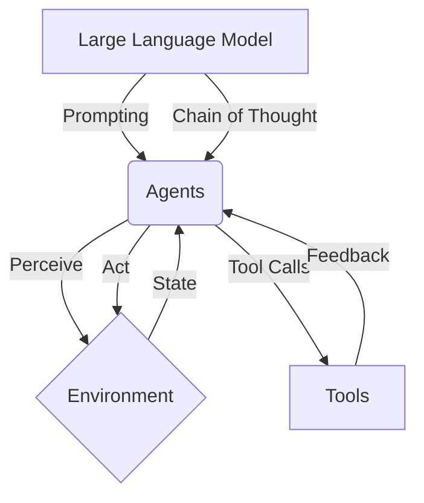

# 【大模型应用开发 动手做AI Agent】MetaGPT简介

## 1. 背景介绍
### 1.1 问题的由来
随着人工智能技术的飞速发展,特别是以ChatGPT为代表的大语言模型(LLM)的出现,AI正在以前所未有的速度影响和改变着人类社会的方方面面。然而,如何利用好这些强大的AI模型,将其转化为真正有价值、可落地的应用,是摆在众多开发者面前的一大难题。

### 1.2 研究现状
目前,业界已经出现了一些利用LLM进行应用开发的框架和工具,如 Langchain、AutoGPT、BabyAGI等。它们在一定程度上降低了开发门槛,但仍然存在一些局限性,比如可扩展性不强、缺乏灵活的调优手段等。因此,亟需一个更加强大、灵活的开发框架。

### 1.3 研究意义 
MetaGPT的出现为解决上述问题提供了新的思路。它是一个专为大模型应用开发设计的开源框架,旨在帮助开发者更高效、低成本地构建基于LLM的AI应用,推动人工智能技术在各行各业的落地应用。研究MetaGPT对于推进AI民主化进程、加速产业智能化转型具有重要意义。

### 1.4 本文结构
本文将从以下几个方面对MetaGPT进行全面介绍:

1. MetaGPT的核心概念与工作原理
2. MetaGPT的系统架构与主要组件
3. 基于MetaGPT进行应用开发的核心算法与操作步骤
4. MetaGPT背后的数学模型与公式推导
5. MetaGPT的代码实现与详细解读
6. MetaGPT的实际应用场景与案例分析 
7. MetaGPT生态中的各类学习资源与开发工具
8. MetaGPT未来的发展趋势、面临的挑战及展望

## 2. 核心概念与联系

MetaGPT的核心理念是将大语言模型(LLM)与Prompt工程、Agents结合,赋予LLM更强的认知与执行能力,使其能够完成更加复杂的任务。其中涉及的几个关键概念包括:

- 大语言模型(LLM):以Transformer为基础架构,在海量文本数据上训练得到的语言模型,具备强大的自然语言理解与生成能力,代表模型有GPT-3、PaLM等。

- Prompt(提示):一段包含任务指令、背景知识、输入数据等信息的文本,用于引导LLM进行特定任务的执行。设计优质的Prompt是发挥LLM能力的关键。

- Agent(智能体):一个可以感知环境、执行动作、完成目标的自主实体。将LLM与Agent结合,可以创造出更加智能、自主的AI系统。

- Tools(工具):Agent执行任务时可调用的外部函数或接口,如网络搜索、数据库查询、第三方API等,用于拓展Agent的认知与执行能力。

- Chain of Thought(思维链):一种Prompt优化技术,通过引导LLM逐步推理、解释其决策过程,可以提升应对复杂任务的能力。

下图展示了MetaGPT中这些核心概念之间的关系:



MetaGPT以LLM为核心,通过Prompt引导LLM构建具备认知、决策、执行能力的Agent。Agent可以感知环境状态,调用各类Tool与外部世界交互,并根据获取的反馈信息不断更新自身的认知与行为策略。同时,MetaGPT还应用了Chain of Thought等Prompt优化技术,进一步增强了Agent应对复杂任务的能力。

## 3. 核心算法原理 & 具体操作步骤
### 3.1 算法原理概述
MetaGPT的核心算法可以概括为基于LLM的认知推理与决策执行循环。具体来说,它采用了以下几个关键技术:

1. 基于Prompt的任务描述与环境建模
2. 基于LLM的Agent认知推理
3. 基于工具调用的环境交互
4. 基于反馈学习的策略优化

这些技术环环相扣,共同构成了MetaGPT的核心算法流程。下面将对每个环节进行更加详细的说明。

### 3.2 算法步骤详解

#### Step1:任务描述与环境建模
首先需要将待执行的任务转化为一段结构化的Prompt,描述任务目标、环境状态、可用操作等信息。Prompt的设计要遵循一定的范式,包含以下几个关键要素:

- 任务目标:明确、具体的任务诉求,如"帮我订一张从北京到上海的机票"
- 环境状态:与任务相关的各类背景信息,如当前日期、出行时间、预算等
- 可用操作:Agent可执行的动作空间,如网络搜索、数据库查询、第三方API调用等
- 格式要求:对Agent返回结果的格式进行规定,如JSON、XML等

举个例子:
```
任务目标:帮我订一张从北京到上海的机票
环境状态:
- 当前日期:2023年6月20日
- 出行日期:2023年7月1日
- 出行时间:不限
- 舱位等级:经济舱
- 预算:1000元以内
可用操作:
- 网络搜索:百度、Google等搜索引擎
- 数据库查询:航班信息数据库
- API调用:携程、飞猪等机票预订平台的API接口
格式要求:
{
  "航班号":"CA1234",
  "起飞时间":"2023-07-01 08:00",
  "到达时间":"2023-07-01 10:00",
  "舱位等级":"经济舱",
  "价格":800
}
```

#### Step2:Agent认知推理
将构建好的任务Prompt输入LLM,启动Agent的认知推理过程。LLM会根据Prompt中的信息,结合其所学习到的海量知识,对任务进行分解、规划、决策,输出一系列思维步骤及对应的操作指令。

以订机票为例,LLM可能会生成如下的思维链:

```
思考:订机票需要考虑的因素有:日期、时间、舱位、价格等,需要在多个平台进行比价和选择。
- 步骤1:在携程、飞猪等平台搜索北京到上海的航班信息,筛选出7月1日的航班
- 步骤2:根据舱位等级和价格区间进一步筛选,选出候选航班
- 步骤3:比较不同航班的起飞时间、到达时间、机型、服务等,选出最优选项
- 步骤4:调用对应平台的API接口,传入选定的航班信息,完成订票
```

#### Step3:环境交互
根据Agent生成的操作指令,MetaGPT会调用对应的Tool与外部环境进行交互,如进行网络搜索、数据库查询、API调用等,并将返回的结果回传给Agent。

以订机票为例,MetaGPT会执行以下操作:

1. 调用携程、飞猪的航班搜索API,检索北京到上海的航班信息
2. 调用数据库查询接口,获取不同航班的起飞时间、到达时间、价格等信息
3. 调用携程的机票预订API,传入选定的航班信息,完成订票

每一步操作返回的数据,都会作为新的观察信息,输入到LLM中,供Agent进行下一步决策。

#### Step4:策略优化
Agent在执行任务的过程中,会不断地获得新的观察信息和反馈信号,用于对自身的认知和决策进行优化调整,提升任务完成的效率和质量。

主要的策略优化技术包括:

- 基于反馈的策略学习:根据每个操作的执行结果(如订票成功还是失败),调整Agent的行为策略,加强正确操作的权重,削弱错误操作的权重。
- 基于上下文的认知更新:将新观察到的信息持续输入LLM,动态地扩充Agent的知识和语境,使其能够对环境变化做出及时反应。
- 基于目标的行为规划:根据任务的最终目标,对Agent的决策过程进行宏观引导和优化,避免其过度关注局部收益而忽略全局。

通过策略优化,MetaGPT可以不断提升Agent的性能表现,使其能够更高效、准确地完成各类任务。

### 3.3 算法优缺点
MetaGPT算法的主要优点包括:

- 强大的语言理解与生成能力:得益于LLM的加持,MetaGPT可以处理复杂的自然语言交互,具备类人的认知推理能力。
- 灵活的环境建模与交互:通过Prompt引入环境信息,并使用工具实现外部交互,MetaGPT可以适应各种应用场景。
- 连续的策略学习与优化:Agent可以通过不断与环境交互获得反馈,持续优化自身的认知和决策。

但MetaGPT也存在一些局限性,例如:

- 对LLM性能的依赖:MetaGPT的表现很大程度上取决于底层LLM的能力,而当前的LLM在常识推理、因果理解等方面还存在欠缺。
- 对Prompt质量的敏感:设计优质的Prompt需要一定的经验和技巧,Prompt的好坏直接影响Agent的行为表现。
- 可解释性和可控性有待提高:Agent的决策过程缺乏透明度,难以对其行为进行精细控制和纠正。

### 3.4 算法应用领域
得益于其灵活性和通用性,MetaGPT可以应用于多个领域,包括但不限于:

- 智能客服:通过Agent与用户进行多轮对话交互,解答问题、提供服务。
- 智能助手:协助用户完成日程管理、信息检索、工作流自动化等任务。
- 知识问答:根据海量知识库进行问题理解和推理,给出准确的答案。
- 数据分析:自动执行数据处理、分析、可视化等任务,生成洞见报告。

未来,随着MetaGPT的不断发展和完善,其有望在更多领域发挥重要作用,推动人工智能行业的进步。

## 4. 数学模型和公式 & 详细讲解 & 举例说明
### 4.1 数学模型构建
MetaGPT背后的数学模型可以用一个马尔可夫决策过程(MDP)来描述。MDP由以下几个要素组成:

- 状态空间 $\mathcal{S}$:表示Agent所处的环境状态集合。
- 行为空间 $\mathcal{A}$:表示Agent可执行的动作集合。
- 状态转移函数 $\mathcal{P}$:表示在状态 $s$ 下执行行为 $a$ 后,环境转移到状态 $s'$ 的概率。形式化定义为 $P(s'|s,a)$。
- 奖励函数 $\mathcal{R}$:表示Agent执行动作后,环境返回的即时奖励。形式化定义为 $R(s,a)$。 
- 折扣因子 $\gamma$:表示未来奖励的衰减率,取值范围为 $[0,1]$。

Agent的目标是学习一个最优策略 $\pi^*$,使得在该策略下,Agent能够获得最大的期望累积奖励,即:

$$\pi^* = \arg\max_{\pi} \mathbb{E}\left[\sum_{t=0}^{\infty} \gamma^t R(s_t,a_t)\right]$$

其中,$s_t$ 和 $a_t$ 分别表示 $t$ 时刻Agent所处的状态和执行的动作。

### 4.2 公式推导过程
为了求解最优策略 $\pi^*$,我们引入价值函数 $V^{\pi}(s)$ 和动作价值函数 $Q^{\pi}(s,a)$ 的概念。

- 价值函数 $V^{\pi}(s)$ 表示从状态 $s$ 开始,遵循策略 $\pi$ 的期望累积奖励:

$$V^{\pi}(s) = \mathbb{E}\left[\sum_{t=0}^{\infty} \gamma^t R(s_t,a_t)|s_0=s,\pi\