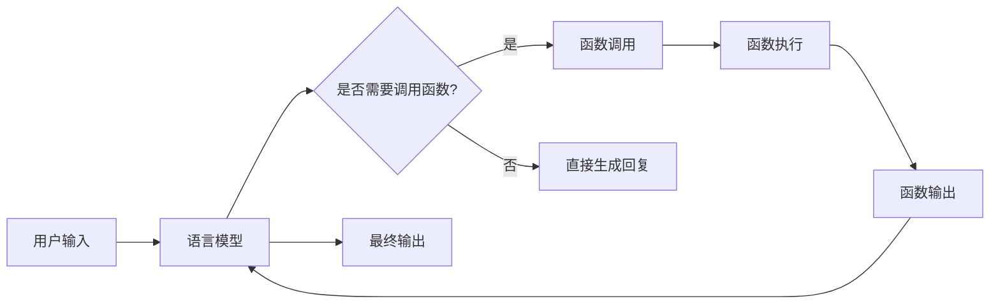

# 【大模型应用开发 动手做AI Agent】OpenAI中的Functions

## 1. 背景介绍
### 1.1 问题的由来
随着人工智能技术的飞速发展,大语言模型(Large Language Models, LLMs)在自然语言处理和理解方面展现出了惊人的能力。OpenAI作为该领域的领军企业,推出了一系列革命性的语言模型如GPT系列,极大地推动了自然语言AI的进步。然而,大模型虽然在通用智能上取得了长足进展,但在特定领域知识和任务的处理上仍然存在局限性。为了进一步提升大模型的应用能力,OpenAI在其API中引入了Functions功能,允许开发者将特定功能和知识灌输给AI模型,实现更加智能化的人机交互和任务处理。这为大模型的应用开发开辟了广阔的前景。

### 1.2 研究现状
目前,业界对于大模型应用开发的研究主要集中在提示工程(Prompt Engineering)、few-shot learning、知识蒸馏等方面,旨在通过优化输入提示、少样本学习、模型蒸馏等技术提升大模型在下游任务中的表现。而OpenAI Functions的推出,为大模型应用开发提供了一种新的思路。通过Functions,开发者可以将特定功能封装成API,供大模型调用,实现更加灵活和个性化的人工智能应用。这种模式在智能助手、客服机器人、教育培训等领域展现出了广阔的应用前景。

### 1.3 研究意义
深入研究OpenAI中Functions的应用开发,对于推动大模型技术在实际场景中的落地具有重要意义:

1. 拓展大模型的应用边界,实现领域知识和通用智能的融合,提升模型在垂直领域的适用性。
2. 为开发者提供更加灵活和强大的人工智能开发框架,降低应用构建门槛,加速AI产品的开发和迭代。 
3. 推动人机交互体验的升级,通过函数插件实现更加智能化和个性化的对话交互。
4. 探索大模型技术和传统软件工程的结合,为未来的人工智能系统架构设计提供新的思路和实践。

### 1.4 本文结构
本文将围绕OpenAI Functions的核心概念、工作原理、开发实践等方面展开深入探讨,内容涵盖:

- Functions的核心概念和工作机制
- 如何使用Functions构建定制化AI应用
- 案例分析:基于Functions的智能助手开发
- Functions的局限性和未来展望

通过系统性的讲解和实践,帮助读者掌握利用OpenAI Functions进行大模型应用开发的关键技术和方法。

## 2. 核心概念与联系
OpenAI Functions的核心理念是允许开发者将特定功能封装成API,供大语言模型在执行任务时调用,从而实现通用智能和领域知识的融合。其关键概念包括:

- 函数(Function):封装了特定功能的代码片段,可以被语言模型调用执行。函数的输入输出与自然语言对齐,易于理解和使用。
- 函数调用(Function Call):语言模型根据用户输入和上下文,动态决定是否调用特定函数,并将结果整合到最终的输出中。
- 函数注册(Function Registry):开发者需要将编写好的函数注册到OpenAI平台,以供语言模型调用。注册过程包括函数签名、输入输出格式等元信息的定义。
- 语境理解(Context Understanding):语言模型需要根据当前对话状态和用户意图,判断是否需要调用函数,以及调用哪些函数。这需要模型具备较强的语境理解能力。

下图展示了OpenAI Functions的整体工作流程:

用户的自然语言输入首先被语言模型接收和理解。模型根据当前语境判断是否需要调用特定函数协助任务完成。如果需要,则调用相应函数并获取执行结果,再将函数输出整合到模型生成的最终回复中。如果不需要调用函数,则直接由语言模型生成回复。通过这种方式,Functions使得大模型可以调用外部代码实现更加复杂和个性化的功能,提升了模型的适用性和表现力。

## 3. 核心算法原理 & 具体操作步骤
### 3.1 算法原理概述
OpenAI Functions的核心算法可以概括为基于语境的动态函数调用。其基本原理是语言模型在生成回复的过程中,根据当前对话状态和用户意图,动态地决定是否调用特定函数,并将函数执行结果整合到最终输出中。这一过程涉及以下关键技术:

- 语境编码(Context Encoding):将对话历史、用户输入等信息编码为语言模型可以理解的向量表示,为后续的函数调用决策提供依据。
- 函数匹配(Function Matching):基于语境向量和函数签名,计算用户意图与候选函数之间的相关性,选择最相关的函数进行调用。
- 函数执行(Function Execution):调用选定的函数,并将函数执行结果进行处理和转换,以便语言模型可以将其整合到最终生成的回复中。
- 信息融合(Information Fusion):将函数执行结果与语言模型生成的文本进行融合,形成连贯、自然的最终输出。这需要考虑函数输出的格式、语义等因素。

### 3.2 算法步骤详解
1. 语境编码:
   - 将对话历史、用户当前输入等信息拼接成一个完整的上下文。
   - 使用预训练的语言模型(如GPT)对上下文进行编码,得到语境向量。
2. 函数匹配:
   - 遍历所有注册的函数,计算每个函数签名与语境向量之间的相似度(如点积、余弦相似度等)。
   - 选择相似度最高的函数作为候选函数。
   - 根据设定的阈值判断候选函数的相关性是否足够高,如果是则进行调用,否则跳过函数调用。
3. 函数执行:
   - 将用户输入传递给选定的函数,执行函数逻辑。
   - 对函数返回的结果进行处理,转换为语言模型可以接受的格式(如将JSON转换为自然语言描述)。
4. 信息融合:
   - 将处理后的函数输出与语言模型生成的文本进行拼接或插入,形成完整的回复。
   - 对融合后的文本进行后处理,如修正语法、调整语态等,以提高回复的自然性和连贯性。
5. 输出回复:
   - 将融合后的最终文本返回给用户,完成一次交互。

### 3.3 算法优缺点
OpenAI Functions的动态函数调用算法具有以下优点:
- 增强了语言模型的功能扩展性,使其可以调用外部代码执行特定任务,提升了模型的适用范围。
- 通过函数注册机制,允许开发者灵活地为模型添加定制化功能,满足不同应用场景的需求。
- 基于语境进行函数匹配和调用,使得模型可以根据对话状态动态决策,提高了交互的智能性和自然性。

同时,该算法也存在一些局限性:
- 函数匹配的准确性依赖于语境编码和相似度计算的效果,在复杂对话场景下可能出现匹配错误。
- 函数执行结果与语言模型生成文本的融合需要考虑格式、语义等因素,存在一定的技术难度。
- 函数注册和管理需要额外的工作量,对开发者有一定的技术要求。

### 3.4 算法应用领域
OpenAI Functions所采用的动态函数调用算法在以下领域具有广泛的应用前景:

- 智能客服:通过函数插件实现多轮对话、知识检索、业务处理等功能,提升客服机器人的服务能力。
- 虚拟助手:通过函数扩展实现日程管理、信息查询、设备控制等个性化功能,打造智能化的人工助手。  
- 教育培训:通过函数插件实现题库管理、知识评估、学习推荐等功能,为学习者提供智能化的教育服务。
- 金融分析:通过函数扩展实现数据处理、风险评估、投资建议等量化分析功能,赋能金融决策。

未来,随着大模型技术的不断发展和应用领域的拓展,OpenAI Functions的动态函数调用算法有望在更多场景中得到应用和优化,为人工智能应用开发带来更多可能性。

## 4. 数学模型和公式 & 详细讲解 & 举例说明
### 4.1 数学模型构建
OpenAI Functions的动态函数调用可以用以下数学模型来描述:

设语境向量为$c$,函数签名向量为$f_i$,其中$i=1,2,...,n$表示注册的函数编号。函数匹配的目标是找到与当前语境最相关的函数$f_*$:

$$
f_* = \arg\max_{f_i} \text{sim}(c, f_i)
$$

其中,$\text{sim}(c, f_i)$表示语境向量$c$与函数签名向量$f_i$之间的相似度。常见的相似度计算方法包括:

- 点积:
  $$
  \text{sim}(c, f_i) = c \cdot f_i
  $$
- 余弦相似度:
  $$
  \text{sim}(c, f_i) = \frac{c \cdot f_i}{\|c\| \|f_i\|}
  $$

函数匹配阶段得到最相关函数$f_*$后,将其与语言模型生成的文本$t$进行融合,得到最终回复$r$:

$$
r = \text{fusion}(t, f_*(c))
$$

其中,$f_*(c)$表示将语境向量$c$传入函数$f_*$执行得到的输出,$\text{fusion}(\cdot)$表示文本融合操作,如拼接、插入等。

### 4.2 公式推导过程
函数匹配公式的推导过程如下:

1. 假设语境向量$c$和函数签名向量$f_i$都是$d$维向量,即$c, f_i \in \mathbb{R}^d$。
2. 定义相似度函数$\text{sim}(c, f_i)$,用于计算两个向量之间的相关性。以余弦相似度为例:
   $$
   \begin{aligned}
   \text{sim}(c, f_i) &= \frac{c \cdot f_i}{\|c\| \|f_i\|} \\
   &= \frac{\sum_{j=1}^d c_j f_{ij}}{\sqrt{\sum_{j=1}^d c_j^2} \sqrt{\sum_{j=1}^d f_{ij}^2}}
   \end{aligned}
   $$
3. 找到与语境向量$c$最相关的函数签名向量$f_*$,即相似度最大的函数:
   $$
   f_* = \arg\max_{f_i} \text{sim}(c, f_i)
   $$
4. 将$f_*$与语言模型生成的文本$t$进行融合,得到最终回复$r$:
   $$
   r = \text{fusion}(t, f_*(c))
   $$

### 4.3 案例分析与讲解
下面以一个简单的智能助手场景为例,说明OpenAI Functions中动态函数调用的过程:

假设已注册了以下函数:
- 天气查询:$f_1(location) \rightarrow weather\_info$
- 日程安排:$f_2(date) \rightarrow schedule$
- 闹钟设置:$f_3(time) \rightarrow alarm\_info$

用户输入:"明天上海的天气如何?我需要安排一个会议。"

1. 语境编码:将用户输入编码为语境向量$c$。
2. 函数匹配:计算$c$与每个函数签名向量$f_i$的相似度:
   - $\text{sim}(c, f_1) = 0.8$
   - $\text{sim}(c, f_2) = 0.6$
   - $\text{sim}(c, f_3) = 0.2$
   选择相似度最高的函数$f_1$进行调用。