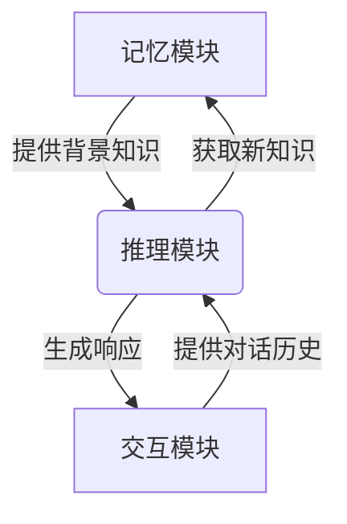

以下是根据您提供的标题和要求撰写的技术博客文章正文内容:

# 【大模型应用开发 动手做AI Agent】下一代Agent的诞生地：科研论文中的新思路

## 1. 背景介绍

### 1.1 问题的由来

随着人工智能(AI)和大型语言模型(LLM)的不断发展,智能对话系统(Conversational AI)已经成为了一个热门的研究领域。传统的基于规则或检索的对话系统已经无法满足日益复杂的需求,因此需要一种新的范式来构建更智能、更自然的对话代理(Agent)。

### 1.2 研究现状  

近年来,随着transformer等注意力机制模型的出现,以及大规模语料库的涌现,大型语言模型展现出了惊人的自然语言理解和生成能力。GPT、BERT等模型在多项自然语言处理(NLP)任务中取得了卓越的成绩。然而,这些模型仍然存在一些局限性,例如缺乏持久的记忆能力、推理能力有限、无法与外部世界交互等。

### 1.3 研究意义

为了克服上述局限性,研究人员提出了基于大模型的新一代对话代理(Agent)的概念,旨在构建一种具有持续学习、推理和交互能力的智能系统。这种新型Agent不仅能够进行自然语言交互,还能够与外部环境和知识库集成,持续获取新知识、形成新的推理和决策。它们有望在虚拟助手、智能教育、医疗健康等多个领域发挥重要作用。

### 1.4 本文结构

本文将首先介绍新型Agent的核心概念,包括记忆、推理和交互三大模块。接下来,将详细阐述其核心算法原理和数学模型。然后,通过代码实例和应用场景,展示如何开发和部署这种新型Agent。最后,探讨其未来发展趋势和面临的挑战。

## 2. 核心概念与联系

新型基于大模型的对话Agent通常由三个核心模块组成:记忆(Memory)、推理(Reasoning)和交互(Interaction)。这三个模块相互关联、相互作用,共同构建了一个智能化的对话系统。

- **记忆模块**:负责存储和管理系统所掌握的知识,包括事实知识、程序知识等。它不仅能够存储大规模的结构化和非结构化知识,还能够持续获取新知识并融入现有知识库。
- **推理模块**:基于记忆模块中的知识库,结合对话历史上下文,进行逻辑推理、决策规划等高级认知活动,生成合理的响应。
- **交互模块**:负责与用户进行自然语言对话交互,接收用户的输入,并将推理模块生成的响应呈现给用户。

这三个模块紧密协作,形成一个闭环系统。交互模块为推理模块提供对话历史上下文;推理模块基于记忆模块中的知识进行推理并生成响应;记忆模块则从交互中获取新知识,不断扩充知识库。

## 3. 核心算法原理与具体操作步骤

### 3.1 算法原理概述

新型基于大模型的对话Agent通常采用一种名为"思考-推理-修正"(Think-Reason-Revise)的算法框架。该框架由三个主要步骤组成:

1. **思考(Think)**: Agent基于当前对话历史和知识库,生成一个初步的响应草案。
2. **推理(Reason)**: Agent对初步响应进行逻辑推理和规划,生成一个更合理、更具洞见的响应。
3. **修正(Revise)**: Agent根据推理结果,修正和完善最终的响应,并将新获得的知识融入知识库。

该算法框架的核心思想是:Agent不仅仅被动地回答问题,而是主动思考、推理和学习,从而产生更加智能和有见地的响应。

### 3.2 算法步骤详解

1. **思考(Think)步骤**:
   - 输入:对话历史 $H = \{(q_1, a_1), (q_2, a_2), ..., (q_n, a_n)\}$,知识库 $K$
   - 使用大型语言模型(如GPT-3)基于当前对话历史 $H$ 和知识库 $K$ 生成一个初步响应 $r_0$
   - 输出:初步响应 $r_0$

2. **推理(Reason)步骤**:
   - 输入:初步响应 $r_0$,对话历史 $H$,知识库 $K$
   - 使用推理模型(如基于规则的推理引擎或神经符号推理模型)对 $r_0$ 进行推理:
     - 检查 $r_0$ 是否自洽、是否符合已知事实
     - 利用 $K$ 中的知识进行补充和扩展
     - 结合 $H$ 中的上下文进行规划和决策
   - 输出:改进的响应 $r_1$

3. **修正(Revise)步骤**:
   - 输入:改进的响应 $r_1$,对话历史 $H$,知识库 $K$  
   - 使用大型语言模型对 $r_1$ 进行修正和完善,生成最终响应 $r_2$
   - 从 $r_2$ 中提取新知识,并更新知识库 $K' = K \cup \text{ExtractKnowledge}(r_2)$
   - 输出:最终响应 $r_2$,更新后的知识库 $K'$

该算法的核心在于将大型语言模型的生成能力与符号推理能力相结合,充分利用两者的优势。大模型能够基于海量语料生成自然、流畅的响应;而推理模型则能够确保响应的合理性、一致性和有见地。

### 3.3 算法优缺点

**优点**:

- 结合了大型语言模型和推理模型的优势,产生更加智能、有见地的响应
- 具有持续学习能力,能够不断扩充知识库
- 模块化设计,各模块可以单独优化和替换

**缺点**:

- 算法复杂度较高,需要大量计算资源
- 推理模块的设计和构建具有一定挑战性
- 知识库的构建和管理是一个长期的系统工程

### 3.4 算法应用领域

该算法框架可以广泛应用于各种需要智能对话交互的场景,例如:

- 智能虚拟助手:提供更加自然、富有见解的对话体验
- 智能教育系统:作为智能教师或学习伴侣,提供个性化的教学和辅导
- 医疗健康领域:作为智能医疗助理,协助诊断和治疗决策
- 客户服务系统:提供更加人性化、高效的客户服务和支持
- 知识问答系统:整合多源异构知识,提供准确、全面的问答服务

## 4. 数学模型和公式详细讲解举例说明

### 4.1 数学模型构建

在新型基于大模型的对话Agent中,数学模型主要用于以下几个方面:

1. **语言模型(Language Model)**
   
   语言模型是该系统的核心部分,用于生成自然语言响应。常用的语言模型包括基于Transformer的自回归模型(如GPT)和自编码器模型(如BERT)。这些模型通过在大规模语料库上预训练,学习到语言的统计规律和语义知识。

   对于一个长度为 $n$ 的文本序列 $X = (x_1, x_2, ..., x_n)$,语言模型需要学习该序列的概率分布 $P(X)$。自回归模型将该概率分解为一个条件概率的乘积:

   $$P(X) = \prod_{t=1}^n P(x_t | x_1, x_2, ..., x_{t-1})$$

   其中每一项 $P(x_t | x_1, x_2, ..., x_{t-1})$ 表示在给定前 $t-1$ 个词的情况下,生成第 $t$ 个词的概率。通过最大化语料库上的对数似然函数,可以学习到模型参数 $\theta$:

   $$\theta^* = \arg\max_\theta \sum_{X \in \mathcal{D}} \log P_\theta(X)$$

   其中 $\mathcal{D}$ 表示训练语料库。

2. **知识表示(Knowledge Representation)**

   为了有效地存储和管理知识库中的知识,需要采用适当的知识表示方法。常见的方法包括:
   - 符号逻辑表示:使用一阶逻辑、描述逻辑等形式化语言表示事实知识和规则知识
   - 向量空间模型:将实体和关系映射到低维连续向量空间中,例如Word2Vec、TransE等
   - 图神经网络:使用图结构(如知识图谱)表示实体和关系,并使用图神经网络模型进行推理

3. **推理模型(Reasoning Model)**

   推理模型用于对初步响应进行逻辑推理、补充和规划。可以采用以下几种方法:
   - 基于规则的推理:根据预定义的推理规则,对响应进行校验和修正
   - 神经符号推理:结合神经网络和符号系统,在连续空间和离散空间中同时进行推理
   - 规划算法:基于响应和对话历史,使用经典规划算法(如STRIPS、PDDL等)进行决策规划

### 4.2 公式推导过程

以transformer的自注意力机制为例,我们来推导其核心公式。

自注意力机制的主要思想是:对于一个序列 $X = (x_1, x_2, ..., x_n)$,计算每个位置 $t$ 处的向量表示 $z_t$,不仅依赖于该位置的输入 $x_t$,还依赖于整个输入序列的所有位置,即:

$$z_t = \text{Attention}(Q_t, K, V)$$

其中 $Q_t$、$K$、$V$ 分别表示查询(Query)、键(Key)和值(Value),都是通过线性变换得到的:

$$\begin{aligned}
Q &= X W^Q\\
K &= X W^K\\
V &= X W^V
\end{aligned}$$

注意力分数 $\alpha_{t,i}$ 表示查询 $Q_t$ 对键 $K_i$ 的注意力程度,通过点积计算:

$$\alpha_{t,i} = \text{score}(Q_t, K_i) = Q_t K_i^T$$

为了使分数满足归一化的要求,我们将其通过 softmax 函数归一化:

$$\hat{\alpha}_{t,i} = \frac{\exp(\alpha_{t,i})}{\sum_{j=1}^n \exp(\alpha_{t,j})}$$

最终,注意力向量 $z_t$ 是所有值向量 $V_i$ 根据注意力分数 $\hat{\alpha}_{t,i}$ 加权求和得到的:

$$z_t = \sum_{i=1}^n \hat{\alpha}_{t,i} V_i$$

通过这种自注意力机制,每个位置的向量表示 $z_t$ 都融合了整个输入序列的信息,从而增强了模型的表示能力。

### 4.3 案例分析与讲解

现在,我们通过一个具体的案例来演示新型对话Agent是如何工作的。

假设用户向Agent提出这样一个问题:"我应该买特斯拉还是丰田的电动车?"

1. **思考(Think)步骤**

   输入对话历史和知识库,大型语言模型生成一个初步响应:

   > 特斯拉和丰田都是知名的电动车品牌,在选择时需要考虑多方面因素。特斯拉拥有领先的电池和自动驾驶技术,但价格较高;丰田的电动车价格相对亲民,但技术略逊于特斯拉。您可以根据自身的预算和需求进行权衡。

2. **推理(Reason)步骤**

   推理模型对初步响应进行分析和补充:
   - 检查响应是否自洽、是否符合已知事实
   - 从知识库中查找相关信息,例如两家公司最新的产品线、销量、评分等
   - 结合用户的个人情况(如居住地、预算、用车需求等),进行规划和决策

   经过推理后,响应被修改为:

   > 根