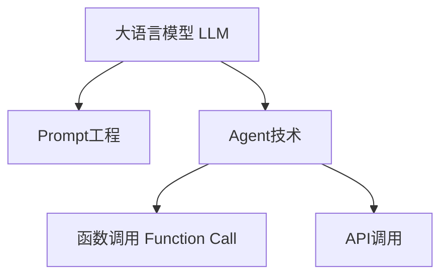
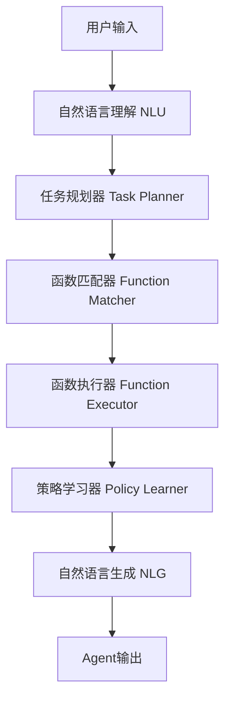

# 【大模型应用开发 动手做AI Agent】创建能使用Function的助手

作者：禅与计算机程序设计艺术 / Zen and the Art of Computer Programming

## 1. 背景介绍

### 1.1 问题的由来

随着人工智能技术的飞速发展,特别是近年来大语言模型(LLM)的突破性进展,AI助手已经开始逐步走进人们的日常生活。从苹果的Siri、微软的小冰,到近期大火的ChatGPT,智能助理正在改变着我们获取信息、解决问题的方式。然而,目前的AI助手还主要局限于对话式的交互,缺乏执行具体任务的能力。为了让AI助手能更好地辅助人类工作和生活,我们需要赋予它们调用API、执行函数等更强大的功能。这就引出了一个关键问题:如何创建一个能够使用Function的AI Agent助手?

### 1.2 研究现状

近年来,围绕大语言模型的应用研究如火如荼。许多科技巨头和研究机构都在探索如何将LLM与其他AI技术相结合,创建更加智能和实用的助手。比如Anthropic推出的Claude,就具备了接入API和工具的能力,可以帮助用户执行一些实际任务。再如DeepMind的Sparrow,则尝试通过对话引导AI进行网络搜索和信息整合。这些研究为我们提供了宝贵的思路和参考。

不过,目前将Function功能与LLM助手相结合还处于起步阶段,在工程实现和应用拓展上都有很大的探索空间。特别是如何设计合理的Agent架构、如何实现高效稳定的函数调用、如何权衡安全性和功能性等,都是函待解决的问题。

### 1.3 研究意义

研究创建能使用Function的AI助手,具有重要的理论意义和应用价值:

首先,这有助于推动认知智能和计算智能的融合发展。传统的AI助手更多是基于检索式的问答,通过语言交互实现信息传递。而集成了Function功能后,AI助手就能主动执行任务,产生实际的行为,这是迈向通用人工智能的关键一步。研究Function-enabled AI Agent,能加深我们对机器推理、规划、决策等高级智能的认识。

其次,这可以极大拓展AI助手的应用场景。目前智能助理已经在客服、教育、医疗等领域崭露头角,但若要真正发挥其潜力,单靠对话交互是远远不够的。比如一个智能医疗助手,若能够主动调用医学影像识别、药物数据库查询等API,就可以更高效、更精准地辅助医生诊疗。再如一个智能教学助手,若能根据学生的学习进度和薄弱点,自动推送个性化的习题和学习资源,就能大幅提升教学效果。种种应用场景,无不需要AI助手具备使用Function的能力。

### 1.4 本文结构

本文将重点探讨如何开发一个能使用Function的AI Agent助手。内容安排如下:

第2部分,我们将介绍Agent开发涉及的一些核心概念,如大语言模型、API调用、Prompt工程等,厘清它们之间的联系。

第3部分,我们将系统阐述实现Function-enabled AI Agent的核心算法原理,并给出详细的操作步骤,包括如何设计Agent系统架构、如何实现LLM与函数的交互等。

第4部分,我们将建立Agent的数学模型,推导出关键的计算公式,并结合具体案例进行分析讲解,帮助读者深入理解原理。

第5部分,我们将给出一个完整的代码实现示例,搭建一个简单但功能齐全的AI Agent原型系统,展示如何用代码将理论付诸实践。

第6部分,我们将畅想Function-enabled AI Agent的实际应用场景,展望其在智能客服、智慧医疗、智能教育等领域的广阔前景。

第7部分,我们将推荐一些有助于读者进一步学习和研究的相关工具、资源、论文。

第8部分,我们将总结全文的核心观点,并展望Function-enabled AI Agent未来的发展趋势和面临的挑战。

第9部分,我们将解答一些读者可能遇到的常见问题。

## 2. 核心概念与联系

在开始探讨如何创建Function-enabled AI Agent之前,我们有必要先了解一些相关的核心概念:

**大语言模型(Large Language Model,LLM)**: 这是当前AI助手的核心,本质上是一个基于海量语料训练的神经网络模型,能够生成连贯、通顺的自然语言文本。GPT、BERT、T5等都是典型的LLM。它们具有强大的语言理解和生成能力,但本身并不具备执行任务的功能。

**API调用**: 即应用程序接口(Application Programming Interface)调用。API定义了不同软件之间相互通信的规则和协议。通过API,AI助手可以访问和调用其他软件系统的功能,实现数据交换和功能扩展。常见的API包括RESTful API、GraphQL API等。

**Prompt工程**: 这是一种新兴的技术,旨在优化人类与AI助手的对话交互。通过精心设计Prompt(提示语),引导LLM生成更加符合需求的回复。Prompt工程涉及Prompt的语法、语义、格式等多个方面,可以显著提升LLM的可用性和实用性。

**Agent技术**: Agent即智能体,是一种能够感知环境、自主决策并采取行动的计算实体。将LLM与Agent技术相结合,就是要赋予语言模型主动执行任务的能力。这需要在LLM之上构建一个Agent框架,内置任务规划、策略学习等模块。

**函数调用(Function Call)**: 这是编程语言中的一个基本概念。函数是一段可重用的代码块,执行特定的操作。通过函数调用,可以在需要时执行这段代码。为AI助手集成函数调用能力,意味着它可以执行预定义的操作,如数据库查询、文件读写、API请求等,大大拓展了其应用范围。

下图展示了这些概念之间的关系:

可以看到,大语言模型是AI助手的基石,通过Prompt工程可以优化其语言交互;而Agent技术是赋予LLM行为能力的关键,其中函数调用使得Agent能执行内部操作,API调用则允许Agent与外部系统交互。这些技术的结合,最终造就了一个Function-enabled的智能Agent助手。

## 3. 核心算法原理 & 具体操作步骤

### 3.1 算法原理概述

创建Function-enabled AI Agent的核心,在于构建一个能够集成LLM和函数调用的Agent框架。这个框架需要具备以下关键能力:

1. 自然语言理解(NLU):能够准确理解用户的意图和需求。这主要依赖LLM的语言理解能力。

2. 任务规划(Task Planning):能够根据用户意图,拆解出一系列可执行的子任务。这需要一个任务规划器(Task Planner)。

3. 函数匹配(Function Matching):能够为每个子任务匹配到合适的函数进行调用。这需要一个函数库和匹配算法。 

4. 策略学习(Policy Learning):能够根据执行反馈,学习和优化任务执行的策略。这需要强化学习等算法。

5. 自然语言生成(NLG):能够将函数执行结果转化为自然语言,反馈给用户。这主要依赖LLM的文本生成能力。

下图展示了这个Agent框架的基本架构:

具体而言,当用户输入一个请求(如"帮我订一张去北京的机票"),NLU模块首先对其进行语义解析,提取出关键信息(如目的地、时间等)。然后Task Planner根据这些信息,制定一个任务执行计划(如先查询航班、再比价、再下单)。接着Function Matcher为每个子任务匹配相应的函数(如航班查询API、支付API等)。随后Function Executor调用这些函数,完成实际操作。执行过程中,Policy Learner会根据反馈(如执行成功/失败、用户评价等)来优化执行策略。最后,NLG模块将执行结果转换成自然语言(如"已为您预订好明天北京的机票,票价xxx元"),返回给用户。

### 3.2 算法步骤详解

基于上述原理,我们可以总结出实现Function-enabled AI Agent的关键步骤如下:

步骤1:搭建一个基于LLM的NLU模块,对用户输入进行意图识别和槽位提取。可以使用现成的NLU工具如Rasa、Dialogflow,或者基于BERT、GPT等模型自己训练。

步骤2:开发一个Task Planner模块,将用户意图划分为可执行的子任务。这需要预先定义一个任务本体(Task Ontology),描述不同意图可以拆解的子任务模板。Task Planner根据意图匹配模板,生成具体的子任务列表。

步骤3:构建一个Function Matcher模块,为每个子任务匹配可用的函数。这需要预先建立一个函数库,注册可被调用的函数及其输入输出接口。Function Matcher通过比较子任务和函数的输入输出,进行匹配。可以使用一些语义匹配算法,如Word2Vec等。

步骤4:封装一个通用的Function Executor模块,负责函数的实际调用。它接收函数名和参数,转发给对应的API或可执行程序,并获取返回结果。需要注意的是,要做好异常处理和超时控制,以保证执行的稳定性。

步骤5:开发一个Policy Learner模块,负责优化任务执行策略。可以使用多种强化学习算法,如Q-Learning、SARSA等。Policy Learner根据执行反馈(奖励信号),调整Task Planner生成子任务的方式,以及Function Matcher匹配函数的策略。这是一个在线学习的过程。

步骤6:搭建一个基于LLM的NLG模块,将函数执行结果转换成自然语言。可以使用现成的NLG工具如GPT-3,或者基于Transformer、LSTM等模型自己训练。需要在模型训练时,加入一些任务相关的样本,以提高生成的针对性。

步骤7:将上述各模块集成为一个完整的Agent系统。设计清晰的接口,确保各模块之间的数据流转顺畅。同时,要加入必要的日志记录和监控,以便跟踪和调试。

步骤8:在真实场景中部署和测试Agent系统,收集用户反馈,迭代优化模型和策略。要特别注意数据安全和隐私保护,以及可能的意外风险。

### 3.3 算法优缺点

上述Function-enabled AI Agent算法有以下优点:

1. 增强了语言模型的行为能力,使其能执行实际任务,大大拓展了应用场景。

2. 通过函数复用,避免了重复开发,提高了开发效率。

3. 引入了在线学习机制,使得Agent能够根据反馈不断自我优化,提高了鲁棒性。

4. 模块化设计,使得系统易于扩展和维护。

同时,该算法也存在一些局限和挑战:

1. 任务拆解和函数匹配有时会出错,导致执行失败。需要更好的任务本体和匹配算法。

2. 对于开放域的对话,很难穷尽所有可能的函数。需要引入更灵活的函数生成机制。 

3. 强化学习需要大量的训练数据和时间,实际应用中成本较高。需要更有效的策略学习算法。

4. 在敏感任务领域(如医疗、金融),函数执行可能带来风险。需要谨慎评估和控制。

### 3.4 算法应用领域

Function-enabled AI Agent技术可以应用于多个领域,典型的场景包括:

1. 智能客服:通过