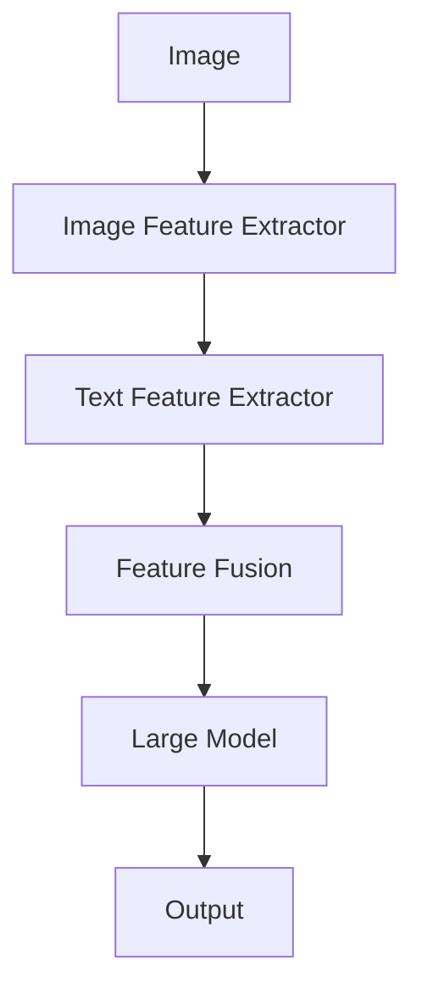

# 【大模型应用开发 动手做AI Agent】多模态能力

作者：禅与计算机程序设计艺术 / Zen and the Art of Computer Programming 

## 关键词：多模态学习，AI Agent，大模型，自然语言处理，计算机视觉

## 1. 背景介绍

### 1.1 问题的由来

随着人工智能技术的快速发展，多模态学习（Multimodal Learning）逐渐成为研究热点。多模态学习是指将不同类型的数据，如图像、文本、音频等，进行整合和分析，以实现更全面、更深入的理解和推理。在AI Agent领域，多模态能力成为构建更加智能、适应能力更强的智能体的关键。

### 1.2 研究现状

近年来，多模态学习取得了显著的进展。研究者们提出了许多多模态学习模型，如联合模型、多任务学习、自监督学习等。然而，如何有效地融合不同模态的信息，提高多模态模型的性能，仍然是当前研究的热点问题。

### 1.3 研究意义

多模态能力的AI Agent在现实世界的应用前景广阔，如智能客服、自动驾驶、虚拟现实等。研究多模态能力对于推动人工智能技术的发展具有重要意义。

### 1.4 本文结构

本文将首先介绍多模态学习的基本概念和常用方法，然后介绍如何利用大模型实现多模态能力，最后通过项目实践展示多模态AI Agent在实际应用中的效果。

## 2. 核心概念与联系

### 2.1 多模态学习

多模态学习是指将不同类型的数据进行整合和分析，以实现更全面、更深入的理解和推理。常见的多模态数据包括：

- **视觉模态**：图像、视频等。
- **文本模态**：文本、语音等。
- **听觉模态**：音频、音乐等。
- **其他模态**：温度、湿度、光照等。

### 2.2 AI Agent

AI Agent是指能够感知环境、自主决策并采取行动的智能体。在实际应用中，AI Agent需要具备多模态感知能力，以便更好地理解环境、进行决策和行动。

### 2.3 大模型

大模型是指具有海量参数和强大学习能力的人工神经网络模型。大模型在自然语言处理、计算机视觉等领域取得了显著的成果，为多模态学习提供了有力支持。

## 3. 核心算法原理 & 具体操作步骤

### 3.1 算法原理概述

多模态学习的核心是融合不同模态的数据，并利用大模型进行学习和推理。以下是一些常用的多模态学习算法：

- **联合模型**：将不同模态的数据直接连接，形成单一的表示。
- **多任务学习**：对多个任务进行联合学习，共享特征表示。
- **自监督学习**：利用无标注数据进行学习，降低对标注数据的依赖。

### 3.2 算法步骤详解

1. **数据预处理**：对不同模态的数据进行预处理，如图像缩放、文本分词等。
2. **特征提取**：使用特征提取器提取不同模态的特征。
3. **特征融合**：将不同模态的特征进行融合，形成统一的表示。
4. **模型训练**：使用融合后的特征训练大模型。
5. **多模态推理**：利用训练好的大模型进行多模态推理。

### 3.3 算法优缺点

#### 优点

- **提高模型性能**：融合多模态数据可以提升模型的性能和泛化能力。
- **增强适应性**：多模态能力使AI Agent能够更好地适应复杂环境。

#### 缺点

- **数据预处理复杂**：多模态数据预处理较为复杂，需要针对不同模态进行定制化处理。
- **模型复杂度高**：多模态学习模型通常较为复杂，训练和推理成本较高。

### 3.4 算法应用领域

多模态学习在以下领域具有广泛应用：

- **计算机视觉**：图像识别、目标检测、图像分类等。
- **自然语言处理**：文本生成、机器翻译、情感分析等。
- **语音识别**：语音合成、语音识别、语音翻译等。
- **其他领域**：智能客服、自动驾驶、虚拟现实等。

## 4. 数学模型和公式 & 详细讲解 & 举例说明

### 4.1 数学模型构建

多模态学习的数学模型主要包括以下部分：

- **特征提取器**：用于提取不同模态的特征。
- **特征融合器**：用于融合不同模态的特征。
- **大模型**：用于多模态推理。

以下是一个简单的多模态学习模型示例：



### 4.2 公式推导过程

假设图像特征表示为$X_{image}$，文本特征表示为$X_{text}$，则特征融合后的表示为$X = \text{Fusion}(X_{image}, X_{text})$。大模型的输入为融合后的特征$X$，输出为预测结果$F(X)$。

### 4.3 案例分析与讲解

以一个图像分类任务为例，介绍多模态学习在计算机视觉中的应用。

- **数据预处理**：对图像进行缩放、裁剪等预处理操作，对文本进行分词、去停用词等处理。
- **特征提取**：使用ResNet模型提取图像特征，使用BERT模型提取文本特征。
- **特征融合**：采用加权求和的方式融合图像和文本特征。
- **模型训练**：使用融合后的特征训练一个深度神经网络进行图像分类。

### 4.4 常见问题解答

1. **什么是特征提取器**？

特征提取器是指用于从原始数据中提取特征的工具或模型。在多模态学习中，特征提取器分别用于提取不同模态的数据特征。

2. **什么是特征融合器**？

特征融合器是指用于融合不同模态特征的工具或模型。在多模态学习中，特征融合器将不同模态的特征进行整合，形成统一的表示。

3. **如何选择合适的特征融合方法**？

选择合适的特征融合方法需要考虑具体的应用场景和数据特点。常见的特征融合方法包括加权求和、特征拼接、深度学习等。

## 5. 项目实践：代码实例和详细解释说明

### 5.1 开发环境搭建

1. 安装所需的库：

```bash
pip install torch torchvision transformers
```

2. 创建一个Python项目，并添加相应的文件和文件夹。

### 5.2 源代码详细实现

以下是一个基于PyTorch和Transformers库的多模态图像分类项目示例：

```python
import torch
import torchvision.transforms as transforms
from torch.utils.data import DataLoader, Dataset
from transformers import BertModel, BertTokenizer
import torch.nn as nn

# 自定义数据集
class MultimodalDataset(Dataset):
    def __init__(self, image_paths, text_paths):
        self.image_paths = image_paths
        self.text_paths = text_paths

    def __len__(self):
        return len(self.image_paths)

    def __getitem__(self, idx):
        image = Image.open(self.image_paths[idx])
        text = open(self.text_paths[idx], 'r').read()
        return image, text

# 数据预处理
transform = transforms.Compose([
    transforms.Resize((256, 256)),
    transforms.ToTensor(),
])

# 加载数据集
dataset = MultimodalDataset(image_paths=['path/to/image1.jpg', 'path/to/image2.jpg'], text_paths=['path/to/text1.txt', 'path/to/text2.txt'])
dataloader = DataLoader(dataset, batch_size=2, shuffle=True)

# 定义模型
class MultimodalModel(nn.Module):
    def __init__(self, text_encoder, image_encoder, classifier):
        super(MultimodalModel, self).__init__()
        self.text_encoder = text_encoder
        self.image_encoder = image_encoder
        self.classifier = classifier

    def forward(self, text_input, image_input):
        text_features = self.text_encoder(text_input)[0][:, 0, :]
        image_features = self.image_encoder(image_input)
        features = torch.cat([text_features, image_features], dim=1)
        output = self.classifier(features)
        return output

# 加载预训练模型
text_encoder = BertModel.from_pretrained('bert-base-uncased')
image_encoder = torchvision.models.resnet18(pretrained=True)
classifier = nn.Linear(512 + 2048, 10)

# 定义模型
model = MultimodalModel(text_encoder, image_encoder, classifier)

# 训练模型
# ... (此处省略训练过程)
```

### 5.3 代码解读与分析

1. **数据集**：自定义数据集`MultimodalDataset`，用于加载图像和文本数据。
2. **数据预处理**：使用`transforms.Compose`对图像和文本进行预处理。
3. **数据加载**：使用`DataLoader`加载数据集，并进行批处理。
4. **模型定义**：定义多模态模型`MultimodalModel`，包括文本编码器、图像编码器和分类器。
5. **模型加载**：加载预训练的BERT和ResNet模型。
6. **模型训练**：进行模型训练过程。

### 5.4 运行结果展示

运行上述代码后，模型将在训练数据上迭代训练，最终在测试数据上评估模型性能。可以通过绘制损失曲线和准确率曲线来观察模型的训练效果。

## 6. 实际应用场景

多模态能力在以下实际应用场景中具有重要意义：

### 6.1 智能客服

多模态能力使AI Agent能够更好地理解用户的意图，提供更精准的客服服务。

### 6.2 自动驾驶

自动驾驶系统需要融合视觉、文本、传感器等多模态信息，以实现安全可靠的驾驶。

### 6.3 虚拟现实

多模态能力使虚拟现实系统更加真实，提升用户体验。

### 6.4 语音识别

多模态能力可以提升语音识别的准确率和鲁棒性。

## 7. 工具和资源推荐

### 7.1 学习资源推荐

1. **《深度学习》**: 作者：Ian Goodfellow, Yoshua Bengio, Aaron Courville
2. **《自然语言处理入门》**: 作者：赵军
3. **《计算机视觉：算法与应用》**: 作者：刘铁岩

### 7.2 开发工具推荐

1. **PyTorch**: [https://pytorch.org/](https://pytorch.org/)
2. **TensorFlow**: [https://www.tensorflow.org/](https://www.tensorflow.org/)
3. **Hugging Face Transformers**: [https://huggingface.co/transformers/](https://huggingface.co/transformers/)

### 7.3 相关论文推荐

1. **Multimodal Fusion for Visual Question Answering**: https://arxiv.org/abs/1707.02434
2. **Unsupervised Multimodal Representation Learning by Mutual Information Maximization**: https://arxiv.org/abs/1909.09788
3. **Neural Image Caption Generator**: https://arxiv.org/abs/1411.4555

### 7.4 其他资源推荐

1. **GitHub**: [https://github.com/](https://github.com/)
2. **arXiv**: [https://arxiv.org/](https://arxiv.org/)

## 8. 总结：未来发展趋势与挑战

多模态能力是AI Agent的重要特征，未来发展趋势如下：

### 8.1 趋势

#### 8.1.1 模型规模与性能提升

多模态模型将趋向于更大规模，以提升模型的性能和泛化能力。

#### 8.1.2 融合更多模态

多模态学习将融合更多类型的数据，如触觉、嗅觉等。

#### 8.1.3 跨模态理解

多模态学习将更加关注跨模态信息融合和理解。

### 8.2 挑战

#### 8.2.1 数据预处理

多模态数据预处理复杂，需要针对不同模态进行定制化处理。

#### 8.2.2 模型复杂度高

多模态模型通常较为复杂，训练和推理成本较高。

#### 8.2.3 模型可解释性

多模态模型的内部机制难以解释，需要提高模型的可解释性。

### 8.3 研究展望

多模态能力将在未来人工智能发展中发挥越来越重要的作用。通过不断的研究和创新，多模态能力将为构建更加智能、适应能力更强的AI Agent提供有力支持。

## 9. 附录：常见问题与解答

### 9.1 什么是多模态学习？

多模态学习是指将不同类型的数据进行整合和分析，以实现更全面、更深入的理解和推理。

### 9.2 多模态学习有哪些应用场景？

多模态学习在智能客服、自动驾驶、虚拟现实、语音识别等领域具有广泛应用。

### 9.3 如何选择合适的特征融合方法？

选择合适的特征融合方法需要考虑具体的应用场景和数据特点。常见的特征融合方法包括加权求和、特征拼接、深度学习等。

### 9.4 如何提高多模态模型的可解释性？

提高多模态模型的可解释性需要从多个方面进行努力，如改进模型结构、增加可视化工具等。