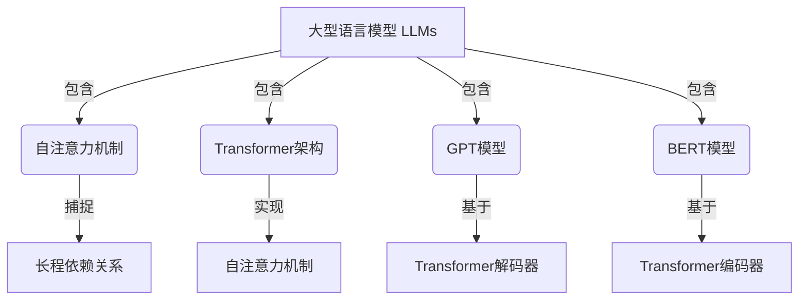
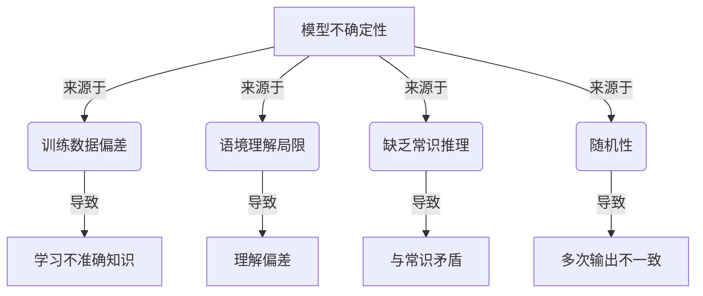
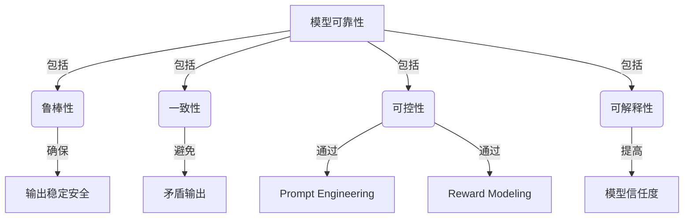
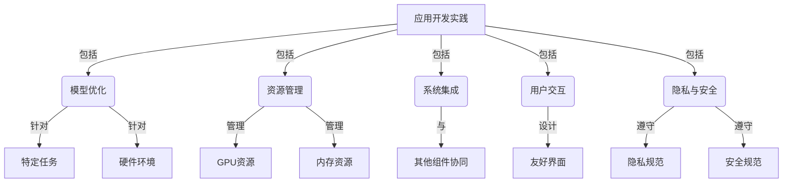
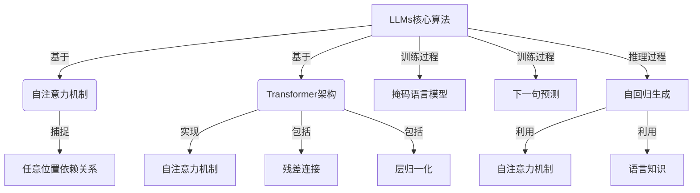

# 【大模型应用开发 动手做AI Agent】期望顶峰和失望低谷

## 1. 背景介绍

### 1.1 问题的由来

在过去几年中,大型语言模型(Large Language Models, LLMs)在自然语言处理(NLP)领域取得了令人瞩目的进展。这些模型通过在大规模文本数据上进行预训练,展现出令人惊叹的语言生成能力,在各种NLP任务中表现出色。随着模型规模的不断扩大,LLMs已经能够生成看似合理、连贯且内容丰富的文本输出。

然而,尽管取得了这些令人鼓舞的成就,但在实际应用中,LLMs仍然面临着诸多挑战。其中,模型的不确定性、可靠性和可解释性等问题一直是研究人员和开发人员所关注的焦点。此外,在模型部署和应用开发过程中,也存在着诸多实践上的困难,例如模型优化、资源管理、系统集成等。

### 1.2 研究现状

目前,学术界和工业界都在积极探索如何更好地利用LLMs的强大能力,同时克服其固有的局限性。一些主要的研究方向包括:

1. **模型可解释性**:通过引入注意力机制、可视化技术等方法,试图提高模型的可解释性,让人们能够更好地理解模型的决策过程。

2. **模型鲁棒性**:研究人员正在探索各种方法来提高LLMs对于对抗性攻击、噪声数据等的鲁棒性,以确保模型在实际应用中的可靠性。

3. **模型控制**:通过引入各种控制机制,如prompt engineering、reward modeling等,试图让模型的输出更加符合预期,减少不确定性。

4. **模型评估**:开发更加全面、客观的评估指标和方法,以更好地衡量LLMs在不同任务和场景下的表现。

5. **应用开发实践**:探索LLMs在实际应用中的最佳实践,包括模型优化、资源管理、系统集成等方面的技术和经验。

### 1.3 研究意义

LLMs代表了人工智能领域的一个重要里程碑,它们展现出了令人惊叹的语言理解和生成能力。然而,要真正发挥LLMs的潜力,并将其应用于实际场景中,我们仍需要解决诸多挑战。本文旨在探讨LLMs在应用开发过程中所面临的期望顶峰和失望低谷,分析其中的关键问题和挑战,并提供一些可能的解决方案和最佳实践。

通过深入探讨这些问题,我们希望能够为LLMs的应用开发提供一些有价值的见解和指导,帮助开发人员更好地理解和应对潜在的困难,从而推动LLMs在实际应用中的成功落地。

### 1.4 本文结构

本文将按照以下结构展开:

1. 背景介绍
2. 核心概念与联系
3. 核心算法原理与具体操作步骤
4. 数学模型和公式详细讲解与举例说明
5. 项目实践:代码实例和详细解释说明
6. 实际应用场景
7. 工具和资源推荐
8. 总结:未来发展趋势与挑战
9. 附录:常见问题与解答

## 2. 核心概念与联系

在探讨LLMs应用开发的期望顶峰和失望低谷之前,我们需要先了解一些核心概念及其相互关系。

### 2.1 大型语言模型(LLMs)

大型语言模型(LLMs)是一种基于深度学习的自然语言处理模型,通常具有数十亿甚至上万亿个参数。这些模型通过在大规模文本数据上进行无监督预训练,学习到了丰富的语言知识和模式。

LLMs的核心思想是利用自注意力(Self-Attention)机制来捕捉输入序列中的长程依赖关系,从而更好地理解和生成语言。常见的LLM架构包括Transformer、GPT、BERT等。

### 2.2 模型不确定性

尽管LLMs展现出了令人印象深刻的语言生成能力,但它们的输出往往存在一定程度的不确定性。这种不确定性可能来源于以下几个方面:

1. **训练数据偏差**:LLMs通常在互联网上收集的大规模文本数据上进行预训练,这些数据可能存在偏差、噪声或不一致的情况,导致模型学习到了不准确或有偏差的知识。

2. **语境理解局限**:尽管LLMs具有一定的语境理解能力,但它们对于长期依赖关系和复杂语义的捕捉仍有局限性,可能导致生成的文本与预期存在偏差。

3. **缺乏常识推理**:LLMs主要是基于统计模式进行语言生成,缺乏对常识知识和逻辑推理的深入理解,因此其输出可能与人类的常识存在矛盾。

4. **随机性**:LLMs的生成过程具有一定的随机性,即使对于相同的输入,多次生成的输出也可能存在差异。

### 2.3 模型可靠性

在实际应用中,模型的可靠性是一个至关重要的考虑因素。可靠性包括以下几个方面:

1. **鲁棒性**:模型应该具有足够的鲁棒性,能够抵御对抗性攻击、噪声数据等,确保输出的稳定性和安全性。

2. **一致性**:模型在不同场景和条件下的输出应该保持一致,避免出现矛盾或自相违背的情况。

3. **可控性**:开发人员应该能够通过一定的机制(如prompt engineering)来控制模型的输出,使其符合预期目标。

4. **可解释性**:模型的决策过程应该具有一定的可解释性,让人们能够理解模型是如何得出特定输出的,从而提高对模型的信任度。

### 2.4 应用开发实践

在将LLMs应用于实际场景时,开发人员需要考虑诸多实践问题,包括:

1. **模型优化**:如何针对特定任务和硬件环境对LLMs进行优化,以提高性能和效率。

2. **资源管理**:如何有效管理LLMs所需的大量计算资源,包括GPU、内存等。

3. **系统集成**:如何将LLMs集成到现有的软件系统中,并与其他组件协同工作。

4. **用户交互**:如何设计直观、友好的用户界面,让用户能够方便地与LLMs进行交互。

5. **隐私与安全**:如何确保LLMs在处理敏感数据时遵守隐私和安全规范。

通过上述核心概念的介绍,我们可以看到,LLMs在应用开发过程中面临着诸多挑战,包括模型不确定性、可靠性问题,以及实践层面的困难。在接下来的章节中,我们将更深入地探讨这些挑战,并提供一些可能的解决方案和最佳实践。

## 3. 核心算法原理与具体操作步骤

### 3.1 算法原理概述

LLMs的核心算法原理是基于自注意力(Self-Attention)机制和Transformer架构。自注意力机制允许模型捕捉输入序列中任意两个位置之间的依赖关系,从而更好地理解和生成语言。Transformer架构则提供了一种高效的方式来实现自注意力机制,同时通过残差连接和层归一化等技术提高了模型的训练稳定性。

在训练过程中,LLMs通过掩码语言模型(Masked Language Modeling)和下一句预测(Next Sentence Prediction)等任务,在大规模文本数据上进行无监督预训练。预训练后的模型能够捕捉到丰富的语言知识和模式,为下游的各种NLP任务提供强大的语言表示能力。

在推理阶段,LLMs通过自回归(Auto-Regressive)的方式生成文本。具体来说,模型会根据给定的输入(如问题或prompt),逐步生成下一个词或子词,直到生成完整的输出序列。在这个过程中,模型会利用自注意力机制捕捉上下文信息,并基于学习到的语言知识进行预测。

### 3.2 算法步骤详解

LLMs的训练和推理过程可以分为以下几个主要步骤:

1. **数据预处理**:首先需要从互联网或其他来源收集大量的文本数据,并对其进行清洗、标记化等预处理操作。

2. **模型构建**:基于Transformer架构构建LLM模型,包括embedding层、编码器层、解码器层等。模型的具体结构和参数设置会影响其性能和计算资源需求。

3. **预训练**:在预处理后的大规模文本数据上,使用掩码语言模型和下一句预测等任务进行无监督预训练。预训练过程通常需要大量的计算资源和时间。

4. **微调**:根据具体的下游任务,在预训练模型的基础上进行进一步的微调(Fine-Tuning),以适应特定任务的需求。

5. **推理**:在推理阶段,模型会根据给定的输入(如问题或prompt),通过自回归的方式逐步生成输出序列。在这个过程中,模型会利用自注意力机制捕捉上下文信息,并基于学习到的语言知识进行预测。

6. **后处理**:对模型生成的原始输出进行后处理,如去除特殊标记、解码等,以获得最终的文本输出。

需要注意的是,LLMs的训练和推理过程通常需要大量的计算资