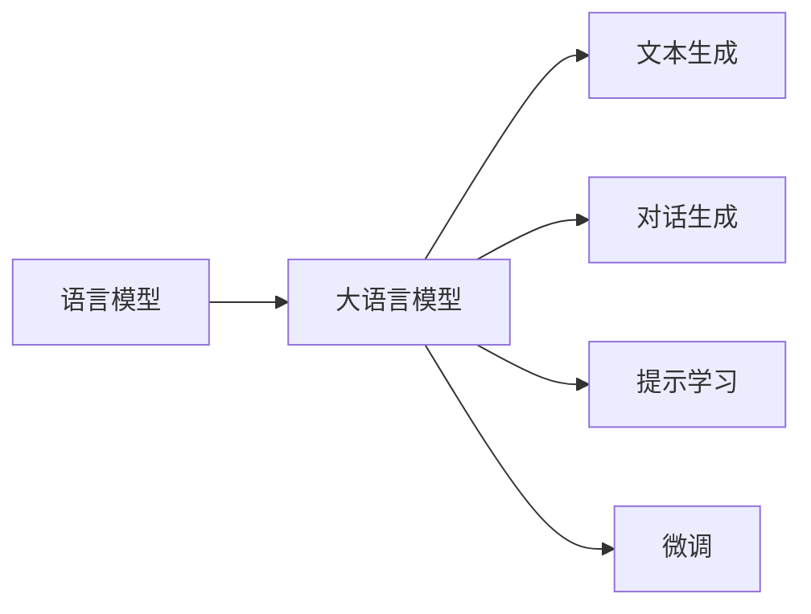

# 【大模型应用开发 动手做AI Agent】语言输出能力

作者：禅与计算机程序设计艺术 / Zen and the Art of Computer Programming

## 1. 背景介绍
### 1.1 问题的由来
随着人工智能技术的飞速发展,特别是大语言模型(Large Language Models, LLMs)的出现,AI在自然语言处理和生成方面取得了巨大的突破。这些大模型展现出了非凡的语言理解和生成能力,可以完成诸如对话、翻译、摘要、写作等多种任务。然而,如何将这些强大的语言模型应用到实际的AI系统中,构建具有智能交互能力的AI Agent,仍然是一个亟待探索的问题。

### 1.2 研究现状 
目前,业界已经出现了一些利用大语言模型构建AI Agent的尝试和应用。比如微软的小冰、OpenAI的ChatGPT、Google的LaMDA等,都是基于大模型实现的对话型AI系统。这些系统在与人进行自然语言交互、完成特定任务方面表现出色。但总的来说,大模型在AI Agent开发中的应用还处于起步阶段,在算法优化、工程实现、人机交互等方面还有很大的探索空间。

### 1.3 研究意义
研究大模型在AI Agent开发中的应用,对于推动人工智能在实际场景中的落地具有重要意义:

1. 丰富AI交互方式,提升用户体验。基于大模型构建的AI Agent可以提供更加智能、自然的人机交互方式,大大提升AI系统的易用性和用户体验。

2. 拓展AI应用场景,创造商业价值。AI Agent可以应用于客服、教育、金融等多个领域,通过智能化的用户交互为企业创造更多价值。

3. 探索通用人工智能的实现路径。大模型是通用人工智能的重要基石,研究其在AI Agent中的应用有助于探索AGI的实现路径。

### 1.4 本文结构
本文将重点探讨大模型在AI Agent开发中的语言输出能力。内容安排如下:

- 第2部分介绍相关的核心概念
- 第3部分讲解语言输出的核心算法原理和操作步骤
- 第4部分从理论层面对语言生成的数学模型和公式进行推导和讲解
- 第5部分给出语言生成模型的代码实现示例
- 第6部分讨论大模型语言输出能力在实际应用场景中的价值
- 第7部分推荐相关的学习资源和开发工具
- 第8部分总结全文,展望未来的发展趋势和挑战
- 第9部分的附录给出了一些常见问题解答

## 2. 核心概念与联系
在利用大模型构建AI Agent的语言输出能力时,需要了解以下几个核心概念:

- 语言模型(Language Model):用于建模自然语言的概率统计模型,可以预测给定上下文时下一个词或字符出现的概率。常见的语言模型有N-gram、RNN、Transformer等。

- 大语言模型(Large Language Model):基于海量语料和深度学习技术训练的大规模语言模型,具有强大的语言理解和生成能力。代表模型有GPT系列、BERT、T5等。

- 文本生成(Text Generation):根据给定的上下文或提示,自动生成连贯、可读的文本内容的任务。常用的方法有基于搜索的生成和基于采样的生成。

- 对话生成(Dialogue Generation):一种特定的文本生成任务,根据对话历史自动生成下一轮对话内容,使对话流畅自然地进行下去。

- 提示学习(Prompt Learning):通过设计合适的输入提示模板,引导语言模型生成期望的输出内容。可以显著提升语言模型在下游任务中的表现。

- 微调(Fine-tuning):在特定任务上使用少量标注数据对预训练语言模型进行二次训练,使其更好地适应任务需求。微调可以大幅提升模型性能。

这些概念之间的关系如下图所示:

可以看出,大语言模型是实现AI Agent语言输出能力的核心,其强大的语言理解和生成能力为文本生成、对话生成等任务提供了基础。而提示学习和微调则是进一步提升语言模型在特定任务上表现的重要手段。

## 3. 核心算法原理 & 具体操作步骤
### 3.1 算法原理概述
大模型的语言输出能力主要基于Transformer结构和自回归生成范式。Transformer通过自注意力机制建模输入序列的全局依赖,并使用前馈神经网络对特征进行变换,从而学习到丰富的语义表示。在生成阶段,模型根据输入的提示信息,通过自回归地预测下一个token,最终生成连贯的文本序列。

### 3.2 算法步骤详解
1. 模型训练:在大规模语料上使用自监督学习方法预训练语言模型,学习通用的语言表示和生成能力。常见的预训练任务有语言模型、掩码语言模型等。

2. 输入提示构造:根据具体任务设计输入提示,引导模型进行特定领域的文本生成。提示内容可以包含任务描述、领域知识、人设等信息。

3. 解码生成:使用训练好的语言模型,根据输入的提示信息进行自回归解码生成。具体采用基于搜索的beam search解码或基于采样的top-k/top-p采样等方法。

4. 输出后处理:对生成的文本进行后处理,如去除无效字符、过滤不当内容、格式调整等,提升文本的可读性和适用性。

5. 交互反馈:根据用户的交互反馈优化系统,如调整提示内容、调节生成参数、增量训练模型等,不断提升AI Agent的语言输出质量。

### 3.3 算法优缺点
优点:
- 端到端生成,无需复杂的人工特征工程
- 生成内容流畅自然,接近人类书写水平
- 通过提示引导,可以灵活适应不同任务需求
- 预训练+微调范式,可以显著减少任务特定数据的标注成本

缺点:
- 模型参数量大,训练和推理成本高
- 生成内容可控性较差,易出现幻觉和不当言论
- 对少样本任务的适应能力有限
- 推理速度慢,难以应用于实时场景

### 3.4 算法应用领域
大模型的语言输出能力可以应用于以下领域:

- 智能客服:通过对话交互为用户提供个性化服务
- 内容创作:自动撰写文章、广告文案、剧本等 
- 教育助手:智能问答、作业批改、知识讲解等
- 医疗助理:自动生成病历、医嘱、诊断报告等
- 金融分析:撰写金融研报、市场分析、投资建议等

## 4. 数学模型和公式 & 详细讲解 & 举例说明
### 4.1 数学模型构建
大语言模型的核心是建立文本序列的概率分布模型。给定一个文本序列 $X=(x_1,x_2,...,x_T)$,语言模型的目标是估计其概率:

$$P(X)=\prod_{t=1}^{T} P(x_t|x_1,...,x_{t-1})$$

其中,$x_t$ 表示序列的第 $t$ 个token,$P(x_t|x_1,...,x_{t-1})$ 表示在给定前 $t-1$ 个token的条件下,第 $t$ 个token为 $x_t$ 的条件概率。

大语言模型使用神经网络来参数化这个条件概率分布。以GPT模型为例,其使用Transformer的解码器结构对序列进行自回归建模:

$$h_0 = Embedding(X)$$
$$h_l = Transformer\_Block_l(h_{l-1}), l=1,2,...,L$$
$$P(x_t|x_1,...,x_{t-1}) = Softmax(Linear(h_L[t-1,:]))$$

其中,$Embedding$ 将离散的token映射为连续的向量表示,$Transformer\_Block$ 为Transformer的解码器块,包含自注意力和前馈网络,$L$ 为模型的层数。最后通过线性变换和Softmax函数将特征向量映射为下一个token的概率分布。

### 4.2 公式推导过程
以上述GPT模型为例,对其前向计算过程进行推导。

首先,输入序列 $X$ 通过 $Embedding$ 层映射为向量表示 $h_0$:
$$h_0 = Embedding(X) \in \mathbb{R}^{T \times d}$$
其中,$d$ 为词嵌入维度。

然后,向量序列通过 $L$ 个 $Transformer\_Block$ 进行特征提取:
$$h_l = Transformer\_Block_l(h_{l-1}), l=1,2,...,L$$

每个 $Transformer\_Block$ 包含两个子层:自注意力层(SelfAttention)和前馈网络层(FFN)。

自注意力层通过计算序列内元素的注意力权重,实现全局建模:

$$Q,K,V = Linear_Q(h_{l-1}),Linear_K(h_{l-1}),Linear_V(h_{l-1})$$
$$A = Softmax(\frac{QK^T}{\sqrt{d}})V$$

其中,$Q,K,V$ 分别为查询、键、值向量,$A$ 为注意力输出。

前馈网络层通过两层线性变换和非线性激活,对特征进行变换:

$$FFN(A) = ReLU(Linear_1(A))Linear_2$$

最后,将 $Transformer\_Block$ 的输出 $h_L$ 通过线性变换和 $Softmax$ 函数,得到下一个token的概率分布:

$$P(x_t|x_1,...,x_{t-1}) = Softmax(Linear(h_L[t-1,:]))$$

语言模型的训练目标是最大化整个序列的对数似然概率:

$$\mathcal{L}(\theta) = \sum_{t=1}^{T} \log P(x_t|x_1,...,x_{t-1};\theta)$$

其中,$\theta$ 为模型参数。通过梯度下降等优化算法最小化损失函数,实现模型训练。

### 4.3 案例分析与讲解
下面以一个简单的例子来说明语言模型的生成过程。

假设已经训练好一个基于字符级别的语言模型,词表大小为100。现在给定提示"Hello, how are you"作为输入,要求模型生成后续文本。

首先,将提示编码为token序列 $X=(x_1,x_2,...,x_T)$,其中每个字符对应一个token。

然后,将 $X$ 输入语言模型,经过 $Embedding$ 层和 $L$ 个 $Transformer\_Block$ 后,得到最后一层的输出特征 $h_L \in \mathbb{R}^{T \times d}$。

接下来,从最后一个token开始,自回归地生成后续token。假设当前生成到第 $t$ 步,已经生成的token序列为 $(x_1,x_2,...,x_{t-1})$。

取 $h_L$ 中第 $t-1$ 个向量 $h_L[t-1,:]$,通过线性变换和 $Softmax$ 函数得到下一个token的概率分布:

$$P(x_t|x_1,...,x_{t-1}) = Softmax(Linear(h_L[t-1,:]))$$

从这个概率分布中采样或选择概率最大的token作为 $x_t$,添加到生成序列中。

重复上述过程,直到生成结束符或达到最大长度,即可得到模型生成的文本。

例如,模型可能生成:"Hello, how are you doing today? I hope you are having a great day!"

### 4.4 常见问题解答
Q: 语言模型的生成质量如何评估?
A: 可以使用perplexity、BLEU、ROUGE等指标对生成文本的流畅性和相关性进行自动评估。但更可靠的方法是进行人工评估,由人类判断生成文本的可读性、连贯性、信息量等。

Q: 如何控制语言模型的生成风格和内容?
A: 主要有两种方法:1)通过设计提示模板,在输入中加入风格和内容控制信号;2)对语言模型进行微调,在特定风格和领域的数据上进行训练,使其适应目标任务。