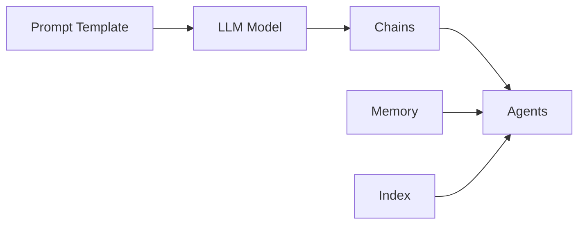

# 【大模型应用开发 动手做AI Agent】说说LangChain

作者：禅与计算机程序设计艺术 / Zen and the Art of Computer Programming

## 1. 背景介绍
### 1.1 问题的由来
随着人工智能技术的快速发展,特别是大语言模型的出现,AI已经开始在各行各业展现出巨大的应用潜力。然而,如何将强大的语言模型有效地应用到实际的业务场景中,构建智能化的应用程序,仍然是一个巨大的挑战。开发者需要一个灵活、易用的工具来帮助他们快速搭建基于大模型的应用程序。

### 1.2 研究现状 
目前已经出现了一些旨在简化大模型应用开发的框架和工具,如 OpenAI 的 GPT-3 API、Hugging Face 的 Transformers 库等。它们提供了方便的接口来调用预训练模型,但在构建端到端应用时仍然需要大量的开发工作。LangChain 的出现填补了这一空白,它提供了一套完整的工具集,帮助开发者快速搭建基于语言模型的应用程序。

### 1.3 研究意义
LangChain 作为一个专注于构建 LLM 应用的开发框架,有望极大地降低 AI 应用的开发门槛,加速人工智能技术在各领域的落地应用。通过研究 LangChain 的原理和使用方法,开发者可以掌握利用大模型构建智能应用的关键技术,创造出更多有价值的 AI 产品,推动人工智能行业的发展。

### 1.4 本文结构
本文将首先介绍 LangChain 的核心概念和整体架构,然后深入分析其关键组件的原理和使用方法,包括 Prompt 模板、LLM 模型接口、Agents、Memory 等。接着通过实际的代码案例演示如何使用 LangChain 进行应用开发。最后总结 LangChain 的特点,展望其未来的发展趋势和面临的挑战。

## 2. 核心概念与联系
LangChain 的核心概念包括:

- **Prompt 模板**: 定义与 LLM 交互的输入模板,动态填充参数生成 Prompt。
- **LLM 模型接口**: 封装不同 LLM 模型的统一调用接口,支持 OpenAI、Hugging Face 等。  
- **Chains**: 定义由多个组件顺序执行的工作流,如 Prompt+LLM+Parser 的管道。
- **Agents**: 封装了复杂的决策逻辑,根据 Prompt 对话历史进行多轮交互,完成任务。
- **Memory**: 存储 Prompt 交互的历史记录,支持 Buffer、Summary 等方式,用于多轮对话。
- **Index 索引**: 对文档进行向量化索引,通过相似度搜索从海量信息中检索答案。

下图展示了 LangChain 的核心组件及其关系:



## 3. 核心算法原理 & 具体操作步骤
### 3.1 算法原理概述
LangChain 的核心算法主要基于 Transformer 语言模型和向量索引技术。其中 Prompt 模板和 Chain 机制利用了 Transformer 模型的 few-shot 学习能力,通过设计输入示例来引导模型生成所需的输出。而 Index 索引则利用向量化技术,将文本映射到高维语义空间,通过相似度搜索快速检索相关信息。

### 3.2 算法步骤详解
以下是使用 LangChain 构建应用的典型步骤:

1. 定义 Prompt 模板,设计输入示例和参数占位符。
2. 选择合适的 LLM 模型接口,如 OpenAI 的 GPT-3。
3. 使用 Prompt 模板动态生成输入,调用 LLM 接口获取输出。
4. 将 Prompt、LLM 等组件组合成 Chain,定义执行流程。
5. 创建 Agent,定义任务目标和决策逻辑,实现多轮交互。 
6. 添加 Memory 组件存储对话历史,实现多轮对话。
7. 对背景知识进行向量化索引,实现基于语义相似度的信息检索。

### 3.3 算法优缺点
LangChain 的优点在于:
- 封装了 LLM 调用细节,简化了应用开发流程。
- Prompt 模板机制灵活,可以引导模型生成所需输出。
- Chain 和 Agent 支持定义复杂的任务流程和决策逻辑。
- 提供了 Memory 机制,支持多轮对话。
- 集成了向量索引,可以对大规模语料进行语义检索。

但同时也存在一些局限:
- 对 LLM 调用有较强依赖,需要昂贵的 API 调用。 
- Prompt 设计需要一定经验,调试成本高。
- 语言模型的推理结果不确定性高,可控性较差。

### 3.4 算法应用领域
LangChain 可以用于构建各种 AI 应用,例如:
- 智能客服、销售助手等对话机器人
- 个性化推荐、智能搜索等决策支持系统
- 数据分析、报告生成等自动化任务
- 创意生成、写作助手等内容创作工具

## 4. 数学模型和公式 & 详细讲解 & 举例说明
### 4.1 数学模型构建
LangChain 中的核心数学模型主要包括 Transformer 语言模型和向量索引。

Transformer 模型基于 Self-Attention 机制,通过 Query-Key-Value 计算实现输入之间的关联性建模:

$$
\text{Attention}(Q, K, V) = \text{softmax}(\frac{QK^T}{\sqrt{d_k}})V
$$

其中 $Q$, $K$, $V$ 分别表示 Query、Key、Value 矩阵,$d_k$ 为 Key 向量的维度。

向量索引则基于文本嵌入技术,常用的模型如 Word2Vec、GloVe 等。以 Word2Vec 为例,其核心是 Skip-gram 模型,通过最大化给定中心词 $w$ 生成上下文 $c$ 的概率来学习词向量:

$$
\arg\max_\theta \prod_{w \in \text{corpus}} \prod_{c \in \text{context}(w)} P(c|w;\theta)
$$

其中 $\theta$ 为模型参数,即词向量。$P(c|w;\theta)$ 可以用 Softmax 函数建模:

$$
P(c|w;\theta) = \frac{\exp(v_c \cdot v_w)}{\sum_{c' \in V} \exp(v_{c'} \cdot v_w)}
$$

其中 $v_c$ 和 $v_w$ 分别表示上下文词和中心词的向量,$V$ 为词表。

### 4.2 公式推导过程
以上是 Transformer 和 Word2Vec 的核心公式,推导过程涉及以下几个关键步骤:

1. Self-Attention 公式:
   - 将输入转化为 Query、Key、Value 矩阵
   - 计算 Query 与 Key 的点积,得到注意力分数
   - 对分数进行 Softmax 归一化,得到注意力权重
   - 将权重与 Value 加权求和,得到 Attention 输出

2. Skip-gram 公式:  
   - 对语料中的每个词,提取其上下文词
   - 构建 $(w,c)$ 正样本对,以及 $(w,c')$ 负样本对
   - 定义损失函数,最大化正样本概率,最小化负样本概率 
   - 通过梯度下降优化模型参数,即词向量

### 4.3 案例分析与讲解
下面以一个简单的例子说明如何使用 LangChain 构建应用。假设我们要开发一个基于知识库的问答机器人,用户输入问题,系统从知识库中检索相关信息,生成回答。

首先定义 Prompt 模板:

```python
from langchain import PromptTemplate

template = """
根据以下背景知识,回答最后的问题。如果无法从背景知识中得到答案,请说 "根据已知信息无法回答该问题"。

背景知识:
{context}

问题:
{question}

回答:
"""

prompt = PromptTemplate(
    input_variables=["context", "question"], 
    template=template
)
```

然后选择 LLM 模型接口,这里以 OpenAI 的 GPT-3 为例:

```python
from langchain.llms import OpenAI

llm = OpenAI(model_name="text-davinci-002", temperature=0.7)
```

接着将知识库文档向量化,构建索引:

```python
from langchain.indexes import VectorstoreIndexCreator

index = VectorstoreIndexCreator().from_loaders([...])
```

最后定义 Chain,将问题输入 Prompt 模板,从索引中检索相关知识,输入 LLM 生成答案:

```python
from langchain.chains import RetrievalQA

qa_chain = RetrievalQA.from_chain_type(
    llm=llm, 
    chain_type="stuff", 
    retriever=index.vectorstore.as_retriever()
)

result = qa_chain({"query": "用户问题"})
print(result["result"])
```

以上是一个端到端的问答系统示例,展示了如何使用 LangChain 的 Prompt、LLM、Index 等组件,快速搭建基于知识库的问答应用。

### 4.4 常见问题解答
1. Q: LangChain 支持哪些 LLM 模型?
   A: LangChain 支持主流的 LLM 模型接口,如 OpenAI GPT-3、Anthropic Claude、Hugging Face 等。

2. Q: 如何在 LangChain 中实现多轮对话?
   A: 可以使用 Memory 组件存储对话历史,如 ConversationBufferMemory。将其与 LLM 结合,即可实现多轮对话。

3. Q: LangChain 的索引功能如何使用?
   A: LangChain 提供了 VectorstoreIndexCreator 等工具,可以将文本数据转化为向量索引。在查询时使用索引的 as_retriever() 方法检索相关文档。

4. Q: LangChain 的 Prompt 模板是否支持条件逻辑?  
   A: 支持。可以在 Prompt 模板中使用 Jinja2 模板语法,实现条件判断、循环等逻辑。

## 5. 项目实践：代码实例和详细解释说明
### 5.1 开发环境搭建
首先需要安装 Python 和 LangChain 包:

```bash
pip install langchain openai faiss-cpu
```

其中 openai 包用于调用 OpenAI 接口,faiss-cpu 用于向量索引。

### 5.2 源代码详细实现
下面是一个使用 LangChain 实现的智能助手代码示例:

```python
from langchain import OpenAI, ConversationChain, LLMChain, PromptTemplate
from langchain.memory import ConversationBufferWindowMemory

template = """助手是一个大型语言模型,旨在帮助用户解决问题。

当前对话:
{history}
用户: {input}
助手: """

prompt = PromptTemplate(
    input_variables=["history", "input"], 
    template=template
)

llm = OpenAI(temperature=0.7) 
memory = ConversationBufferWindowMemory(k=5)
conversation = LLMChain(
    llm=llm, 
    prompt=prompt, 
    verbose=True, 
    memory=memory,
)

print("你好,我是智能助手,有什么可以帮助你的吗?")
while True:
    user_input = input("用户: ")
    if user_input.lower() in ["bye", "再见"]:
        print("助手: 再见,很高兴为你服务!")
        break
    
    result = conversation.predict(input=user_input)
    print(f"助手: {result}")
```

### 5.3 代码解读与分析
1. 首先定义了一个 Prompt 模板,其中包含对话历史 {history} 和用户输入 {input} 两个变量。
2. 然后初始化 OpenAI LLM 对象,设置 temperature 参数控制生成的随机性。
3. 创建 ConversationBufferWindowMemory 对象,用于存储最近 k 轮对话。
4. 将 LLM、Prompt、Memory 组合成 LLMChain,形成一个端到端的对话系统。
5. 进入交互循环,不断获取用户输入,调用 conversation 的 predict 方法生成回复。
6. 输出助手的回复,直到用户输入 "bye" 或 "再见" 结束对