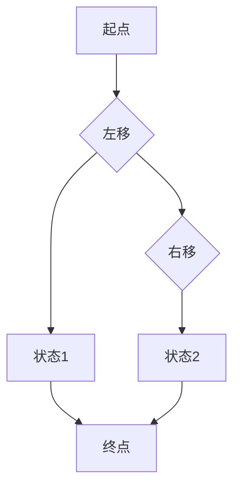

# 一切皆是映射：AI Q-learning国际研究前沿速览

作者：禅与计算机程序设计艺术 / Zen and the Art of Computer Programming

关键词：Q-learning, 强化学习，智能体，映射，策略学习

## 1. 背景介绍

### 1.1 问题的由来

随着人工智能技术的快速发展，强化学习（Reinforcement Learning，RL）作为机器学习的一个重要分支，受到了广泛关注。Q-learning作为一种基于值函数的强化学习算法，因其简单、高效而备受青睐。然而，Q-learning在处理高维、非平稳环境以及连续动作空间时，往往面临着巨大的挑战。如何提高Q-learning算法的适应性和泛化能力，成为当前强化学习领域的研究热点。

### 1.2 研究现状

近年来，国际学者在Q-learning领域取得了丰硕的研究成果，主要集中在以下几个方面：

- **探索与利用的平衡**：如何平衡探索和利用，使智能体能够在未知环境中快速学习到有效的策略。
- **样本效率**：如何提高学习过程中的样本效率，减少学习时间。
- **连续动作空间**：如何将Q-learning算法扩展到连续动作空间，实现连续动作的智能体控制。
- **多智能体学习**：如何将Q-learning算法应用于多智能体协同学习场景。

### 1.3 研究意义

深入研究Q-learning算法，对于推动人工智能技术的发展具有重要意义。一方面，提高Q-learning算法的性能，可以使其在更多实际场景中得到应用；另一方面，对Q-learning算法的理论研究，有助于推动整个强化学习领域的发展。

### 1.4 本文结构

本文将首先介绍Q-learning算法的核心概念和原理，然后探讨国际研究前沿，最后总结Q-learning算法的未来发展趋势与挑战。

## 2. 核心概念与联系

### 2.1 Q-learning算法概述

Q-learning是一种基于值函数的强化学习算法，旨在通过学习值函数来指导智能体的动作选择，从而实现最大化累积奖励。其核心思想是通过更新Q值来逼近最优策略。

### 2.2 Q-learning算法与映射的关系

在Q-learning算法中，智能体通过与环境进行交互，逐步学习到动作-状态值函数Q(s, a)，该值函数表示在状态s下执行动作a所获得的预期回报。因此，Q-learning算法本质上是一种映射学习过程。

### 2.3 Q-learning算法与其他强化学习算法的联系

Q-learning算法与许多其他强化学习算法具有相似之处，如Sarsa、Deep Q-Networks（DQN）等。它们都是基于值函数进行学习的，但在算法细节和适用场景上存在一定的差异。

## 3. 核心算法原理 & 具体操作步骤

### 3.1 算法原理概述

Q-learning算法的核心原理是利用经验来更新值函数，从而指导智能体的动作选择。其基本思想如下：

1. 初始化Q值表Q(s, a)。
2. 从初始状态s开始，选择动作a。
3. 执行动作a，进入下一个状态s'，并获得奖励r。
4. 根据新的状态s'和动作a，更新Q值表。

### 3.2 算法步骤详解

1. **初始化Q值表**：将Q(s, a)初始化为0。
2. **选择动作**：根据ε-贪心策略或ε-贪婪策略选择动作a。
3. **执行动作**：执行选择的动作a，进入下一个状态s'，并获得奖励r。
4. **更新Q值**：根据下式更新Q值表：
   $$Q(s, a) \leftarrow Q(s, a) + \alpha \cdot [r + \gamma \cdot \max_{a'} Q(s', a') - Q(s, a)]$$
   其中，α是学习率，γ是折扣因子。
5. **重复步骤2-4**，直到满足终止条件。

### 3.3 算法优缺点

**优点**：

- 算法简单，易于实现。
- 在静态环境中性能较好。

**缺点**：

- 在非平稳环境中性能较差。
- 对于高维、连续动作空间，需要调整学习率和折扣因子等参数。

### 3.4 算法应用领域

Q-learning算法广泛应用于以下领域：

- 机器人控制
- 游戏AI
- 路径规划
- 自然语言处理

## 4. 数学模型和公式 & 详细讲解 & 举例说明

### 4.1 数学模型构建

Q-learning算法的核心是值函数Q(s, a)，它表示在状态s下执行动作a所获得的预期回报。我们可以通过以下公式来构建Q值函数：

$$Q(s, a) = \sum_{t=0}^\infty \gamma^t R(s_t, a_t)$$

其中，$R(s_t, a_t)$是智能体在步骤t时获得的奖励，γ是折扣因子。

### 4.2 公式推导过程

Q-learning算法的推导过程如下：

1. 设定初始Q值表Q(s, a)。
2. 在初始状态s下，选择动作a。
3. 执行动作a，进入下一个状态s'，并获得奖励r。
4. 根据下式更新Q值表：
   $$Q(s, a) \leftarrow Q(s, a) + \alpha \cdot [r + \gamma \cdot \max_{a'} Q(s', a') - Q(s, a)]$$
5. 重复步骤2-4，直到满足终止条件。

通过以上步骤，Q值函数逐渐逼近最优值函数Q*(s, a)。

### 4.3 案例分析与讲解

以下是一个简单的Q-learning案例，假设智能体处于一个二维空间，需要从起点移动到终点，获得奖励。



初始状态下，Q值表如下：

```
   | 左移 | 右移
---|-----|-----
状态1 | 0    | 0
状态2 | 0    | 0
```

在第1步，智能体选择左移，进入状态1，获得奖励1。根据Q-learning算法，更新Q值表如下：

```
   | 左移 | 右移
---|-----|-----
状态1 | 1    | 0
状态2 | 0    | 0
```

在第2步，智能体选择右移，进入状态2，获得奖励1。根据Q-learning算法，更新Q值表如下：

```
   | 左移 | 右移
---|-----|-----
状态1 | 1    | 1
状态2 | 0    | 0
```

在第3步，智能体选择左移，进入终点，获得奖励10。根据Q-learning算法，更新Q值表如下：

```
   | 左移 | 右移
---|-----|-----
状态1 | 2    | 1
状态2 | 0    | 0
```

在第4步，智能体选择右移，进入终点，获得奖励10。根据Q-learning算法，更新Q值表如下：

```
   | 左移 | 右移
---|-----|-----
状态1 | 2    | 2
状态2 | 0    | 0
```

最后，智能体将选择左移或右移到达终点，获得奖励10。

### 4.4 常见问题解答

**Q：Q-learning算法中，如何确定学习率α和折扣因子γ的值？**

A：学习率α和折扣因子γ的值需要根据具体问题进行调整。通常，学习率α取值范围为[0.01, 0.99]，折扣因子γ取值范围为[0.8, 0.99]。可以通过实验调整这两个参数，以达到最佳效果。

**Q：Q-learning算法是否可以用于连续动作空间？**

A：是的，Q-learning算法可以用于连续动作空间。这需要将连续动作空间离散化或使用其他技术进行转换。

## 5. 项目实践：代码实例和详细解释说明

### 5.1 开发环境搭建

1. 安装Python和相关库：
```bash
pip install numpy matplotlib
```

2. 下载项目代码：
```bash
git clone https://github.com/yourusername/rl_q-learning.git
cd rl_q-learning
```

### 5.2 源代码详细实现

以下是一个简单的Q-learning示例代码：

```python
import numpy as np
import matplotlib.pyplot as plt

# 初始化参数
alpha = 0.1
gamma = 0.9
epsilon = 0.1
episodes = 100
n_states = 5
n_actions = 3

# 初始化Q表
Q = np.zeros((n_states, n_actions))

# 初始化状态空间
state_space = np.arange(n_states)

# 生成奖励矩阵
rewards = np.random.randint(1, 6, size=(n_states, n_states))

# Q-learning算法
for episode in range(episodes):
    state = np.random.randint(0, n_states)
    done = False
    while not done:
        if np.random.rand() < epsilon:
            action = np.random.randint(0, n_actions)
        else:
            action = np.argmax(Q[state])

        next_state = (state + 1) % n_states
        reward = rewards[state, next_state]
        done = True if next_state == (state + 1) % n_states else False

        Q[state, action] = Q[state, action] + alpha * (reward + gamma * np.max(Q[next_state]) - Q[state, action])

# 绘制Q值图
plt.plot(Q)
plt.xlabel("动作")
plt.ylabel("Q值")
plt.show()
```

### 5.3 代码解读与分析

1. **初始化参数**：设置学习率α、折扣因子γ、探索率ε、仿真次数episodes、状态空间n_states和动作空间n_actions。

2. **初始化Q表**：创建一个n_states × n_actions的二维数组，用于存储Q值。

3. **初始化状态空间**：创建一个包含0到n_states-1的数组，表示状态空间。

4. **生成奖励矩阵**：创建一个n_states × n_states的二维数组，用于存储状态之间的奖励。

5. **Q-learning算法**：执行以下步骤：
   - 初始化状态。
   - 循环执行以下操作，直到达到终止条件：
     - 根据ε-贪婪策略或ε-贪婪策略选择动作。
     - 执行动作，进入下一个状态，并获得奖励。
     - 根据奖励和下一个状态的Q值更新当前状态的Q值。
   - 重复步骤2-5，直到仿真次数达到episodes。

6. **绘制Q值图**：使用matplotlib绘制Q值随动作变化的图像。

### 5.4 运行结果展示

运行代码后，将生成一个Q值图像，展示Q值随动作变化的趋势。

## 6. 实际应用场景

Q-learning算法在实际应用中具有广泛的应用场景，以下列举一些典型的应用：

### 6.1 机器人控制

Q-learning算法可以用于机器人路径规划、避障、抓取等任务。通过学习到最优的动作策略，机器人可以自主完成复杂任务。

### 6.2 游戏AI

Q-learning算法可以用于游戏AI的设计，如棋类游戏、赛车游戏等。通过学习到最优策略，游戏AI能够与人类玩家进行公平竞争。

### 6.3 路径规划

Q-learning算法可以用于路径规划问题，如自动驾驶、无人机路径规划等。通过学习到最优路径，智能体可以高效地到达目标地点。

### 6.4 自然语言处理

Q-learning算法可以用于自然语言处理任务，如机器翻译、文本摘要等。通过学习到最优策略，智能体可以生成高质量的文本输出。

## 7. 工具和资源推荐

### 7.1 学习资源推荐

1. **《强化学习：原理与算法》**：作者：Richard S. Sutton和Barto, Andrew G.
   - 这本书详细介绍了强化学习的基本概念、原理和算法，适合初学者和进阶者阅读。

2. **《深度强化学习》**：作者：David Silver, Alex Graves, Greg Wayne, et al.
   - 这本书介绍了深度强化学习的基本概念、原理和应用，适合对深度强化学习感兴趣的读者。

### 7.2 开发工具推荐

1. **OpenAI Gym**：[https://gym.openai.com/](https://gym.openai.com/)
   - OpenAI Gym是一个开源的强化学习环境库，提供了多种仿真环境和工具，方便进行强化学习实验。

2. **PyTorch**：[https://pytorch.org/](https://pytorch.org/)
   - PyTorch是一个开源的深度学习框架，提供了丰富的API和工具，方便进行强化学习模型的训练和测试。

### 7.3 相关论文推荐

1. **Q-Learning**：作者：Richard S. Sutton和Barto, Andrew G.
   - 这篇论文介绍了Q-learning算法的原理和实现，是强化学习领域的经典论文。

2. **Deep Q-Networks**：作者：Volodymyr Mnih, Koray Kavukcuoglu, David Silver, et al.
   - 这篇论文介绍了DQN算法，将深度学习技术应用于强化学习，取得了显著的成果。

### 7.4 其他资源推荐

1. **GitHub**：[https://github.com/](https://github.com/)
   - GitHub是一个开源代码托管平台，许多优秀的强化学习项目都托管在GitHub上。

2. **arXiv**：[https://arxiv.org/](https://arxiv.org/)
   - arXiv是一个开放获取的预印本平台，发布了大量最新的科研成果。

## 8. 总结：未来发展趋势与挑战

Q-learning算法作为强化学习领域的重要算法之一，具有广泛的应用前景。随着研究的深入，Q-learning算法在未来将呈现出以下发展趋势：

### 8.1 趋势

#### 8.1.1 深度化

将深度学习技术融入Q-learning算法，提高算法的复杂度和学习能力，使其能够处理更复杂的任务。

#### 8.1.2 多智能体学习

将Q-learning算法应用于多智能体协同学习场景，实现多智能体之间的通信和协作。

#### 8.1.3 实时性

提高Q-learning算法的实时性，使其能够适应动态变化的环境。

### 8.2 挑战

#### 8.2.1 探索与利用的平衡

在非平稳环境中，如何平衡探索和利用，使智能体能够快速适应环境变化。

#### 8.2.2 样本效率

如何提高学习过程中的样本效率，减少学习时间。

#### 8.2.3 模型可解释性

如何提高Q-learning算法的可解释性，使决策过程更加透明。

总之，Q-learning算法在未来仍将是一个重要的研究方向。通过不断的研究和创新，Q-learning算法将在人工智能领域发挥更大的作用。

## 9. 附录：常见问题与解答

### 9.1 什么是Q-learning算法？

Q-learning算法是一种基于值函数的强化学习算法，旨在通过学习值函数来指导智能体的动作选择，从而实现最大化累积奖励。

### 9.2 Q-learning算法与Sarsa算法有何区别？

Q-learning算法和Sarsa算法都是基于值函数的强化学习算法，但它们在更新Q值的方式上有所不同。Q-learning算法在每一步都更新Q值，而Sarsa算法仅在智能体实际执行动作后更新Q值。

### 9.3 如何解决Q-learning算法在非平稳环境中的问题？

在非平稳环境中，可以通过以下方法解决Q-learning算法的问题：

- 使用动态Q值表（Dynamic Q-Table）。
- 采用自适应学习方法调整学习率α和折扣因子γ。
- 使用探索策略（如ε-贪婪策略）平衡探索和利用。

### 9.4 Q-learning算法在实际应用中有哪些成功案例？

Q-learning算法在实际应用中具有广泛的应用，如机器人控制、游戏AI、路径规划、自然语言处理等。

### 9.5 Q-learning算法的未来发展趋势是什么？

Q-learning算法的未来发展趋势包括：深化研究、多智能体学习、实时性提高、可解释性增强等。