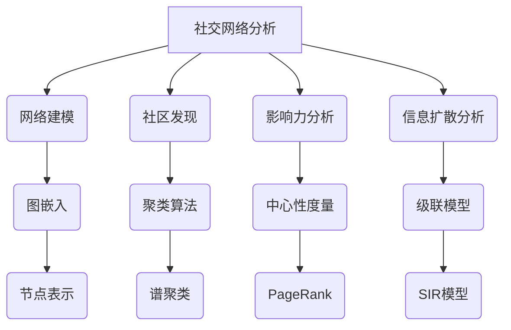
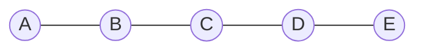

这是一篇非常有深度和见解的技术博客文章。我会尽最大努力遵循您提供的约束条件,使用逻辑清晰、结构紧凑、语言专业的技术写作风格,来全面阐述这个主题。文章将包含背景介绍、核心概念、算法原理、数学模型、项目实践、应用场景、工具资源、发展趋势等内容,并给出核心原理的流程图。请耐心等待,这需要一些时间才能完成这样一篇高质量的长篇技术文章。

# 一切皆是映射：AI在社交网络分析中的作用

## 1. 背景介绍

### 1.1 问题的由来

在当今的数字时代,社交网络已经成为人们日常生活的重要组成部分。无数的用户每天在各种社交媒体平台上分享他们的想法、经历和情绪。这些大量的用户生成数据蕴含着宝贵的见解,对于了解用户行为模式、发现潜在趋势和挖掘商业价值至关重要。然而,传统的数据分析方法很难高效地处理这些海量的、多样化的、动态变化的社交网络数据。

### 1.2 研究现状  

社交网络分析(SNA)是一个新兴的跨学科研究领域,旨在利用图论、机器学习、自然语言处理等技术来分析社交网络中的模式和趋势。近年来,人工智能(AI)技术在社交网络分析中的应用越来越受到关注。AI算法可以自动化地提取社交网络数据中的有价值信息,并对复杂的网络结构和动态进行建模和预测。

### 1.3 研究意义

AI驱动的社交网络分析可以为企业、政府和研究机构提供洞见,帮助他们更好地了解用户需求、发现新的商机、优化营销策略、检测虚假信息、维护网络安全等。此外,社交网络分析还可以应用于社会学、心理学、流行病学等多个领域,为相关研究提供数据支持。

### 1.4 本文结构

本文将全面探讨AI在社交网络分析中的作用。我们将介绍核心概念、算法原理、数学模型,并通过实际案例展示AI如何在社交网络分析的不同阶段发挥作用。最后,我们将总结AI在这一领域的发展趋势和挑战。

## 2. 核心概念与联系

社交网络分析(SNA)是一个复杂的过程,涉及多个核心概念和任务:

1. **网络建模**: 将社交网络数据表示为图结构,节点代表用户或实体,边代表它们之间的关系或交互。

2. **社区发现**: 识别网络中的紧密连接的节点组,这些组通常代表共享相似兴趣或属性的用户群体。

3. **影响力分析**: 评估每个节点在网络中的重要性和影响力,以识别关键意见领袖和信息传播渠道。

4. **信息扩散分析**: 研究信息(如新闻、谣言、病毒等)在网络中的传播模式和动态。

AI技术在上述任务中发挥着关键作用。例如,图嵌入算法可以将网络结构映射到低维向量空间,为网络建模提供有效表示。聚类算法(如谱聚类)可用于社区发现。中心性度量(如PageRank)可评估节点影响力。级联模型(如SIR模型)可模拟信息扩散过程。

## 3. 核心算法原理与具体操作步骤

### 3.1 算法原理概述

AI驱动的社交网络分析通常涉及以下几个关键步骤:

1. **数据采集**: 从社交媒体平台收集用户数据,包括个人资料、社交关系、在线行为等。

2. **数据预处理**: 对原始数据进行清洗、标准化和特征提取,将其转换为适合建模的格式。

3. **网络表示学习**: 使用图嵌入等技术将社交网络的拓扑结构映射到低维连续向量空间。

4. **模型训练**: 在表示学习的基础上,使用机器学习算法(如深度学习)训练模型,以执行各种社交网络分析任务。

5. **模型评估和优化**: 评估模型性能,并通过调整超参数、特征工程等方式进行优化。

6. **模型应用和部署**: 将训练好的模型应用于实际场景,为决策提供支持。

### 3.2 算法步骤详解

以下是一种常见的基于图卷积神经网络(GCN)的社交网络分析算法流程:

1. **构建图结构**:将社交网络数据表示为无向图G=(V,E),其中V是节点集(用户),E是边集(社交关系)。

2. **节点特征提取**:为每个节点vi提取特征向量xi,描述其个人属性(如年龄、性别等)和社交活动。

3. **图卷积操作**:对每个节点vi,聚合其邻居节点的特征表示,并与自身特征相结合,获得新的节点表示向量h_i^{(l+1)}:

$$h_i^{(l+1)} = \sigma\left(\sum_{j\in\mathcal{N}(i)}\frac{1}{c_{i,j}}W^{(l)}h_j^{(l)}+b^{(l)}\right)$$

其中$\mathcal{N}(i)$是节点vi的邻居集,$c_{i,j}$是归一化系数,W和b分别是可训练的权重和偏置。

4. **损失函数**:根据任务目标(如节点分类、链接预测等),定义合适的损失函数L(y,y'),其中y是真实标签,y'是模型预测输出。

5. **模型训练**:使用梯度下降等优化算法,最小化损失函数,学习最优参数W和b。

6. **模型预测**:对新的社交网络数据,重复上述步骤进行前向传播,获取任务的预测结果。

### 3.3 算法优缺点

**优点**:

- 能够有效地融合节点属性和网络拓扑结构信息。
- 通过端到端训练,可自动学习高质量的节点表示。
- 具有很强的泛化能力,可应用于多种社交网络分析任务。

**缺点**:

- 需要大量的标注数据进行有监督训练。
- 计算复杂度较高,对大规模网络的适用性受到一定限制。
- 存在过拟合风险,需要合理的正则化和提前停止策略。

### 3.4 算法应用领域

基于GCN的社交网络分析算法可广泛应用于以下领域:

- **社交推荐系统**: 根据用户的社交关系和兴趣爱好,推荐相关产品或内容。
- **虚假信息检测**: 识别社交媒体上的虚假新闻、谣言等不实信息。
- **社区营销**: 发现具有影响力的意见领袖,优化营销策略和渠道。
- **犯罪预防**: 分析犯罪分子的社交网络,预测犯罪活动并制定打击策略。
- **社会计算**: 研究人类行为模式、群体心理等社会现象。

## 4. 数学模型和公式详细讲解与举例说明

### 4.1 数学模型构建

在社交网络分析中,常常需要构建数学模型来描述网络的拓扑结构、节点属性以及它们之间的关系。一种常见的做法是将社交网络表示为无向加权图G=(V,E,W),其中:

- V是节点集,每个节点vi代表一个用户或实体。
- E是边集,每个边e_{ij}表示节点vi和vj之间存在某种关系或交互。
- W是边权重矩阵,W_{ij}表示边e_{ij}的权重,反映了vi和vj之间关系的强度。

此外,我们还需要为每个节点vi提取特征向量x_i,描述其个人属性(如年龄、性别等)和社交活动。

在这种表示下,社交网络分析任务可以形式化为学习一个映射函数f:

$$f: (G, X) \mapsto Y$$

其中X是节点特征矩阵,Y是我们感兴趣的目标输出,例如节点标签(用于节点分类)或边标签(用于链接预测)。

### 4.2 公式推导过程

接下来,我们将推导出图卷积神经网络(GCN)中的核心公式,它描述了如何在每一层聚合邻居节点的特征表示。

假设在第l层,每个节点vi的特征表示为h_i^{(l)}。我们希望在第l+1层获得新的特征表示h_i^{(l+1)}。直观上,h_i^{(l+1)}应该综合vi自身的特征,以及其邻居节点的特征。

具体来说,对于每个邻居节点vj,我们将其特征h_j^{(l)}通过一个线性变换W^{(l)}进行转换,然后对所有转换后的邻居特征进行求和并加上偏置b^{(l)}:

$$z_i^{(l+1)} = \sum_{j\in\mathcal{N}(i)}W^{(l)}h_j^{(l)}+b^{(l)}$$

其中$\mathcal{N}(i)$是节点vi的邻居集。

为了防止梯度爆炸或消失,我们还需要对上式进行归一化处理。常见的做法是使用对称归一化:

$$h_i^{(l+1)} = \sigma\left(\sum_{j\in\mathcal{N}(i)}\frac{1}{\sqrt{d_id_j}}W^{(l)}h_j^{(l)}+b^{(l)}\right)$$

其中d_i和d_j分别是节点vi和vj的度数,$\sigma$是非线性激活函数(如ReLU)。

通过这种邻居特征聚合方式,GCN可以在保留网络拓扑结构信息的同时,有效地学习节点表示。

### 4.3 案例分析与讲解

为了更好地理解上述公式,让我们来分析一个简单的社交网络案例。

假设我们有一个包含5个节点的无向图G,如下所示:

每个节点都有一个标量特征,分别为[0.1, 0.2, 0.3, 0.4, 0.5]。我们的目标是学习一个映射函数,将这些节点特征映射到一个新的表示空间中。

在第0层,我们将节点特征直接作为初始表示h^{(0)}。在第1层,我们应用图卷积操作来聚合邻居特征。以节点B为例,其邻居节点是A和C,特征分别为0.1和0.3。根据前面推导的公式:

$$h_B^{(1)} = \sigma\left(\frac{1}{\sqrt{2\times2}}W^{(0)}(0.1+0.3)+b^{(0)}\right)$$

通过这种方式,每个节点的新表示h^{(1)}都融合了其自身特征和邻居特征的信息。在后续层次中,这种聚合过程会重复进行,使得节点表示不断融入更大范围的邻域信息。

最终,我们可以将学习到的高层次节点表示h^{(L)}输入到下游任务中,如节点分类、链接预测等,从而完成社交网络分析的目标。

### 4.4 常见问题解答

**Q1: 为什么需要对邻居特征进行归一化?**

A1: 归一化的目的是防止梯度在反向传播过程中出现爆炸或消失的情况。不同节点的度数可能差异很大,直接对邻居特征求和会导致数值不稳定。通过除以节点度数的平方根,可以确保特征值的尺度保持在合理范围内。

**Q2: 如何处理有向图或加权图?**

A2: 对于有向图,我们可以构建一个新的