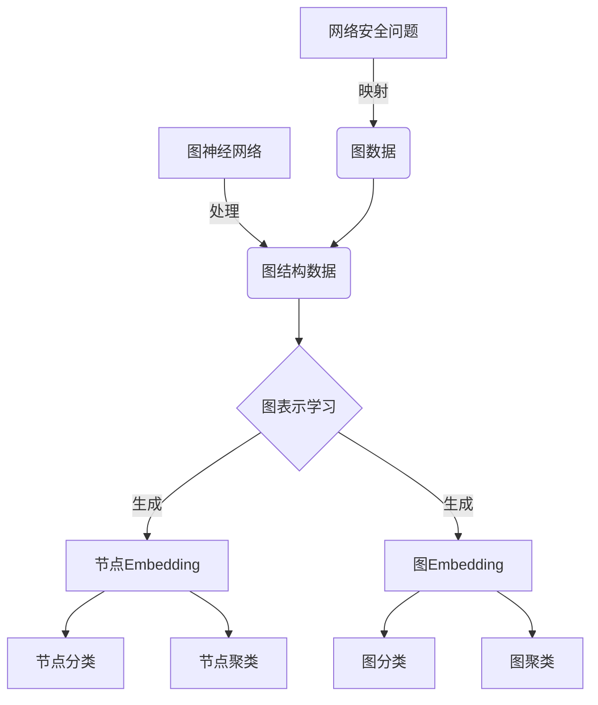
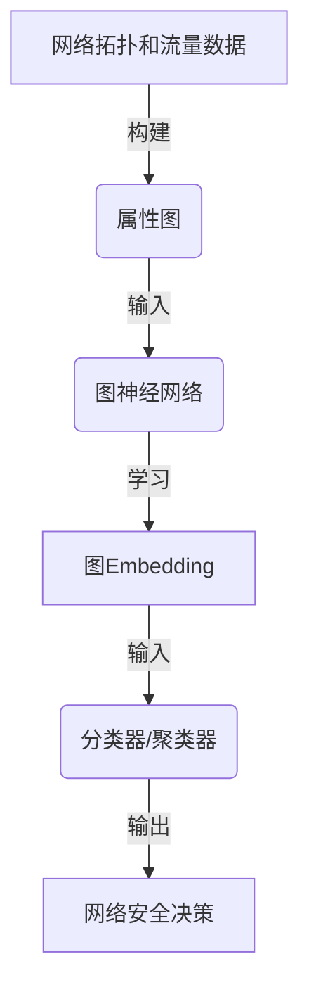
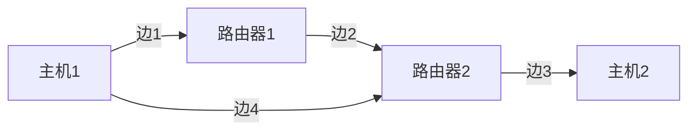

以下是标题为《一切皆是映射：AI在网络安全中的应用》的技术博客文章正文内容：

# 一切皆是映射：AI在网络安全中的应用

## 1. 背景介绍

### 1.1 问题的由来

在当今数字时代,网络安全已成为一个关键的全球性挑战。随着网络攻击日益复杂和不断演化,传统的网络安全防御措施已难以完全应对新型威胁。同时,网络流量和数据量的激增也给网络安全防御带来了巨大压力。因此,亟需探索新型网络安全防御技术来应对这些挑战。

### 1.2 研究现状 

人工智能(AI)技术在近年来取得了长足进步,展现出强大的数据处理和模式识别能力,为解决网络安全问题提供了新的思路。目前,AI在网络安全领域的应用主要集中在入侵检测、恶意软件分析、漏洞挖掘、威胁情报分析等方面。然而,现有方法还存在一些局限性,如对大规模异构数据处理能力不足、缺乏全局性网络视角等。

### 1.3 研究意义

本文旨在探讨如何利用AI技术,特别是深度学习和图神经网络等前沿方法,构建全面、高效的网络安全防御体系。通过建模网络拓扑结构和流量特征,将网络安全问题映射为图数据挖掘问题,从而实现全局性的网络状态感知和威胁检测。这一全新的AI驱动网络安全范式,有望彻底提升网络安全防御的智能化水平。

### 1.4 本文结构

本文首先介绍相关的核心概念,包括图神经网络、图表示学习等。然后详细阐述将网络安全问题映射为图数据挖掘问题的核心算法原理和数学模型。接下来通过实际案例,解释如何在代码层面实现该方法。最后探讨该技术在实际应用场景中的潜力,并对未来发展趋势和挑战进行展望。

## 2. 核心概念与联系

图神经网络(Graph Neural Networks, GNNs)是一种专门处理图结构数据的深度学习模型。它通过沿着图的边缘传播节点表示,捕捉图拓扑结构和节点属性的综合特征。

图表示学习(Graph Representation Learning)则旨在学习低维连续的向量表示(Embedding),编码图中节点/边的结构信息和属性信息。通过这种低维密集表示,可以高效地对图数据进行下游任务,如节点分类、图分类等。

将网络安全问题映射为图数据挖掘问题,是利用GNNs和图表示学习技术的一种创新方法。具体来说,可以将网络拓扑结构和流量特征建模为属性图,然后应用GNNs学习其图表示,最终完成入侵检测、恶意软件识别等网络安全任务。

## 3. 核心算法原理与具体操作步骤

### 3.1 算法原理概述

算法的核心思想是将网络拓扑结构和流量特征统一建模为属性图,然后利用图神经网络对该属性图进行端到端的表示学习,自动挖掘出与网络安全相关的拓扑和流量模式,最终完成入侵检测、恶意软件识别等任务。

具体来说,算法分为以下几个主要步骤:

1. 数据预处理:将网络拓扑和流量数据转化为属性图表示
2. 图表示学习:使用图神经网络对属性图进行编码,学习图Embedding
3. 下游任务:将学习到的图Embedding输入分类器/聚类器等模型,完成网络安全任务

### 3.2 算法步骤详解

#### 步骤1:数据预处理

首先需要将原始的网络拓扑和流量数据转化为属性图表示。可以将网络中的设备(如路由器、交换机等)作为节点,将链路作为边,同时将流量特征(如源IP、目的IP、端口号等)作为节点属性。通过这种方式,原始数据被编码为一个具有丰富属性信息的属性图。

#### 步骤2:图表示学习

接下来使用图神经网络对上一步得到的属性图进行编码,学习出图级别的Embedding表示。图神经网络的核心思想是沿着图的边缘传播和聚合邻居节点的表示,从而获得对每个节点的更新表示。通过多层传播聚合,最终可以生成整个图的Embedding,编码了图拓扑结构和节点属性的综合特征。

常用的图神经网络模型有图卷积神经网络(GCN)、图注意力网络(GAT)等。以GCN为例,在第l+1层,节点v的表示向量计算如下:

$$H^{(l+1)}_v = \sigma\left(\sum_{u\in\mathcal{N}(v)}\frac{1}{c_{v,u}}W^{(l)}H^{(l)}_u\right)$$

其中$\mathcal{N}(v)$表示节点v的邻居节点集合,W是可训练的权重矩阵,$c_{v,u}$是归一化常数,用于消除节点度数的影响。$\sigma$是非线性激活函数,如ReLU。

通过K层的信息传播和转换,GCN可以学习到包含了节点K阶邻域拓扑结构和属性信息的节点Embedding。然后对所有节点Embedding进行平均池化或其他聚合操作,即可得到整个图的Embedding表示。

#### 步骤3:下游任务

最后,将学习到的图Embedding输入下游的分类器或聚类器等模型,完成具体的网络安全任务,如入侵检测、恶意软件识别等。常用的分类器包括多层感知机(MLP)、支持向量机(SVM)等,也可以结合注意力机制等技术提升性能。

### 3.3 算法优缺点  

**优点:**

1. **全局建模**:通过将网络拓扑和流量特征统一建模为属性图,可以从全局视角捕捉网络状态,而不是局部分析。
2. **自动特征学习**:图神经网络能够自动挖掘出与网络安全相关的拓扑和流量模式,无需人工设计特征。
3. **端到端训练**:整个模型可以端到端地联合训练,无需分阶段处理,简化了流程。
4. **泛化能力强**:模型学习到的是网络拓扑和流量模式,可以很好地推广到新的未见过的网络环境。

**缺点:**

1. **训练数据需求量大**:训练高质量的图神经网络模型需要大量的标注数据,获取成本较高。
2. **可解释性较差**:目前图神经网络的内在工作机理还不够清晰,模型的"黑盒"特征影响了可解释性。
3. **计算复杂度高**:在大规模网络环境下,属性图的规模会很大,给模型的计算和存储带来压力。

### 3.4 算法应用领域

该算法可应用于以下网络安全领域:

- **入侵检测系统(IDS)**: 将算法应用于检测网络入侵行为,如垃圾邮件、网络攻击等。
- **恶意软件分析**: 通过分析软件调用图等,检测恶意软件样本。
- **网络流量分析**: 对网络流量的拓扑和统计特征建模,发现异常流量。
- **威胁情报分析**: 对网络威胁情报数据(如IP、域名等)进行关联分析和聚类。
- **网络配置优化**: 通过对网络拓扑和流量的建模,优化网络配置和资源调度。

## 4. 数学模型和公式详细讲解与举例说明

### 4.1 数学模型构建

我们将网络拓扑结构和流量特征统一建模为属性图$\mathcal{G} = (\mathcal{V}, \mathcal{E}, \mathbf{X})$:

- $\mathcal{V}$是节点集合,每个节点$v_i \in \mathcal{V}$表示网络中的一台设备(如路由器、交换机等)
- $\mathcal{E} \subseteq \mathcal{V} \times \mathcal{V}$是边集合,每个边$(v_i, v_j) \in \mathcal{E}$表示$v_i$和$v_j$之间有链路相连
- $\mathbf{X} \in \mathbb{R}^{|\mathcal{V}| \times d}$是节点属性矩阵,其中$\mathbf{x}_i \in \mathbb{R}^d$是节点$v_i$的属性向量,编码了该节点的流量特征(如源IP、目的IP、端口号等)

在这种表示下,网络拓扑结构对应于图的拓扑结构,而流量特征对应于节点属性向量。

### 4.2 公式推导过程

我们的目标是学习一个编码器$f: \mathcal{G} \mapsto \mathbf{z}$,将输入属性图$\mathcal{G}$映射为一个固定维度的向量表示$\mathbf{z} \in \mathbb{R}^{d'}$,即图的Embedding。这个Embedding应该能够编码图$\mathcal{G}$的拓扑结构和节点属性信息。

为此,我们采用图卷积神经网络(GCN)作为编码器$f$。在GCN中,节点的表示向量是通过聚合其邻居节点的表示,并经过线性变换和非线性激活函数得到的。具体地,在第$l+1$层,节点$v$的表示向量计算如下:

$$\mathbf{h}_v^{(l+1)} = \sigma\left(\sum_{u\in\mathcal{N}(v)}\frac{1}{c_{v,u}}\mathbf{W}^{(l)}\mathbf{h}_u^{(l)}\right)$$

其中:
- $\mathcal{N}(v)$是节点$v$的邻居节点集合
- $\mathbf{W}^{(l)} \in \mathbb{R}^{d^{(l+1)} \times d^{(l)}}$是当前层的可训练权重矩阵
- $c_{v,u}$是归一化常数,用于消除节点度数的影响,通常取$\sqrt{|\mathcal{N}(v)||N(u)|}$
- $\sigma$是非线性激活函数,如ReLU

在第0层,我们令$\mathbf{h}_v^{(0)} = \mathbf{x}_v$,即节点的初始表示为其属性向量。经过$L$层的信息传播和转换后,我们可以得到每个节点的$L$阶邻域信息的编码$\mathbf{h}_v^{(L)}$。

为了获得整个图$\mathcal{G}$的Embedding表示$\mathbf{z}$,我们对所有节点的$L$层表示进行平均池化:

$$\mathbf{z} = \mathrm{POOLING}\left(\left\{\mathbf{h}_v^{(L)} | v \in \mathcal{V}\right\}\right)$$

其中POOLING是平均池化操作,即对所有节点表示取平均值。

通过以上步骤,我们就学习到了一个能够编码图$\mathcal{G}$拓扑结构和节点属性信息的向量表示$\mathbf{z}$。这个向量表示可以被输入到下游的分类器或聚类器中,完成网络安全任务。

### 4.3 案例分析与讲解

假设我们有如下一个简单的网络拓扑结构,包含4个节点和4条边:

我们将其建模为一个