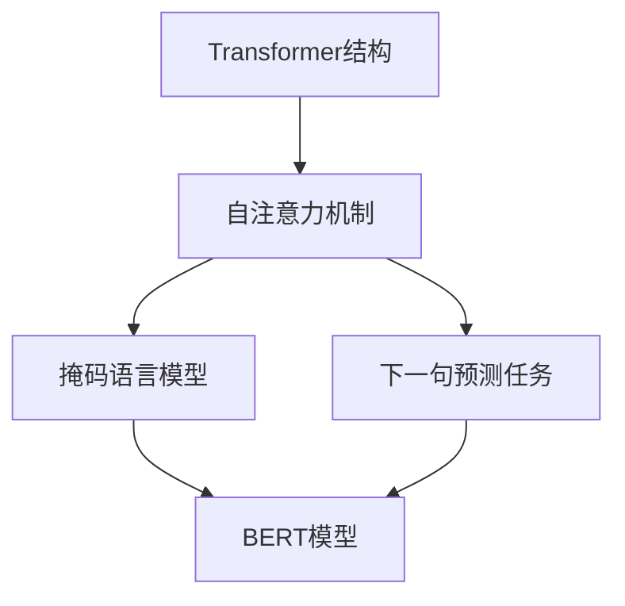

# 一切皆是映射：BERT模型原理及其在文本理解中的应用

## 1. 背景介绍

### 1.1 问题的由来

在自然语言处理(NLP)领域,文本理解一直是一个极具挑战的任务。传统的机器学习方法通常依赖于手工设计的特征工程,无法有效地捕捉文本中丰富的语义信息。随着深度学习技术的不断发展,基于神经网络的模型逐渐在NLP任务中展现出优异的性能。然而,早期的神经网络模型(如RNN和CNN)在处理长序列文本时仍存在一些局限性,例如无法很好地捕捉长距离依赖关系。

### 1.2 研究现状

为了解决上述问题,2018年,Google的AI研究人员提出了BERT(Bidirectional Encoder Representations from Transformers)模型。BERT是一种基于Transformer的双向编码器模型,能够捕捉文本中的上下文信息,从而更好地理解文本的语义。自从推出以来,BERT及其变体模型在各种NLP任务中取得了卓越的成绩,包括文本分类、机器阅读理解、自然语言推理等,引领了NLP领域的新潮流。

### 1.3 研究意义

BERT模型的出现不仅推动了NLP技术的发展,也为其他领域的研究带来了新的启示。BERT模型的核心思想是通过自监督学习方式在大规模语料库上进行预训练,获取通用的语言表示,然后在特定的下游任务上进行微调,从而实现语义理解。这种预训练与微调的范式为其他领域的迁移学习提供了新的思路。此外,BERT模型的双向编码器结构和自注意力机制也为序列建模提供了新的视角。

### 1.4 本文结构

本文将全面介绍BERT模型的原理及其在文本理解中的应用。首先,我们将探讨BERT模型的核心概念和关键技术,包括Transformer结构、自注意力机制、掩码语言模型等。接下来,我们将深入剖析BERT模型的算法原理和数学模型,并通过案例分析和代码实现加深理解。此外,我们还将探讨BERT模型在各种文本理解任务中的应用,包括文本分类、机器阅读理解、自然语言推理等。最后,我们将总结BERT模型的研究成果,展望其未来的发展趋势和面临的挑战。

## 2. 核心概念与联系

BERT模型的核心概念包括Transformer结构、自注意力机制、掩码语言模型和下一句预测任务等。这些概念相互关联,共同构建了BERT模型的理论基础。

1. **Transformer结构**是BERT模型的基础架构,它采用了全新的自注意力机制,能够有效地捕捉序列中的长距离依赖关系。

2. **自注意力机制**是Transformer结构的核心,它允许每个位置的输出与输入序列的所有其他位置相关联,从而捕捉全局依赖关系。

3. **掩码语言模型**是BERT模型预训练的主要任务之一,它通过随机掩码部分输入词元,并预测被掩码的词元,从而学习到双向的语义表示。

4. **下一句预测任务**是BERT模型预训练的另一个辅助任务,它旨在捕捉句子之间的关系,进一步提高模型的语义理解能力。

5. **BERT模型**通过在大规模语料库上进行预训练,学习到通用的语言表示,然后在特定的下游任务上进行微调,从而实现文本理解和其他NLP任务。

## 3. 核心算法原理 & 具体操作步骤

### 3.1 算法原理概述

BERT模型的核心算法原理可以概括为以下几个关键步骤:

1. **输入表示**:将文本序列转换为词元(token)序列,并添加特殊词元(如[CLS]和[SEP])用于表示句子和序列的边界。

2. **位置编码**:为每个词元添加位置信息,以捕捉序列中的位置依赖关系。

3. **Transformer编码器**:将词元序列输入到Transformer编码器中,通过多层自注意力和前馈神经网络进行编码,获得每个词元的上下文表示。

4. **掩码语言模型**:在预训练阶段,随机掩码部分输入词元,并使用其余词元的上下文表示来预测被掩码的词元。

5. **下一句预测任务**:在预训练阶段,判断两个句子是否相邻,以捕捉句子之间的关系。

6. **微调**:在下游任务上,根据任务类型对BERT模型进行微调,如添加特定的输出层、调整模型参数等。

7. **输出**:根据微调后的BERT模型,输出下游任务的预测结果。

### 3.2 算法步骤详解

1. **输入表示**

   BERT模型将输入文本序列转换为词元序列,其中包括单词、子词、标点符号等。为了区分不同的句子和序列,BERT模型在序列的开头添加一个特殊的[CLS]词元,用于表示整个序列的表示;在每个句子的结尾添加一个特殊的[SEP]词元,用于分隔不同的句子。

2. **位置编码**

   由于Transformer结构没有捕捉序列顺序的能力,BERT模型采用了位置编码的方式为每个词元添加位置信息。位置编码是一个与词元embedding维度相同的向量,通过一些特定的函数(如正弦函数和余弦函数)生成,能够唯一地表示每个词元在序列中的位置。

3. **Transformer编码器**

   BERT模型的核心是一个基于Transformer的双向编码器,由多层Transformer编码器块组成。每个编码器块包含一个多头自注意力子层和一个前馈神经网络子层。

   - **多头自注意力子层**:通过计算每个词元与其他词元的注意力权重,捕捉序列中的长距离依赖关系,生成每个词元的上下文表示。
   - **前馈神经网络子层**:对每个词元的上下文表示进行非线性变换,提取更高层次的特征表示。

   通过多层Transformer编码器块的计算,BERT模型能够获得每个词元的上下文表示,这些表示包含了序列中的双向语义信息。

4. **掩码语言模型**

   在预训练阶段,BERT模型采用了掩码语言模型(Masked Language Model, MLM)的任务。具体来说,对于输入的词元序列,BERT模型会随机选择15%的词元进行掩码(替换为[MASK]词元)。然后,BERT模型的目标是基于其余词元的上下文表示,预测被掩码的词元。通过这种自监督的方式,BERT模型能够学习到双向的语义表示,捕捉序列中的上下文信息。

5. **下一句预测任务**

   除了掩码语言模型任务,BERT模型还引入了下一句预测(Next Sentence Prediction, NSP)任务作为辅助任务。在预训练语料库中,BERT模型会随机采样一对句子,其中50%的样本是相邻的句子,另外50%是随机的句子对。BERT模型的目标是判断这两个句子是否相邻,从而学习到句子之间的关系。

6. **微调**

   在预训练阶段,BERT模型在大规模语料库上学习到通用的语言表示。对于特定的下游任务(如文本分类、机器阅读理解等),BERT模型需要进行微调。微调的过程包括:

   - 根据下游任务的类型,对BERT模型进行适当的修改,如添加特定的输出层、调整模型参数等。
   - 在标注的下游任务数据集上,使用监督学习的方式对BERT模型进行微调,优化模型参数。

   通过微调,BERT模型能够将预训练获得的通用语言表示迁移到特定的下游任务中,从而提高任务性能。

7. **输出**

   经过微调后,BERT模型可以根据下游任务的类型输出相应的预测结果,如文本分类标签、答案span等。

### 3.3 算法优缺点

**优点**:

1. **双向语义表示**:BERT模型通过掩码语言模型任务,能够学习到双向的语义表示,捕捉序列中的上下文信息,从而提高了语义理解能力。

2. **长距离依赖捕捉**:Transformer结构和自注意力机制使BERT模型能够有效地捕捉序列中的长距离依赖关系,克服了RNN等模型的局限性。

3. **通用语言表示**:BERT模型通过在大规模语料库上进行预训练,学习到了通用的语言表示,可以在多种下游任务上进行迁移学习,提高了模型的泛化能力。

4. **灵活的任务适配**:BERT模型可以通过微调的方式适配不同的下游任务,具有很强的灵活性和可扩展性。

**缺点**:

1. **计算资源消耗大**:BERT模型的预训练和微调过程需要消耗大量的计算资源,对硬件要求较高。

2. **序列长度限制**:由于自注意力机制的计算复杂度与序列长度的平方成正比,BERT模型在处理超长序列时会面临性能bottleneck。

3. **缺乏结构化知识**:BERT模型主要依赖于语料库中的统计模式,缺乏对结构化知识的利用,在某些任务上可能存在局限性。

4. **缺乏可解释性**:BERT模型是一个黑盒模型,其内部表示和决策过程缺乏可解释性,难以人类理解。

### 3.4 算法应用领域

BERT模型及其变体已经在多个NLP任务中取得了卓越的成绩,主要应用领域包括:

1. **文本分类**:如新闻分类、情感分析、垃圾邮件检测等。

2. **机器阅读理解**:根据给定的文本,回答相关的问题。

3. **自然语言推理**:判断一个假设是否能够从前提中得出。

4. **序列标注**:如命名实体识别、词性标注、关系抽取等。

5. **文本生成**:如机器翻译、文本摘要、对话系统等。

6. **信息检索**:通过语义匹配提高检索质量。

7. **知识图谱构建**:从文本中抽取实体、关系等知识元素。

除了NLP领域,BERT模型的思想也被应用到了计算机视觉、音频处理等其他领域,展现出了广阔的应用前景。

## 4. 数学模型和公式 & 详细讲解 & 举例说明

### 4.1 数学模型构建

BERT模型的核心是基于Transformer的编码器结构,其数学模型主要包括以下几个部分:

1. **词元嵌入(Token Embedding)**

   对于输入的词元序列$X = (x_1, x_2, \dots, x_n)$,BERT模型首先将每个词元$x_i$映射到一个固定维度的向量空间,得到词元嵌入$E_X = (e_1, e_2, \dots, e_n)$。

2. **位置编码(Positional Encoding)**

   为了捕捉序列中的位置信息,BERT模型为每个位置$i$添加一个位置编码向量$P_i$,与词元嵌入相加,得到输入表示$H_0 = E_X + P$。

3. **多头自注意力(Multi-Head Attention)**

   自注意力机制是Transformer结构的核心,它允许每个位置的输出与输入序列的所有其他位置相关联。具体来说,对于第$l$层的输入$H_{l-1}$,自注意力的计算过程如下:

   $$\begin{aligned}
   Q &= H_{l-1}W^Q \\
   K &= H_{l-1}W^K \\
   V &= H_{l-1}W^V \\
   \text{Attention}(Q, K, V) &= \text{softmax}\left(\frac{QK^T}{\sqrt{d_k}}\right)V
   \end{aligned}$$

   其中$W^Q, W^K, W^V$分别是查询(Query)、键(Key)和值(Value