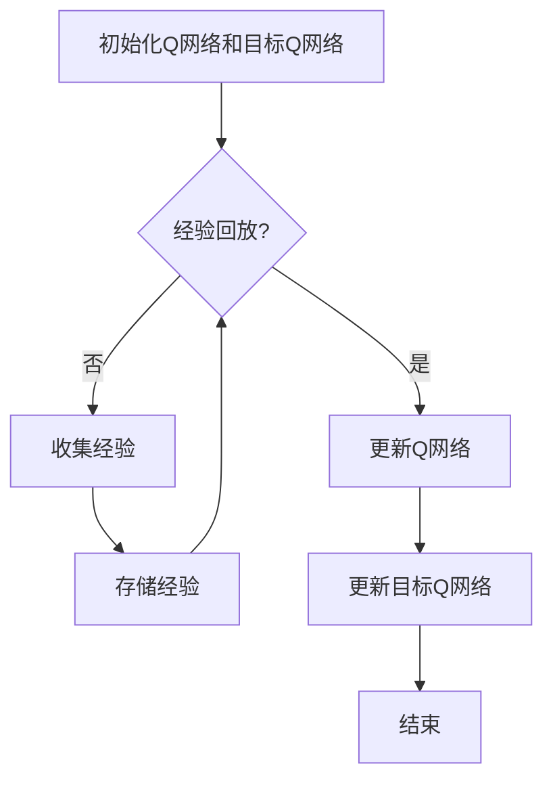

# 一切皆是映射：DQN算法改进历程与关键技术点

作者：禅与计算机程序设计艺术 / Zen and the Art of Computer Programming

## 1. 背景介绍

### 1.1 问题的由来

深度强化学习（Deep Reinforcement Learning，DRL）自提出以来，在多个领域取得了显著的成果。其中，深度Q网络（Deep Q-Network，DQN）作为DRL的代表算法之一，因其出色的性能和良好的可解释性，被广泛应用于游戏、自动驾驶、机器人控制等领域。

然而，DQN算法在处理连续动作空间、高维状态空间以及长时依赖问题时，仍存在一些局限性。为了克服这些局限，研究人员对DQN算法进行了不断的改进和优化。

### 1.2 研究现状

近年来，针对DQN算法的研究主要集中在以下几个方面：

1. **改进经验回放（Experience Replay）机制**：通过经验回放机制，可以有效地缓解样本波动和样本偏差问题，提高算法的收敛速度和稳定性。
2. **目标网络（Target Network）更新策略**：采用双网络结构，可以降低目标网络与主网络之间的误差，提高学习效果。
3. **动作选择策略**：采用ε-greedy策略、软ε-greedy策略等，可以平衡探索和利用，提高算法的适应性和稳定性。
4. **连续动作空间处理**：针对连续动作空间，采用动作编码和解码技术，将连续动作转换为离散动作，以便于DQN算法的输入和输出。

### 1.3 研究意义

DQN算法及其改进版本在强化学习领域具有重要的研究意义：

1. **推动DRL技术的发展**：通过不断改进和优化DQN算法，可以推动深度强化学习技术在各个领域的应用。
2. **丰富强化学习理论**：DQN算法及其改进版本的研究，为强化学习理论的发展提供了新的思路和方法。
3. **促进人工智能技术的进步**：DQN算法及其改进版本在多个领域的成功应用，为人工智能技术的进步提供了有力支持。

### 1.4 本文结构

本文将首先介绍DQN算法的核心概念和原理，然后详细阐述其关键技术点，并探讨其在实际应用中的改进方法。最后，本文将总结DQN算法的未来发展趋势和挑战。

## 2. 核心概念与联系

### 2.1 强化学习

强化学习是一种机器学习方法，通过智能体在环境中与环境的交互，学习如何完成特定任务。强化学习的基本要素包括：

- **智能体（Agent）**：执行任务并学习策略的实体。
- **环境（Environment）**：智能体所处的环境，包含状态、动作、奖励和过渡概率等。
- **策略（Policy）**：智能体根据当前状态选择动作的策略。
- **价值函数（Value Function）**：表示智能体在特定状态下采取某种策略所能获得的最大期望奖励。
- **策略梯度（Policy Gradient）**：用于优化策略参数的方法。

### 2.2 深度Q网络

深度Q网络（DQN）是一种基于深度学习的强化学习算法。DQN通过神经网络来近似Q函数，并通过Q值函数来指导智能体选择最优动作。

DQN的主要特点包括：

- **端到端学习**：直接从原始数据中学习，无需手动设计特征。
- **数据驱动**：利用大量的经验数据进行学习，具有较强的泛化能力。
- **可解释性**：Q值函数可以直观地表示智能体对某个状态的期望奖励。

### 2.3 经验回放

经验回放（Experience Replay）是一种在DQN中常用的技术，用于缓解样本波动和样本偏差问题。经验回放机制的主要思想是将智能体在训练过程中积累的经验存储在经验池中，然后从中随机抽取样本进行训练。

## 3. 核心算法原理 & 具体操作步骤

### 3.1 算法原理概述

DQN算法的基本原理如下：

1. **初始化Q网络和目标Q网络**：使用随机权重初始化Q网络和目标Q网络，并将目标Q网络设置为Q网络的软复制。
2. **收集经验**：智能体与环境交互，执行动作，并获取奖励和下一个状态。
3. **存储经验**：将收集到的经验存储在经验池中。
4. **经验回放**：从经验池中随机抽取一批经验，用于训练Q网络。
5. **更新Q网络**：使用最小化损失函数的方法更新Q网络权重。
6. **更新目标Q网络**：将Q网络的软复制更新为目标Q网络。

### 3.2 算法步骤详解

以下是DQN算法的具体操作步骤：



1. 初始化Q网络和目标Q网络：使用随机权重初始化Q网络和目标Q网络，并将目标Q网络设置为Q网络的软复制。
2. 经验回放：判断是否进行经验回放。
3. 如果进行经验回放，则从经验池中随机抽取一批经验，用于训练Q网络。
4. 更新Q网络：使用最小化损失函数的方法更新Q网络权重。
5. 更新目标Q网络：将Q网络的软复制更新为目标Q网络。
6. 如果未进行经验回放，则继续收集经验。
7. 将收集到的经验存储在经验池中。
8. 判断是否完成训练，如果完成则结束。

### 3.3 算法优缺点

**优点**：

- **端到端学习**：直接从原始数据中学习，无需手动设计特征。
- **数据驱动**：利用大量的经验数据进行学习，具有较强的泛化能力。
- **可解释性**：Q值函数可以直观地表示智能体对某个状态的期望奖励。

**缺点**：

- **样本方差较大**：由于经验回放机制，样本方差较大，可能导致收敛速度慢。
- **目标网络更新策略**：目标网络的更新策略可能导致学习不稳定。
- **处理连续动作空间能力有限**：DQN算法在处理连续动作空间时，需要采用特殊的动作编码和解码技术。

### 3.4 算法应用领域

DQN算法及其改进版本在多个领域取得了显著的应用成果，如：

- 游戏AI：例如，DQN算法在经典的视频游戏如Atari 2600游戏上实现了超人类水平的表现。
- 自动驾驶：DQN算法可以用于自动驾驶车辆的决策规划，提高车辆的行驶稳定性。
- 机器人控制：DQN算法可以用于机器人控制，实现机器人自主导航和任务执行。
- 机器翻译：DQN算法可以用于机器翻译任务，提高翻译的准确性和流畅性。

## 4. 数学模型和公式 & 详细讲解 & 举例说明

### 4.1 数学模型构建

DQN算法的核心是Q函数，它表示智能体在特定状态下采取某种策略所能获得的最大期望奖励。Q函数可以表示为：

$$Q(s, a) = \mathbb{E}[R_{t+1} | s, a] = \sum_{s'} P(s' | s, a) \cdot R(s', a)$$

其中，$s$表示当前状态，$a$表示采取的动作，$R(s', a)$表示在状态$s'$采取动作$a$所获得的奖励，$P(s' | s, a)$表示从状态$s$采取动作$a$转移到状态$s'$的概率。

### 4.2 公式推导过程

**Q函数的推导过程如下**：

1. **马尔可夫决策过程（MDP）**：假设智能体处于状态$s$，采取动作$a$，转移到状态$s'$，并获得奖励$R(s', a)$。根据MDP的性质，我们可以得到：

   $$R(s', a) = \sum_{s''} P(s'' | s', a) \cdot R(s'', a)$$

2. **期望值**：根据期望值的定义，我们可以得到：

   $$\mathbb{E}[R_{t+1} | s, a] = \sum_{s''} P(s'' | s, a) \cdot R(s'', a)$$

3. **Q函数**：将上述两个公式结合起来，我们可以得到Q函数的定义：

   $$Q(s, a) = \mathbb{E}[R_{t+1} | s, a] = \sum_{s'} P(s' | s, a) \cdot R(s', a)$$

### 4.3 案例分析与讲解

以下是一个简单的案例，说明DQN算法在Atari游戏中的应用：

**游戏环境**：Pong游戏

**状态**：游戏的当前画面

**动作**：向上移动、向下移动

**奖励**：根据球的得分和游戏状态给予奖励

**Q网络**：使用卷积神经网络（CNN）来近似Q函数

**训练过程**：

1. 初始化Q网络和目标Q网络
2. 智能体与环境交互，执行动作，并获取奖励和下一个状态
3. 将收集到的经验存储在经验池中
4. 从经验池中随机抽取一批经验，用于训练Q网络
5. 更新Q网络和目标Q网络

通过训练，智能体将学会在Pong游戏中根据当前画面选择最佳动作，实现自动控制游戏角色。

### 4.4 常见问题解答

**问题1**：DQN算法在训练过程中会出现样本方差较大的问题，如何解决？

**解答**：可以通过经验回放机制来缓解样本方差问题。经验回放机制可以将智能体在训练过程中积累的经验存储在经验池中，然后从中随机抽取样本进行训练，从而降低样本方差。

**问题2**：DQN算法在处理连续动作空间时，需要采用特殊的动作编码和解码技术，如何实现？

**解答**：可以将连续动作空间离散化，将连续动作映射到离散动作空间中，然后使用DQN算法进行训练。离散化方法可以采用等间隔划分、不等间隔划分或基于聚类的方法。

## 5. 项目实践：代码实例和详细解释说明

### 5.1 开发环境搭建

以下是DQN算法在Python环境下的开发环境搭建步骤：

1. 安装Python 3.6及以上版本
2. 安装TensorFlow 2.0及以上版本
3. 安装PyTorch 1.5及以上版本
4. 安装OpenAI Gym，用于构建游戏环境

```bash
pip install tensorflow==2.0
pip install torch==1.5
pip install gym
```

### 5.2 源代码详细实现

以下是一个简单的DQN算法实现示例：

```python
import random
import numpy as np
import torch
import torch.nn as nn
import torch.optim as optim
from gym import make

# 定义DQN网络
class DQN(nn.Module):
    def __init__(self, input_size, output_size):
        super(DQN, self).__init__()
        self.fc1 = nn.Linear(input_size, 128)
        self.fc2 = nn.Linear(128, output_size)

    def forward(self, x):
        x = torch.relu(self.fc1(x))
        x = self.fc2(x)
        return x

# 实例化网络、优化器、损失函数
input_size = 4
output_size = 2
model = DQN(input_size, output_size)
optimizer = optim.Adam(model.parameters(), lr=0.001)
criterion = nn.MSELoss()

# 创建环境
env = make('Pong-v0')

# 训练过程
for episode in range(1000):
    state = env.reset()
    state = torch.from_numpy(state).float()
    for step in range(500):
        action = model(state).argmax().item()
        next_state, reward, done, _ = env.step(action)
        next_state = torch.from_numpy(next_state).float()
        reward = torch.tensor([reward], dtype=torch.float32)
        if done:
            next_state = torch.zeros_like(state)
        target = reward + 0.99 * model(next_state).max(1)[0].detach()
        loss = criterion(model(state).gather(1, action.unsqueeze(1)), target)
        optimizer.zero_grad()
        loss.backward()
        optimizer.step()
        state = next_state
        if done:
            break
```

### 5.3 代码解读与分析

以上代码实现了DQN算法在Atari游戏Pong中的基本框架。以下是代码的解读与分析：

1. **DQN网络定义**：使用PyTorch框架定义DQN网络，包含两个全连接层。
2. **优化器与损失函数**：使用Adam优化器和均方误差（MSELoss）损失函数。
3. **环境创建**：使用OpenAI Gym创建Pong游戏环境。
4. **训练过程**：循环执行以下步骤：
   - 初始化状态
   - 选择动作
   - 执行动作并获取奖励和下一个状态
   - 更新目标函数
   - 更新网络参数

### 5.4 运行结果展示

运行上述代码后，智能体将在Pong游戏中进行学习，并逐渐提高游戏水平。

## 6. 实际应用场景

DQN算法及其改进版本在多个领域取得了显著的应用成果，以下是一些典型的应用场景：

### 6.1 游戏AI

DQN算法及其改进版本在多个经典游戏上实现了超人类水平的表现，如：

- **Atari游戏**：DQN算法在Pong、Space Invaders、Breakout等经典Atari游戏中取得了超人类水平的表现。
- **电子游戏**：DQN算法在电子游戏如星际争霸、英雄联盟等游戏中取得了较好的效果。

### 6.2 自动驾驶

DQN算法可以用于自动驾驶车辆的决策规划，提高车辆的行驶稳定性。例如，使用DQN算法可以实现自动驾驶车辆在复杂交通场景下的安全驾驶。

### 6.3 机器人控制

DQN算法可以用于机器人控制，实现机器人自主导航和任务执行。例如，使用DQN算法可以实现机器人在未知环境中的自主导航。

### 6.4 机器翻译

DQN算法可以用于机器翻译任务，提高翻译的准确性和流畅性。例如，使用DQN算法可以实现基于深度学习的机器翻译系统。

## 7. 工具和资源推荐

### 7.1 学习资源推荐

1. **《深度学习》**：作者：Ian Goodfellow, Yoshua Bengio, Aaron Courville
2. **《强化学习及其应用》**：作者：Stuart J. Russell, Peter Norvig

### 7.2 开发工具推荐

1. **TensorFlow**：https://www.tensorflow.org/
2. **PyTorch**：https://pytorch.org/
3. **OpenAI Gym**：https://gym.openai.com/

### 7.3 相关论文推荐

1. **Playing Atari with Deep Reinforcement Learning**：作者：Volodymyr Mnih, Koray Kavukcuoglu, David Silver, Alex Graves, Ioannis Antonoglou, Daan Wierstra, Martin Riedmiller
2. **Dueling Network Architectures for Deep Reinforcement Learning**：作者：Wojciech Zaremba, Ilya Sutskever

### 7.4 其他资源推荐

1. **GitHub**：https://github.com/
2. **Stack Overflow**：https://stackoverflow.com/

## 8. 总结：未来发展趋势与挑战

DQN算法及其改进版本在强化学习领域取得了显著的成果，为人工智能技术的发展做出了重要贡献。然而，DQN算法在实际应用中仍存在一些挑战和局限性：

### 8.1 未来发展趋势

1. **多智能体强化学习**：研究多智能体协同学习的方法，提高多智能体系统的性能和鲁棒性。
2. **多模态强化学习**：研究多模态数据的融合方法，实现多模态智能体的学习。
3. **强化学习与知识融合**：将强化学习与知识表示、推理等人工智能技术相结合，提高智能体的决策能力和适应性。

### 8.2 面临的挑战

1. **样本效率**：如何提高样本效率，降低训练成本，是DQN算法面临的一个挑战。
2. **稀疏奖励问题**：如何解决稀疏奖励问题，提高算法的收敛速度，是一个重要的研究方向。
3. **可解释性和可控性**：如何提高DQN算法的可解释性和可控性，使其在关键领域得到应用，是一个亟待解决的问题。

### 8.3 研究展望

随着人工智能技术的不断发展，DQN算法及其改进版本将在更多领域得到应用，并为人工智能技术的发展做出更大贡献。

## 9. 附录：常见问题与解答

### 9.1 什么是DQN算法？

DQN算法是一种基于深度学习的强化学习算法，通过神经网络来近似Q函数，并通过Q值函数来指导智能体选择最优动作。

### 9.2 DQN算法在处理连续动作空间时，需要采用特殊的动作编码和解码技术，如何实现？

可以将连续动作空间离散化，将连续动作映射到离散动作空间中，然后使用DQN算法进行训练。离散化方法可以采用等间隔划分、不等间隔划分或基于聚类的方法。

### 9.3 如何解决DQN算法在训练过程中出现的样本方差较大的问题？

可以通过经验回放机制来缓解样本方差问题。经验回放机制可以将智能体在训练过程中积累的经验存储在经验池中，然后从中随机抽取样本进行训练，从而降低样本方差。

### 9.4 DQN算法在实际应用中，如何解决稀疏奖励问题？

可以通过以下方法解决稀疏奖励问题：

1. 采用稀疏奖励折扣因子，降低稀疏奖励的影响。
2. 使用强化学习与无监督学习相结合的方法，提高稀疏奖励环境下的学习效果。
3. 采用多智能体强化学习，通过多个智能体之间的协作，提高整体的学习效果。

### 9.5 如何提高DQN算法的可解释性和可控性？

可以通过以下方法提高DQN算法的可解释性和可控性：

1. 使用可解释的神经网络架构，如稀疏网络、图神经网络等。
2. 采用可视化技术，如可视化Q值函数、策略梯度等，提高算法的可解释性。
3. 研究可解释的强化学习算法，如基于物理的强化学习、基于规则的强化学习等。