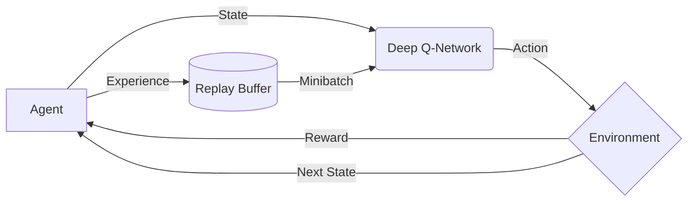

# 一切皆是映射：DQN算法的行业标准化：走向商业化应用

## 1. 背景介绍

### 1.1  问题的由来
近年来,随着人工智能技术的飞速发展,强化学习(Reinforcement Learning, RL)作为一种通用的学习和决策范式,在众多领域展现出了巨大的应用潜力。其中,以 Deep Q-Network(DQN)为代表的深度强化学习算法更是引领了一股研究热潮。DQN通过将深度学习与Q学习相结合,使得强化学习在复杂环境中的决策成为可能。然而,DQN算法在实际应用中仍面临诸多挑战,亟需在算法标准化、工程实践等方面进行系统性的研究,以推动其在工业界的规模化落地。

### 1.2  研究现状
自从 2015年 DeepMind提出 DQN并在 Atari游戏上取得突破性进展以来,学术界和工业界都对 DQN及其变种展开了广泛而深入的研究。Nature、ICML等顶级期刊和会议上发表了大量关于DQN改进和应用的论文,极大地推动了 DQN算法的发展。同时,DeepMind、OpenAI等知名机构也陆续开源了 DQN等深度强化学习算法的实现框架,促进了算法在各行各业中的应用探索。但目前 DQN在算法标准化和产业化落地方面的研究仍相对匮乏。

### 1.3  研究意义 
DQN作为深度强化学习的代表性算法之一,在智能体的感知、规划、决策等方面具有广阔的应用前景。系统梳理 DQN算法的技术标准,有助于加快该算法的迭代优化和成果转化。而探索 DQN在实际场景中的最佳实践,对于推动其商业化进程、释放产业价值具有重要意义。本文拟对 DQN算法进行全面剖析,并就其工程实现、行业应用等给出指导性建议,为后续研究提供参考。

### 1.4  本文结构
本文将从以下几个方面对 DQN算法进行深入探讨：第2部分介绍 DQN的核心概念与内在联系；第3部分重点阐述 DQN的算法原理与实现细节；第4部分从数学角度对 DQN的模型与公式进行推导与举例说明；第5部分给出 DQN的代码实例与详细解读；第6部分讨论 DQN在实际场景中的应用情况；第7部分分享 DQN相关的学习资源与开发工具；第8部分总结全文并展望 DQN的未来发展方向。

## 2. 核心概念与联系

DQN的提出源于传统强化学习和深度学习的结合。在标准的强化学习框架中,智能体(Agent)通过与环境(Environment)的交互来学习最优策略。具体来说,智能体根据当前环境状态(State)采取一个动作(Action),环境对该动作给予奖励(Reward)反馈,并更新到下一个状态。智能体的目标是最大化长期累积奖励,以找到最优行为策略。

Q-Learning 是一种经典的强化学习算法,其核心是学习一个 Q函数来估计在某个状态下采取特定动作的长期回报。Q函数的更新遵循贝尔曼方程(Bellman Equation):

$$Q(s,a) \leftarrow Q(s,a) + \alpha[r + \gamma \max_{a'}Q(s',a') - Q(s,a)]$$

其中,$s$为当前状态,$a$为在$s$下采取的动作,$r$为获得的即时奖励,$s'$为下一个状态,$\gamma$为折扣因子。Q-Learning的优点是简单直观,且能够保证收敛到最优策略。但在状态和动作空间很大的情况下,Q函数通常难以用表格的形式表示。

DQN的创新在于用深度神经网络来近似 Q函数,从而使得Q-Learning能够处理大规模的状态空间。DQN将Q函数参数化为 $Q(s,a;\theta)$,其中$\theta$为神经网络的权重,并通过最小化时序差分(TD)误差来训练该网络:

$$L(\theta) = \mathbb{E}_{(s,a,r,s')\sim D}[(r + \gamma \max_{a'}Q(s',a';\theta^-) - Q(s,a;\theta))^2]$$

这里的 $D$ 为经验回放(Experience Replay)池,用于存储智能体与环境交互的历史轨迹数据,打破了数据间的相关性。$\theta^-$为目标网络(Target Network)的参数,它是 $\theta$ 的一个延迟副本,以提高训练稳定性。

除了网络结构外,DQN还引入了一些重要的技巧,如:$\epsilon$-贪婪探索(Epsilon-Greedy Exploration)、双 DQN(Double DQN)、优先级经验回放(Prioritized Experience Replay)等,进一步增强了其性能表现。

总的来说,DQN继承了深度学习强大的特征提取和函数拟合能力,弥补了传统 Q-Learning在复杂环境中的不足,为强化学习的发展开辟了新的道路。理解 DQN内在机制和构件的协同作用,是掌握该算法的关键所在。

## 3. 核心算法原理 & 具体操作步骤

### 3.1  算法原理概述
DQN算法的核心思想是:利用深度神经网络来逼近最优Q函数,即在给定状态下采取某个动作的长期累积奖励期望。通过最小化TD误差,网络可以逐步学习到最优Q函数,并依此作出最优决策。整个训练过程可分为两个阶段:1)利用当前策略与环境交互,收集状态转移数据并存入回放池;2)从回放池中随机抽取小批量数据,计算TD误差并执行梯度下降,更新网络参数。不断重复上述两个阶段,最终得到最优策略。

### 3.2  算法步骤详解
1. 初始化 Q网络参数 $\theta$,目标网络参数 $\theta^-=\theta$,经验回放池 $D$
2. for episode = 1 to M do:
   1. 初始化环境,获得初始状态 $s_0$
   2. for t = 1 to T do:
      1. 根据 $\epsilon$-贪婪策略,以 $\epsilon$ 的概率随机选择动作 $a_t$,否则选择 $a_t=\arg\max_aQ(s_t,a;\theta)$
      2. 执行动作 $a_t$,观测奖励 $r_t$ 和下一状态 $s_{t+1}$
      3. 将四元组 $(s_t,a_t,r_t,s_{t+1})$ 存入 $D$ 
      4. 从 $D$ 中随机采样小批量数据 $\{(s_j,a_j,r_j,s_{j+1})\}$
      5. 计算目标值 $y_j$:
         - 若 $s_{j+1}$ 为终止状态,则 $y_j=r_j$
         - 否则, $y_j=r_j+\gamma \max_{a'}Q(s_{j+1},a';\theta^-)$
      6. 最小化损失: $L(\theta)=\frac{1}{N}\sum_j(y_j-Q(s_j,a_j;\theta))^2$,其中 $N$ 为小批量样本数
      7. 每隔 $C$ 步,将 $\theta^-$ 更新为 $\theta$
   3. end for
3. end for

### 3.3  算法优缺点
DQN的主要优点包括:

1. 端到端的学习范式,不需要人工设计特征,具有通用性。
2. 可处理大规模离散状态和动作空间,克服了维度灾难。 
3. 引入经验回放和目标网络,提升了训练效率和稳定性。
4. 支持非线性函数逼近,可学习复杂策略。

但DQN仍存在一些局限性:

1. 采样效率较低,需要大量的环境交互数据。
2. 对超参数较为敏感,调参需要经验和技巧。
3. 不适用于连续动作空间,需要进行离散化处理。
4. 在稀疏奖励和长期信用分配问题上表现不佳。

### 3.4  算法应用领域
DQN及其变体在诸多领域得到了成功应用,展现出广阔的前景:

1. 游戏:Atari系列游戏、星际争霸、Dota等
2. 机器人控制:机械臂操纵、四足机器人运动规划等  
3. 推荐系统:电商推荐、广告投放、新闻推荐等
4. 网络优化:数据中心冷却、网络路由、流量调度等
5. 金融:股票交易、投资组合管理、风险控制等
6. 自然语言处理:对话系统、问答系统、机器翻译等

随着DQN的不断发展和完善,其有望在更多实际场景中大显身手。

## 4. 数学模型和公式 & 详细讲解 & 举例说明

### 4.1  数学模型构建
DQN的数学模型建立在马尔可夫决策过程(Markov Decision Process, MDP)之上。一个MDP可以表示为一个五元组 $M=<S,A,P,R,\gamma>$:

- $S$ 为有限状态集
- $A$ 为有限动作集  
- $P$ 为状态转移概率矩阵,其中 $P(s'|s,a)$ 表示在状态 $s$ 下执行动作 $a$ 后转移到状态 $s'$ 的概率
- $R$ 为奖励函数,其中 $R(s,a)$ 表示在状态 $s$ 下执行动作 $a$ 后获得的即时奖励
- $\gamma \in [0,1]$ 为折扣因子,表示未来奖励的重要程度

MDP的目标是寻找一个最优策略 $\pi^*:S \rightarrow A$,使得智能体在所有状态下的长期累积奖励达到最大。定义状态-动作值函数(Q函数)为:

$$Q^\pi(s,a)=\mathbb{E}_\pi[\sum_{k=0}^\infty \gamma^kr_{t+k}|s_t=s,a_t=a]$$

它表示从状态 $s$ 开始,执行动作 $a$ 并根据策略 $\pi$ 选择后续动作所获得的累积奖励的期望。最优Q函数 $Q^*$ 满足贝尔曼最优方程:

$$Q^*(s,a)=R(s,a)+\gamma \sum_{s'\in S}P(s'|s,a)\max_{a'\in A}Q^*(s',a')$$

直觉上,最优动作值等于即时奖励加上下一状态的最大动作值的折现。贝尔曼方程为Q-Learning提供了理论基础。

### 4.2  公式推导过程
Q-Learning的核心是通过不断的探索和利用来逼近 $Q^*$。其更新公式为:

$$Q(s_t,a_t) \leftarrow Q(s_t,a_t) + \alpha[r_t + \gamma \max_aQ(s_{t+1},a) - Q(s_t,a_t)]$$

这里 $\alpha \in (0,1]$ 为学习率。可以证明,在适当的条件下,Q-Learning最终会收敛到 $Q^*$。

DQN在Q-Learning的基础上引入深度神经网络 $Q(s,a;\theta)$ 来近似 $Q^*$,其中 $\theta$ 为网络权重。定义目标值 $y_t$ 为:

$$y_t=\begin{cases}
r_t & \text{if } s_{t+1} \text{ is terminal} \\
r_t+\gamma \max_aQ(s_{t+1},a;\theta^-) & \text{otherwise}
\end{cases}$$

其中 $\theta^-$ 为目标网络参数,它是 $\theta$ 的延迟副本。DQN的损失函数为均方TD误差:

$$L(\theta)=\mathbb{E}_{(s,a,r,s')\sim D}[(y-Q(s,a;\theta))^2]$$

通过随机梯度下降来最小化损失函数,可得参数更新公式:

$$\theta \leftarrow \theta - \eta \nabla_\theta L(\theta)$$

其中 $\eta$ 为学习率。重复执行以上更新,直至 $Q