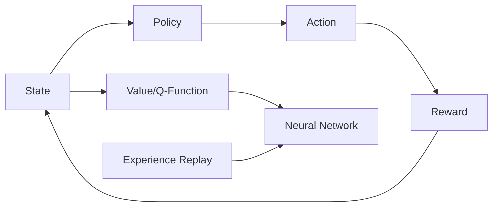

# 一切皆是映射：如何通过软件工程方法来维护和优化DQN代码

关键词：DQN, 深度强化学习, 软件工程, 代码维护, 代码优化, 设计模式, 面向对象, 测试驱动开发

## 1. 背景介绍

### 1.1 问题的由来

随着深度强化学习(Deep Reinforcement Learning, DRL)的快速发展,越来越多的研究者和工程师开始关注DRL算法的工程实现。其中,DQN(Deep Q-Network)作为DRL的代表算法之一,因其在Atari游戏、机器人控制等领域取得的突破性成果而备受瞩目。然而,DQN算法涉及的概念众多,代码实现复杂,对工程师的编程能力提出了较高要求。如何编写可读性强、易于维护和扩展的高质量DQN代码,成为了一个亟待解决的问题。

### 1.2 研究现状

目前,关于DQN算法的研究主要集中在算法本身的改进和应用拓展方面。例如,Double DQN[1]通过引入双Q网络解决了Q值估计偏高的问题；Dueling DQN[2]通过将Q值分解为状态值和优势函数提高了算法的稳定性；Rainbow[3]将多种改进方法集成在一起,进一步提升了DQN的性能表现。在应用方面,DQN及其变体被广泛应用于游戏AI[4]、自动驾驶[5]、推荐系统[6]等领域。

然而,现有研究较少关注DQN算法工程实现的软件质量问题。大多数论文只给出了简化版的伪代码,缺乏对工程细节的讨论。在GitHub等开源社区中,虽然存在大量的DQN开源实现,但代码质量参差不齐,可维护性和可扩展性有待提高。因此,亟需引入软件工程的理念和方法,指导DQN代码的编写和维护。

### 1.3 研究意义

本文尝试从软件工程的角度,探讨如何提高DQN代码的可维护性和可扩展性。具体而言,本文将重点讨论以下几个方面:

1. 如何将DQN算法的数学概念映射到编程语言的语法元素(类、函数等)中,构建清晰的概念模型。
2. 如何运用设计模式等面向对象技术,合理划分类的职责,降低类之间的耦合度。 
3. 如何基于测试驱动开发(TDD)的思想,编写可测试的DQN代码,提高代码的健壮性。
4. 如何利用Python语言的高级特性,编写简洁优雅的DQN代码,提高代码的可读性和开发效率。

通过系统地总结DQN代码实现的最佳实践,本文希望为DRL研究人员和工程师提供一份有益的参考,帮助大家写出高质量的DQN代码,加速DRL算法的工程落地。同时,本文的思路和方法也可以推广到其他DRL算法的工程实践中。

### 1.4 本文结构

本文后续章节安排如下:第2节介绍DQN算法涉及的核心概念,并讨论它们之间的联系;第3节重点阐述DQN算法的原理,给出详细的操作步骤;第4节建立DQN算法的数学模型,推导相关公式,并给出案例说明;第5节给出一个完整的DQN代码实现,并详细解释关键逻辑;第6节讨论DQN算法的实际应用场景;第7节推荐一些学习DQN的资源;第8节总结全文,展望DQN的未来发展方向,并指出面临的挑战;第9节列举一些常见问题,并给出参考答案。

## 2. 核心概念与联系

要实现一个完整的DQN系统,需要理解以下核心概念:

- 状态(State):描述智能体(Agent)所处的环境状态,通常用特征向量表示。
- 动作(Action):描述智能体可以采取的行为,通常是一个离散或连续的数值。
- 奖励(Reward):描述智能体采取某个动作后,环境给出的即时反馈,通常是一个标量值。
- 策略(Policy):描述智能体的行为模式,即在给定状态下,如何选择动作。
- 值函数(Value Function):描述状态的长期价值,即从该状态开始,智能体可以获得的累积奖励的期望。
- Q函数(Q-Function):描述在某个状态下采取某个动作的长期价值,是值函数的一种特殊形式。
- 神经网络(Neural Network):用于逼近值函数或Q函数的参数化函数,通常使用深度神经网络。
- 经验回放(Experience Replay):一种提高样本利用效率的技术,通过缓存并重复利用历史转移数据来训练神经网络。

这些概念之间的关系可以用下图表示:

智能体根据当前状态,使用策略选择动作,动作导致环境状态转移并产生奖励,奖励和新状态又被用于更新策略。值函数或Q函数则使用神经网络来逼近,神经网络的训练样本来自经验回放池。

理解了这些概念之间的联系,就可以开始设计DQN系统的整体架构了。一个典型的DQN系统通常包括以下几个模块:

- 环境模型:负责模拟智能体所处的环境,根据智能体的动作产生下一个状态和奖励。
- 智能体模型:负责根据当前状态选择动作,通常使用ϵ-贪心策略。
- 神经网络模型:负责逼近Q函数,通常使用卷积神经网络(CNN)处理原始像素输入,使用全连接层(FC)输出每个动作的Q值。
- 经验回放:负责存储历史转移数据,并从中随机抽样产生训练批次。
- 训练流程:负责协调各个模块,完成神经网络参数的更新。

基于这些模块,就可以构建一个完整的DQN系统。下面,我们将详细讨论DQN算法的原理和实现细节。

## 3. 核心算法原理 & 具体操作步骤

### 3.1 算法原理概述

DQN算法的核心思想是使用神经网络来逼近最优Q函数。传统的Q学习算法使用查找表来存储每个状态-动作对的Q值,但在状态和动作空间很大时,这种方法就不再适用。DQN算法的创新之处在于,它使用深度神经网络来拟合Q函数,将原始的高维状态空间映射到低维的隐空间,从而实现了端到端的Q值估计。

具体来说,DQN算法包含以下关键思想:

1. 使用CNN网络提取状态特征,使用FC层输出每个动作的Q值。
2. 使用目标网络(Target Network)计算Q学习的目标值,以提高算法稳定性。
3. 使用经验回放(Experience Replay)缓存并重复利用历史转移数据,打破了数据间的关联性。
4. 使用ϵ-贪心策略在探索和利用之间进行权衡,以平衡系统的即时和长期收益。

下面,我们将详细讨论DQN算法的每个步骤。

### 3.2 算法步骤详解

DQN算法的主要步骤如下:

1. 初始化Q网络和目标网络的参数,经验回放池D。
2. for episode = 1 to M do
3.    初始化初始状态s
4.    for t = 1 to T do
5.       使用ϵ-贪心策略,基于状态s选择动作a
6.       执行动作a,观察奖励r和下一状态s'
7.       将转移数据(s,a,r,s')存入D 
8.       从D中随机抽取一个批次的转移数据
9.       对于每个样本(s,a,r,s'),计算目标Q值:
            if s'是终止状态 then
                y = r
            else
                y = r + γ max_a' Q'(s',a') 
10.      使用均方误差(MSE)作为损失函数,更新Q网络参数
11.      每C步同步一次目标网络的参数
12.      s = s'
13.   end for
14. end for

其中,Q和Q'分别表示Q网络和目标网络,γ是折扣因子。第9步是DQN算法的核心,它使用目标网络计算了一个稳定的Q值目标,避免了因Q网络参数更新而导致的目标值振荡。第11步的参数同步则进一步提高了算法的稳定性。

### 3.3 算法优缺点

DQN算法的主要优点包括:

1. 端到端的学习能力,无需人工设计状态特征。
2. 通过神经网络泛化,可以处理大规模状态空间。
3. 使用经验回放,提高了样本利用效率。
4. 引入目标网络,提高了算法稳定性。

但DQN算法也存在一些局限性:

1. 只适用于离散动作空间,无法直接处理连续动作。
2. 对超参数敏感,训练时需要精细调参。
3. 难以应对部分可观察(Partially Observable)环境。
4. 在探索策略上有待改进,容易陷入局部最优。

针对这些问题,后续研究者提出了一系列改进版的DQN算法,如Double DQN、Dueling DQN、Rainbow等。

### 3.4 算法应用领域

DQN算法在以下领域取得了广泛应用:

1. 游戏AI:DQN在Atari系列游戏中实现了超越人类的表现[4],掀起了一股深度强化学习的研究热潮。
2. 机器人控制:DQN可以用于训练机器人执行抓取、装配等任务[7],提高了机器人的自主能力。
3. 自动驾驶:将DQN应用于自动驾驶可以处理连续的状态输入,实现端到端的决策控制[5]。 
4. 推荐系统:DQN可以建模用户的长期行为偏好,优化推荐系统的长期收益[6]。
5. 智能电网:DQN可以优化电网的调度和能源管理策略[8],提高电网的经济性和鲁棒性。

随着DQN算法的不断发展和完善,它有望在更多领域发挥重要作用。

## 4. 数学模型和公式 & 详细讲解 & 举例说明

### 4.1 数学模型构建

DQN算法可以建模为一个马尔可夫决策过程(Markov Decision Process, MDP)。一个MDP由一个六元组$(S,A,P,R,γ,μ_0)$定义,其中:

- $S$是有限状态集
- $A$是有限动作集  
- $P:S×A×S→[0,1]$是状态转移概率函数
- $R:S×A→ℝ$是奖励函数
- $γ∈[0,1]$是折扣因子
- $μ_0:S→[0,1]$是初始状态分布

在MDP框架下,智能体的目标是寻找一个最优策略$π^*:S→A$,使得期望累积奖励最大化:

$$π^*=argmax_πE_{μ_0}[∑_{t=0}^∞γ^tR(s_t,π(s_t))]$$

其中,$s_t$是第$t$步的状态。上式也被称为最优值函数$V^*(s)$:

$$V^*(s)=max_πE[∑_{t=0}^∞γ^tR(s_t,π(s_t))|s_0=s]$$

与之对应的是最优Q函数$Q^*(s,a)$:

$$Q^*(s,a)=E[R(s,a)+γmax_{a'}Q^*(s',a')]$$

其中,$s'$是在状态$s$下执行动作$a$后转移到的下一个状态。最优策略可以通过贪心地选择Q值最大的动作来实现:

$$π^*(s)=argmax_aQ^*(s,a)$$

因此,只要我们能够准确估计最优Q函数,就可以导出最优策略。

### 4.2 公式推导过程

DQN算法使用函数逼近的方法来估计Q函数。记神经网络的参数为$θ$,则Q函数可以表示为$Q(s,a;θ)$。我们希望通过最小化如