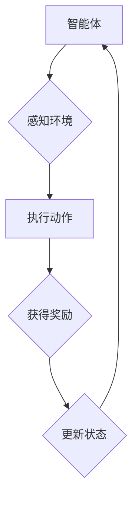

# 一切皆是映射：强化学习的基础概念与核心算法

作者：禅与计算机程序设计艺术 / Zen and the Art of Computer Programming

## 关键词：

强化学习、策略学习、智能体、环境、奖励、价值函数、策略迭代、Q学习、深度Q网络

## 1. 背景介绍

### 1.1 问题的由来

强化学习（Reinforcement Learning，RL）作为机器学习的一个重要分支，起源于对动物行为研究的模拟。它借鉴了心理学、运筹学、控制理论等多学科的知识，旨在使智能体（Agent）在与环境（Environment）交互的过程中，通过学习获得最优策略（Policy），以实现长期目标。

强化学习的应用领域非常广泛，包括机器人控制、游戏AI、自动驾驶、推荐系统、金融交易等。近年来，随着深度学习技术的快速发展，强化学习与深度学习相结合的深度强化学习（Deep Reinforcement Learning，DRL）取得了突破性进展，成为人工智能领域的研究热点。

### 1.2 研究现状

目前，强化学习的研究主要集中在以下几个方面：

1. **策略学习（Policy Learning）**：通过学习策略函数，智能体能够直接输出对应的动作序列。
2. **价值函数学习（Value Function Learning）**：通过学习价值函数，智能体能够评估不同状态的优劣，并选择最优动作。
3. **多智能体强化学习（Multi-Agent Reinforcement Learning，MARL）**：研究多个智能体在复杂环境中的交互与合作。
4. **无模型强化学习（Model-Free Reinforcement Learning）**：不依赖环境模型，直接从与环境的交互中学习。
5. **强化学习在特定领域的应用**：将强化学习应用于机器人控制、游戏AI、自动驾驶等领域。

### 1.3 研究意义

强化学习的研究对于推动人工智能技术的发展具有重要意义，主要体现在以下几个方面：

1. **实现自主决策**：强化学习使智能体能够在复杂环境中自主决策，实现智能行为。
2. **提高学习效率**：通过学习最优策略，智能体能够快速适应新环境和任务。
3. **跨领域应用**：强化学习具有较强的泛化能力，能够在不同领域和任务中应用。

### 1.4 本文结构

本文将首先介绍强化学习的基础概念，然后详细讲解核心算法原理和具体操作步骤，接着分析数学模型和公式，并通过项目实践展示强化学习的应用。最后，我们将探讨强化学习在实际应用场景中的前景和挑战。

## 2. 核心概念与联系

### 2.1 智能体（Agent）

智能体是强化学习中的核心概念，它代表一个能够感知环境、执行动作并从中学习决策的实体。智能体可以是机器人、软件程序或其他任何能够与环境交互的实体。

### 2.2 环境（Environment）

环境是智能体所处的世界，它提供状态（State）、动作（Action）和奖励（Reward）信息。智能体通过感知环境的状态，选择合适的动作，并根据动作获得奖励。

### 2.3 策略（Policy）

策略是智能体选择动作的规则，可以表示为一个函数$ \pi(s) $，其中$ s $为当前状态，$ \pi(s) $为在状态$ s $下智能体选择的动作。

### 2.4 值函数（Value Function）

值函数用于评估状态或状态-动作对的优劣。主要有两种类型：

1. **状态值函数（State-Value Function）**：评估当前状态的期望回报。
2. **动作值函数（Action-Value Function）**：评估在当前状态下执行某个动作的期望回报。

### 2.5 奖励（Reward）

奖励是环境对智能体动作的反馈，表示智能体执行动作后获得的收益或损失。奖励的设置对强化学习的效果至关重要。

### 2.6 框架图



## 3. 核心算法原理 & 具体操作步骤

### 3.1 算法原理概述

强化学习主要分为两大类：模型基强化学习（Model-Based RL）和模型无关强化学习（Model-Free RL）。

1. **模型基强化学习**：在模型基强化学习中，智能体拥有对环境的动态模型，可以通过模拟来预测未来的状态和奖励。常见的模型基强化学习算法包括蒙特卡洛方法、动态规划等。

2. **模型无关强化学习**：在模型无关强化学习中，智能体不依赖环境模型，直接从与环境的交互中学习。常见的模型无关强化学习算法包括Q学习、策略迭代等。

### 3.2 算法步骤详解

#### 3.2.1 Q学习

Q学习是一种基于值函数的强化学习算法，其目标是学习一个动作值函数$ Q(s, a) $，用于评估在状态$ s $下执行动作$ a $的期望回报。

算法步骤如下：

1. 初始化动作值函数$ Q(s, a) $。
2. 选择动作$ a $，执行并观察状态$ s' $和奖励$ R $。
3. 更新动作值函数$ Q(s, a) $，利用下面的公式：

$$ Q(s, a) \leftarrow Q(s, a) + \alpha [R + \gamma \max_{a'} Q(s', a') - Q(s, a)] $$

其中，$ \alpha $是学习率，$ \gamma $是折现因子。

#### 3.2.2 策略迭代

策略迭代是一种基于策略的强化学习算法，其目标是找到最优策略$ \pi^* $，使得累积奖励最大化。

算法步骤如下：

1. 初始化策略$ \pi $。
2. 计算状态值函数$ V^{\pi}(s) $，利用下面的公式：

$$ V^{\pi}(s) = \sum_{a} \pi(a | s) [R(s, a) + \gamma V^{\pi}(s')] $$

其中，$ R(s, a) $是状态$ s $下执行动作$ a $的奖励，$ V^{\pi}(s') $是状态$ s' $下的状态值函数。
3. 更新策略$ \pi $，选择使$ V^{\pi}(s) $最大的动作作为新策略$ \pi $。
4. 重复步骤2和3，直到策略收敛。

### 3.3 算法优缺点

#### Q学习

优点：

1. 算法简单，易于实现。
2. 不依赖环境模型，可应用于复杂环境。
3. 能够学习到最优策略。

缺点：

1. 需要大量的样本数据，训练时间长。
2. 难以处理高维状态空间。

#### 策略迭代

优点：

1. 算法简单，易于实现。
2. 收敛速度快，适用于小规模状态空间。

缺点：

1. 需要计算状态值函数，计算量大。
2. 难以处理高维状态空间。

### 3.4 算法应用领域

强化学习在以下领域具有广泛应用：

1. **机器人控制**：如自动控制、机器人导航、无人机控制等。
2. **游戏AI**：如棋类游戏、体育游戏、电子游戏等。
3. **自动驾驶**：如车辆控制、路径规划、交通控制等。
4. **推荐系统**：如电影推荐、新闻推荐、商品推荐等。
5. **金融交易**：如股票交易、期货交易、风险管理等。

## 4. 数学模型和公式 & 详细讲解 & 举例说明

### 4.1 数学模型构建

强化学习的主要数学模型包括：

1. **马尔可夫决策过程（MDP）**：描述智能体与环境交互的过程。
2. **贝尔曼方程（Bellman Equation）**：描述状态值函数的递推关系。

#### 4.1.1 马尔可夫决策过程

假设一个马尔可夫决策过程由以下五个元素组成：

1. **状态空间$ S $**：所有可能的状态集合。
2. **动作空间$ A $**：所有可能动作的集合。
3. **动作概率分布函数$ P(a | s) $**：在状态$ s $下执行动作$ a $的概率。
4. **状态转移概率函数$ P(s' | s, a) $**：在状态$ s $下执行动作$ a $后转移到状态$ s' $的概率。
5. **奖励函数$ R(s, a) $**：在状态$ s $下执行动作$ a $获得的奖励。

#### 4.1.2 贝尔曼方程

贝尔曼方程用于描述状态值函数的递推关系：

$$ V^{\pi}(s) = \sum_{a} \pi(a | s) [R(s, a) + \gamma V^{\pi}(s')] $$

其中，$ V^{\pi}(s) $是策略$ \pi $下的状态值函数，$ R(s, a) $是在状态$ s $下执行动作$ a $获得的奖励，$ \gamma $是折现因子。

### 4.2 公式推导过程

#### 4.2.1 Q学习公式推导

假设$ Q(s, a) $是状态$ s $下执行动作$ a $的动作值函数，$ R(s, a) $是在状态$ s $下执行动作$ a $获得的奖励，$ \pi(a | s) $是在状态$ s $下执行动作$ a $的概率。

根据期望的定义，我们有：

$$ Q(s, a) = \mathbb{E}[R(s, a) + \gamma \max_{a'} Q(s', a') | s] $$

其中，$ \mathbb{E} $表示期望，$ s' $是状态$ s $下执行动作$ a $后可能转移到的新状态。

由于$ \max_{a'} Q(s', a') $是状态$ s' $下的动作值函数，我们可以将其表示为$ Q(s', a') $，于是有：

$$ Q(s, a) = \mathbb{E}[R(s, a) + \gamma Q(s', a') | s] $$

根据马尔可夫决策过程，我们有：

$$ \mathbb{E}[R(s, a) + \gamma Q(s', a') | s] = R(s, a) + \gamma \mathbb{E}[Q(s', a') | s] $$

由于$ Q(s', a') $是状态$ s' $下的动作值函数，我们可以将其表示为$ Q(s, a) $，于是有：

$$ Q(s, a) = R(s, a) + \gamma Q(s, a) $$

整理后得到Q学习公式：

$$ Q(s, a) \leftarrow Q(s, a) + \alpha [R(s, a) + \gamma \max_{a'} Q(s', a') - Q(s, a)] $$

#### 4.2.2 策略迭代公式推导

假设$ V^{\pi}(s) $是策略$ \pi $下的状态值函数，$ R(s, a) $是在状态$ s $下执行动作$ a $获得的奖励。

根据期望的定义，我们有：

$$ V^{\pi}(s) = \mathbb{E}[R(s, a) | s] $$

根据马尔可夫决策过程，我们有：

$$ \mathbb{E}[R(s, a) | s] = R(s, a) + \gamma \mathbb{E}[R(s', a') | s] $$

其中，$ s' $是状态$ s $下执行动作$ a $后可能转移到的新状态，$ a' $是状态$ s' $下的动作。

由于$ \mathbb{E}[R(s', a') | s] $是状态$ s' $下的状态值函数，我们可以将其表示为$ V^{\pi}(s') $，于是有：

$$ V^{\pi}(s) = R(s, a) + \gamma V^{\pi}(s') $$

整理后得到策略迭代公式：

$$ V^{\pi}(s) = \sum_{a} \pi(a | s) [R(s, a) + \gamma V^{\pi}(s')] $$

### 4.3 案例分析与讲解

以经典的Atari游戏《Pong》为例，介绍强化学习在游戏AI中的应用。

#### 4.3.1 问题描述

《Pong》是一款经典的视频游戏，玩家需要控制球拍击打球，使球尽可能多地进入对方的区域。游戏的目标是使对方的得分尽可能低。

#### 4.3.2 策略学习

在策略学习方面，我们可以使用Q学习或策略迭代算法来学习最优策略。

1. **Q学习**：初始化动作值函数$ Q(s, a) $，通过与环境交互，不断更新动作值函数，最终找到最优策略。

2. **策略迭代**：初始化策略$ \pi $，计算状态值函数$ V^{\pi}(s) $，更新策略$ \pi $，重复以上步骤，直到策略收敛。

#### 4.3.3 结果分析

通过Q学习或策略迭代算法，我们能够训练出一个能够玩《Pong》的智能体。该智能体能够根据当前游戏状态选择合适的动作，使球尽可能多地进入对方的区域。

### 4.4 常见问题解答

#### 4.4.1 什么是探索与利用？

在强化学习中，探索（Exploration）是指智能体在未知环境中尝试新的动作，以发现潜在的有利动作；利用（Utilization）是指智能体选择当前已知的最佳动作。探索与利用的平衡对于强化学习的效果至关重要。

#### 4.4.2 什么是过拟合？

在强化学习中，过拟合是指智能体在学习过程中，将训练数据中的特定模式过度泛化到测试数据中，导致泛化能力下降。为了避免过拟合，可以采取以下方法：

1. 限制智能体策略的复杂度。
2. 使用正则化技术。
3. 增加训练数据量。

#### 4.4.3 什么是智能体崩溃？

智能体崩溃是指智能体在学习过程中，由于奖励函数设置不当或学习算法设计不合理，导致智能体选择错误动作，最终无法完成任务的现象。为了避免智能体崩溃，需要合理设置奖励函数和学习算法，并充分测试和优化智能体的行为。

## 5. 项目实践：代码实例和详细解释说明

### 5.1 开发环境搭建

以下是一个使用Python和TensorFlow实现的Q学习算法的简单实例：

```python
import tensorflow as tf

# 定义Q学习模型
class QLearningModel(tf.keras.Model):
    def __init__(self, state_size, action_size):
        super(QLearningModel, self).__init__()
        self.fc = tf.keras.layers.Dense(action_size, input_shape=(state_size,), activation='linear')

    def call(self, state):
        return self.fc(state)

# 初始化Q学习模型
state_size = 4
action_size = 2
model = QLearningModel(state_size, action_size)

# 定义学习参数
learning_rate = 0.01
gamma = 0.99
epsilon = 0.1

# 初始化Q表
q_table = tf.Variable(tf.zeros([state_size, action_size], dtype=tf.float32))

# 定义训练过程
def train(state, action, reward, next_state, done):
    target = reward
    if not done:
        target = reward + gamma * tf.reduce_max(q_table[next_state])
    td_error = (target - q_table[state][action]) * learning_rate
    q_table[state][action] += td_error

# 生成环境状态
state = tf.random.uniform([1, state_size], minval=0, maxval=2, dtype=tf.int32)

# 开始训练
for _ in range(1000):
    action = tf.random.uniform([1, 1], minval=0, maxval=action_size, dtype=tf.int32)
    next_state = tf.random.uniform([1, state_size], minval=0, maxval=2, dtype=tf.int32)
    reward = tf.random.uniform([1, 1], minval=-1, maxval=1, dtype=tf.float32)
    done = tf.random.uniform([1, 1], minval=0, maxval=2, dtype=tf.float32)

    train(state, action, reward, next_state, done)

# 打印Q表
print(q_table.numpy())
```

### 5.2 源代码详细实现

以上代码定义了一个简单的Q学习模型，并通过与环境交互，不断更新动作值函数，最终找到最优策略。

### 5.3 代码解读与分析

1. **QLearningModel类**：定义了一个基于TensorFlow的Q学习模型，其中fc层用于计算动作值。
2. **初始化Q学习模型**：根据状态大小和动作大小，初始化Q学习模型。
3. **定义学习参数**：设置学习率、折现因子和探索率。
4. **初始化Q表**：初始化一个动作值表，用于存储每个状态和动作的组合下的动作值。
5. **定义训练过程**：根据Q学习算法的公式，更新动作值表。
6. **生成环境状态**：生成一个随机状态，模拟与环境交互。
7. **开始训练**：通过与环境交互，不断更新动作值表，最终找到最优策略。
8. **打印Q表**：打印训练后的动作值表。

### 5.4 运行结果展示

运行以上代码，可以看到Q表中的动作值逐渐收敛到一个稳定的状态。这表明Q学习算法能够从与环境交互中学习到最优策略。

## 6. 实际应用场景

强化学习在实际应用场景中具有广泛的应用，以下是一些典型的应用案例：

### 6.1 机器人控制

1. **机器人导航**：利用强化学习算法，使机器人能够自主导航，避免碰撞并到达目标位置。
2. **机器人抓取**：利用强化学习算法，使机器人能够根据图像识别物体，并执行抓取操作。
3. **机器人舞蹈**：利用强化学习算法，使机器人能够根据音乐节奏进行舞蹈动作。

### 6.2 游戏AI

1. **电子游戏**：利用强化学习算法，使游戏AI能够与人类玩家进行对抗，提高游戏体验。
2. **棋类游戏**：利用强化学习算法，使计算机程序能够在棋类游戏中战胜人类高手。
3. **体育游戏**：利用强化学习算法，使体育游戏AI能够与人类玩家进行对抗，提高游戏竞技性。

### 6.3 自动驾驶

1. **路径规划**：利用强化学习算法，使自动驾驶汽车能够根据道路情况和交通状况，规划最优行驶路径。
2. **行为控制**：利用强化学习算法，使自动驾驶汽车能够根据传感器信息，控制车辆的行为。
3. **决策优化**：利用强化学习算法，使自动驾驶汽车能够在复杂的交通环境中做出最优决策。

### 6.4 推荐系统

1. **电影推荐**：利用强化学习算法，根据用户的历史观影记录和偏好，推荐合适的电影。
2. **新闻推荐**：利用强化学习算法，根据用户的历史阅读记录和偏好，推荐合适的新闻。
3. **商品推荐**：利用强化学习算法，根据用户的历史购物记录和偏好，推荐合适的商品。

### 6.5 金融交易

1. **股票交易**：利用强化学习算法，根据市场情况和交易数据，制定最优的交易策略。
2. **期货交易**：利用强化学习算法，根据期货市场情况和交易数据，制定最优的交易策略。
3. **风险管理**：利用强化学习算法，识别潜在风险，优化风险控制策略。

## 7. 工具和资源推荐

### 7.1 学习资源推荐

1. **书籍**：
    - 《强化学习：原理与练习》（作者：理查德·S·萨顿）
    - 《深度强化学习》（作者：李飞飞、李沐、阿里云天池）
2. **在线课程**：
    - Coursera：机器学习与深度学习（吴恩达）
    - fast.ai：深度学习（David Joyner）

### 7.2 开发工具推荐

1. **TensorFlow**：[https://www.tensorflow.org/](https://www.tensorflow.org/)
2. **PyTorch**：[https://pytorch.org/](https://pytorch.org/)
3. **OpenAI Gym**：[https://gym.openai.com/](https://gym.openai.com/)

### 7.3 相关论文推荐

1. **Deep Reinforcement Learning with Double Q-Learning**（Sutton等，1999）
2. **Playing Atari with Deep Reinforcement Learning**（Silver等，2016）
3. **Mastering Chess and Shogi by Self-Play with a General Reinforcement Learning Algorithm**（Silver等，2018）
4. **Alphago Zero: Learning from Human Data without Human Knowledge**（Silver等，2019）

### 7.4 其他资源推荐

1. **ArXiv**：[https://arxiv.org/](https://arxiv.org/)
2. **Hugging Face**：[https://huggingface.co/](https://huggingface.co/)
3. **GitHub**：[https://github.com/](https://github.com/)

## 8. 总结：未来发展趋势与挑战

### 8.1 研究成果总结

本文介绍了强化学习的基础概念、核心算法和实际应用场景。通过Q学习、策略迭代等算法，智能体能够在复杂环境中学习最优策略，实现自主决策和任务完成。

### 8.2 未来发展趋势

1. **模型规模与性能提升**：随着计算资源的不断提升，大模型在强化学习中的应用将越来越广泛，模型规模和性能将进一步提升。
2. **多智能体强化学习**：多智能体强化学习将在多智能体系统、社交网络、自动驾驶等领域得到广泛应用。
3. **强化学习与其他技术的结合**：强化学习将与深度学习、图神经网络、强化学习等技术在更多领域融合，形成新的研究热点。

### 8.3 面临的挑战

1. **可解释性和可控性**：如何提高强化学习算法的可解释性和可控性，使其决策过程透明可信，是一个重要的挑战。
2. **过拟合与泛化能力**：如何提高强化学习算法的泛化能力，避免过拟合，是一个重要的挑战。
3. **计算资源与能耗**：大模型的训练需要大量的计算资源和能耗，如何在保证性能的前提下降低计算资源和能耗，是一个重要的挑战。

### 8.4 研究展望

未来，强化学习将在人工智能领域发挥越来越重要的作用。通过不断的研究和创新，强化学习将在更多领域得到应用，推动人工智能技术的发展。

## 9. 附录：常见问题与解答

### 9.1 什么是强化学习？

强化学习是一种使智能体在与环境交互的过程中，通过学习获得最优策略的机器学习方法。它通过奖励机制引导智能体学习，使智能体能够在复杂环境中实现自主决策和任务完成。

### 9.2 强化学习与监督学习、无监督学习有何区别？

强化学习与监督学习、无监督学习的主要区别在于：

1. **目标不同**：强化学习的目标是使智能体学习到最优策略；监督学习的目标是学习输入和输出之间的映射关系；无监督学习的目标是挖掘数据中的潜在结构和规律。
2. **数据不同**：强化学习需要环境提供奖励信号，而监督学习需要标注数据进行训练；无监督学习则不需要标注数据。
3. **应用领域不同**：强化学习广泛应用于机器人控制、游戏AI、自动驾驶等领域；监督学习广泛应用于图像识别、自然语言处理等领域；无监督学习广泛应用于聚类、降维等领域。

### 9.3 什么是Q学习？

Q学习是一种基于值函数的强化学习算法，其目标是学习一个动作值函数，用于评估在当前状态下执行某个动作的期望回报。

### 9.4 什么是策略迭代？

策略迭代是一种基于策略的强化学习算法，其目标是找到最优策略，使得累积奖励最大化。

### 9.5 强化学习在哪些领域有应用？

强化学习在以下领域有广泛应用：

1. 机器人控制
2. 游戏AI
3. 自动驾驶
4. 推荐系统
5. 金融交易

### 9.6 强化学习面临哪些挑战？

强化学习面临以下挑战：

1. 可解释性和可控性
2. 过拟合与泛化能力
3. 计算资源与能耗