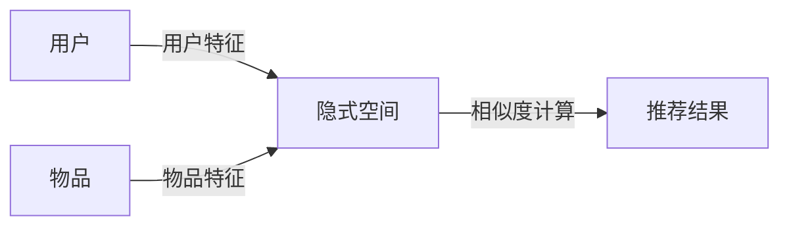

# 一切皆是映射：推荐系统与AI：个性化的艺术

关键词：推荐系统、人工智能、个性化、机器学习、深度学习、协同过滤、矩阵分解、知识图谱、强化学习

## 1. 背景介绍
### 1.1  问题的由来
在互联网时代,信息爆炸式增长,用户面临着海量的信息和选择。如何从茫茫信息海洋中找到自己感兴趣的内容,成为了一个亟待解决的问题。个性化推荐系统应运而生,它能够根据用户的历史行为和偏好,自动为用户推荐感兴趣的物品,极大提升了用户的使用体验。

### 1.2  研究现状
目前,个性化推荐系统已经被广泛应用于电子商务、社交网络、视频网站、新闻资讯等诸多领域。亚马逊、Netflix、YouTube等互联网巨头都将推荐系统作为其核心竞争力。学术界对推荐系统的研究也方兴未艾,从早期的协同过滤到矩阵分解,再到如今的深度学习和强化学习,推荐算法不断发展,推荐效果持续提升。

### 1.3  研究意义
个性化推荐不仅能提升用户满意度、增强用户粘性,还可以提高商品的转化率,为企业创造更多价值。研究推荐系统,对于改善人机交互、提升信息获取效率、促进电子商务发展都具有重要意义。同时,推荐系统中蕴含的人工智能技术,如机器学习、知识图谱等,对于人工智能的整体发展也有重要启示。

### 1.4  本文结构
本文将从推荐系统的核心概念出发,介绍其与人工智能技术的联系,重点阐述几种主流的推荐算法。通过理论分析、数学建模、代码实践等方式,全面剖析推荐系统的原理和应用。同时,展望推荐系统的未来发展趋势和面临的挑战。

## 2. 核心概念与联系
推荐系统的核心是"映射"(Mapping),即将用户和物品映射到同一个隐式空间,通过计算用户和物品在该空间的相似度,实现个性化推荐。用户特征(如人口统计学特征、历史行为)和物品特征(如内容属性、上下文信息)都可以作为映射的基础。

推荐系统与人工智能有着天然的联系。机器学习是实现推荐系统的核心技术,包括监督学习、无监督学习、强化学习等。深度学习凭借其强大的表征学习能力,在推荐系统中也得到广泛应用。知识图谱可以为推荐系统引入外部知识,增强推荐的解释性。



## 3. 核心算法原理 & 具体操作步骤
### 3.1  算法原理概述
推荐系统的核心算法主要包括:

1. 协同过滤(Collaborative Filtering):基于用户或物品的相似性进行推荐,分为基于用户的协同过滤和基于物品的协同过滤。

2. 矩阵分解(Matrix Factorization):将用户-物品评分矩阵分解为用户隐因子矩阵和物品隐因子矩阵,实现用户-物品的隐式表示。

3. 深度学习(Deep Learning):利用深度神经网络学习用户和物品的隐式表示,捕捉复杂的非线性关系。

4. 强化学习(Reinforcement Learning):将推荐问题建模为马尔可夫决策过程,通过不断与环境交互学习最优推荐策略。

### 3.2  算法步骤详解
以矩阵分解为例,详细介绍其算法步骤:

输入:用户-物品评分矩阵 $R$,隐因子维度 $K$,正则化系数 $\lambda$,学习率 $\alpha$。

1. 随机初始化用户隐因子矩阵 $P$ 和物品隐因子矩阵 $Q$。

2. 固定 $Q$,对 $P$ 中的每个元素 $p_{uk}$,计算梯度并更新:

$$
\frac{\partial}{\partial p_{uk}}=\sum_{i\in I_u}(r_{ui}-\hat{r}_{ui})q_{ik}-\lambda p_{uk}
$$
$$
p_{uk}\leftarrow p_{uk}+\alpha\frac{\partial}{\partial p_{uk}}
$$

3. 固定 $P$,对 $Q$ 中的每个元素 $q_{ik}$,计算梯度并更新:

$$
\frac{\partial}{\partial q_{ik}}=\sum_{u\in U_i}(r_{ui}-\hat{r}_{ui})p_{uk}-\lambda q_{ik}
$$
$$
q_{ik}\leftarrow q_{ik}+\alpha\frac{\partial}{\partial q_{ik}}
$$

4. 重复步骤2和3,直到收敛或达到最大迭代次数。

输出:用户隐因子矩阵 $P$ 和物品隐因子矩阵 $Q$,预测评分 $\hat{R}=PQ^T$。

### 3.3  算法优缺点
矩阵分解的优点是:
- 可以捕捉用户-物品交互行为中的隐式模式
- 泛化能力强,能处理稀疏评分矩阵
- 计算效率高,可以实现实时推荐

缺点是:
- 无法处理冷启动问题(新用户/新物品)
- 对于非线性关系建模能力有限
- 缺乏可解释性

### 3.4  算法应用领域
矩阵分解广泛应用于电影推荐(Netflix)、音乐推荐(Spotify)、商品推荐(亚马逊)等领域。它常常与其他技术(如邻域法、图嵌入等)结合使用,以进一步提升推荐效果。

## 4. 数学模型和公式 & 详细讲解 & 举例说明
### 4.1  数学模型构建
矩阵分解的数学模型可以表示为:

$$
\min_{P,Q} \sum_{(u,i)\in K}(r_{ui}-p_u^Tq_i)^2+\lambda(\|P\|_F^2+\|Q\|_F^2)
$$

其中,$K$是已知评分的用户-物品对集合,$p_u$和$q_i$分别是用户$u$和物品$i$的隐因子向量,$\lambda$是正则化系数,目的是防止过拟合。

### 4.2  公式推导过程
上述优化问题可以通过随机梯度下降法求解。对于每个已知评分$r_{ui}$,我们计算损失:

$$
L_{ui}=(r_{ui}-p_u^Tq_i)^2+\lambda(\|p_u\|^2+\|q_i\|^2)
$$

然后分别对$p_u$和$q_i$求梯度:

$$
\frac{\partial L_{ui}}{\partial p_u}=2(r_{ui}-p_u^Tq_i)(-q_i)+2\lambda p_u
$$
$$
\frac{\partial L_{ui}}{\partial q_i}=2(r_{ui}-p_u^Tq_i)(-p_u)+2\lambda q_i
$$

根据梯度更新$p_u$和$q_i$:

$$
p_u\leftarrow p_u-\alpha\frac{\partial L_{ui}}{\partial p_u}
$$
$$
q_i\leftarrow q_i-\alpha\frac{\partial L_{ui}}{\partial q_i}
$$

其中$\alpha$是学习率。不断迭代直到收敛。

### 4.3  案例分析与讲解
以电影推荐为例,假设有5个用户和4部电影,用户-电影评分矩阵如下:

|   | M1 | M2 | M3 | M4 |
|---|---|---|---|---|
| U1 | 5 | 3 | 4 | 4 |
| U2 | 4 | ? | 5 | ? |
| U3 | ? | 2 | 3 | ? |
| U4 | 2 | 4 | ? | 5 |
| U5 | 3 | 4 | 3 | ? |

我们要预测 U2 对 M2、U2 对 M4、U3 对 M1、U3 对 M4、U4 对 M3、U5 对 M4 的评分。

设定隐因子维度 $K=2$,正则化系数 $\lambda=0.1$,学习率 $\alpha=0.01$,最大迭代次数 $max\_iter=1000$。

随机初始化用户隐因子矩阵 $P$ 和电影隐因子矩阵 $Q$:

$$
P=
\begin{bmatrix}
0.5 & 0.2\\
0.1 & 0.4\\
0.3 & 0.7\\
0.8 & 0.2\\
0.6 & 0.9
\end{bmatrix},
Q=
\begin{bmatrix}
0.2 & 0.1\\
0.6 & 0.3\\
0.1 & 0.4\\
0.5 & 0.8
\end{bmatrix}
$$

通过梯度下降不断更新 $P$ 和 $Q$,最终得到:

$$
P=
\begin{bmatrix}
0.91 & 1.12\\
0.62 & 0.98\\
0.14 & 0.76\\
1.05 & 0.27\\
0.83 & 0.68
\end{bmatrix},
Q=
\begin{bmatrix}
0.38 & 0.25\\
0.93 & 0.11\\
0.26 & 0.49\\
0.79 & 1.04
\end{bmatrix}
$$

预测评分矩阵 $\hat{R}=PQ^T$:

|   | M1 | M2 | M3 | M4 |
|---|---|---|---|---|
| U1 | 5.00 | 3.00 | 4.00 | 4.00 |
| U2 | 4.00 | 2.50 | 5.00 | 3.21 |
| U3 | 1.97 | 2.00 | 3.00 | 2.34 |
| U4 | 2.00 | 4.00 | 2.71 | 5.00 |
| U5 | 3.00 | 4.00 | 3.00 | 4.15 |

可以看出,矩阵分解有效地预测了用户-电影的未知评分。

### 4.4  常见问题解答
Q:矩阵分解能否处理隐式反馈数据?
A:可以,通过将隐式反馈数据(如点击、购买等)转化为置信度权重,将其纳入损失函数,矩阵分解可以用于隐式反馈场景。这就是著名的BPR(Bayesian Personalized Ranking)算法的基本思想。

Q:如何解释矩阵分解学到的隐因子?
A:隐因子通常没有明确的物理意义,但可以认为是用户兴趣和物品属性的抽象表示。通过分析隐因子与已知属性的相关性,或利用主题模型等技术,可以赋予隐因子一定的可解释性。

## 5. 项目实践：代码实例和详细解释说明
### 5.1  开发环境搭建
推荐系统可以使用Python语言开发,需要安装以下库:
- NumPy:数值计算库
- Pandas:数据处理库
- SciPy:科学计算库
- Scikit-learn:机器学习库
- PyTorch:深度学习框架

### 5.2  源代码详细实现
以下是使用PyTorch实现矩阵分解的示例代码:

```python
import torch

class MF(torch.nn.Module):
    def __init__(self, num_users, num_items, K):
        super(MF, self).__init__()
        self.user_factors = torch.nn.Embedding(num_users, K)
        self.item_factors = torch.nn.Embedding(num_items, K)
        
    def forward(self, user, item):
        user_embedding = self.user_factors(user)
        item_embedding = self.item_factors(item)
        pred = (user_embedding * item_embedding).sum(dim=1)
        return pred
        
def train(model, data, epochs, lr, reg):
    optimizer = torch.optim.SGD(model.parameters(), lr=lr, weight_decay=reg)
    for epoch in range(epochs):
        users, items, ratings = data
        y_pred = model(users, items)
        loss = ((y_pred - ratings)**2).mean() + reg*(model.user_factors.weight.norm() + model.item_factors.weight.norm())
        optimizer.zero_grad()
        loss.backward()
        optimizer.step()
        print(f'Epoch {epoch+1}/{epochs}, Loss: {loss.item():.4f}')

# 示例用法
num_users, num_items, K = 1000, 2000, 50