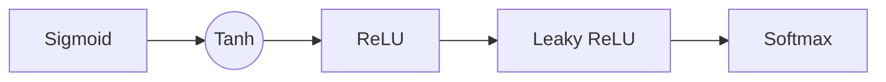
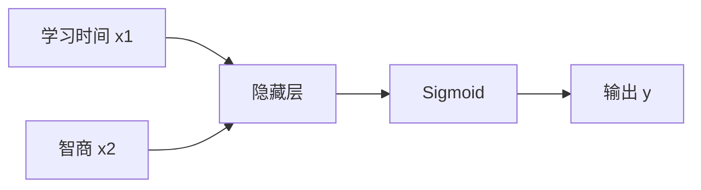

# 一切皆是映射：激活函数的选择与影响

关键词：激活函数，非线性映射，神经网络，Sigmoid，ReLU，Tanh，Softmax

## 1. 背景介绍
### 1.1  问题的由来
在深度学习的发展历程中，激活函数一直扮演着至关重要的角色。作为连接神经元的桥梁，激活函数决定了神经网络能否学习和表达复杂的非线性关系。然而，激活函数的选择却常常被忽视，很多研究者和工程师往往习惯性地使用某些"标准"的激活函数，而没有深入思考其背后的原理和影响。

### 1.2  研究现状
目前，在深度学习领域，ReLU（Rectified Linear Unit）已经成为最常用的激活函数，其简单高效的特性使其在很多任务上表现出色。然而，ReLU 也存在一些问题，如死亡 ReLU 问题，即某些神经元可能永远不会被激活。因此，一些改进版本如 Leaky ReLU，PReLU 等被提出。

除了 ReLU，Sigmoid 和 Tanh 这两个 S 型函数在早期的神经网络中应用广泛，但随着网络加深，它们容易出现梯度消失的问题。Softmax 函数常用于多分类任务的输出层。

### 1.3  研究意义
深入理解不同激活函数的特点，对于设计高效的神经网络架构至关重要。本文将从数学原理出发，系统分析几种常见激活函数的优缺点，并通过实例讲解其在不同任务中的应用。这对于深度学习的研究者和实践者都具有重要的参考价值。

### 1.4  本文结构
本文将首先介绍激活函数的基本概念和作用，然后重点分析 Sigmoid，Tanh，ReLU 和 Softmax 等几种常用函数的数学原理和特性。接着，我们将通过实例代码演示这些函数的实现和应用。最后，本文还将讨论激活函数的选择对神经网络性能的影响，并展望未来的研究方向。

## 2. 核心概念与联系
激活函数是神经网络中不可或缺的一部分，其作用是将神经元的加权输入映射到输出。从数学角度看，激活函数实现了一种非线性变换，使得神经网络能够逼近任意复杂的函数。

我们可以将激活函数形象地比喻为一个开关，控制着信号在神经元之间的传递。当输入信号达到一定阈值时，激活函数就会"打开"，让信号通过并传递到下一层神经元；否则信号就会被"关闭"。不同的激活函数，就像不同类型的开关，有着不同的特性。

下图展示了几种常见激活函数的曲线形状：



可以看到，Sigmoid 和 Tanh 都是 S 型曲线，将输入映射到 (0,1) 或 (-1,1) 的范围内。ReLU 则是一个分段线性函数，负值部分输出为0，正值部分保持不变。Leaky ReLU 对负值部分也给出了一定的梯度。Softmax 将输入映射为一个概率分布。

这些激活函数各有优缺点，适用于不同的任务和网络结构。选择合适的激活函数需要考虑以下几个因素：

1. 网络的深度：对于深层网络，梯度消失问题更加严重，需要选择梯度较大的函数如 ReLU。

2. 任务的类型：对于二分类任务，Sigmoid 是个不错的选择；多分类任务可以使用 Softmax；回归任务可以使用线性函数或 ReLU。 

3. 收敛速度和稳定性：有些激活函数如 Tanh 可能导致训练不稳定，而 ReLU 一般能加速收敛。

4. 特定的问题结构：如在生成对抗网络中，Leaky ReLU 常用于生成器，而 Tanh 常用于判别器。

下面我们将详细讨论几种主要激活函数的原理和实现。

## 3. 核心算法原理 & 具体操作步骤
### 3.1  算法原理概述
本节将介绍 Sigmoid，Tanh，ReLU 和 Softmax 四种常见激活函数的数学定义和特性。

#### Sigmoid 函数
Sigmoid 函数定义为：

$$f(x) = \frac{1}{1+e^{-x}}$$

其值域为 (0,1)，具有以下特点：

- 光滑且单调，适合作为输出层的激活函数
- 饱和性，当输入较大或较小时，梯度趋近于0，容易导致梯度消失
- 非零中心化，输出均值不为0，影响收敛速度

#### Tanh 函数
Tanh 函数定义为：

$$f(x) = \frac{e^x - e^{-x}}{e^x + e^{-x}}$$

其值域为 (-1,1)，与 Sigmoid 类似，也存在饱和和非零中心化问题，但在特定场合如生成对抗网络的判别器中有独特的优势。

#### ReLU 函数
ReLU 函数定义为：

$$f(x) = max(0, x)$$

其特点包括：

- 非饱和，梯度恒为1，有效缓解梯度消失问题
- 计算简单高效，加速训练过程
- 引入了稀疏性，使得部分神经元输出为0
- 存在死亡 ReLU 问题，即某些神经元可能永远不会被激活

#### Softmax 函数
Softmax 函数将一个 n 维向量 $\mathbf{z}$ 映射为一个概率分布 $\mathbf{p}$：

$$p_i = \frac{e^{z_i}}{\sum_{j=1}^n e^{z_j}}$$

其中 $p_i$ 表示第 i 类的概率。Softmax 函数常用于多分类任务的输出层，与交叉熵损失函数配合使用。

### 3.2  算法步骤详解
以 Sigmoid 函数为例，其前向传播和反向传播过程如下：

前向传播：
1. 输入加权和：$z = \sum_{i} w_i x_i + b$
2. 计算激活值：$a = \frac{1}{1+e^{-z}}$

反向传播：
1. 计算激活值对加权和的梯度：$\frac{\partial a}{\partial z} = a(1-a)$
2. 计算损失对加权和的梯度：$\frac{\partial L}{\partial z} = \frac{\partial L}{\partial a} \frac{\partial a}{\partial z}$
3. 计算损失对权重的梯度：$\frac{\partial L}{\partial w_i} = \frac{\partial L}{\partial z} x_i$

其他激活函数的前向和反向过程类似，区别在于激活值和梯度的计算公式不同。

### 3.3  算法优缺点
各激活函数的优缺点总结如下：

| 函数 | 优点 | 缺点 |
|------|------|------|
| Sigmoid | 光滑，输出范围有限 | 饱和，梯度消失，非零中心化 |
| Tanh | 光滑，输出以0为中心 | 饱和，梯度消失 |
| ReLU | 非饱和，梯度不消失，计算高效 | 死亡 ReLU，输出非零中心化 |
| Softmax | 输出为概率分布，适合多分类 | 计算复杂度高，数值不稳定 |

### 3.4  算法应用领域
不同的激活函数在不同的应用领域有着广泛的应用：

- 图像分类：ReLU 常用于卷积神经网络的隐藏层，Softmax 用于输出层
- 语音识别：ReLU 和 Tanh 常用于循环神经网络
- 自然语言处理：Tanh 常用于长短期记忆网络（LSTM）的门控单元
- 生成对抗网络：Leaky ReLU 常用于生成器，Tanh 常用于判别器

## 4. 数学模型和公式 & 详细讲解 & 举例说明
### 4.1  数学模型构建
我们以一个简单的三层全连接网络为例，说明激活函数在前向传播中的作用。

假设输入为 $\mathbf{x} \in \mathbb{R}^d$，第一层权重为 $\mathbf{W}_1 \in \mathbb{R}^{d \times h}$，第二层权重为 $\mathbf{W}_2 \in \mathbb{R}^{h \times c}$，激活函数为 $f$，输出为 $\mathbf{y} \in \mathbb{R}^c$。则前向传播过程可以表示为：

$$\mathbf{h} = f(\mathbf{W}_1^T \mathbf{x})$$
$$\mathbf{y} = \mathbf{W}_2^T \mathbf{h}$$

其中 $\mathbf{h} \in \mathbb{R}^h$ 为隐藏层的输出。可以看到，激活函数 $f$ 在隐藏层中引入了非线性变换，使得网络能够拟合复杂的函数关系。

### 4.2  公式推导过程
下面我们以 Sigmoid 函数为例，推导其导数公式。

Sigmoid 函数定义为：

$$f(x) = \frac{1}{1+e^{-x}}$$

对其求导，得到：

$$f'(x) = \frac{e^{-x}}{(1+e^{-x})^2}$$

化简，得到：

$$f'(x) = \frac{1}{1+e^{-x}} (1 - \frac{1}{1+e^{-x}}) = f(x)(1-f(x))$$

这个结果表明，Sigmoid 函数的导数可以用其输出值表示，这在反向传播中非常有用。

### 4.3  案例分析与讲解
我们以一个二分类问题为例，说明 Sigmoid 函数的应用。

假设我们要判断一个学生是否会通过考试，输入特征包括学生的学习时间 $x_1$ 和智商 $x_2$，目标值 $y \in \{0, 1\}$ 表示是否通过考试。我们可以构建一个简单的神经网络：



其中隐藏层的计算公式为：

$$h = w_1 x_1 + w_2 x_2 + b$$

输出层的计算公式为：

$$y = \frac{1}{1+e^{-h}}$$

可以看到，Sigmoid 函数将隐藏层的输出映射到 (0,1) 的范围内，得到了一个概率值，表示学生通过考试的可能性。这个概率值可以用来与真实标签计算交叉熵损失，从而训练网络的参数。

### 4.4  常见问题解答
1. 为什么 Sigmoid 函数容易出现梯度消失？

答：当输入较大或较小时，Sigmoid 函数的导数趋近于0，这意味着在反向传播过程中，梯度信号会不断衰减，导致网络难以训练。

2. ReLU 函数的死亡问题是如何产生的？

答：当某个神经元的加权输入持续为负值时，其输出将恒为0，导致该神经元在反向传播中无法更新参数，相当于"死亡"了。这通常发生在学习率设置不当或初始化不良的情况下。

3. 如何缓解 ReLU 的死亡问题？

答：可以使用一些 ReLU 的变体，如 Leaky ReLU，它在负值部分给出一个小的梯度；或者 PReLU，它学习负值部分的斜率参数。此外，合适的学习率和初始化方法也有助于减轻这一问题。

## 5. 项目实践：代码实例和详细解释说明
### 5.1  开发环境搭建
本节我们将使用 Python 3 和 PyTorch 框架来实现几种常见的激活函数。首先需要安装 PyTorch：

```bash
pip install torch
```

### 5.2  源代码详细实现
下面是 Sigmoid，Tanh，ReLU 和 Softmax 函数的 PyTorch 实现：

```python
import torch
import torch.nn as nn

# Sigmoid 函数
sigmoid = nn.Sigmoid()
x = torch.randn(3)
print(f"Sigmoid: {sigmoid(x)}")

# Tanh 函数
tanh = nn.Tanh