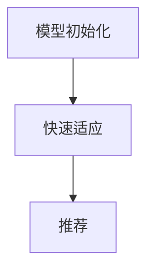

# 一切皆是映射：通过元学习提升个性化推荐系统性能

## 1. 背景介绍

### 1.1 问题的由来

在当今信息时代,我们被海量的数据所包围。从网上购物到观看视频,从社交媒体到新闻资讯,每个人都会产生大量的个人数据足迹。如何从这些海量数据中为用户推荐最感兴趣的内容,成为了一个亟待解决的问题。传统的推荐系统通常基于协同过滤或内容过滤,但它们存在一些固有的缺陷,例如冷启动问题、数据稀疏性问题和对用户兴趣变化的适应性不足等。

### 1.2 研究现状  

为了解决上述问题,研究人员提出了元学习(Meta-Learning)在推荐系统中的应用。元学习是机器学习领域的一个新兴方向,它旨在通过学习不同任务之间的共性,从而快速适应新的任务。在推荐系统中,我们可以将每个用户视为一个任务,元学习可以帮助模型从历史数据中学习用户之间的共性,从而更好地适应新用户的兴趣。

### 1.3 研究意义

个性化推荐系统对于提升用户体验、增强用户粘性和实现精准营销等具有重要意义。通过元学习,我们可以更好地解决冷启动问题、提高推荐系统的泛化能力,并且能够更好地捕捉用户兴趣的动态变化。此外,元学习为推荐系统带来了全新的思路和方法,有望推动推荐系统的发展和创新。

### 1.4 本文结构

本文将首先介绍元学习和推荐系统的核心概念,然后详细阐述元学习在推荐系统中的应用原理和算法步骤。接下来,我们将构建数学模型并推导公式,并通过案例分析加深理解。之后,我们将展示一个实际项目的代码实现,并解读核心代码。最后,我们将探讨元学习推荐系统的实际应用场景、未来发展趋势和面临的挑战。

## 2. 核心概念与联系

在深入探讨元学习在推荐系统中的应用之前,我们需要先了解一些核心概念。

**推荐系统(Recommender System):** 推荐系统是一种基于用户历史数据(如浏览记录、购买记录等)为用户推荐感兴趣的项目(如商品、新闻、视频等)的系统。常见的推荐系统包括协同过滤(Collaborative Filtering)和内容过滤(Content-based Filtering)两大类。

**元学习(Meta-Learning):** 元学习是机器学习领域的一个新兴方向,它旨在通过学习不同任务之间的共性,从而快速适应新的任务。在推荐系统中,我们可以将每个用户视为一个任务,元学习可以帮助模型从历史数据中学习用户之间的共性,从而更好地适应新用户的兴趣。

**模型初始化(Model Initialization):** 在传统的机器学习中,模型参数通常是随机初始化的。而在元学习中,我们可以通过学习多个任务,得到一个良好的模型初始化,从而加快新任务的学习速度。

**快速适应(Fast Adaptation):** 元学习的目标是在少量数据或少量梯度更新步骤后,就能快速适应新的任务。这对于解决推荐系统中的冷启动问题至关重要。

**任务(Task):** 在推荐系统的元学习中,每个用户可以被视为一个独立的任务。模型需要学习不同用户之间的共性,从而更好地适应新用户的兴趣。

通过将元学习应用于推荐系统,我们可以更好地解决冷启动问题、提高推荐系统的泛化能力,并且能够更好地捕捉用户兴趣的动态变化。下一节,我们将详细阐述元学习在推荐系统中的应用原理和算法步骤。

## 3. 核心算法原理与具体操作步骤

### 3.1 算法原理概述

元学习在推荐系统中的应用原理可以概括为以下三个步骤:

1. **模型初始化:** 通过学习多个用户(任务)的历史数据,获得一个良好的模型初始化。
2. **快速适应:** 对于新用户,利用少量数据或少量梯度更新步骤,快速适应该用户的兴趣。
3. **推荐:** 基于适应后的模型,为该用户推荐感兴趣的项目。

这种思路的关键在于,通过学习多个任务的共性,模型可以获得一个很好的初始化,从而加快对新任务(用户)的适应速度。

### 3.2 算法步骤详解

下面我们将详细介绍元学习在推荐系统中的具体算法步骤。

#### 3.2.1 数据准备

首先,我们需要准备一个包含多个用户历史数据的数据集。这些数据通常包括用户的浏览记录、购买记录、评分记录等。我们将这些数据划分为元训练集(Meta-Training Set)和元测试集(Meta-Testing Set)。

#### 3.2.2 模型初始化

接下来,我们使用元训练集来初始化模型参数。具体步骤如下:

1. 从元训练集中随机采样一批用户(任务)及其历史数据。
2. 对于每个用户(任务),使用该用户的历史数据进行几步梯度更新,得到适应该用户的模型参数。
3. 将所有用户(任务)的适应后的模型参数进行平均,得到一个良好的模型初始化。

通过这种方式,我们可以获得一个能够较好地适应多个用户的模型初始化。

#### 3.2.3 快速适应

对于一个新用户,我们需要快速适应该用户的兴趣。具体步骤如下:

1. 从该用户的少量历史数据中采样一批数据。
2. 使用第3.2.2步骤得到的模型初始化,对采样的数据进行少量梯度更新步骤,得到适应该用户的模型参数。

通过这种方式,我们可以在少量数据或少量梯度更新步骤后,就能快速适应新用户的兴趣。

#### 3.2.4 推荐

最后,我们可以基于适应后的模型,为该用户推荐感兴趣的项目。具体步骤如下:

1. 使用适应后的模型,预测该用户对所有候选项目的兴趣程度。
2. 根据预测的兴趣程度,为该用户推荐前N个感兴趣的项目。

通过这种方式,我们可以为用户提供个性化的推荐结果。

### 3.3 算法优缺点

**优点:**

1. **解决冷启动问题:** 通过元学习,我们可以在少量数据或少量梯度更新步骤后,就能快速适应新用户的兴趣,从而有效解决了推荐系统中的冷启动问题。
2. **提高泛化能力:** 元学习可以学习多个用户之间的共性,从而提高了模型的泛化能力,使其能够更好地适应新用户。
3. **捕捉用户兴趣动态变化:** 由于元学习可以快速适应新数据,因此它能够更好地捕捉用户兴趣的动态变化。

**缺点:**

1. **计算开销较大:** 元学习需要在多个任务上进行训练,计算开销相对较大。
2. **数据质量要求较高:** 元学习对数据质量的要求较高,如果训练数据质量不佳,可能会影响模型的性能。
3. **超参数调优困难:** 元学习引入了一些新的超参数,如何合理设置这些超参数仍然是一个挑战。

### 3.4 算法应用领域

除了推荐系统之外,元学习还可以应用于以下领域:

1. **计算机视觉:** 元学习可以帮助模型快速适应新的视觉任务,如目标检测、图像分类等。
2. **自然语言处理:** 元学习可以用于快速适应新的语言任务,如机器翻译、文本分类等。
3. **强化学习:** 元学习可以帮助智能体快速适应新的环境和任务,提高强化学习的效率。
4. **医疗健康:** 元学习可以应用于个性化医疗,快速适应新患者的病情和需求。

总的来说,元学习为机器学习带来了全新的思路和方法,有望推动多个领域的发展和创新。

## 4. 数学模型和公式详细讲解与举例说明

在上一节中,我们介绍了元学习在推荐系统中的应用原理和算法步骤。本节,我们将构建数学模型,并推导相关公式,以加深对元学习推荐系统的理解。

### 4.1 数学模型构建

我们将推荐系统建模为一个元学习问题。假设我们有一个包含 $N$ 个用户(任务)的数据集 $\mathcal{D} = \{D_1, D_2, \dots, D_N\}$,其中 $D_i$ 表示第 $i$ 个用户的历史数据。我们的目标是学习一个模型 $f_\theta$,它可以快速适应新用户的兴趣。

具体来说,我们将模型参数 $\theta$ 分为两部分:一部分是可以快速适应的参数 $\phi$,另一部分是元参数 $\psi$。对于每个用户 $i$,我们首先使用该用户的历史数据 $D_i$ 对 $\phi$ 进行少量梯度更新,得到适应该用户的参数 $\phi_i^*$。然后,我们使用适应后的参数 $\phi_i^*$ 来计算该用户的损失函数 $\mathcal{L}_i(\phi_i^*)$。最后,我们通过最小化所有用户的损失函数之和来优化元参数 $\psi$。

数学模型可以表示为:

$$
\begin{aligned}
\min_\psi \sum_{i=1}^N \mathcal{L}_i(\phi_i^*) \\
\text{s.t.} \quad \phi_i^* = \text{Update}(\phi, D_i; \psi)
\end{aligned}
$$

其中,Update 函数表示使用用户 $i$ 的历史数据 $D_i$ 对参数 $\phi$ 进行少量梯度更新的过程,该过程由元参数 $\psi$ 控制。

在实际应用中,我们通常使用梯度下降法来优化上述目标函数。具体来说,我们首先随机初始化元参数 $\psi$,然后迭代执行以下步骤:

1. 从数据集 $\mathcal{D}$ 中随机采样一批用户及其历史数据。
2. 对于每个用户 $i$,使用该用户的历史数据 $D_i$ 对参数 $\phi$ 进行少量梯度更新,得到适应该用户的参数 $\phi_i^*$。
3. 计算每个用户的损失函数 $\mathcal{L}_i(\phi_i^*)$。
4. 计算所有用户损失函数之和,并对元参数 $\psi$ 进行梯度更新。

通过不断迭代上述步骤,我们可以得到一个良好的元参数 $\psi$,从而获得一个能够快速适应新用户的模型 $f_\theta$。

### 4.2 公式推导过程

接下来,我们将推导元学习在推荐系统中的核心公式。

假设我们使用梯度下降法来优化目标函数,则第 $t$ 次迭代的更新公式为:

$$
\psi^{(t+1)} = \psi^{(t)} - \alpha \sum_{i=1}^N \frac{\partial \mathcal{L}_i(\phi_i^*)}{\partial \psi^{(t)}}
$$

其中,$ \alpha $ 是学习率,$ \frac{\partial \mathcal{L}_i(\phi_i^*)}{\partial \psi^{(t)}} $ 是损失函数对元参数的梯度。

根据链式法则,我们可以将梯度展开为:

$$
\frac{\partial \mathcal{L}_i(\phi_i^*)}{\partial \psi^{(t)}} = \frac{\partial \mathcal{L}_i(\phi_i^*)}{\partial \phi_i^*} \frac{\partial \phi_i^*}{\partial