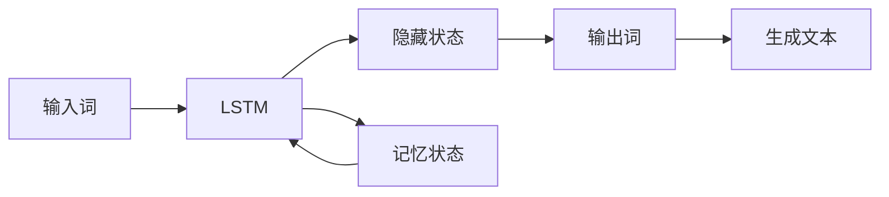

# 一切皆是映射：长短时记忆网络(LSTM)与文本生成

关键词：长短时记忆网络、LSTM、文本生成、自然语言处理、深度学习

## 1. 背景介绍
### 1.1  问题的由来
随着人工智能技术的飞速发展,自然语言处理(NLP)已成为当前人工智能领域的研究热点之一。而在自然语言处理领域,文本生成一直是一个极具挑战性的任务。传统的文本生成方法,如基于规则的方法和基于统计的方法,在生成连贯、流畅的长文本方面存在局限性。近年来,深度学习技术的兴起为文本生成任务带来了新的突破,其中长短时记忆网络(LSTM)在文本生成中展现出了卓越的性能。

### 1.2 研究现状
目前,基于LSTM的文本生成模型已经在多个领域取得了显著成果。例如,在对话系统中,LSTM可以根据上下文生成连贯、自然的回复;在机器翻译中,LSTM可以生成流畅、准确的译文;在文本摘要中,LSTM可以自动生成简洁、信息丰富的摘要。这些成果表明,LSTM在捕捉文本的长距离依赖关系和生成连贯文本方面具有独特的优势。

### 1.3 研究意义  
深入研究LSTM在文本生成中的应用,对于推动自然语言处理技术的发展具有重要意义。一方面,LSTM为文本生成任务提供了一种新的思路和方法,有助于克服传统方法的局限性,提高文本生成的质量和效率。另一方面,通过研究LSTM在文本生成中的机制和特点,可以加深我们对语言本质的理解,为构建更加智能、自然的人机交互系统奠定基础。

### 1.4 本文结构
本文将围绕LSTM在文本生成中的应用展开深入探讨。首先,我们将介绍LSTM的核心概念和原理,阐述其在处理序列数据方面的优势。然后,我们将详细讲解LSTM在文本生成中的数学模型和算法实现。接下来,我们将通过实际项目案例,演示如何使用LSTM构建文本生成模型。最后,我们将总结LSTM在文本生成领域的应用现状和未来发展趋势,并提出面临的挑战和研究展望。

## 2. 核心概念与联系
长短时记忆网络(Long Short-Term Memory,LSTM)是一种特殊类型的循环神经网络(RNN),它能够有效地捕捉序列数据中的长距离依赖关系。与传统的RNN相比,LSTM引入了门控机制,可以选择性地记忆和遗忘信息,从而克服了梯度消失和梯度爆炸的问题。

在文本生成任务中,LSTM将文本视为一个序列,通过逐个处理文本中的词或字符,学习文本的上下文信息和语言模式。具体而言,LSTM接收当前时刻的输入,结合之前时刻的隐藏状态和记忆状态,通过门控机制更新隐藏状态和记忆状态,并生成下一时刻的输出。通过这种方式,LSTM可以建立起文本中词与词之间的联系,捕捉文本的语义和语法结构,从而生成连贯、流畅的文本。

下图展示了LSTM在文本生成中的核心概念和联系:

## 3. 核心算法原理 & 具体操作步骤
### 3.1 算法原理概述
LSTM的核心思想是通过引入门控机制,控制信息的流动和更新。LSTM包含三种类型的门:输入门、遗忘门和输出门。这些门的作用如下:

- 输入门:控制当前时刻的输入信息有多少保存到记忆状态中。
- 遗忘门:控制上一时刻的记忆状态有多少被遗忘。
- 输出门:控制当前时刻的记忆状态有多少输出到隐藏状态中。

通过这三种门的协同工作,LSTM可以选择性地记忆和遗忘信息,并动态地更新隐藏状态和记忆状态。

### 3.2 算法步骤详解
LSTM的前向传播过程可以分为以下几个步骤:

1. 计算输入门、遗忘门和输出门的激活值:
   
$i_t = \sigma(W_i \cdot [h_{t-1}, x_t] + b_i)$
   
$f_t = \sigma(W_f \cdot [h_{t-1}, x_t] + b_f)$
   
$o_t = \sigma(W_o \cdot [h_{t-1}, x_t] + b_o)$

其中,$i_t$,$f_t$,$o_t$分别表示输入门、遗忘门和输出门的激活值,$\sigma$表示sigmoid激活函数,$W_i$,$W_f$,$W_o$分别表示输入门、遗忘门和输出门的权重矩阵,$h_{t-1}$表示上一时刻的隐藏状态,$x_t$表示当前时刻的输入,$b_i$,$b_f$,$b_o$分别表示输入门、遗忘门和输出门的偏置项。

2. 计算候选记忆状态:
   
$\tilde{C}_t = \tanh(W_C \cdot [h_{t-1}, x_t] + b_C)$

其中,$\tilde{C}_t$表示候选记忆状态,$\tanh$表示双曲正切激活函数,$W_C$表示候选记忆状态的权重矩阵,$b_C$表示候选记忆状态的偏置项。

3. 更新记忆状态:

$C_t = f_t * C_{t-1} + i_t * \tilde{C}_t$

其中,$C_t$表示当前时刻的记忆状态,$C_{t-1}$表示上一时刻的记忆状态,$*$表示逐元素相乘。

4. 计算隐藏状态:

$h_t = o_t * \tanh(C_t)$

其中,$h_t$表示当前时刻的隐藏状态。

5. 生成输出:

$y_t = \text{softmax}(W_y \cdot h_t + b_y)$

其中,$y_t$表示当前时刻的输出,$\text{softmax}$表示softmax激活函数,$W_y$表示输出层的权重矩阵,$b_y$表示输出层的偏置项。

通过以上步骤,LSTM可以逐个处理输入序列,并生成相应的输出序列。在文本生成任务中,输入序列通常是词或字符的嵌入向量,输出序列则是下一个词或字符的概率分布。

### 3.3 算法优缺点
LSTM算法在处理序列数据方面具有以下优点:

- 能够捕捉长距离依赖关系:通过引入门控机制,LSTM可以选择性地记忆和遗忘信息,从而有效地捕捉序列中的长距离依赖关系。
- 克服梯度消失和梯度爆炸问题:LSTM通过门控机制控制信息的流动,可以缓解传统RNN中梯度消失和梯度爆炸的问题,使得模型能够学习到更长的序列。
- 适用于各种序列建模任务:LSTM是一种通用的序列建模架构,可以应用于各种序列建模任务,如语言建模、机器翻译、语音识别等。

然而,LSTM算法也存在一些缺点:

- 计算复杂度高:由于引入了门控机制,LSTM的计算复杂度相对较高,训练和推理的时间开销较大。
- 参数量大:LSTM包含大量的参数,需要较大的训练数据和计算资源。
- 解释性较差:LSTM作为一种黑盒模型,其内部机制和决策过程难以解释,缺乏可解释性。

### 3.4 算法应用领域
LSTM算法在自然语言处理领域有广泛的应用,主要包括:

- 语言建模:LSTM可以学习语言的统计规律,预测下一个词或字符,生成连贯、流畅的文本。
- 机器翻译:LSTM可以将源语言序列编码为固定长度的向量,然后解码生成目标语言序列,实现端到端的机器翻译。
- 文本摘要:LSTM可以理解文本的主要内容,自动生成简洁、信息丰富的摘要。
- 对话系统:LSTM可以根据上下文生成自然、连贯的对话回复,提高对话系统的智能化水平。
- 情感分析:LSTM可以捕捉文本中的情感信息,实现情感分类和情感强度预测。

除了自然语言处理,LSTM还可以应用于其他序列建模任务,如时间序列预测、视频分析、音乐生成等。

## 4. 数学模型和公式 & 详细讲解 & 举例说明
### 4.1 数学模型构建
LSTM的数学模型可以用以下公式表示:

输入门:
$i_t = \sigma(W_i \cdot [h_{t-1}, x_t] + b_i)$

遗忘门:
$f_t = \sigma(W_f \cdot [h_{t-1}, x_t] + b_f)$

输出门:  
$o_t = \sigma(W_o \cdot [h_{t-1}, x_t] + b_o)$

候选记忆状态:
$\tilde{C}_t = \tanh(W_C \cdot [h_{t-1}, x_t] + b_C)$

记忆状态更新:
$C_t = f_t * C_{t-1} + i_t * \tilde{C}_t$

隐藏状态计算:
$h_t = o_t * \tanh(C_t)$

输出生成:
$y_t = \text{softmax}(W_y \cdot h_t + b_y)$

其中,各符号的含义如下:

- $i_t$,$f_t$,$o_t$:输入门、遗忘门和输出门的激活值。
- $W_i$,$W_f$,$W_o$:输入门、遗忘门和输出门的权重矩阵。
- $b_i$,$b_f$,$b_o$:输入门、遗忘门和输出门的偏置项。
- $h_{t-1}$:上一时刻的隐藏状态。
- $x_t$:当前时刻的输入。
- $\tilde{C}_t$:候选记忆状态。
- $W_C$:候选记忆状态的权重矩阵。
- $b_C$:候选记忆状态的偏置项。
- $C_t$:当前时刻的记忆状态。
- $C_{t-1}$:上一时刻的记忆状态。
- $h_t$:当前时刻的隐藏状态。
- $y_t$:当前时刻的输出。
- $W_y$:输出层的权重矩阵。
- $b_y$:输出层的偏置项。

### 4.2 公式推导过程
下面我们详细推导LSTM的前向传播公式:

1. 输入门激活值:

$$
\begin{aligned}
i_t &= \sigma(W_i \cdot [h_{t-1}, x_t] + b_i) \\
&= \sigma(W_{ih} \cdot h_{t-1} + W_{ix} \cdot x_t + b_i)
\end{aligned}
$$

其中,$W_{ih}$和$W_{ix}$分别表示隐藏状态和输入的权重矩阵。

2. 遗忘门激活值:

$$
\begin{aligned}
f_t &= \sigma(W_f \cdot [h_{t-1}, x_t] + b_f) \\
&= \sigma(W_{fh} \cdot h_{t-1} + W_{fx} \cdot x_t + b_f)
\end{aligned}
$$

其中,$W_{fh}$和$W_{fx}$分别表示隐藏状态和输入的权重矩阵。

3. 输出门激活值:

$$
\begin{aligned}
o_t &= \sigma(W_o \cdot [h_{t-1}, x_t] + b_o) \\
&= \sigma(W_{oh} \cdot h_{t-1} + W_{ox} \cdot x_t + b_o)
\end{aligned}
$$

其中,$W_{oh}$和$W_{ox}$分别表示隐藏状态和输入的权重矩阵。

4. 候选记忆状态:

$$
\begin{aligned}
\tilde{C}_t &= \tanh(W_C \cdot [h_{t-1}, x_t] + b_C) \\
&= \tanh(W