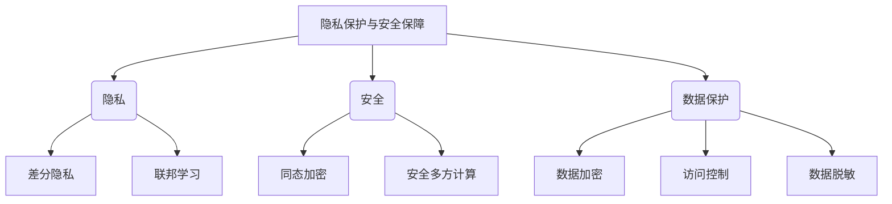

# 专家系统的隐私保护与安全保障

## 1. 背景介绍

### 1.1 问题的由来

随着人工智能技术的快速发展,专家系统在各个领域得到了广泛的应用。专家系统是一种将人类专家的知识和经验转化为可计算形式的智能系统,能够模拟人类专家的决策过程,为用户提供智能化的建议和解决方案。然而,专家系统在处理敏感数据时,面临着严峻的隐私和安全挑战。

专家系统通常需要收集和处理大量的个人信息、医疗记录、金融数据等隐私数据,以进行决策分析和推理。如果这些敏感数据被非法获取或滥用,将会给个人和组织带来严重的隐私泄露风险和经济损失。同时,专家系统本身也可能存在安全漏洞,被黑客攻击或被植入恶意代码,从而威胁系统的完整性和可靠性。

因此,确保专家系统的隐私保护和安全保障是一个迫切的需求,也是人工智能系统发展的关键挑战之一。

### 1.2 研究现状

近年来,隐私保护和安全保障在人工智能领域受到了广泛关注。研究人员提出了多种技术手段来保护数据隐私和系统安全,例如:

1. **差分隐私(Differential Privacy)**: 通过在数据上添加噪声来保护个人隐私,同时保留数据的统计特性。
2. **同态加密(Homomorphic Encryption)**: 允许在加密数据上直接进行计算,无需解密,从而保护数据的机密性。
3. **联邦学习(Federated Learning)**: 在不共享原始数据的情况下,协同训练机器学习模型,保护数据隐私。
4. **安全多方计算(Secure Multi-Party Computation)**: 多个参与方在不泄露各自的输入数据的情况下,共同计算一个函数的结果。

然而,这些技术在专家系统中的应用还存在一些挑战,例如效率低下、计算开销大、隐私保护程度有限等。因此,需要进一步研究和优化这些技术,以满足专家系统的特定需求。

### 1.3 研究意义

确保专家系统的隐私保护和安全保障具有重要的理论和实践意义:

1. **保护个人隐私权**: 专家系统处理大量敏感数据,如果不加保护,将严重侵犯个人隐私权。通过有效的隐私保护技术,可以保障个人信息的安全,维护公众对人工智能系统的信任。

2. **维护数据安全**: 专家系统中的数据是宝贵的资源,一旦被破坏或泄露,将造成巨大的经济损失和社会影响。强化系统安全性可以保护数据的完整性和机密性。

3. **促进人工智能的可持续发展**: 隐私保护和安全保障是人工智能系统被广泛接受和应用的前提条件。解决这一问题有助于消除公众对人工智能的顾虑,推动人工智能技术的健康发展。

4. **提高专家系统的可靠性和可信度**: 通过采取有效的隐私保护和安全保障措施,可以增强专家系统的可靠性和可信度,提高用户对系统的信任度。

### 1.4 本文结构

本文将全面探讨专家系统隐私保护与安全保障的相关技术和挑战。文章首先介绍隐私保护和安全保障在专家系统中的重要性和研究现状。然后详细阐述核心概念和算法原理,包括差分隐私、同态加密、联邦学习和安全多方计算等技术。接下来,通过数学模型和公式推导,深入分析这些技术的理论基础和工作机制。并结合实际案例,展示这些技术在专家系统中的应用场景和实现方式。最后,探讨未来的发展趋势和挑战,并提供相关的学习资源和工具推荐。

## 2. 核心概念与联系

专家系统的隐私保护和安全保障涉及多个核心概念,包括隐私、安全、数据保护等,这些概念之间存在着密切的联系。



1. **隐私(Privacy)**: 指个人信息不被非授权的第三方获取或滥用的权利。在专家系统中,需要保护用户的个人隐私,防止敏感数据泄露。常用的隐私保护技术包括差分隐私和联邦学习。

2. **安全(Security)**: 指保护系统、数据和信息免受未经授权的访问、使用、披露、破坏、修改或中断的能力。在专家系统中,需要确保系统的完整性和可靠性,防止黑客攻击和恶意代码植入。常用的安全保障技术包括同态加密和安全多方计算。

3. **数据保护(Data Protection)**: 指通过技术和管理措施,保护数据免受未经授权的访问、使用、披露、破坏、修改或丢失。在专家系统中,需要保护敏感数据的机密性、完整性和可用性。常用的数据保护技术包括数据加密、访问控制和数据脱敏。

这些核心概念相互关联,共同构建了专家系统隐私保护和安全保障的整体框架。隐私保护技术如差分隐私和联邦学习,可以保护个人隐私,防止敏感数据泄露。安全保障技术如同态加密和安全多方计算,可以确保系统的完整性和可靠性,防止黑客攻击和恶意代码植入。数据保护技术如数据加密、访问控制和数据脱敏,可以保护敏感数据的机密性、完整性和可用性。

只有将这些核心概念和技术有机结合,才能为专家系统提供全面的隐私保护和安全保障。下一章节将详细介绍这些技术的原理和实现方式。

## 3. 核心算法原理 & 具体操作步骤

### 3.1 算法原理概述

#### 3.1.1 差分隐私(Differential Privacy)

差分隐私是一种提供隐私保护的强大理论和技术,它通过在查询结果中引入适当的噪声,使得单个记录的加入或删除对查询结果的影响很小,从而保护个人隐私。差分隐私提供了严格的隐私保证,并且具有可组合性和后验保证等优点。

#### 3.1.2 同态加密(Homomorphic Encryption)

同态加密允许在加密数据上直接进行计算,而无需解密。它保证了数据的机密性,同时也支持对加密数据进行有限的计算操作。同态加密可以分为部分同态加密(只支持加法或乘法同态)和完全同态加密(支持任意次加法和乘法同态)。

#### 3.1.3 联邦学习(Federated Learning)

联邦学习是一种分布式机器学习范式,它允许多个参与方在不共享原始数据的情况下协同训练机器学习模型。每个参与方在本地训练模型,然后将模型更新发送给中央服务器,服务器聚合所有更新并返回新的全局模型。这种方式可以保护数据隐私,同时也提高了模型的准确性和鲁棒性。

#### 3.1.4 安全多方计算(Secure Multi-Party Computation)

安全多方计算允许多个参与方在不泄露各自的输入数据的情况下,共同计算一个函数的结果。它基于密码学原理,通过交换加密的中间结果,最终得到函数的输出结果,而不会泄露任何参与方的输入数据。安全多方计算可以应用于各种隐私保护场景,如金融、医疗、投票等领域。

### 3.2 算法步骤详解

#### 3.2.1 差分隐私算法步骤

1. **定义隐私预算(Privacy Budget) ε**: 隐私预算ε是一个正数,用于控制隐私保护的强度。ε越小,隐私保护程度越高,但也会导致噪声越大,实用性降低。

2. **选择噪声机制**: 常用的噪声机制包括拉普拉斯机制(Laplace Mechanism)和高斯机制(Gaussian Mechanism)。拉普拉斯机制适用于数值型查询,而高斯机制适用于实数值域。

3. **计算全局敏感度(Global Sensitivity)**: 全局敏感度衡量了单个记录的加入或删除对查询结果的最大影响。它是噪声大小的一个重要参数。

4. **添加噪声**: 根据隐私预算ε、噪声机制和全局敏感度,计算噪声大小,并将其添加到查询结果中。

5. **输出噪声化查询结果**: 输出添加了噪声的查询结果,作为差分隐私的输出。

以下是一个示例,展示如何使用拉普拉斯机制实现差分隐私:

```python
import numpy as np

def laplace_mechanism(data, f, epsilon, sensitivity):
    """
    拉普拉斯机制实现差分隐私
    
    参数:
    data: 输入数据
    f: 查询函数
    epsilon: 隐私预算
    sensitivity: 全局敏感度
    
    返回:
    噪声化的查询结果
    """
    result = f(data)
    noise = np.random.laplace(loc=0.0, scale=sensitivity/epsilon, size=1)
    noisy_result = result + noise
    return noisy_result
```

#### 3.2.2 同态加密算法步骤

1. **选择同态加密方案**: 常用的同态加密方案包括Paillier加密、BGN加密、CKKS加密等。不同的加密方案支持不同的同态操作。

2. **生成密钥对**: 根据选择的加密方案,生成公钥和私钥。公钥用于加密,私钥用于解密。

3. **加密输入数据**: 使用公钥对输入数据进行加密,得到加密数据。

4. **在加密数据上进行计算**: 根据加密方案的同态性质,在加密数据上直接进行加法、乘法或其他支持的同态操作,得到加密的计算结果。

5. **解密计算结果(可选)**: 如果需要获取明文结果,可以使用私钥对加密的计算结果进行解密。

以下是一个使用Paillier加密进行同态加法的示例:

```python
from phe import paillier

# 生成密钥对
public_key, private_key = paillier.generate_paillier_keypair()

# 加密输入数据
encrypted_a = public_key.encrypt(3)
encrypted_b = public_key.encrypt(5)

# 同态加法
encrypted_c = encrypted_a + encrypted_b

# 解密结果(可选)
decrypted_c = private_key.decrypt(encrypted_c)
print(decrypted_c)  # 输出: 8
```

#### 3.2.3 联邦学习算法步骤

1. **初始化全局模型**: 在中央服务器上初始化一个全局模型,作为协同训练的起点。

2. **分发全局模型**: 将全局模型分发给所有参与方。

3. **本地训练**: 每个参与方在本地数据上训练模型,得到模型更新。

4. **聚合模型更新**: 参与方将本地模型更新发送给中央服务器,服务器聚合所有更新,得到新的全局模型。

5. **迭代训练**: 重复步骤2-4,直到模型收敛或达到预设的迭代次数。

以下是一个简化的联邦学习示例,使用TensorFlow实现:

```python
import tensorflow as tf
import numpy as np

# 初始化全局模型
model = tf.keras.Sequential([
    tf.keras.layers.Dense(10, activation='relu', input_shape=(784,)),
    tf.keras.layers.Dense(10, activation='softmax')
])

# 分发全局模型
local_models = [model.clone() for _ in range(num_clients)]

# 本地训练和聚合模型更新
for round in range(num_rounds):
    local_updates = []
    for local_model in local_models:
        # 本地训练
        local_data = get_local_data()
        local_update = local_model.train_on_batch(local_data)
        local_