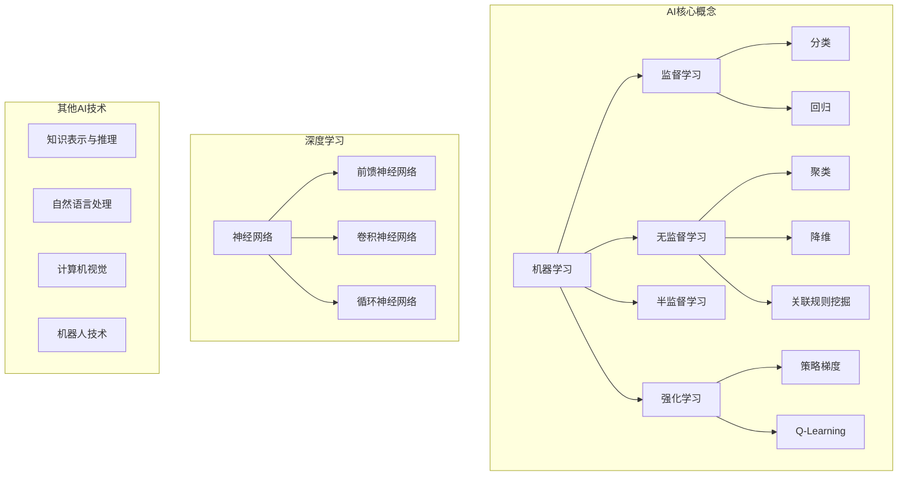

好的,我会按照您提供的要求和约束条件,以"人工智能(AI)原理与代码实战案例讲解"为主题,撰写一篇专业的技术博客文章。

# 人工智能(AI)原理与代码实战案例讲解

## 1. 背景介绍

### 1.1 问题的由来

人工智能(Artificial Intelligence,AI)是当代最具颠覆性和革命性的技术之一。自20世纪50年代诞生以来,AI技术不断发展壮大,涉及领域也日益广泛,从最初的博弈问题、专家系统,到现在的机器学习、深度学习等,AI已经深深渗透到我们生活的方方面面。

随着大数据时代的到来和算力的不断提升,AI技术得到了前所未有的发展。但与此同时,AI系统的复杂性也与日俱增,黑箱操作、缺乏解释性等问题日益凸显。如何设计出高效、可解释、可控的AI系统,成为了当前AI研究的重中之重。

### 1.2 研究现状  

目前,AI领域的主流研究方向包括:

- 机器学习算法创新,如深度学习、强化学习、迁移学习等
- AI系统的可解释性、可靠性、鲁棒性等
- 人工智能与其他学科的交叉融合,如认知科学、心理学等
- 新型AI架构和硬件加速
- AI在各行业的实际应用

业界和学术界正在通过不同的技术路线,努力突破AI发展的瓶颈,以期获得真正的"通用人工智能"。

### 1.3 研究意义

人工智能技术的发展将深刻影响未来社会的方方面面。AI不仅能提高生产效率、优化资源配置,还可以辅助科学研究、医疗诊断等,为人类创造更大的价值。

然而,AI技术的快速发展也带来了一些潜在风险和挑战,如就业岗位被取代、算法偏差、隐私和安全问题等,需要政府、企业和社会各界的共同参与来规避风险、把控发展方向。

因此,深入探讨AI的原理、算法和实践应用,对于指导AI的未来发展至关重要。本文将结合理论和实践,为读者提供AI领域的核心知识。

### 1.4 本文结构

本文首先介绍AI的核心概念和技术发展脉络,接着重点讲解主流的AI算法原理、数学模型及其推导过程。

然后通过实战案例,展示如何将算法原理运用到实际项目中,包括代码开发实现、工程实践等细节。

最后,探讨AI在不同领域的应用现状,分析未来的发展趋势和面临的挑战,并给出相关的学习资源和工具推荐。

## 2. 核心概念与联系

人工智能是一个庞大的概念,包含了多种不同的技术和理论。上图展示了AI的核心概念及它们之间的关系。

机器学习是AI的核心,可分为监督学习、无监督学习、半监督学习和强化学习四大类。其中,监督学习用于分类和回归问题;无监督学习常用于聚类、降维和关联规则挖掘;强化学习则专注于基于奖惩的策略优化。

深度学习是机器学习的一个重要分支,主要基于神经网络模型,包括前馈神经网络、卷积神经网络和循环神经网络等。

除此之外,AI还包括知识表示与推理、自然语言处理、计算机视觉、机器人技术等多个领域。这些技术相互关联、相辅相成,共同推动着AI的发展。

## 3. 核心算法原理 & 具体操作步骤  

### 3.1 算法原理概述

本节将介绍几种核心的AI算法原理,包括:

1. **逻辑回归(Logistic Regression)**: 一种经典的监督学习算法,常用于二分类问题。通过对数几率回归模型,将输入映射到0到1之间,进行分类。

2. **支持向量机(Support Vector Machine, SVM)**: 有监督学习中的另一种主要算法,通过构建最大间隔超平面,实现对输入数据的分类。

3. **K-Means聚类**: 无监督学习中常用的聚类算法,通过迭代优化将数据划分为K个簇,使得簇内数据相似度高,簇间相似度低。

4. **主成分分析(Principal Component Analysis, PCA)**: 常用的无监督学习降维算法,通过正交变换将高维数据投影到低维空间,实现去噪和可视化。

5. **BP神经网络**: 基于误差反向传播算法训练的前馈神经网络,是深度学习中最基础的网络结构。

6. **卷积神经网络(Convolutional Neural Network, CNN)**: 在计算机视觉领域表现卓越的深度网络,通过卷积和池化操作自动提取特征。

7. **长短期记忆网络(Long Short-Term Memory, LSTM)**: 一种常用的循环神经网络,擅长处理序列数据,在自然语言处理等领域有广泛应用。

8. **Q-Learning**: 强化学习中的经典算法之一,通过不断试错和奖惩机制,学习出最优的决策策略。

### 3.2 算法步骤详解

以逻辑回归为例,具体算法步骤如下:

1. **数据预处理**: 对输入数据进行归一化或标准化处理,使不同特征在同一数量级。

2. **定义模型和损失函数**: 逻辑回归的模型为 $h_\theta(x) = \frac{1}{1 + e^{-\theta^Tx}}$, 损失函数为交叉熵损失:

$$J(\theta) = -\frac{1}{m}\sum_{i=1}^m[y^{(i)}\log(h_\theta(x^{(i)})) + (1-y^{(i)})\log(1-h_\theta(x^{(i)}))]$$

3. **梯度下降求解**: 使用梯度下降算法求解模型参数$\theta$:

$$\theta := \theta - \alpha\nabla_\theta J(\theta)$$

其中$\alpha$为学习率,梯度为:

$$\nabla_\theta J(\theta) = \frac{1}{m}\sum_{i=1}^m(h_\theta(x^{(i)}) - y^{(i)})x^{(i)}$$

4. **迭代训练**: 重复执行梯度下降,直至收敛或达到停止条件。

5. **模型评估**: 使用准确率、精确率、召回率等指标评估模型性能。

6. **模型调优**: 根据评估结果,调整超参数(如正则化系数)或特征工程,提升模型性能。

### 3.3 算法优缺点

每种算法都有其适用场景和局限性:

- 逻辑回归简单易用,但只能处理线性可分数据,对非线性数据效果不佳。
- SVM对小样本、高维数据表现良好,但计算开销大,对缺失数据敏感。
- K-Means无监督聚类快速高效,但需要事先确定聚类数K,对噪声和异常值敏感。
- PCA可以有效降维,但可解释性差,信息压缩存在损失。
- BP神经网络具有一定的非线性拟合能力,但容易陷入局部最小值,需要大量数据和计算资源。
- CNN在图像等结构化数据上表现出色,但对无结构数据如时序数据效果不佳。
- LSTM适合处理序列数据,但对长期依赖存在一定缺陷。
- Q-Learning无需事先建模,但在大状态空间下收敛缓慢,探索效率低下。

因此在实际应用中,需要根据具体问题特点选择合适的算法,或将多种算法相结合,发挥各自的优势。

### 3.4 算法应用领域

AI算法在诸多领域都有广泛的应用:

- 监督学习算法如逻辑回归、SVM等常用于图像分类、文本分类、异常检测等。
- 无监督学习算法如聚类、降维等用于客户细分、基因分析、推荐系统等。
- 深度学习算法在计算机视觉、自然语言处理、语音识别等领域发挥着重要作用。
- 强化学习算法可应用于机器人控制、智能交通、游戏AI等领域。

此外,不同算法还可以相互组合,形成各种复杂的混合模型,用于解决更加困难的AI问题。

## 4. 数学模型和公式 & 详细讲解 & 举例说明

### 4.1 数学模型构建

机器学习算法的数学模型是整个算法的核心和基础。以线性回归为例,其基本数学模型为:

$$h_\theta(x) = \theta_0 + \theta_1x_1 + \theta_2x_2 + \cdots + \theta_nx_n$$

其中$x$为输入特征向量,包含$n$个特征;$\theta$为模型参数,需要通过训练数据来估计得到。

对于分类问题,我们可以使用逻辑回归模型:

$$h_\theta(x) = \frac{1}{1 + e^{-\theta^Tx}}$$

其中$\theta^Tx$为线性回归的结果,通过Sigmoid函数映射到(0,1)区间,得到分类概率。

对于更加复杂的问题,我们可以使用神经网络模型。以三层BP神经网络为例,其数学模型为:

$$
\begin{aligned}
a^{(1)} &= x\\
z^{(2)} &= \Theta^{(1)}a^{(1)} + b^{(1)}\\
a^{(2)} &= g(z^{(2)})\\
z^{(3)} &= \Theta^{(2)}a^{(2)} + b^{(2)}\\
h_\Theta(x) &= a^{(3)} = g(z^{(3)})
\end{aligned}
$$

其中$a^{(i)}$为第$i$层的激活值,$z^{(i)}$为第$i$层的加权输入,
$\Theta^{(i)}$为第$i$层的权重矩阵,$b^{(i)}$为第$i$层的偏置向量,$g(\cdot)$为激活函数(如Sigmoid或ReLU)。

通过不断堆叠多层神经网络,并使用反向传播算法训练网络参数,神经网络就能够逼近任意的非线性函数,从而解决更加复杂的问题。

### 4.2 公式推导过程

对于机器学习算法中涉及的一些核心公式,我们需要了解其推导过程,以加深对算法原理的理解。

以逻辑回归的交叉熵损失函数为例:

$$J(\theta) = -\frac{1}{m}\sum_{i=1}^m[y^{(i)}\log(h_\theta(x^{(i)})) + (1-y^{(i)})\log(1-h_\theta(x^{(i)}))]$$

其推导过程如下:

1) 单个样本的负对数似然为:
$$\text{Cost}(h_\theta(x),y) = \begin{cases} -\log(h_\theta(x)) & \text{if }y=1\\ -\log(1-h_\theta(x)) & \text{if }y=0\end{cases}$$

2) 对所有训练样本求和,得到经验风险:
$$J(\theta) = -\frac{1}{m}\sum_{i=1}^m[\log(h_\theta(x^{(i)}))^{y^{(i)}} + \log(1-h_\theta(x^{(i)}))^{1-y^{(i)}}]$$

3) 将指数函数化简,即可得到交叉熵损失函数的最终形式。

通过这一系列的数学推导,我们可以更好地理解损失函数的本质含义,以及为何要采用这种形式。

### 4.3 案例分析与