以下是根据您提供的要求和约束条件，撰写的技术博客文章正文部分：

# 从零开始大模型开发与微调：MNIST数据集的准备

## 1. 背景介绍

### 1.1 问题的由来

随着深度学习和大规模预训练模型在自然语言处理、计算机视觉等领域取得了巨大成功，人工智能领域正在经历一场范式转移。传统的机器学习模型由于其局限性和数据饥渴问题,已难以满足当前复杂任务的需求。而大规模预训练模型通过在海量无标注数据上进行自监督学习,学习到了通用的表示能力,再通过在特定任务数据上进行微调(fine-tuning),可以快速获得出色的性能表现。

MNIST是一个入门级的手写数字识别数据集,常被用作深度学习模型的测试数据集。本文将从零开始,介绍如何基于MNIST数据集,开发一个大规模预训练模型,并对其进行微调,以完成手写数字识别任务。通过这个实例,读者可以全面了解大模型开发和微调的全过程,为将来开发更复杂的大模型打下坚实基础。

### 1.2 研究现状

目前,大规模预训练模型主要分为两大类:自然语言预训练模型(如BERT、GPT等)和计算机视觉预训练模型(如ViT、CLIP等)。前者主要应用于自然语言处理任务,后者则用于图像、视频等视觉任务。这些模型通过Transformer结构和自注意力机制,学习到了通用的表示能力,可以通过在下游任务数据上进行微调,快速迁移到新任务。

此外,也有一些统一的大模型架构(如PaLM、Gato等),试图在单一模型中同时学习语言和视觉的表示能力,实现多模态的泛化。但由于计算资源和数据集的限制,这些模型目前的性能还无法完全超越专门的单模态大模型。

### 1.3 研究意义

通过本文的学习,读者可以全面理解大模型开发和微调的核心概念、关键算法和实现细节,为将来开发更复杂的大模型打下坚实基础。具体来说,本文将探讨以下几个方面的内容:

1. **大模型预训练**: 介绍如何构建一个基于MNIST数据集的大规模预训练模型,包括数据预处理、模型架构设计、预训练目标和优化策略等。

2. **微调技术**: 探讨如何将预训练模型微调到手写数字识别任务上,包括数据准备、微调策略、超参数选择等关键技术。

3. **模型评估**: 介绍如何评估微调后模型在MNIST数据集上的性能表现,并与其他基线模型进行对比分析。

4. **实践经验总结**: 分享在大模型开发和微调过程中遇到的常见问题和解决方案,以及一些实用的技巧和工具推荐。

通过本文的学习,读者不仅可以掌握大模型开发和微调的核心知识,还可以获得实践经验,为将来开发更复杂的大模型打下坚实基础。

### 1.4 本文结构  

本文共分为9个部分,结构如下:

```mermaid
graph TD
    A[1. 背景介绍] --> B[1.1 问题的由来]
    A --> C[1.2 研究现状] 
    A --> D[1.3 研究意义]
    A --> E[1.4 本文结构]
    F[2. 核心概念与联系] --> G[大模型预训练]
    F --> H[微调技术]
    I[3. 核心算法原理&具体操作步骤] --> J[3.1 算法原理概述] 
    I --> K[3.2 算法步骤详解]
    I --> L[3.3 算法优缺点]
    I --> M[3.4 算法应用领域]
    N[4. 数学模型和公式&详细讲解&举例说明] --> O[4.1 数学模型构建]
    N --> P[4.2 公式推导过程]
    N --> Q[4.3 案例分析与讲解] 
    N --> R[4.4 常见问题解答]
    S[5. 项目实践代码实例和详细解释说明] --> T[5.1 开发环境搭建]
    S --> U[5.2 源代码详细实现]
    S --> V[5.3 代码解读与分析]
    S --> W[5.4 运行结果展示]
    X[6. 实际应用场景] --> Y[6.1 当前应用场景]
    X --> Z[6.2 未来应用展望]
    AA[7. 工具和资源推荐] --> AB[7.1 学习资源推荐]
    AA --> AC[7.2 开发工具推荐]
    AA --> AD[7.3 相关论文推荐]
    AA --> AE[7.4 其他资源推荐]
    AF[8. 总结未来发展趋势与挑战] --> AG[8.1 研究成果总结]
    AF --> AH[8.2 未来发展趋势]
    AF --> AI[8.3 面临的挑战]
    AF --> AJ[8.4 研究展望]
    AK[9. 附录常见问题与解答]
```

## 2. 核心概念与联系

在开发大模型并将其微调到特定任务之前,我们首先需要了解一些核心概念,它们之间存在着内在的联系。

**大模型预训练(Pre-training)**是一种自监督学习范式,旨在从大量无标注数据中学习通用的表示能力。常见的预训练目标包括**掩码语言模型(Masked Language Modeling)**和**下一句预测(Next Sentence Prediction)**等。通过预训练,模型可以捕捉到数据中的统计规律和语义信息,形成对应的参数表示。

**微调(Fine-tuning)**则是将预训练模型在特定任务数据上进行进一步训练的过程。由于预训练模型已经学习到了通用的表示能力,只需要对其进行少量参数调整,即可快速适应新的任务,达到很高的性能水平。这种"预训练+微调"的范式大大减少了从头训练大模型的计算代价。

除了上述两个核心概念,我们还需要了解一些相关的技术细节,如**数据预处理**、**模型架构设计**、**优化策略**、**评估指标**等,它们都是开发和微调大模型不可或缺的重要环节。

## 3. 核心算法原理 & 具体操作步骤  

### 3.1 算法原理概述

大模型开发和微调的核心算法原理可以概括为以下几个方面:

1. **自监督预训练**:通过设计合适的预训练目标(如掩码语言模型、下一句预测等),利用大量无标注数据进行自监督学习,使模型捕捉到数据中的统计规律和语义信息,形成通用的表示能力。

2. **迁移学习**:将在大规模无标注数据上预训练得到的模型参数,作为初始化参数,再在特定任务的标注数据上进行进一步的微调训练,实现模型知识的快速迁移。

3. **注意力机制**:通过Self-Attention和Multi-Head Attention等注意力机制,模型可以自适应地捕捉输入数据中不同位置元素之间的长程依赖关系,提高表示能力。

4. **优化策略**:采用合适的优化器(如AdamW)、学习率调度策略、正则化技术(如Dropout、权重衰减)等,有助于模型训练的收敛和泛化性能。

5. **数据增强**:通过一些数据增强技术(如随机裁剪、水平翻转等),可以增加训练数据的多样性,提高模型的泛化能力。

6. **模型并行**:在多GPU环境下,通过模型并行和张量并行等技术,可以有效地加速大模型的训练过程。

总的来说,大模型开发和微调的核心思想是先在大规模无标注数据上进行自监督预训练,学习到通用的表示能力,再将预训练模型迁移到特定任务上进行微调,快速获得良好的性能表现。

### 3.2 算法步骤详解

基于上述算法原理,我们可以将大模型开发和微调的具体步骤概括为以下几个环节:

1. **数据预处理**
    - 收集和清洗原始数据
    - 将数据转换为模型可接受的格式(如图像到张量的转换)
    - 按照一定比例划分训练集、验证集和测试集
    - 对训练数据进行必要的增强(如随机裁剪、水平翻转等)

2. **模型架构设计**
    - 选择合适的模型架构(如ViT、BERT等)
    - 确定模型的输入维度、层数、头数等超参数
    - 初始化模型参数

3. **自监督预训练**
    - 设计合适的预训练目标(如掩码语言模型、像素重建等)
    - 准备大规模无标注数据
    - 选择优化器、学习率调度策略等训练超参数
    - 在无标注数据上进行自监督预训练
    - 保存预训练模型的参数

4. **微调训练**
    - 准备特定任务的标注数据
    - 加载预训练模型参数作为初始化
    - 根据任务设置合适的损失函数和评估指标
    - 选择微调超参数(如学习率、批量大小等)
    - 在标注数据上进行微调训练
    - 在验证集上监控模型性能,选择最优模型

5. **模型评估**
    - 在测试集上评估微调后模型的性能表现
    - 与其他基线模型进行对比分析
    - 分析模型的优缺点及可能的改进方向

6. **模型部署**
    - 将微调好的模型导出为可部署的格式
    - 在生产环境中部署模型服务
    - 监控模型在线性能,进行必要的优化

需要注意的是,上述步骤并非一成不变,在实际开发过程中可能会根据具体情况进行一些调整和优化。此外,每个步骤中还包含了许多技术细节,我们将在后续章节中进行详细介绍。

### 3.3 算法优缺点

大模型开发和微调算法具有以下一些优缺点:

**优点**:

1. **高效迁移**:通过在大规模无标注数据上进行预训练,模型可以学习到通用的表示能力,再经过少量微调即可快速迁移到新任务,大大节省了从头训练的计算代价。

2. **泛化性强**:预训练过程中模型接触到了海量多样化的数据,因此具有很强的泛化能力,在新任务上往往可以获得不错的性能表现。

3. **任务灵活**:同一个预训练模型可以通过微调的方式迁移到多种不同的下游任务,具有很强的通用性和灵活性。

4. **性能优异**:目前大模型在自然语言处理、计算机视觉等多个领域都展现出了超越人类的出色性能。

**缺点**:

1. **资源消耗大**:预训练一个大模型需要消耗大量的计算资源(GPU资源)和存储资源,对硬件要求很高。

2. **训练时间长**:即使采用了模型并行等优化技术,训练一个大模型仍然需要耗费大量的时间,通常需要数周甚至数月。

3. **可解释性差**:大模型内部的参数形式复杂,很难对其进行解释,这给模型的可信赖性带来了一定的挑战。

4. **隐私和伦理风险**:大模型可能会从训练数据中学习到一些不当的偏见和有害内容,需要注意相关的隐私和伦理风险。

5. **推理成本高**:在生产环境中部署一个大型模型需要消耗大量的计算资源,对于一些资源受限的场景可能不太实用。

因此,在实际应用大模型时,需要权衡计算资源、时间成本、隐私伦理风险等多方面因素,选择合适的模型大小和训练策略。

### 3.4 算法应用领域

大模型开发和微调算法可以广泛应用于多个领域,包括但不限于:

1. **自然语言处理**:通过预训练语言模型(如BERT、GPT等),并对其进行微调,可以将大模型应用于文本分类、机器翻译、问答系统、文本生成等多种自然