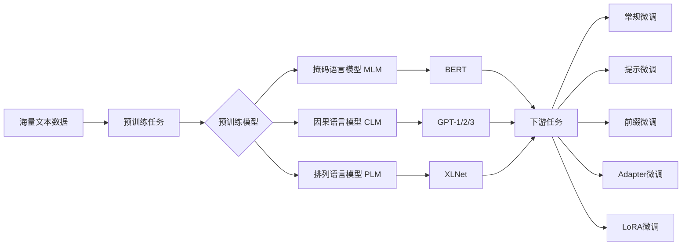

# 从零开始大模型开发与微调：新时代的曙光—人工智能与大模型

关键词：大模型、人工智能、机器学习、深度学习、自然语言处理、Transformer、BERT、GPT、微调、迁移学习

## 1. 背景介绍
### 1.1  问题的由来
人工智能(Artificial Intelligence, AI)自诞生以来就备受瞩目,它试图赋予机器人类智能的特性,使其能像人类一样思考、学习和解决问题。近年来,随着计算机硬件性能的飞速发展和海量数据的积累,AI技术取得了突破性进展,尤其是深度学习(Deep Learning, DL)的兴起,更是将AI推向了一个新的高度。

在众多AI技术中,大模型(Large Language Model, LLM)无疑是当前最耀眼的明星。LLM是一种基于Transformer架构的超大规模语言模型,通过在海量文本数据上进行预训练,可以学习到丰富的语言知识和常识,从而具备强大的自然语言理解和生成能力。以GPT-3、PaLM、BLOOM等为代表的LLM展现出了惊人的性能,在问答、对话、写作、编程等多个任务上达到甚至超越了人类的水平,引发了学术界和产业界的广泛关注。

### 1.2  研究现状 
目前,LLM已经成为NLP领域的研究热点和产业竞争的焦点。谷歌、OpenAI、DeepMind、Meta等科技巨头和顶尖实验室纷纷投入巨资,开发出一个个参数量高达千亿、万亿级别的超大模型。而围绕LLM的应用探索也如火如荼,涌现出Copilot、ChatGPT、DALL·E等耳熟能详的明星产品,正在深刻改变人们的工作和生活方式。

但LLM的研发成本极其高昂,动辄需要数千万美元的硬件投入和数百万小时的训练时间,这对于大多数企业和研究者而言是难以企及的。同时,LLM虽然性能卓越,但仍存在知识获取能力有限、推理能力不足、可解释性差等问题,离真正的人类水平智能还有很大差距。因此,如何在有限资源下高效开发和优化LLM,进一步提升其性能,是目前函待解决的重要课题。

### 1.3  研究意义
本文针对上述问题,提出了一套从零开始开发和微调LLM的完整方法。具体包括:

1. 详细阐述LLM的原理,包括Transformer结构、注意力机制、预训练方法等,帮助读者深入理解LLM的内在机制。

2. 介绍LLM开发的完整流程,包括数据准备、模型设计、训练优化、推理部署等,为读者提供一个系统的指导。

3. 重点探讨LLM的微调技术,介绍多种数据增强、Prompt工程、参数高效微调等方法,帮助读者在下游任务上进一步提升LLM性能。

4. 给出具体的代码实现,包括用PyTorch从头实现BERT、GPT等模型,以及使用huggingface进行微调的示例,便于读者动手实践。

5. 展望LLM未来的发展方向,包括知识增强、推理能力、多模态建模、绿色高效等,为读者指明前进的道路。

本文的研究具有重要意义:一方面,它为广大研究者和开发者提供了一个全面系统的LLM开发指南,有助于降低门槛,推动LLM技术的普及应用;另一方面,文中提出的微调方法可以在降低训练成本的同时提高模型性能,为进一步发展人工智能技术提供了新思路。

### 1.4  本文结构
本文共分为九个部分:第一部分介绍研究背景;第二部分阐述LLM的核心概念;第三部分详细讲解LLM的原理和算法;第四部分建立LLM的数学模型并给出公式推导;第五部分通过代码实例演示LLM的开发流程;第六部分讨论LLM的应用场景;第七部分推荐LLM相关的学习资源;第八部分总结全文并展望未来;第九部分为常见问题解答。

## 2. 核心概念与联系
大模型是指参数量极其庞大(百亿、千亿甚至更多)的机器学习模型,尤其是自然语言处理领域的语言模型。它主要基于Transformer架构,通过自监督学习在海量无标注文本数据上进行预训练,可以学习到丰富的语言知识和常识,从而在下游任务上取得优异的性能。

与传统的自然语言处理模型相比,大模型具有以下优势:

1. 强大的语言理解和生成能力。得益于其海量的参数和训练数据,大模型可以深入理解文本的语义,捕捉词汇间的复杂关系,生成流畅自然的文本。

2. 出色的零样本和少样本学习能力。大模型可以在预训练阶段学习到丰富的先验知识,在面对新任务时无需或只需少量调优,即可取得不错的效果。

3. 优秀的迁移学习能力。大模型可以作为通用的语言理解器,为各种下游任务提供优质的文本特征,大大降低了任务的开发成本。

大模型的核心是Transformer结构和注意力机制:

- Transformer采用编码器-解码器架构,通过堆叠多层自注意力和前馈网络,可以并行地对文本序列进行特征提取。

- 注意力机制赋予模型聚焦于关键信息的能力,使其能够捕捉文本中的长距离依赖,克服了RNN等传统模型的缺陷。

大模型的训练采用自监督学习范式,即通过对输入文本进行mask、扰动等操作,让模型去预测被遮掩或扰动的部分,从而学习到语言的内在规律。常见的预训练任务包括:

- 掩码语言模型(Masked Language Model, MLM),如BERT
- 因果语言模型(Causal Language Model, CLM),如GPT系列
- 排列语言模型(Permuted Language Model, PLM),如XLNet

在实际使用中,大模型一般要在下游任务的数据上进行微调,以进一步提升性能。微调技术包括:

- 常规微调:在下游任务数据上对预训练模型进行简单的监督学习。
- 提示微调(Prompt-tuning):设计输入提示模板,引导模型进行特定任务的学习。
- 前缀微调(Prefix-tuning):只微调输入嵌入的前缀部分,参数量更少。
- Adapter微调:在预训练模型中插入浅层的Adapter模块,只微调这些模块。
- LoRA微调:只微调注意力矩阵的低秩分解部分,大幅降低参数量。

下图展示了大模型的整体架构和关键组件之间的联系:

## 3. 核心算法原理 & 具体操作步骤
### 3.1  算法原理概述
大模型的核心是基于Transformer的语言模型。Transformer由编码器和解码器组成,每个编码器和解码器又由多个相同的层堆叠而成。

编码器的每一层包含两个子层:

1. 多头自注意力(Multi-Head Self-Attention)层,用于捕捉文本序列内部的长距离依赖关系。

2. 前馈(Feed Forward)层,用于对特征进行非线性变换。

多头自注意力是Transformer的核心,它将输入序列的每个位置与该序列的所有位置进行注意力计算,得到每个位置的上下文表示。具体地,多头自注意力分为三步:

1. 将输入序列X通过三个线性变换得到Q(Query)、K(Key)、V(Value)矩阵。

2. 将Q、K进行点积并归一化,得到注意力权重矩阵。

3. 将注意力权重矩阵与V相乘,得到输出表示。

通过引入多个注意力头,可以让模型关注输入序列的不同方面,提高特征提取能力。前馈层则使用两层线性变换with a ReLU激活函数,对特征进行进一步的抽象。

解码器与编码器结构类似,但在每个多头自注意力层后添加了一个encoder-decoder attention层,用于捕捉编码器输出与解码器输入之间的关系。此外,解码器还使用了masked self-attention,以避免在生成每个token时看到未来的信息。

Transformer在预训练阶段通过自监督学习从海量无标注语料中学习语言知识。常见的预训练任务有:

- MLM:随机mask输入序列的部分token,让模型根据上下文预测被遮掩的token。
- CLM:给定前若干token,让模型预测下一个token。
- PLM:随机打乱输入序列的顺序,让模型预测原始的顺序。

在微调阶段,Transformer在下游任务的有标注数据上进行监督学习,常见的微调技术有:

- 常规微调:在任务数据上对整个预训练模型进行微调。
- Prompt微调:设计输入提示模板,引导模型进行任务学习。
- Prefix微调:只微调输入嵌入的前缀token。
- Adapter微调:在预训练模型中插入额外的Adapter模块并微调。
- LoRA微调:只微调注意力矩阵的低秩分解部分。

### 3.2  算法步骤详解
下面以BERT和MLM为例,详细讲解Transformer的预训练过程:

输入:文本序列 $X=(x_1,…,x_n)$,其中$x_i$为第$i$个token的嵌入向量。

1. 嵌入层:将$X$通过token、位置、段嵌入求和,得到输入嵌入$E=(e_1,…,e_n)$。

2. 多头自注意力层:
   
   a. 线性变换:$Q=EW_Q,K=EW_K,V=EW_V$
   
   b. 计算注意力权重:$A=softmax(QK^T/\sqrt{d_k})$
   
   c. 加权求和:$H=AV$
   
   d. 拼接多头输出:$M=Concat(H_1,…,H_h)W_O$

3. 前馈层:
   
   $F=max(0,MW_1+b_1)W_2+b_2$

4. 层归一化和残差连接:
   
   $L=LayerNorm(F+M)$

5. 重复步骤2~4,堆叠N个编码器层,得到最终输出$T=(t_1,…,t_n)$。

6. MLM预训练:

   a. 随机mask 15%的token,替换为[MASK]、随机token或保持不变。
   
   b. 将$T$输入线性层和softmax层,预测被mask的token:$y=softmax(TW_P+b_P)$
   
   c. 计算预测值与真实值的交叉熵损失:$L=-\sum_{i=1}^nq_ilog(y_i)$
   
   d. 反向传播,更新模型参数。

7. 微调:
   
   a. 在下游任务数据上,将输入文本序列$X$通过BERT编码,得到$T$。
   
   b. 将$T$输入任务特定的输出层,如分类、匹配等:$y=f(T)$
   
   c. 计算任务损失,并进行反向传播和参数更新。

以上就是BERT的完整训练流程。其他如GPT、XLNet等模型与之类似,主要区别在于预训练任务、注意力掩码等细节。

### 3.3  算法优缺点
Transformer语言模型具有以下优点:

1. 并行计算能力强,训练速度快。
2. 注意力机制可以捕捉长距离依赖,对语言理解更深入。
3. 预训练学习语言知识,具备迁移和泛化