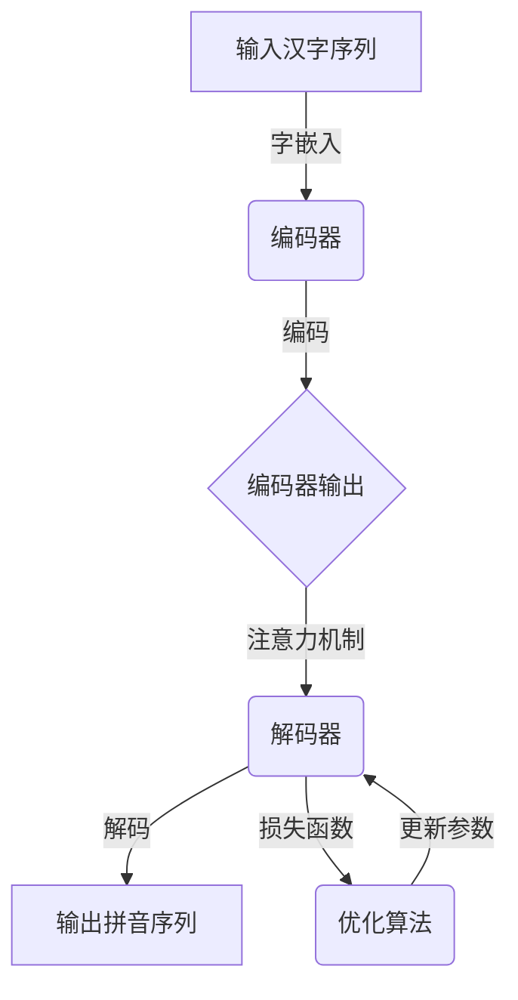

# 从零开始大模型开发与微调：汉字拼音转化模型的确定

## 1. 背景介绍

### 1.1 问题的由来

在当今信息时代,文字处理和自然语言处理技术已经渗透到我们生活的方方面面。无论是在网络搜索、智能语音助手还是文字翻译等场景中,高效准确的汉字与拼音之间的转换都扮演着关键角色。然而,由于汉语拼音和汉字之间的映射关系复杂多变,构建一个高性能的汉字拼音转化模型仍然是一个具有挑战性的任务。

### 1.2 研究现状  

传统的汉字拼音转化方法主要依赖于字典查询和规则匹配,但这种方法往往无法很好地处理生僻字、新词以及特殊情况。近年来,随着深度学习技术的飞速发展,基于神经网络的端到端模型在自然语言处理领域取得了巨大成功,为构建高效的汉字拼音转化模型提供了新的思路和方法。

### 1.3 研究意义

构建一个高性能的汉字拼音转化模型不仅能够提高文字处理的效率和准确性,还可以为其他自然语言处理任务提供基础支持,如语音识别、机器翻译等。此外,该模型的研究和开发过程也将促进深度学习技术在自然语言处理领域的进一步应用和发展。

### 1.4 本文结构

本文将详细介绍如何从零开始构建一个基于深度学习的汉字拼音转化模型。首先,我们将探讨该模型的核心概念和算法原理;接着,将深入讨论数学模型的构建和公式推导过程;然后,我们将通过代码实例和实际应用场景,展示该模型的实现和应用;最后,我们将总结该模型的未来发展趋势和面临的挑战。

## 2. 核心概念与联系

在深入探讨汉字拼音转化模型的算法原理和数学模型之前,我们需要先了解一些核心概念和它们之间的联系。

### 2.1 序列到序列模型

汉字拼音转化可以被视为一个序列到序列(Sequence-to-Sequence,Seq2Seq)的任务,即将一个序列(汉字序列)映射到另一个序列(拼音序列)。Seq2Seq模型通常由两部分组成:编码器(Encoder)和解码器(Decoder)。

编码器的作用是将输入序列编码为一个向量表示,而解码器则根据该向量表示生成目标序列。在汉字拼音转化任务中,编码器将汉字序列编码为一个向量表示,解码器则根据该向量表示生成对应的拼音序列。

### 2.2 注意力机制

虽然传统的Seq2Seq模型能够完成序列到序列的映射,但它存在一个主要缺陷:编码器需要将整个输入序列压缩到一个固定长度的向量中,这可能会导致信息丢失,影响模型的性能。

为了解决这个问题,注意力机制(Attention Mechanism)被引入到Seq2Seq模型中。注意力机制允许解码器在生成每个目标元素时,selectively关注输入序列的不同部分,从而更好地捕获输入和输出之间的对应关系。

在汉字拼音转化任务中,注意力机制可以帮助模型更好地关注汉字序列中与当前生成的拼音相关的部分,提高模型的性能。

### 2.3 字嵌入和拼音嵌入

为了将汉字和拼音输入到神经网络模型中,我们需要将它们表示为数值向量。这通常是通过嵌入(Embedding)技术实现的。

字嵌入(Word Embedding)是将每个汉字映射到一个固定长度的密集向量,这些向量能够捕捉到汉字之间的语义和语法关系。同样,拼音嵌入(Pinyin Embedding)是将每个拼音映射到一个固定长度的密集向量。

通过字嵌入和拼音嵌入,我们可以将汉字序列和拼音序列表示为数值矩阵,从而输入到神经网络模型中进行训练和预测。

## 3. 核心算法原理 & 具体操作步骤

### 3.1 算法原理概述

基于上述核心概念,我们可以构建一个端到端的神经网络模型来实现汉字到拼音的转化。该模型的核心算法原理如下:

1. **编码器(Encoder)**: 将输入的汉字序列通过字嵌入层转换为数值矩阵,然后使用递归神经网络(如LSTM或GRU)对该矩阵进行编码,得到一个包含了输入序列信息的向量表示。

2. **注意力机制(Attention Mechanism)**: 在解码器的每一个时间步,计算注意力权重,用于选择性地关注编码器输出的不同部分,从而更好地捕获输入和输出之间的对应关系。

3. **解码器(Decoder)**: 将注意力权重与编码器输出进行加权求和,得到一个上下文向量。然后,将该上下文向量与解码器的隐藏状态和上一个时间步的预测结果(通过拼音嵌入层获得)作为输入,使用另一个递归神经网络进行解码,生成当前时间步的拼音预测。

4. **损失函数和优化**: 将预测的拼音序列与真实的拼音序列进行比较,计算损失函数(如交叉熵损失)。然后,使用优化算法(如随机梯度下降)对模型参数进行更新,使损失函数最小化。

通过上述算法原理,我们可以构建一个端到端的神经网络模型,实现高效准确的汉字到拼音的转化。

### 3.2 算法步骤详解

下面我们将详细解释该算法的具体操作步骤:

1. **输入处理**:
   - 将输入的汉字序列转换为一个一维张量,其中每个元素表示一个汉字的索引。
   - 通过字嵌入层,将该一维张量映射为一个二维矩阵,其中每一行表示一个汉字的嵌入向量。

2. **编码器**:
   - 将字嵌入矩阵输入到编码器(如双向LSTM或GRU)中。
   - 编码器对输入序列进行编码,得到一个包含了输入序列信息的向量序列。

3. **注意力机制**:
   - 在解码器的每一个时间步,计算注意力权重向量,其中每个元素表示对应编码器输出向量的重要性。
   - 将注意力权重向量与编码器输出向量序列进行加权求和,得到一个上下文向量。

4. **解码器**:
   - 将上下文向量与解码器的隐藏状态和上一个时间步的预测结果(通过拼音嵌入层获得)作为输入,输入到解码器(如单向LSTM或GRU)中。
   - 解码器根据这些输入,生成当前时间步的拼音预测。

5. **损失函数和优化**:
   - 将预测的拼音序列与真实的拼音序列进行比较,计算损失函数(如交叉熵损失)。
   - 使用优化算法(如随机梯度下降)对模型参数进行更新,使损失函数最小化。

6. **预测**:
   - 在训练完成后,可以使用该模型对新的汉字序列进行拼音预测。
   - 将输入的汉字序列输入到模型中,模型将生成对应的拼音序列作为输出。

通过上述步骤,我们可以实现一个端到端的神经网络模型,完成高效准确的汉字到拼音的转化任务。

### 3.3 算法优缺点

该算法的主要优点包括:

- **端到端**:该算法是一个端到端的神经网络模型,无需手工设计复杂的规则或特征,能够自动从数据中学习映射关系。
- **注意力机制**:引入注意力机制,可以有效捕获输入和输出之间的对应关系,提高模型的性能。
- **可扩展性**:该算法可以很容易地扩展到其他序列到序列的任务,如机器翻译、文本摘要等。

该算法的主要缺点包括:

- **数据需求**:训练一个高性能的神经网络模型需要大量的训练数据,而获取高质量的汉字-拼音对数据可能是一个挑战。
- **计算资源需求**:训练和推理过程都需要大量的计算资源,尤其是对于长序列和大型模型。
- **可解释性**:神经网络模型通常被视为"黑盒",其内部工作机制可能难以解释和理解。

### 3.4 算法应用领域

该算法不仅可以应用于汉字到拼音的转化任务,还可以扩展到其他序列到序列的自然语言处理任务,如:

- **机器翻译**:将一种语言的句子翻译为另一种语言。
- **文本摘要**:根据原始文本生成摘要。
- **对话系统**:根据对话历史生成自然的回复。
- **语音识别**:将语音信号转换为文本。

此外,该算法还可以应用于其他领域的序列到序列任务,如:

- **视频描述**:根据视频帧序列生成文本描述。
- **蛋白质结构预测**:根据蛋白质序列预测其三维结构。
- **时间序列预测**:根据历史数据预测未来的时间序列值。

总的来说,该算法具有广泛的应用前景,是自然语言处理和序列建模领域的一个重要算法。

## 4. 数学模型和公式 & 详细讲解 & 举例说明

### 4.1 数学模型构建

为了更好地理解和实现上述算法,我们需要构建相应的数学模型。下面将详细介绍该模型的数学表示和公式推导过程。

#### 4.1.1 符号说明

- $X = (x_1, x_2, \dots, x_n)$: 输入的汉字序列,其中$x_i$表示第$i$个汉字。
- $Y = (y_1, y_2, \dots, y_m)$: 目标的拼音序列,其中$y_j$表示第$j$个拼音。
- $E$: 编码器,将输入序列$X$编码为一个向量序列$H = (h_1, h_2, \dots, h_n)$。
- $D$: 解码器,根据编码器输出$H$和上一个时间步的预测结果$y_{j-1}$,生成当前时间步的拼音预测$\hat{y}_j$。
- $\alpha_{ij}$: 注意力权重,表示解码器在生成第$j$个拼音时,对编码器输出$h_i$的关注程度。

#### 4.1.2 编码器模型

编码器$E$的作用是将输入序列$X$编码为一个向量序列$H$,其中每个向量$h_i$包含了输入序列前$i$个元素的信息。常用的编码器模型包括循环神经网络(RNN)、长短期记忆网络(LSTM)和门控循环单元(GRU)等。

对于RNN编码器,其数学表示为:

$$h_i = f(x_i, h_{i-1})$$

其中$f$是一个非线性函数,如tanh或ReLU。

对于LSTM编码器,其数学表示为:

$$\begin{aligned}
f_t &= \sigma(W_f x_t + U_f h_{t-1} + b_f) \\
i_t &= \sigma(W_i x_t + U_i h_{t-1} + b_i) \\
o_t &= \sigma(W_o x_t + U_o h_{t-1} + b_o) \\
c_t &= f_t \odot c_{t-1} + i_t \odot \tanh(W_c x_t + U_c h_{t-1} + b_c) \\
h_t &= o_t \odot \tanh(c_t)
\end{aligned}$$

其中$\sigma$是sigmoid函数,$\odot$表示元素wise乘积