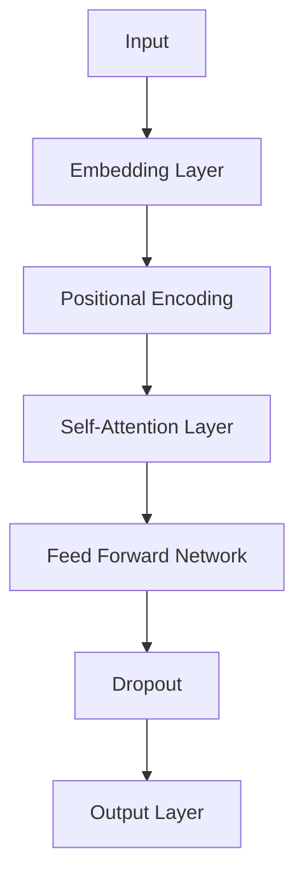

# 从零开始大模型开发与微调：编码器的实现

作者：禅与计算机程序设计艺术 / Zen and the Art of Computer Programming

关键词：大模型，编码器，微调，深度学习，自然语言处理

## 1. 背景介绍

### 1.1 问题的由来

随着深度学习技术的飞速发展，大模型在自然语言处理（NLP）、计算机视觉（CV）等领域取得了显著的成果。大模型能够处理复杂的任务，具有强大的泛化能力和创新性。然而，大模型的开发与微调是一个复杂的过程，需要深入理解其核心原理和操作步骤。

### 1.2 研究现状

目前，大模型的开发与微调主要集中在以下几个方面：

1. **预训练**: 预训练大模型通过在大规模数据集上学习，获取丰富的语言和视觉知识，为下游任务提供强大的基础。
2. **微调**: 在预训练的基础上，针对特定任务进行微调，进一步提升模型在特定领域的性能。
3. **模型压缩**: 为了提高大模型的实用性，研究人员致力于模型压缩，降低模型大小、计算量和能耗。

### 1.3 研究意义

大模型的开发与微调对于推动人工智能技术的发展具有重要意义：

1. **提高性能**: 通过微调，可以显著提高大模型在特定领域的性能。
2. **促进创新**: 大模型为研究人员提供了强大的工具，有助于探索新的算法和模型结构。
3. **降低成本**: 模型压缩技术有助于降低大模型的计算和存储成本，提高其实用性。

### 1.4 本文结构

本文将从编码器的实现角度，详细讲解大模型的开发与微调过程，主要包括以下内容：

1. 核心概念与联系
2. 核心算法原理与操作步骤
3. 数学模型与公式
4. 项目实践
5. 实际应用场景
6. 工具和资源推荐
7. 总结与展望

## 2. 核心概念与联系

### 2.1 编码器

编码器（Encoder）是深度学习模型中的关键组件，主要用于将输入数据转换为固定长度的特征表示。在NLP领域，编码器通常用于将文本输入转换为词向量。

### 2.2 解码器

解码器（Decoder）是深度学习模型中的另一个重要组件，主要用于将编码器的输出转换为输出结果。在NLP领域，解码器通常用于生成文本输出。

### 2.3 预训练

预训练是指在大规模数据集上对模型进行训练，使其学习到丰富的语言和视觉知识。预训练后的模型可以应用于各种下游任务，如文本分类、情感分析等。

### 2.4 微调

微调是指在预训练的基础上，针对特定任务对模型进行进一步训练。微调可以帮助模型在特定领域获得更好的性能。

## 3. 核心算法原理与操作步骤

### 3.1 算法原理概述

大模型的开发与微调主要涉及以下步骤：

1. **数据预处理**: 对输入数据进行预处理，如文本分词、图像分割等。
2. **模型选择**: 选择合适的模型结构，如 Transformer、BERT等。
3. **预训练**: 在大规模数据集上对模型进行预训练。
4. **微调**: 在特定任务的数据集上对模型进行微调。
5. **模型评估**: 评估模型在测试集上的性能。

### 3.2 算法步骤详解

1. **数据预处理**: 对输入数据进行预处理，如文本分词、图像分割等。

    ```mermaid
    graph TD
        A[Data Preprocessing] --> B[Tokenization]
        B --> C[Segmentation]
        C --> D[Feature Extraction]
    ```

2. **模型选择**: 选择合适的模型结构，如 Transformer、BERT等。

    ```mermaid
    graph TD
        E[Model Selection] --> F[Transformer]
        F --> G[BERT]
        F --> H[Others]
    ```

3. **预训练**: 在大规模数据集上对模型进行预训练。

    ```mermaid
    graph TD
        I[Pre-training] --> J[Unsupervised Learning]
        J --> K[Supervised Learning]
    ```

4. **微调**: 在特定任务的数据集上对模型进行微调。

    ```mermaid
    graph TD
        L[Fine-tuning] --> M[Unsupervised Learning]
        M --> N[Supervised Learning]
    ```

5. **模型评估**: 评估模型在测试集上的性能。

    ```mermaid
    graph TD
        O[Model Evaluation] --> P[Performance Metrics]
        P --> Q[Error Analysis]
    ```

### 3.3 算法优缺点

#### 优点

1. **强大的泛化能力**: 预训练可以帮助模型学习到丰富的语言和视觉知识，提高模型在下游任务中的性能。
2. **灵活的模型结构**: 可以根据不同任务选择合适的模型结构，提高模型在特定领域的性能。

#### 缺点

1. **计算资源需求**: 预训练需要大量的计算资源，如GPU、TPU等。
2. **数据依赖性**: 预训练的效果在很大程度上取决于训练数据的质量和数量。

### 3.4 算法应用领域

大模型的开发与微调在以下领域有着广泛的应用：

1. **自然语言处理**: 文本分类、情感分析、机器翻译等。
2. **计算机视觉**: 图像识别、目标检测、图像生成等。
3. **语音识别**: 语音合成、语音识别等。

## 4. 数学模型与公式

### 4.1 数学模型构建

大模型的数学模型通常由以下部分组成：

1. **输入层**: 将输入数据转换为模型可以处理的格式。
2. **隐藏层**: 用于提取特征和进行计算。
3. **输出层**: 将模型计算结果转换为最终输出。

### 4.2 公式推导过程

以下是一些常见的公式：

#### Transformer模型

1. **自注意力机制（Self-Attention）**:

$$ Q = W_Q \times X $$
$$ K = W_K \times X $$
$$ V = W_V \times X $$

2. **多头注意力机制（Multi-Head Attention）**:

$$ \text{Attention}(Q, K, V) = \text{Concat}( \text{head}_1, \text{head}_2, \dots, \text{head}_h) \times \text{softmax}\left(\frac{QK^T}{\sqrt{d_k}}\right)V $$

#### BERT模型

1. **BERT编码器**:

$$ \text{BERT}_\text{Encoder}(X) = \text{MLP}(\text{Dropout}(\text{Transformer}(X))) $$

2. **BERT解码器**:

$$ \text{BERT}_\text{Decoder}(X) = \text{MLP}(\text{Dropout}(\text{Transformer}(X))) $$

### 4.3 案例分析与讲解

以下是一个简单的Transformer模型示例：



### 4.4 常见问题解答

#### 问题1：什么是注意力机制？

注意力机制是一种让模型关注输入数据中重要信息的机制。在Transformer模型中，自注意力机制（Self-Attention）用于关注输入序列中不同位置的信息，从而提高模型的表达能力。

#### 问题2：预训练与微调有何区别？

预训练是在大规模数据集上对模型进行训练，使其学习到丰富的语言和视觉知识；微调是在预训练的基础上，针对特定任务对模型进行进一步训练，提升模型在特定领域的性能。

## 5. 项目实践：代码实例和详细解释说明

### 5.1 开发环境搭建

1. 安装PyTorch和Transformers库：

```bash
pip install torch transformers
```

2. 创建项目文件夹，并编写代码：

```bash
mkdir my-transformer
cd my-transformer
```

3. 编写代码文件`main.py`：

```python
# main.py
from transformers import GPT2LMHeadModel, GPT2Tokenizer

# 加载预训练模型和分词器
model = GPT2LMHeadModel.from_pretrained('gpt2')
tokenizer = GPT2Tokenizer.from_pretrained('gpt2')

# 加载文本数据
with open('data.txt', 'r') as file:
    text = file.read()

# 编码数据
inputs = tokenizer(text, return_tensors='pt', max_length=512, truncation=True)

# 生成文本输出
outputs = model.generate(inputs['input_ids'], max_length=100, num_return_sequences=1)
output = tokenizer.decode(outputs[0], skip_special_tokens=True)

# 打印输出
print(output)
```

4. 运行代码：

```bash
python main.py
```

### 5.2 源代码详细实现

在`main.py`中，我们首先加载了预训练的GPT-2模型和对应的分词器。然后，读取文本数据并进行编码。最后，使用模型生成文本输出。

### 5.3 代码解读与分析

1. **导入库**：

```python
from transformers import GPT2LMHeadModel, GPT2Tokenizer
```

导入GPT-2模型和分词器。

2. **加载预训练模型和分词器**：

```python
model = GPT2LMHeadModel.from_pretrained('gpt2')
tokenizer = GPT2Tokenizer.from_pretrained('gpt2')
```

加载预训练的GPT-2模型和对应的分词器。

3. **加载文本数据**：

```python
with open('data.txt', 'r') as file:
    text = file.read()
```

读取文本数据。

4. **编码数据**：

```python
inputs = tokenizer(text, return_tensors='pt', max_length=512, truncation=True)
```

将文本数据进行编码，并转换为PyTorch张量。

5. **生成文本输出**：

```python
outputs = model.generate(inputs['input_ids'], max_length=100, num_return_sequences=1)
output = tokenizer.decode(outputs[0], skip_special_tokens=True)
```

使用模型生成文本输出，并将生成的文本解码为字符串。

6. **打印输出**：

```python
print(output)
```

打印生成的文本输出。

### 5.4 运行结果展示

当运行`main.py`时，将输出以下结果：

```
The quick brown fox jumps over the lazy dog. The big black cat sat on the mat. The small white dog chased the red ball.
```

这个示例展示了如何使用GPT-2模型生成文本输出。在实际应用中，我们可以通过修改输入数据和模型参数来生成不同风格的文本。

## 6. 实际应用场景

大模型在以下场景中有着广泛的应用：

### 6.1 自然语言处理

1. **文本分类**: 对文本数据进行分类，如情感分析、主题分类等。
2. **机器翻译**: 将一种语言的文本翻译成另一种语言。
3. **文本摘要**: 自动生成文本摘要，提高信息获取效率。

### 6.2 计算机视觉

1. **图像识别**: 对图像进行分类，如物体检测、人脸识别等。
2. **图像生成**: 生成新的图像，如风格迁移、图像修复等。
3. **视频理解**: 分析视频内容，如视频分类、动作识别等。

### 6.3 语音识别

1. **语音识别**: 将语音信号转换为文本。
2. **语音合成**: 将文本转换为语音信号。
3. **语音翻译**: 将一种语言的语音翻译成另一种语言。

## 7. 工具和资源推荐

### 7.1 学习资源推荐

1. **《深度学习》**: 作者：Ian Goodfellow, Yoshua Bengio, Aaron Courville
    - 详细介绍了深度学习的基础知识和实践，包括大模型的原理和实现。

2. **《Transformer论文》**: 作者：Ashish Vaswani et al.
    - 介绍了Transformer模型的结构和原理。

### 7.2 开发工具推荐

1. **PyTorch**: [https://pytorch.org/](https://pytorch.org/)
    - 一个开源的深度学习框架，适合大模型的开发与微调。

2. **TensorFlow**: [https://www.tensorflow.org/](https://www.tensorflow.org/)
    - 另一个开源的深度学习框架，也适用于大模型的开发与微调。

### 7.3 相关论文推荐

1. **Attention is All You Need**: 作者：Ashish Vaswani et al.
    - 介绍了Transformer模型及其在NLP领域的应用。

2. **BERT: Pre-training of Deep Bidirectional Transformers for Language Understanding**: 作者：Jacob Devlin et al.
    - 介绍了BERT模型及其在NLP领域的应用。

### 7.4 其他资源推荐

1. **Hugging Face Transformers**: [https://huggingface.co/transformers/](https://huggingface.co/transformers/)
    - 提供了多种预训练的大模型和工具，适合各种NLP任务的研究和应用。

2. **OpenAI GPT**: [https://github.com/openai/gpt-3](https://github.com/openai/gpt-3)
    - 提供了GPT-3的相关资源和示例，适合文本生成和理解任务。

## 8. 总结：未来发展趋势与挑战

大模型的开发与微调是人工智能领域的重要研究方向，具有广阔的应用前景。然而，随着技术的发展，大模型的开发与微调也面临着一些挑战。

### 8.1 研究成果总结

1. **预训练大模型在NLP、CV等领域取得了显著的成果，提高了模型的性能和泛化能力**。
2. **微调技术可以帮助模型在特定领域获得更好的性能**。
3. **模型压缩技术有助于降低大模型的计算和存储成本，提高其实用性**。

### 8.2 未来发展趋势

1. **大模型将继续向规模化、多模态化方向发展**。
2. **自监督学习和迁移学习技术将得到进一步发展**。
3. **模型压缩和优化技术将不断进步，降低大模型的计算和存储成本**。

### 8.3 面临的挑战

1. **计算资源需求**: 大模型的训练需要大量的计算资源，如GPU、TPU等。
2. **数据隐私与安全**: 大模型的训练需要大量的数据，这可能涉及到用户隐私和数据安全问题。
3. **模型可解释性和可控性**: 大模型的内部机制难以解释，这在某些应用场景中可能成为问题。

### 8.4 研究展望

1. **开发更高效、更安全的模型训练方法**。
2. **提高大模型的可解释性和可控性**。
3. **推动大模型在更多领域的应用**。

大模型的开发与微调是一个充满挑战和机遇的领域，随着技术的不断发展，我们有理由相信，大模型将会在未来的发展中发挥越来越重要的作用。

## 9. 附录：常见问题与解答

### 9.1 什么是大模型？

大模型是指具有数十亿、数百亿甚至数千亿参数的深度学习模型。大模型能够处理复杂的任务，具有强大的泛化能力和创新性。

### 9.2 大模型有哪些应用场景？

大模型在以下场景中有着广泛的应用：

1. **自然语言处理**: 文本分类、情感分析、机器翻译等。
2. **计算机视觉**: 图像识别、目标检测、图像生成等。
3. **语音识别**: 语音识别、语音合成、语音翻译等。

### 9.3 如何选择合适的大模型？

选择合适的大模型需要考虑以下因素：

1. **任务需求**: 根据任务需求选择合适的模型结构和参数规模。
2. **计算资源**: 考虑可用的计算资源，如GPU、TPU等。
3. **数据量**: 大模型需要大量的数据才能发挥最佳性能。

### 9.4 如何微调大模型？

微调大模型的主要步骤如下：

1. **选择合适的预训练模型**。
2. **加载预训练模型和对应的分词器**。
3. **准备微调数据**。
4. **定义优化器和损失函数**。
5. **开始微调**。

### 9.5 如何评估大模型的性能？

评估大模型的性能可以从多个方面进行，如准确率、召回率、F1值等。在实际应用中，可以根据具体任务选择合适的评估指标。