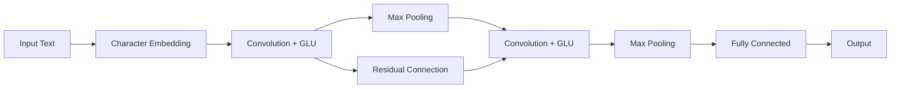

# 从零开始大模型开发与微调：针对文本的卷积神经网络模型简介—字符卷积

关键词：大模型、文本卷积神经网络、字符卷积、模型微调、自然语言处理

## 1. 背景介绍
### 1.1 问题的由来
随着人工智能和自然语言处理技术的快速发展,大规模预训练语言模型(如BERT、GPT等)已经成为了NLP领域的主流范式。这些大模型在多个NLP任务上取得了显著的性能提升。然而,训练这些大模型需要巨大的计算资源和训练数据,对于很多个人开发者和中小企业来说门槛较高。因此,如何从零开始高效地开发和微调适合特定任务的轻量级模型,成为了一个亟待解决的问题。

### 1.2 研究现状 
近年来,卷积神经网络(CNN)在计算机视觉领域取得了巨大成功,很多研究者尝试将CNN应用到NLP任务中。Kim在2014年提出了用于文本分类的字符级CNN模型[1],在多个基准数据集上取得了优异的性能。Zhang等人提出了字符级卷积网络CharCNN[2],在情感分析、问题分类、作者识别等任务上超越了诸多基于词的模型。Conneau等人提出了非常深的字符级CNN模型VDCNN[3],在大规模文本分类任务上取得了SOTA效果。这些工作表明,字符级CNN是一种简单有效的文本建模方法。

### 1.3 研究意义
尽管大模型在NLP领域一枝独秀,但轻量级模型仍然有着不可替代的价值:
1. 更容易部署,对计算资源要求较低,更适合落地应用。
2. 训练和推理速度更快,更适合实时在线服务。
3. 更容易针对特定任务进行微调和优化。
4. 模型更加透明可解释,更容易分析和改进。

因此,研究轻量级的字符级CNN模型对于丰富NLP模型的多样性、促进NLP技术的普及应用具有重要意义。本文将重点介绍字符级CNN的基本原理,并给出详细的模型实现和微调流程,帮助读者快速掌握这一有用的技术。

### 1.4 本文结构
本文后续章节安排如下:
- 第2节介绍字符级CNN涉及的核心概念。 
- 第3节详细讲解字符级CNN的网络结构和训练算法。
- 第4节给出字符级CNN用到的关键数学模型和公式。
- 第5节提供了基于PyTorch实现字符级CNN的完整代码。
- 第6节讨论了字符级CNN的实际应用场景。
- 第7节推荐了相关的学习资源和开发工具。
- 第8节总结全文,并展望了字符级CNN的未来发展方向。
- 第9节的附录解答了一些常见问题。

## 2. 核心概念与联系

在介绍字符级CNN之前,我们先来了解一下其中涉及的几个核心概念:

- 字符嵌入(Character Embedding):将每个字符映射为一个固定长度的稠密向量。类似于词嵌入,但粒度更细。字符嵌入可以从头训练,也可以用预训练的嵌入。

- 卷积(Convolution):使用不同的卷积核在输入的字符嵌入上滑动,提取局部特征。卷积核的宽度等于字符嵌入维度,高度是超参数,常用2-7。卷积的步长通常为1。

- 池化(Pooling):对卷积得到的特征图进行压缩,提取最显著的特征。常用的池化方式有最大池化和平均池化。池化使模型对小的字符变化更加鲁棒。

- 通道(Channel):每个卷积核产生一个通道的特征图。使用多个卷积核可以提取不同角度的特征,类似于RGB图像的三个通道。

- 门控线性单元(GLU):一种用于替代ReLU的激活函数[4]。GLU对输入做线性变换,并用sigmoid门控单元调节每个元素的scale。GLU让梯度更容易回传,使训练更深的模型成为可能。

- 残差连接(Residual Connection):将模型的输入直接接到输出[5],使梯度可以直接回传到底层。残差连接有助于训练更深的模型。

这些概念环环相扣,共同组成了字符级CNN的基本构件。下面这张示意图展示了它们在字符级CNN中是如何协同工作的:

## 3. 核心算法原理 & 具体操作步骤

### 3.1 算法原理概述
字符级CNN的核心思想是用多个卷积核去提取输入文本中不同位置、不同层次的字符组合特征,再通过池化压缩特征,最后用全连接层映射到输出空间。整个过程可以端到端训练。相比基于词的模型,字符级CNN有以下优点:
1. 不需要分词,避免了分词错误。汉语、日语等语言分词比较困难。
2. 字符集相对词表要小得多,嵌入矩阵更小,内存占用低。
3. 新词、罕见词的表征不是问题,所有字符都能得到很好的表示。
4. 可以学到词内的构词信息,更加灵活。

### 3.2 算法步骤详解
字符级CNN主要包含以下几个步骤:

1. 将输入文本转换成字符序列,padding到固定长度L。

2. 随机初始化字符嵌入矩阵$W_e \in \mathbb{R}^{V \times d}$,其中V是字符集大小,d是嵌入维度。将每个字符的one-hot向量与$W_e$相乘,得到L×d的字符嵌入矩阵。

3. 使用k个不同的卷积核$W_i \in \mathbb{R}^{h \times d}, i=1,2,...,k$在字符嵌入矩阵上做卷积,其中h是卷积核高度,即感受野大小。将卷积结果通过GLU激活,得到k个L×d/2的特征图。

4. 对每个特征图分别进行最大池化,得到k个d/2维的向量。将这k个向量拼接成一个kd/2维的向量。

5. 重复步骤3-4 n次,得到层级化的字符组合特征。为了让梯度更好地回传,可以添加残差连接,即将前一层的输出加到下一层的输入。

6. 将步骤5的输出向量通过1-2个全连接层映射到输出空间,如文本分类任务中的类别数。

7. 使用合适的损失函数(如交叉熵)和优化算法(如Adam)进行训练,直到验证集性能收敛。

### 3.3 算法优缺点

字符级CNN的优点:
- 模型结构简单,易于实现和训练。
- 不依赖预训练词向量,完全从头学习文本表征。
- 可以捕捉字符级别的局部特征和词内结构信息。
- 训练和推理速度快,资源占用低。

字符级CNN的缺点:
- 缺乏全局语义信息,对长文本建模能力有限。
- 需要深层叠加才能获得高层语义,但网络太深会影响训练效果。
- 对语言的词法、句法和语用知识利用不足。
- 字符嵌入是任务相关的,缺乏通用性,迁移能力差。

### 3.4 算法应用领域

字符级CNN在很多NLP任务上都取得了不错的效果,例如:
- 文本分类:如情感分析、主题分类、意图识别等。
- 作者识别:判断文本作者身份,在法律、安全等领域有应用。
- 语种检测:判断文本使用的语言,如中文、英文、日文等。
- 词性标注:标注每个词的词性,如名词、动词、形容词等。
- 命名实体识别:标注文本中的人名、地名、机构名等。

此外,字符级CNN还可以作为其他NLP模型的特征提取器,如在序列标注、文本匹配、机器翻译等任务中提供底层字符特征。

## 4. 数学模型和公式 & 详细讲解 & 举例说明

### 4.1 数学模型构建

我们用数学语言对字符级CNN的前向计算过程做一个形式化的描述。

输入:字符序列$c_1, c_2, ..., c_L$,其中$L$为文本长度,$c_i \in \mathbb{R}^V$为第$i$个字符的one-hot向量,$V$为字符集大小。

字符嵌入矩阵:$W_e \in \mathbb{R}^{V \times d}$,其中$d$为字符嵌入维度。

卷积核:$W_i \in \mathbb{R}^{h \times d}, i=1,2,...,k$,其中$h$为卷积核高度,$k$为卷积核个数。

偏置项:$b_i \in \mathbb{R}^{d/2}, i=1,2,...,k$。

全连接层参数:$W_f \in \mathbb{R}^{kd/2 \times o}, b_f \in \mathbb{R}^o$,其中$o$为输出维度。

激活函数:$\sigma$为sigmoid函数,$g$为ReLU函数。

最大池化:$\max$为取最大值操作。

### 4.2 公式推导过程

首先,将输入字符序列转换为字符嵌入矩阵:

$$E=[c_1, c_2, ..., c_L]^\top W_e \in \mathbb{R}^{L \times d} \tag{1}$$

然后,用卷积核$W_i$在$E$上做卷积,并通过GLU激活:

$$C_i = \text{Conv1D}(E, W_i) \in \mathbb{R}^{L \times d} \tag{2}$$
$$C_i' = [C_i[:,:d/2] \odot \sigma(C_i[:,d/2:]), C_i[:,:d/2] \odot (1-\sigma(C_i[:,d/2:]))] \in \mathbb{R}^{L \times d/2} \tag{3}$$

其中$\odot$表示逐元素相乘。接着对$C_i'$进行最大池化:

$$p_i = \max_{1 \leq j \leq L} C_{ij}' \in \mathbb{R}^{d/2} \tag{4}$$

将所有$p_i$拼接成一个向量:

$$z = [p_1, p_2, ..., p_k] \in \mathbb{R}^{kd/2} \tag{5}$$

加上残差连接并重复n次卷积池化:

$$z^{(t)} = \text{Conv1D-MaxPool}(z^{(t-1)}) + z^{(t-1)}, t=1,2,...,n \tag{6}$$

最后通过全连接层输出:

$$o = W_f z^{(n)} + b_f \in \mathbb{R}^o \tag{7}$$

对于分类任务,再接一个softmax层:

$$\hat{y} = \text{softmax}(o) \in \mathbb{R}^o \tag{8}$$

使用交叉熵损失函数:

$$J(\theta) = -\sum_{i=1}^N \sum_{j=1}^o y_{ij} \log \hat{y}_{ij} \tag{9}$$

其中$\theta$为所有参数,$N$为训练样本数,$y_i$为第$i$个样本的真实标签的one-hot向量。

### 4.3 案例分析与讲解

我们以一个简单的情感分类任务为例,来看看字符级CNN是如何工作的。

假设输入文本为"I love this movie!"。首先将其转换为字符序列:['I', ' ', 'l', 'o', 'v', 'e', ' ', 't', 'h', 'i', 's', ' ', 'm', 'o', 'v', 'i', 'e', '!']。

假设字符集大小$V=69$(26个大写字母+26个小写字母+10个数字+7个标点符号),字符嵌入维度$d=50$,卷积核高度$h=3$,卷积核个数$k=100$,卷积层数$n=2$,最大文本长度$L=200$,输出类别数$o=2$(正面/负面)。

首先随机初始化字符嵌入矩阵$W_e \in \mathbb{R}^{69