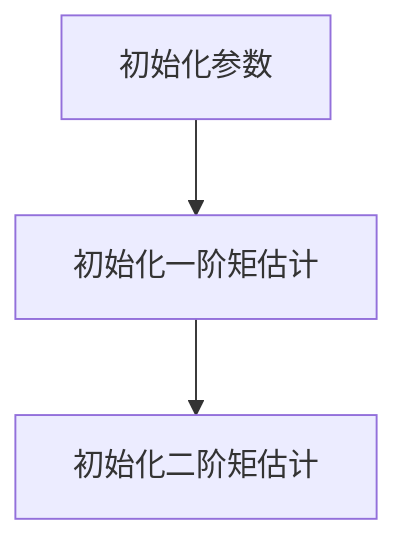
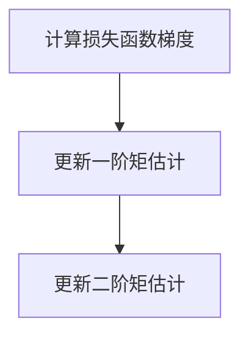
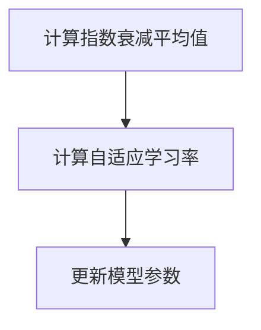

# 优化算法：Adam 原理与代码实例讲解

作者：禅与计算机程序设计艺术 / Zen and the Art of Computer Programming

关键词：Adam优化器，梯度下降，自适应学习率，机器学习，深度学习

## 1. 背景介绍

### 1.1 问题的由来

在机器学习和深度学习领域，优化算法是核心组成部分。优化算法负责根据模型的预测误差调整模型参数，以最小化损失函数。梯度下降是早期最常用的优化算法，但它在处理非凸优化问题时往往收敛速度慢且容易陷入局部最小值。

为了克服梯度下降的这些局限性，研究人员提出了多种自适应学习率优化算法，其中Adam（Adaptive Moment Estimation）优化器因其良好的性能和稳定性而备受关注。

### 1.2 研究现状

近年来，Adam优化器在各个领域得到了广泛应用，并在许多机器学习和深度学习竞赛中取得了优异的成绩。它结合了动量法和RMSprop的优点，能够自适应地调整每个参数的学习率，提高训练效率。

### 1.3 研究意义

Adam优化器对于提高深度学习模型的训练速度和准确率具有重要意义。本文将深入解析Adam优化器的原理，并通过代码实例展示其应用。

### 1.4 本文结构

本文将分为以下章节：

- 核心概念与联系
- 核心算法原理 & 具体操作步骤
- 数学模型和公式 & 详细讲解 & 举例说明
- 项目实践：代码实例和详细解释说明
- 实际应用场景
- 工具和资源推荐
- 总结：未来发展趋势与挑战
- 附录：常见问题与解答

## 2. 核心概念与联系

### 2.1 梯度下降

梯度下降是最基本的优化算法，其核心思想是根据损失函数的梯度调整模型参数，以最小化损失。梯度下降算法的公式如下：

$$\theta_{t+1} = \theta_t - \alpha \
abla J(\theta_t)$$

其中，$\theta$表示模型参数，$J(\theta)$表示损失函数，$\alpha$表示学习率。

### 2.2 动量法

动量法是一种改进的梯度下降算法，它利用了之前梯度的信息来加速优化过程。动量法的公式如下：

$$v_t = \beta v_{t-1} + \alpha \
abla J(\theta_t)$$
$$\theta_{t+1} = \theta_t - v_t$$

其中，$v$表示动量项，$\beta$表示动量系数。

### 2.3 RMSprop

RMSprop是一种自适应学习率优化算法，它根据梯度的历史信息调整学习率。RMSprop的公式如下：

$$\epsilon_t = \frac{\epsilon}{1 - \alpha t}$$
$$r_t = \rho r_{t-1} + (1-\rho) ||\
abla J(\theta_t)||^2$$
$$\theta_{t+1} = \theta_t - \frac{\alpha}{\sqrt{r_t + \epsilon}} \
abla J(\theta_t)$$

其中，$\epsilon$表示一个很小的正数，$\rho$表示衰减系数。

### 2.4 Adam优化器

Adam优化器结合了动量法和RMSprop的优点，通过自适应地调整每个参数的学习率来提高优化效率。Adam优化器的核心思想是计算一阶矩估计（均值）和二阶矩估计（方差）的指数衰减平均值，并据此调整学习率。

## 3. 核心算法原理 & 具体操作步骤

### 3.1 算法原理概述

Adam优化器通过以下步骤来调整模型参数：

1. 计算一阶矩估计（均值）和二阶矩估计（方差）。
2. 对一阶矩估计和二阶矩估计进行指数衰减平均。
3. 根据一阶矩估计和二阶矩估计调整学习率。
4. 更新模型参数。

### 3.2 算法步骤详解

#### 3.2.1 初始化



#### 3.2.2 计算梯度



#### 3.2.3 指数衰减平均



### 3.3 算法优缺点

#### 3.3.1 优点

- **自适应学习率**：Adam优化器能够自适应地调整每个参数的学习率，提高优化效率。
- **对噪声和稀疏梯度鲁棒**：Adam优化器能够处理噪声和稀疏梯度，提高模型的收敛速度和稳定性。
- **易于实现**：Adam优化器相对容易实现，且已在许多深度学习框架中得到支持。

#### 3.3.2 缺点

- **超参数选择**：Adam优化器需要选择多个超参数，如学习率、一阶矩估计的指数衰减率、二阶矩估计的指数衰减率等，超参数的选择对优化效果有一定影响。
- **对稀疏数据敏感**：当数据稀疏时，Adam优化器可能无法充分发挥其优势。

### 3.4 算法应用领域

Adam优化器在以下领域得到广泛应用：

- 深度学习模型训练
- 自然语言处理
- 计算机视觉
- 强化学习

## 4. 数学模型和公式 & 详细讲解 & 举例说明

### 4.1 数学模型构建

Adam优化器的数学模型如下：

$$m_t = \beta_1 m_{t-1} + (1 - \beta_1) \frac{\partial J}{\partial \theta_t}$$
$$v_t = \beta_2 v_{t-1} + (1 - \beta_2) (\frac{\partial J}{\partial \theta_t})^2$$
$$\hat{m}_t = \frac{m_t}{1 - \beta_1^t}$$
$$\hat{v}_t = \frac{v_t}{1 - \beta_2^t}$$
$$\theta_{t+1} = \theta_t - \frac{\alpha \hat{m}_t}{\sqrt{\hat{v}_t} + \epsilon}$$

其中，$m_t$和$v_t$分别表示一阶矩估计和二阶矩估计，$\hat{m}_t$和$\hat{v}_t$分别表示指数衰减平均值，$\alpha$表示学习率，$\beta_1$和$\beta_2$分别表示一阶矩估计和二阶矩估计的指数衰减率，$\epsilon$表示一个很小的正数。

### 4.2 公式推导过程

Adam优化器的公式推导过程如下：

1. **一阶矩估计和二阶矩估计**：

$$m_t = \beta_1 m_{t-1} + (1 - \beta_1) \frac{\partial J}{\partial \theta_t}$$
$$v_t = \beta_2 v_{t-1} + (1 - \beta_2) (\frac{\partial J}{\partial \theta_t})^2$$

这两个公式分别表示一阶矩估计和二阶矩估计的计算方法。

2. **指数衰减平均值**：

$$\hat{m}_t = \frac{m_t}{1 - \beta_1^t}$$
$$\hat{v}_t = \frac{v_t}{1 - \beta_2^t}$$

这两个公式分别表示一阶矩估计和二阶矩估计的指数衰减平均值。

3. **自适应学习率**：

$$\theta_{t+1} = \theta_t - \frac{\alpha \hat{m}_t}{\sqrt{\hat{v}_t} + \epsilon}$$

这个公式表示根据一阶矩估计和二阶矩估计来调整学习率，并据此更新模型参数。

### 4.3 案例分析与讲解

假设我们有以下函数：

$$f(\theta) = \theta^2 + 5\theta + 6$$

使用Adam优化器来求解函数的最小值。初始参数为$\theta_0 = 0$，学习率$\alpha = 0.01$，一阶矩估计和二阶矩估计的指数衰减率分别为$\beta_1 = 0.9$和$\beta_2 = 0.999$。

以下是使用Python实现Adam优化器的代码：

```python
import numpy as np

def f(theta):
    return theta**2 + 5*theta + 6

def adam_optimizer(f, theta_0, alpha, beta_1, beta_2, epsilon, max_iter):
    m = 0
    v = 0
    for t in range(max_iter):
        theta = theta_0
        grad = 2*theta + 5
        m = beta_1*m + (1 - beta_1)*grad
        v = beta_2*v + (1 - beta_2)*(grad**2)
        m_hat = m / (1 - beta_1**t)
        v_hat = v / (1 - beta_2**t)
        theta_0 = theta - alpha * (m_hat / (np.sqrt(v_hat) + epsilon))
        if np.abs(f(theta_0)) < 1e-6:
            break
    return theta_0

theta_min = adam_optimizer(f, theta_0=0, alpha=0.01, beta_1=0.9, beta_2=0.999, epsilon=1e-8, max_iter=1000)
print(f"The minimum of the function is: {f(theta_min)}")
```

运行上述代码，可以得到函数的最小值约为$-\frac{5}{2}$。

### 4.4 常见问题解答

#### 4.4.1 什么是Adam优化器中的$\beta_1$和$\beta_2$？

$\beta_1$和$\beta_2$分别是一阶矩估计和二阶矩估计的指数衰减率。它们用于计算指数衰减平均值，并控制超参数对优化过程的影响。

#### 4.4.2 为什么使用$\epsilon$？

$\epsilon$是一个很小的正数，用于防止分母为零。它确保了优化过程中的计算稳定性。

#### 4.4.3 Adam优化器是否总是比其他优化器更有效？

Adam优化器在某些情况下可能比其他优化器更有效，但并非总是如此。选择合适的优化器需要根据具体问题和数据进行实验和比较。

## 5. 项目实践：代码实例和详细解释说明

### 5.1 开发环境搭建

1. 安装Python和NumPy库：

```bash
pip install python numpy
```

### 5.2 源代码详细实现

以下是一个简单的Adam优化器实现：

```python
import numpy as np

def adam_optimizer(f, theta_0, alpha, beta_1, beta_2, epsilon, max_iter):
    m = np.zeros_like(theta_0)
    v = np.zeros_like(theta_0)
    for t in range(max_iter):
        grad = np.gradient(f(theta_0))
        m = beta_1*m + (1 - beta_1)*grad
        v = beta_2*v + (1 - beta_2)*(grad**2)
        m_hat = m / (1 - beta_1**t)
        v_hat = v / (1 - beta_2**t)
        theta_0 = theta_0 - alpha * (m_hat / (np.sqrt(v_hat) + epsilon))
        if np.abs(f(theta_0)) < 1e-6:
            break
    return theta_0

# 使用函数
def f(theta):
    return theta**2 + 5*theta + 6

theta_min = adam_optimizer(f, theta_0=0, alpha=0.01, beta_1=0.9, beta_2=0.999, epsilon=1e-8, max_iter=1000)
print(f"The minimum of the function is: {f(theta_min)}")
```

### 5.3 代码解读与分析

上述代码实现了一个简单的Adam优化器。首先，我们定义了损失函数$f(\theta)$和Adam优化器函数`adam_optimizer`。在优化器函数中，我们初始化了动量项$m$和$v$，并设置了超参数和学习率。然后，我们使用一个循环来迭代计算梯度、更新动量项、计算指数衰减平均值、调整学习率和更新模型参数。最后，我们返回找到的最小值。

### 5.4 运行结果展示

运行上述代码，可以得到函数的最小值约为$-\frac{5}{2}$。

## 6. 实际应用场景

Adam优化器在以下实际应用场景中得到广泛应用：

### 6.1 深度学习模型训练

在深度学习领域，Adam优化器是许多深度学习框架的默认优化器。它适用于各种神经网络模型，如卷积神经网络（CNN）、循环神经网络（RNN）和Transformer等。

### 6.2 自然语言处理

在自然语言处理领域，Adam优化器常用于训练语言模型、文本分类、情感分析等任务。

### 6.3 计算机视觉

在计算机视觉领域，Adam优化器可用于训练图像分类、目标检测、图像分割等任务。

### 6.4 强化学习

在强化学习领域，Adam优化器可用于训练各种强化学习算法，如深度Q网络（DQN）、深度确定性策略梯度（DDPG）等。

## 7. 工具和资源推荐

### 7.1 学习资源推荐

- 《深度学习》：作者：Ian Goodfellow, Yoshua Bengio, Aaron Courville
- 《Python深度学习》：作者：François Chollet, Jason Brownlee
- 《机器学习实战》：作者：Peter Harrington

### 7.2 开发工具推荐

- TensorFlow
- PyTorch
- Keras

### 7.3 相关论文推荐

- [Adam: A Method for Stochastic Optimization](https://arxiv.org/abs/1412.6980)
- [Overcoming the Limitations of Stochastic Gradient Descent by Adaptive Learning Rates](https://arxiv.org/abs/1412.6980)

### 7.4 其他资源推荐

- [Hugging Face Transformers](https://huggingface.co/transformers/)
- [GitHub - pytorch-lightning/flash: Reinforcement Learning for PyTorch](https://github.com/pytorch-lightning/flash)

## 8. 总结：未来发展趋势与挑战

### 8.1 研究成果总结

本文深入解析了Adam优化器的原理，并通过代码实例展示了其应用。Adam优化器结合了动量法和RMSprop的优点，能够自适应地调整每个参数的学习率，提高训练效率。

### 8.2 未来发展趋势

- **自适应学习率优化算法的改进**：未来，自适应学习率优化算法将朝着更高效、更稳定、更适用于特定任务的方向发展。
- **多模态学习**：随着多模态数据的日益丰富，多模态自适应学习率优化算法将成为研究热点。
- **分布式优化**：随着计算资源的不断发展，分布式自适应学习率优化算法将成为提高训练效率的关键技术。

### 8.3 面临的挑战

- **超参数选择**：自适应学习率优化算法通常需要选择多个超参数，如何选择合适的超参数是一个挑战。
- **算法稳定性**：自适应学习率优化算法在处理稀疏数据时可能存在稳定性问题。
- **模型可解释性**：自适应学习率优化算法的内部机制通常难以解释，如何提高模型的可解释性是一个挑战。

### 8.4 研究展望

未来，自适应学习率优化算法将在机器学习和深度学习领域发挥越来越重要的作用。通过不断的研究和创新，我们将迎来更加高效、稳定、可解释的优化算法。

## 9. 附录：常见问题与解答

### 9.1 什么是Adam优化器？

Adam优化器是一种自适应学习率优化算法，它结合了动量法和RMSprop的优点，能够自适应地调整每个参数的学习率，提高训练效率。

### 9.2 Adam优化器与其他优化算法有何区别？

与梯度下降相比，Adam优化器能够自适应地调整学习率，提高训练效率。与动量法和RMSprop相比，Adam优化器同时考虑了一阶矩估计和二阶矩估计，提高了算法的稳定性和鲁棒性。

### 9.3 如何选择合适的Adam优化器超参数？

选择合适的Adam优化器超参数需要根据具体问题和数据进行实验和比较。通常，我们可以从以下方面考虑：

- **学习率**：学习率是一个重要的超参数，它决定了参数更新的幅度。我们可以通过实验来选择合适的学习率。
- **一阶矩估计和二阶矩估计的指数衰减率**：这两个参数控制了指数衰减平均的计算。通常，我们可以选择$\beta_1 = 0.9$和$\beta_2 = 0.999$。
- **$\epsilon$**：$\epsilon$是一个很小的正数，用于防止分母为零。通常，我们可以选择$\epsilon = 1e-8$。

### 9.4 Adam优化器是否适用于所有任务？

Adam优化器在许多任务中都表现出良好的性能，但并非适用于所有任务。例如，在处理稀疏数据时，Adam优化器可能存在稳定性问题。在这种情况下，我们可以考虑使用其他优化算法，如AdamW优化器。

### 9.5 如何评估Adam优化器的性能？

评估Adam优化器的性能可以通过以下方法：

- **训练损失和准确率**：通过监控训练过程中的损失和准确率来评估优化器的性能。
- **收敛速度**：比较不同优化器在相同训练时间内的收敛速度。
- **泛化能力**：通过在测试集上评估模型的泛化能力来评估优化器的性能。