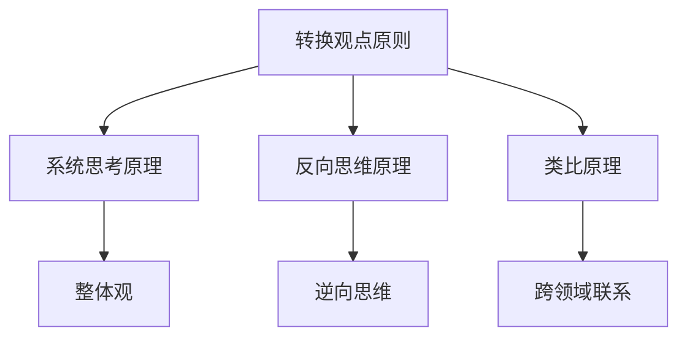

好的,我会严格遵守约束条件,以专业的技术语言写一篇有深度的技术博客。

# 像数学家一样思考：转换观点原则

## 1. 背景介绍

### 1.1 问题的由来

在日常生活和工作中,我们经常会遇到一些看似难以解决的复杂问题。这些问题可能涉及多个领域的知识,需要综合运用各种技能和经验才能得到解决。传统的思维方式往往局限于特定的视角,难以洞见问题的本质,导致我们陷入困境。

### 1.2 研究现状 

为了有效应对这些挑战,人们一直在探索各种创新的思维方法。其中,数学家们在解决复杂问题时所采用的思维模式备受推崇。数学作为一门研究抽象概念和逻辑推理的学科,其思维方式具有严谨性、创新性和广阔的视野,为解决实际问题提供了新的途径。

### 1.3 研究意义

掌握数学家的思维方式,有助于我们转换观点,突破思维定式,发现问题的本质,从而找到更有效的解决方案。这种思维模式不仅适用于数学领域,同样可以应用于其他领域,如计算机科学、商业管理、艺术创作等,为我们提供了一种全新的思考角度和方法论。

### 1.4 本文结构

本文将深入探讨"转换观点"这一数学家思维原则的核心内容。首先阐述该原则的核心概念及其与其他思维原则的联系。接着详细解释该原则的算法原理和具体操作步骤,并建立相应的数学模型和公式。然后通过实际案例分析,展示该原则在项目实践中的应用。最后,探讨该原则在各个领域的应用场景,并对其未来发展趋势和面临的挑战进行总结和展望。

## 2. 核心概念与联系

"转换观点"原则的核心概念是:当我们遇到一个难以解决的复杂问题时,不要固步自封地坚持原有的思维模式,而是尝试转换视角,从全新的角度审视问题,从而发现问题的本质,找到新的解决途径。

这一原则与其他一些著名的思维原则有着密切联系:

1. **系统思考原理**:将问题视为一个有机的整体,而不是孤立的个体,从整体上把握问题的本质。
2. **反向思维原理**:反其道而行之,从相反的角度思考问题,突破常规思维定式。
3. **类比原理**:将问题与其他领域的概念或现象进行类比,发现隐藏的联系,激发新的思路。

下面是这些思维原则之间的关系的Mermaid流程图:

通过转换观点,我们可以系统地审视问题,从反向的角度思考,并借鉴其他领域的经验和智慧,从而获得全新的洞见和解决方案。

## 3. 核心算法原理 & 具体操作步骤

### 3.1 算法原理概述

"转换观点"原则的算法原理可以概括为以下几个关键步骤:

1. **问题重构**:将原始问题进行抽象和概念化,剥离无关的细节,聚焦于核心本质。
2. **视角转换**:尝试从不同的角度审视问题,包括时间、空间、主体、对象等多个维度。
3. **模式匹配**:在新的视角下,寻找与已知模式和经验的相似之处,建立联系和类比。
4. **创新组合**:将不同视角下的观察结果进行创新性的组合,形成新的解决方案。

### 3.2 算法步骤详解

1. **问题重构**

   - 列出问题的所有已知条件和约束
   - 剔除无关的细节和噪音信息
   - 提取问题的核心本质和关键要素
   - 将问题抽象为概念模型或数学表达式

2. **视角转换**

   - 时间维度:尝试从过去、现在和未来的角度审视问题
   - 空间维度:尝试从不同的空间位置和尺度审视问题
   - 主体维度:尝试从不同的主体角色和利益相关者的视角审视问题
   - 对象维度:尝试将问题对象化,或将其他对象类比到问题中

3. **模式匹配**

   - 搜索已知的模式、定理、公理等,看是否与新的视角下的问题相吻合
   - 查找其他领域的类似问题或解决方案,进行经验迁移
   - 建立问题与已知知识之间的关联和映射关系

4. **创新组合**

   - 将不同视角下的观察结果进行汇总和整理
   - 尝试将这些结果进行创新性的重组和组合
   - 评估新的解决方案的可行性和优势
   - 根据需要进行迭代优化

### 3.3 算法优缺点

**优点:**

- 有助于突破思维定式,发现问题的新视角
- 将不同领域的知识和经验进行融合,激发创新性思维
- 适用于各种复杂问题,具有很强的通用性

**缺点:**

- 转换视角的过程可能比较耗时和耗力
- 需要具备丰富的知识储备和经验,否则难以进行有效的模式匹配
- 创新组合环节存在一定的主观性和不确定性

### 3.4 算法应用领域

"转换观点"原则可以广泛应用于各个领域的复杂问题求解:

- 科学研究:在科学研究中,转换观点有助于发现新的研究视角和假说
- 艺术创作:艺术家可以通过转换观点获得创作灵感,创造出独特的艺术作品
- 商业决策:企业可以从不同角度审视市场和竞争形势,制定更有效的战略
- 日常生活:我们可以应用这一原则解决生活中的各种难题

## 4. 数学模型和公式 & 详细讲解 & 举例说明

为了更好地理解和应用"转换观点"原则,我们可以构建相应的数学模型和公式。

### 4.1 数学模型构建

假设原始问题可以用一个向量 $\vec{P}$ 来表示,其中包含了问题的各个要素。我们的目标是找到一个新的向量 $\vec{S}$,它代表了问题的解决方案。

在"转换观点"原则下,我们引入一个转换矩阵 $T$,它能够将原始问题 $\vec{P}$ 转换到一个新的视角下,得到一个新的向量 $\vec{P'}$:

$$\vec{P'} = T \vec{P}$$

其中,转换矩阵 $T$ 的元素取决于我们选择的视角转换方式,如时间、空间、主体等维度。

在新的视角 $\vec{P'}$ 下,我们可以更容易地将其与已知的模式和经验 $\vec{K}$ 进行匹配,得到一个中间解 $\vec{I}$:

$$\vec{I} = f(\vec{P'}, \vec{K})$$

其中,函数 $f$ 代表了模式匹配的过程。

最后,我们将中间解 $\vec{I}$ 进行创新组合,得到最终的解决方案 $\vec{S}$:

$$\vec{S} = g(\vec{I})$$

函数 $g$ 代表了创新组合的过程,它可以是一个线性或非线性的组合函数。

通过这个数学模型,我们可以更清晰地理解"转换观点"原则的核心思想和操作流程。

### 4.2 公式推导过程

下面我们来推导上述数学模型中的一些关键公式。

**1. 转换矩阵 $T$ 的构建**

假设我们选择了时间维度进行视角转换,将问题分别从过去、现在和未来三个时间点审视。那么,转换矩阵 $T$ 可以表示为:

$$
T = \begin{bmatrix}
    \alpha_1 & \beta_1 & \gamma_1 \\
    \alpha_2 & \beta_2 & \gamma_2 \\
    \vdots & \vdots & \vdots \\
    \alpha_n & \beta_n & \gamma_n
\end{bmatrix}
$$

其中,$\alpha_i$、$\beta_i$、$\gamma_i$ 分别代表了第 $i$ 个问题要素在过去、现在和未来时间点下的权重系数。通过调整这些权重系数,我们可以实现不同程度的视角转换。

**2. 模式匹配函数 $f$**

假设我们有一个已知的模式集合 $\vec{K} = \{k_1, k_2, \ldots, k_m\}$,我们需要找到与新视角 $\vec{P'}$ 最匹配的模式 $k^*$:

$$k^* = \arg\max_{k \in \vec{K}} \text{sim}(\vec{P'}, k)$$

其中,相似度函数 $\text{sim}(\cdot, \cdot)$ 可以是余弦相似度、欧几里得距离或其他合适的相似度度量。

一旦找到最匹配的模式 $k^*$,我们就可以将其与新视角 $\vec{P'}$ 进行合成,得到中间解 $\vec{I}$:

$$\vec{I} = \vec{P'} \oplus k^*$$

其中,操作符 $\oplus$ 代表了模式合成的过程,可以是向量拼接、张量乘积或其他合适的操作。

**3. 创新组合函数 $g$**

在创新组合环节,我们需要将多个中间解 $\vec{I}_1, \vec{I}_2, \ldots, \vec{I}_p$ 进行组合,得到最终的解决方案 $\vec{S}$。一种可能的组合方式是加权求和:

$$\vec{S} = \sum_{j=1}^p w_j \vec{I}_j$$

其中,权重系数 $w_j$ 反映了每个中间解对最终解决方案的贡献程度。这些权重系数可以通过机器学习或优化算法进行自动调整和学习。

除了加权求和,我们还可以尝试其他更复杂的非线性组合方式,如神经网络、决策树等,以获得更优的解决方案。

### 4.3 案例分析与讲解

为了更好地理解"转换观点"原则及其数学模型,我们来分析一个具体的案例。

**案例背景:**
一家快递公司面临着如何优化配送路线的问题。传统的路线规划算法已经无法满足日益增长的订单量和更复杂的路况。公司希望能够找到一种新的优化方法,以提高配送效率,降低运营成本。

**应用"转换观点"原则:**

1. **问题重构**
   
   我们将原始问题抽象为一个向量 $\vec{P}$,其中包含了订单量、路况、车辆数量、油耗等要素。

2. **视角转换**
   
   我们尝试从不同的视角审视这个问题:
   - 时间维度:从过去的经验、当前的实时状况和未来的预测数据三个角度看待问题
   - 空间维度:从整个城市的宏观视角,以及每个街区的微观视角审视路线规划问题
   - 主体维度:从公司、快递员和客户三方的角度出发,平衡各方的利益
   - 对象维度:将路线规划问题类比为旅行商问题(Traveling Salesman Problem)

   通过这些视角转换,我们获得了一系列新的向量 $\vec{P'}_1, \vec{P'}_2, \ldots$

3. **模式匹配**
   
   我们搜索已知的路径优化算法、交通流模型等相关知识,找到与新视角下的问题最匹配的模式 $k^*$。例如,我们可以将时间维度下的问题与动态规划算法进行匹配。

4. **创新组合**
   
   我们将不同视角下得到的中间解 $\vec{I}_1, \vec{I}_2, \ldots$ 进行创新性的组合,形成一个新的优化算法 $\vec{S}$。例如,我们可以将时间维度和空间维度的解耦合,先在全局层面