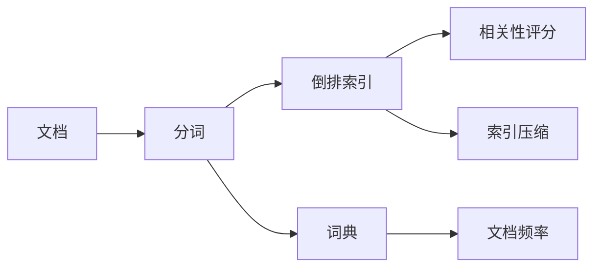

# 全文搜索 原理与代码实例讲解

关键词：全文搜索, 倒排索引, 分词, 索引压缩, 相关性排序

## 1. 背景介绍
### 1.1  问题的由来
随着互联网的快速发展,海量数据的产生和积累,如何高效地从海量文本数据中搜索和查找所需信息,成为了一个亟待解决的问题。传统的数据库查询方式已经无法满足海量非结构化文本数据的搜索需求。全文搜索技术应运而生,它能够快速地从海量文本数据中找出包含指定关键词的文档,极大提高了信息检索的效率。

### 1.2  研究现状
目前,全文搜索技术已经得到了广泛的应用,主流的全文搜索引擎如Lucene、Elasticsearch、Solr等,都是基于倒排索引原理实现的。倒排索引是全文搜索的核心,通过预先建立词项到文档的映射关系,将词项作为索引的key,文档ID作为value,从而实现快速的全文检索。同时,全文搜索领域的研究也在不断深入,如索引压缩、相关性排序、分布式搜索等,都取得了长足的进步。

### 1.3  研究意义
全文搜索在很多领域都有着广泛的应用,如搜索引擎、电商、论坛等。深入研究全文搜索的原理和算法,对于构建高效的搜索引擎,提升用户体验,都具有重要的意义。同时对于处理海量数据,实现精准信息检索,全文搜索技术也是必不可少的利器。

### 1.4  本文结构
本文将全面介绍全文搜索的原理和实现,内容涵盖了全文搜索的核心概念、算法原理、数学模型、代码实现等方面。通过理论与实践相结合的方式,力求让读者全面掌握全文搜索的方方面面。

## 2. 核心概念与联系
全文搜索的核心概念主要包括:

- 文档(Document):全文搜索的基本单位,包含一段文本信息。
- 词项(Term):对文档内容进行分词处理后得到的最小语义单位。
- 倒排索引(Inverted Index):存储词项到文档映射关系的数据结构,通过倒排索引可以快速找到包含指定词项的文档。
- 分词(Tokenization):将文档内容切分成一个个词项的过程。
- 词典(Dictionary):存储词项的数据结构,记录了所有词项,用于分词和倒排索引。
- 文档频率(Document Frequency):包含某个词项的文档数量。
- 索引压缩(Index Compression):通过压缩算法减小倒排索引占用的存储空间。
- 相关性评分(Relevance Scoring):衡量文档与查询的相关程度,将结果按相关性排序。

这些概念之间的联系可以用下图表示:



## 3. 核心算法原理 & 具体操作步骤
### 3.1  算法原理概述
全文搜索的核心是倒排索引,倒排索引的构建过程主要分为两步:

1. 分词:将文档内容切分成词项。常用的分词算法有字典分词、N-Gram、HMM等。
2. 建立倒排索引:遍历分词结果,以词项为key,文档ID为value,构建倒排索引。

查询过程则是根据倒排索引,快速找出包含查询词项的文档,然后进行相关性评分排序,返回查询结果。

### 3.2  算法步骤详解

1. 分词步骤:
   - 采用合适的分词算法,如Jieba、THULAC、Stanford NLP等。
   - 加载通用词典和领域词典,提高分词准确率。
   - 对文档内容进行分词,得到词项列表。
   - 可以对词项进行预处理,如去除停用词、词干提取等。

2. 倒排索引构建步骤:
   - 初始化一个HashMap,用于存储倒排索引。
   - 遍历所有文档的分词结果,以词项为key,文档ID为value,更新HashMap。
   - 遍历完成后,HashMap就是构建好的倒排索引。
   - 可以对倒排索引进行压缩,减小存储空间。

3. 查询步骤:
   - 对查询语句进行分词,得到查询词项。
   - 在倒排索引中查找包含查询词项的文档ID。
   - 根据文档ID取出文档详情。
   - 计算查询词项与文档的相关性得分。
   - 将结果按相关性得分排序,返回Top-K结果。

### 3.3  算法优缺点
倒排索引的优点:  
- 查询速度快,时间复杂度为O(1)。
- 支持复杂的布尔查询,如AND、OR等。
- 可以存储词项的附加信息,如词频、位置等。
- 容易实现相关性评分排序。

倒排索引的缺点:
- 索引构建耗时长,尤其是大规模语料下。
- 占用存储空间大,需要对索引进行压缩。
- 对索引的更新代价较大,不太适合实时索引。

### 3.4  算法应用领域
倒排索引是全文搜索的核心算法,主要应用在:

- 搜索引擎,如Google、Bing、Baidu等。
- 电商搜索,如淘宝、京东、亚马逊等。
- 论坛搜索,如知乎、StackOverflow等。
- 文献检索,如Web of Science、Google Scholar等。
- 企业内部数据检索,如Elasticsearch、Solr等。

## 4. 数学模型和公式 & 详细讲解 & 举例说明
### 4.1  数学模型构建
全文搜索中常用的相关性评分模型有布尔模型、向量空间模型和概率模型。其中向量空间模型(Vector Space Model)是最常用的模型之一。

在向量空间模型中,将查询和文档都表示成向量的形式,然后通过计算查询向量和文档向量的相似度来评估相关性。

设查询向量为$Q$,文档向量为$D_i$,其中每个分量表示词项的权重,则相关性得分可以用余弦相似度来计算:

$$
sim(Q,D_i) = \frac{\sum_{j=1}^{n}w_{q_j} \cdot w_{d_{ij}}}{|Q| \cdot |D_i|}
$$

其中$w_{q_j}$和$w_{d_{ij}}$分别表示查询和文档中词项$j$的权重,$|Q|$和$|D_i|$分别表示查询向量和文档向量的L2范数。

### 4.2  公式推导过程
向量空间模型的关键是如何计算词项的权重。常用的词项权重计算方法是TF-IDF。

TF(Term Frequency)表示词频,即词项在文档中出现的频率。设词项$t$在文档$d$中出现的次数为$f_{t,d}$,文档$d$的总词数为$\sum_{t' \in d}f_{t',d}$,则TF为:

$$
TF_{t,d} = \frac{f_{t,d}}{\sum_{t' \in d}f_{t',d}}
$$

IDF(Inverse Document Frequency)表示逆文档频率,用来衡量词项的区分度。设包含词项$t$的文档数为$n_t$,语料库的总文档数为$N$,则IDF为:

$$
IDF_t = \log \frac{N}{n_t}
$$

TF-IDF权重就是TF和IDF的乘积:

$$
w_{t,d} = TF_{t,d} \cdot IDF_t
$$

将TF-IDF权重代入余弦相似度公式,就得到了最终的相关性评分。

### 4.3  案例分析与讲解
下面以一个简单的例子来说明向量空间模型的计算过程。

假设语料库中有3个文档:

```
d1: "The quick brown fox jumps over the lazy dog"
d2: "Quick fox jumps over lazy dog"
d3: "Lazy dog is jumped over by quick brown fox"
```

查询语句为: "quick fox"

首先对文档和查询进行分词,得到词项向量:

```
q  = [quick, fox]
d1 = [quick:1, fox:1, jump:1, over:1, lazy:1, dog:1] 
d2 = [quick:1, fox:1, jump:1, over:1, lazy:1, dog:1]
d3 = [lazy:1, dog:1, jump:1, over:1, quick:1, brown:1, fox:1]
```

然后计算每个词项的IDF:

```
quick: IDF = log(3/3) = 0
fox:   IDF = log(3/3) = 0
jump:  IDF = log(3/3) = 0
over:  IDF = log(3/3) = 0
lazy:  IDF = log(3/3) = 0 
dog:   IDF = log(3/3) = 0
brown: IDF = log(3/1) = 0.477
```

接着计算查询和文档的TF-IDF向量:

```
q  = [quick:0.707, fox:0.707]
d1 = [quick:0.408, fox:0.408, jump:0, over:0, lazy:0, dog:0] 
d2 = [quick:0.408, fox:0.408, jump:0, over:0, lazy:0, dog:0]
d3 = [lazy:0, dog:0, jump:0, over:0, quick:0.455, brown:0.455, fox:0.455]
```

最后计算余弦相似度:

```
sim(q,d1) = 0.816
sim(q,d2) = 0.816 
sim(q,d3) = 0.639
```

可以看出,d1和d2与查询的相关性得分更高,排在前面。

### 4.4  常见问题解答
Q: 向量空间模型的优缺点是什么?

A: 优点是简单高效,计算代价小,可以用于大规模语料。缺点是无法考虑词序和语义,比如"ABBA"和"ABAB"的区别。

Q: 除了TF-IDF,还有哪些常用的词项权重计算方法?

A: 还有BM25、LMIR等概率模型,以及Word2Vec、BERT等基于深度学习的语义表示模型。

Q: 向量空间模型如何实现查询扩展?

A: 可以利用WordNet等知识库,根据同义词、上下位词等语义关系,对查询词项进行扩展。也可以利用用户反馈,动态调整查询向量。

## 5. 项目实践：代码实例和详细解释说明
### 5.1  开发环境搭建
本项目使用Python 3实现全文搜索引擎,依赖的第三方库有jieba、pickle等。

首先创建一个Python虚拟环境,然后安装依赖:

```bash
python3 -m venv venv
source venv/bin/activate
pip install -r requirements.txt
```

### 5.2  源代码详细实现
全文搜索引擎的主要代码如下:

```python
import jieba
import pickle
import math

class SearchEngine:
    def __init__(self, docs):
        self.docs = docs
        self.index = self.build_index()
        
    def build_index(self):
        index = {}
        for doc_id, doc in enumerate(self.docs):
            words = jieba.lcut_for_search(doc)
            for word in words:
                if word not in index:
                    index[word] = []
                index[word].append(doc_id)
        return index
    
    def search(self, query):
        query_words = jieba.lcut_for_search(query)
        scores = {}
        for word in query_words:
            if word in self.index:
                doc_ids = self.index[word]
                for doc_id in doc_ids:
                    if doc_id not in scores:
                        scores[doc_id] = 0
                    scores[doc_id] += self.tfidf(word, doc_id)
        results = sorted(scores.items(), key=lambda x: x[1], reverse=True)
        return results
    
    def tfidf(self, word, doc_id):
        tf = self.docs[doc_id].count(word) / len(self.docs[doc_id])
        idf = math.log(len(self.docs) / (len(self.index[word]) + 1))
        return tf * idf
        
if __name__ == '__main__':
    docs = [
        "The quick brown fox jumps over the lazy dog",
        "Quick fox jumps over lazy dog", 
        "Lazy dog is jumped over by quick brown fox"
    ]
    engine = SearchEngine(docs)
    results = engine.search("quick fox")
    print(results)
```

### 5.3  代码解读与分析
代码主要分为三个部分:

1. `__init__`方法:初